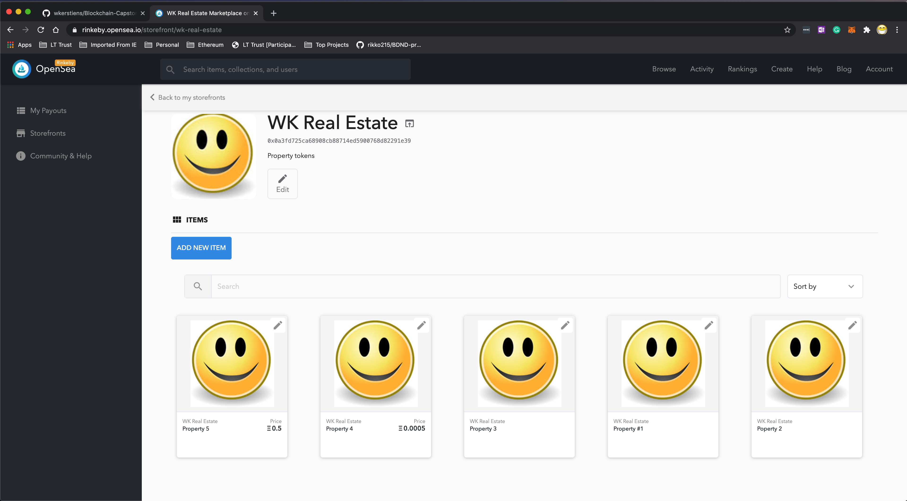

# Udacity Blockchain Capstone

The capstone will build upon the knowledge you have gained in the course in order to build a decentralized housing product. 

## Install
```shell script
# Clone this project
git clone git@github.com:wkerstiens/Blockchain-Capstone.git

# Install required npm packages
cd eth-contracts
npm install
truffle compile

# start ganache-cli - Feel free to adjust the number of accounts and ether amounts
ganache-cli -m "spirit supply whale amount human item harsh scare congress discover talent hamster" -a 50 -e 10000 -l 41000000000
```

The last command above will start ganache-cli with 50 accounts that have 10000 ether and a gas limit of 41,000,000,000.

## Testing
You must be in the eth-contracts directory and ganache-cli must be running as listed above to successfully run these tests.
```shell script
truffle test test/TestERC721Mintable.js
truffle test test/TestSquareVerifier.js 
truffle test test/TestSolnSquareVerifier.js

# To run all tests use the following command
truffle test
```

Whichever way you choose to run the tests they should all pass.

## Zokrates Setup
Install and instantiate a Zokrates zkSnarks development environment using Docker. Completes the Zokrates proof in square.code by adding the variable names in square.code.

When running Zokrates I followed the examples given in the course.  Generated 10 different proofs for test and deployment.

## Creating tokens
Inside the utilites directory is a utility file which will mint tokens called mintTokens.js

Depending on your environment you will need to configure the .env properly.  It will be checked in with development settings and will not work on Rinkeby network until the values are set correctly.

#### Output from the rinkeby network
```shell script
Added solution for tokenId 1 with transaction hash: 0xb1af7b9581f70c8db1e97a09289f29aa574274f095c2efec296bc53fb50d7135
Token 1 has been minted with transaction hash: 0x043c2cfdc0868bbb105eed6ce01345aa4d02abbe1a71a155565ac3ce4dfa77c5
Added solution for tokenId 2 with transaction hash: 0x78c94c47bfd96a35633278c047fa6b04f234b5205024e0cb35e5400ac49bf9a9
Token 2 has been minted with transaction hash: 0x6f0cc984bb389a421cfe04e1cdb18096e551564afc47c68c053f5f6dcf390969
Added solution for tokenId 3 with transaction hash: 0xb7f7fe9517605483d4693d35feed00f2477a90b17639d1ae37f07e5ff00d5c6f
Token 3 has been minted with transaction hash: 0x2b44853611bf17177bff65483e135546a21caf8db4ad05a76fb4520b1d1e7d07
Added solution for tokenId 4 with transaction hash: 0x10d5d1ced78500356cc0e47c4c5772baef38878319979abd52ddf126612ed051
Token 4 has been minted with transaction hash: 0xb1aa02c6eebb0f9a9c501d48d59822bb5bd0fd625804b8090a3c73b34202f426
Added solution for tokenId 5 with transaction hash: 0x23d83a16af9016a8f23bac651eb4dc167fd5a6a3a9db881656d67b02e66f9450
Token 5 has been minted with transaction hash: 0x57c0b891580743f48ff2cddc23e31f4e824847c0ef19d5097cfce81a18bb5b8b
Added solution for tokenId 6 with transaction hash: 0x0be9508097bbfac167909e9ae4688e5c21f8166791e3e35cb76ab5fe33008809
Token 6 has been minted with transaction hash: 0xe13ea7fc1b00419cc051fa3e5fba0326d0bfab33a539f2e67213af0f3a501ca2
Added solution for tokenId 7 with transaction hash: 0x521fb0e7e5c61fb6e1d8511ae1c53c94ce6c131718ceaaea6045dfa6c04803fe
Token 7 has been minted with transaction hash: 0x17bba8174a889fca255e285c44cfd8363fe7030c7dc9d54449a900973ca7327b
Added solution for tokenId 8 with transaction hash: 0x7ccd39afac016046a2cf77848a7d66da9ff3f455b322c63ac36c5bee22e400fb
Token 8 has been minted with transaction hash: 0x02f90f11f362889c36d9eb6c75a6c238af5607ccd9718681975c9b9e8ca6363c
Added solution for tokenId 9 with transaction hash: 0x56071c12eeb13f949c070d1e06db728e9d8ee13e73f5267ad0043e7a96034ebd
Token 9 has been minted with transaction hash: 0x242da7551887cc350ece8956ded1222f9c3d0b6231ecf4136cf6a0e295749dd0
Added solution for tokenId 10 with transaction hash: 0x56aeb62255ab4f42e7f3e83917045f9aace738eac1cd6a4c90330992b58393b8
Token 10 has been minted with transaction hash: 0x83266e0821f98d8baac77129ca19a383ef689d4e6bcb2e392d0c57dea9fea01a
```


## Contract Addresses on Rikeby
| Name | Address | Transaction Hash |
|:-----:|:--------:|:-----------------:|
| Migrations | 0x03aFf57664cE3f97D95D225BA86A884E031F8aa4 | 0xe0c033be472b7e6f009ef004c305b398720c2425793676c52e678742d56f18b1 |
| SquareVerifier | 0x3298d4Bec81a4A6aD888538FFee3C003bB08a24f | 0x5ae1a1317d88a7597f9b56927f2a7b23ecf92414162149c99c9c3a86cef3a71a |
| SolnSquareVerifier | 0x7c9F04060b968FBbe2232E1aE687caE59857b9AF | 0xf33234f1112341a782212d4825263b77d5c674515d157ae892c1b37975694bfe |


## Generated OpenSea marketplace

Storefront: https://rinkeby.opensea.io/storefront/wk-real-estate
Listed 5 properties using the contract owner account.



----
# Additional Details


#### Raw Output
```shell script
$ ▶ truffle migrate --network rinkeby --reset

Compiling your contracts...
===========================
> Everything is up to date, there is nothing to compile.


Starting migrations...
======================
> Network name:    'rinkeby'
> Network id:      4
> Block gas limit: 10000000 (0x989680)


1_initial_migration.js
======================

   Deploying 'Migrations'
   ----------------------
   > transaction hash:    0xe0c033be472b7e6f009ef004c305b398720c2425793676c52e678742d56f18b1
   > Blocks: 0            Seconds: 16
   > contract address:    0x03aFf57664cE3f97D95D225BA86A884E031F8aa4
   > block number:        7351949
   > block timestamp:     1602435962
   > account:             0xeabf1459776380Ff4582Af568b763d01023B0712
   > balance:             52.152564567000000001
   > gas used:            225237 (0x36fd5)
   > gas price:           10 gwei
   > value sent:          0 ETH
   > total cost:          0.00225237 ETH

   Pausing for 2 confirmations...
   ------------------------------
   > confirmation number: 1 (block: 7351949)
   > confirmation number: 2 (block: 7351950)

   > Saving migration to chain.
   > Saving artifacts
   -------------------------------------
   > Total cost:          0.00225237 ETH


2_deploy_contracts.js
=====================

   Deploying 'SquareVerifier'
   --------------------------
   > transaction hash:    0x5ae1a1317d88a7597f9b56927f2a7b23ecf92414162149c99c9c3a86cef3a71a
   > Blocks: 0            Seconds: 8
   > contract address:    0x3298d4Bec81a4A6aD888538FFee3C003bB08a24f
   > block number:        7351952
   > block timestamp:     1602436007
   > account:             0xeabf1459776380Ff4582Af568b763d01023B0712
   > balance:             52.142464627000000001
   > gas used:            967631 (0xec3cf)
   > gas price:           10 gwei
   > value sent:          0 ETH
   > total cost:          0.00967631 ETH

   Pausing for 2 confirmations...
   > confirmation number: 1 (block: 7351953)
   > confirmation number: 2 (block: 7351954)

  Deploying 'SolnSquareVerifier'
   ------------------------------
   > transaction hash:    0xf33234f1112341a782212d4825263b77d5c674515d157ae892c1b37975694bfe
   > Blocks: 0            Seconds: 4
   > contract address:    0x7c9F04060b968FBbe2232E1aE687caE59857b9AF
   > block number:        7351955
   > block timestamp:     1602436052
   > account:             0xeabf1459776380Ff4582Af568b763d01023B0712
   > balance:             52.100041837000000001
   > gas used:            4242279 (0x40bb67)
   > gas price:           10 gwei
   > value sent:          0 ETH
   > total cost:          0.04242279 ETH

   Pausing for 2 confirmations...
   ------------------------------
   > confirmation number: 1 (block: 7351956)
   > confirmation number: 2 (block: 7351957)

   > Saving migration to chain.
   > Saving artifacts
   -------------------------------------
   > Total cost:           0.0520991 ETH


Summary
=======
> Total deployments:   3
> Final cost:          0.05435147 ETH
```

## Contract ABIs
### Migrations.json
```json
{
  "contractName": "Migrations",
  "abi": [
    {
      "inputs": [],
      "payable": false,
      "stateMutability": "nonpayable",
      "type": "constructor"
    },
    {
      "constant": true,
      "inputs": [],
      "name": "last_completed_migration",
      "outputs": [
        {
          "internalType": "uint256",
          "name": "",
          "type": "uint256"
        }
      ],
      "payable": false,
      "stateMutability": "view",
      "type": "function"
    },
    {
      "constant": true,
      "inputs": [],
      "name": "owner",
      "outputs": [
        {
          "internalType": "address",
          "name": "",
          "type": "address"
        }
      ],
      "payable": false,
      "stateMutability": "view",
      "type": "function"
    },
    {
      "constant": false,
      "inputs": [
        {
          "internalType": "uint256",
          "name": "completed",
          "type": "uint256"
        }
      ],
      "name": "setCompleted",
      "outputs": [],
      "payable": false,
      "stateMutability": "nonpayable",
      "type": "function"
    },
    {
      "constant": false,
      "inputs": [
        {
          "internalType": "address",
          "name": "new_address",
          "type": "address"
        }
      ],
      "name": "upgrade",
      "outputs": [],
      "payable": false,
      "stateMutability": "nonpayable",
      "type": "function"
    }
  ],
  "metadata": "{\"compiler\":{\"version\":\"0.5.16+commit.9c3226ce\"},\"language\":\"Solidity\",\"output\":{\"abi\":[{\"inputs\":[],\"payable\":false,\"stateMutability\":\"nonpayable\",\"type\":\"constructor\"},{\"constant\":true,\"inputs\":[],\"name\":\"last_completed_migration\",\"outputs\":[{\"internalType\":\"uint256\",\"name\":\"\",\"type\":\"uint256\"}],\"payable\":false,\"stateMutability\":\"view\",\"type\":\"function\"},{\"constant\":true,\"inputs\":[],\"name\":\"owner\",\"outputs\":[{\"internalType\":\"address\",\"name\":\"\",\"type\":\"address\"}],\"payable\":false,\"stateMutability\":\"view\",\"type\":\"function\"},{\"constant\":false,\"inputs\":[{\"internalType\":\"uint256\",\"name\":\"completed\",\"type\":\"uint256\"}],\"name\":\"setCompleted\",\"outputs\":[],\"payable\":false,\"stateMutability\":\"nonpayable\",\"type\":\"function\"},{\"constant\":false,\"inputs\":[{\"internalType\":\"address\",\"name\":\"new_address\",\"type\":\"address\"}],\"name\":\"upgrade\",\"outputs\":[],\"payable\":false,\"stateMutability\":\"nonpayable\",\"type\":\"function\"}],\"devdoc\":{\"methods\":{}},\"userdoc\":{\"methods\":{}}},\"settings\":{\"compilationTarget\":{\"/Users/wak/ws/personal/udacity/Blockchain-Capstone/eth-contracts/contracts/Migrations.sol\":\"Migrations\"},\"evmVersion\":\"istanbul\",\"libraries\":{},\"optimizer\":{\"enabled\":false,\"runs\":200},\"remappings\":[]},\"sources\":{\"/Users/wak/ws/personal/udacity/Blockchain-Capstone/eth-contracts/contracts/Migrations.sol\":{\"keccak256\":\"0x3586f106c1f551580cee7f4e33100df9264cd03bdd2bd07e854557cb669bdf07\",\"urls\":[\"bzz-raw://14449f4287c616dd29d450389ea04d3740290da343dfd456728a88adcd55e2af\",\"dweb:/ipfs/QmW1XgV1mVfbemfd9CTEPrA1VggP9Hrdv4vMXcf4mwitwN\"]}},\"version\":1}",
  "bytecode": "0x608060405234801561001057600080fd5b50336000806101000a81548173ffffffffffffffffffffffffffffffffffffffff021916908373ffffffffffffffffffffffffffffffffffffffff1602179055506102b7806100606000396000f3fe608060405234801561001057600080fd5b506004361061004c5760003560e01c80630900f01014610051578063445df0ac146100955780638da5cb5b146100b3578063fdacd576146100fd575b600080fd5b6100936004803603602081101561006757600080fd5b81019080803573ffffffffffffffffffffffffffffffffffffffff16906020019092919050505061012b565b005b61009d6101f7565b6040518082815260200191505060405180910390f35b6100bb6101fd565b604051808273ffffffffffffffffffffffffffffffffffffffff1673ffffffffffffffffffffffffffffffffffffffff16815260200191505060405180910390f35b6101296004803603602081101561011357600080fd5b8101908080359060200190929190505050610222565b005b6000809054906101000a900473ffffffffffffffffffffffffffffffffffffffff1673ffffffffffffffffffffffffffffffffffffffff163373ffffffffffffffffffffffffffffffffffffffff1614156101f45760008190508073ffffffffffffffffffffffffffffffffffffffff1663fdacd5766001546040518263ffffffff1660e01b815260040180828152602001915050600060405180830381600087803b1580156101da57600080fd5b505af11580156101ee573d6000803e3d6000fd5b50505050505b50565b60015481565b6000809054906101000a900473ffffffffffffffffffffffffffffffffffffffff1681565b6000809054906101000a900473ffffffffffffffffffffffffffffffffffffffff1673ffffffffffffffffffffffffffffffffffffffff163373ffffffffffffffffffffffffffffffffffffffff16141561027f57806001819055505b5056fea265627a7a72315820e06e1f776caa311b782099075cd553f551c8edbded06dafe220867469d3fceec64736f6c63430005100032",
  "deployedBytecode": "0x608060405234801561001057600080fd5b506004361061004c5760003560e01c80630900f01014610051578063445df0ac146100955780638da5cb5b146100b3578063fdacd576146100fd575b600080fd5b6100936004803603602081101561006757600080fd5b81019080803573ffffffffffffffffffffffffffffffffffffffff16906020019092919050505061012b565b005b61009d6101f7565b6040518082815260200191505060405180910390f35b6100bb6101fd565b604051808273ffffffffffffffffffffffffffffffffffffffff1673ffffffffffffffffffffffffffffffffffffffff16815260200191505060405180910390f35b6101296004803603602081101561011357600080fd5b8101908080359060200190929190505050610222565b005b6000809054906101000a900473ffffffffffffffffffffffffffffffffffffffff1673ffffffffffffffffffffffffffffffffffffffff163373ffffffffffffffffffffffffffffffffffffffff1614156101f45760008190508073ffffffffffffffffffffffffffffffffffffffff1663fdacd5766001546040518263ffffffff1660e01b815260040180828152602001915050600060405180830381600087803b1580156101da57600080fd5b505af11580156101ee573d6000803e3d6000fd5b50505050505b50565b60015481565b6000809054906101000a900473ffffffffffffffffffffffffffffffffffffffff1681565b6000809054906101000a900473ffffffffffffffffffffffffffffffffffffffff1673ffffffffffffffffffffffffffffffffffffffff163373ffffffffffffffffffffffffffffffffffffffff16141561027f57806001819055505b5056fea265627a7a72315820e06e1f776caa311b782099075cd553f551c8edbded06dafe220867469d3fceec64736f6c63430005100032",
  "sourceMap": "27:480:1:-;;;116:50;8:9:-1;5:2;;;30:1;27;20:12;5:2;116:50:1;151:10;143:5;;:18;;;;;;;;;;;;;;;;;;27:480;;;;;;",
  "deployedSourceMap": "27:480:1:-;;;;8:9:-1;5:2;;;30:1;27;20:12;5:2;27:480:1;;;;;;;;;;;;;;;;;;;;;;;;;;;;;;;;;;340:165;;;;;;13:2:-1;8:3;5:11;2:2;;;29:1;26;19:12;2:2;340:165:1;;;;;;;;;;;;;;;;;;;:::i;:::-;;75:36;;;:::i;:::-;;;;;;;;;;;;;;;;;;;51:20;;;:::i;:::-;;;;;;;;;;;;;;;;;;;;;;;233:103;;;;;;13:2:-1;8:3;5:11;2:2;;;29:1;26;19:12;2:2;233:103:1;;;;;;;;;;;;;;;;;:::i;:::-;;340:165;216:5;;;;;;;;;;;202:19;;:10;:19;;;198:26;;;402:19;435:11;402:45;;453:8;:21;;;475:24;;453:47;;;;;;;;;;;;;;;;;;;;;;;;;;;;;;;;8:9:-1;5:2;;;30:1;27;20:12;5:2;453:47:1;;;;8:9:-1;5:2;;;45:16;42:1;39;24:38;77:16;74:1;67:27;5:2;453:47:1;;;;223:1;198:26;340:165;:::o;75:36::-;;;;:::o;51:20::-;;;;;;;;;;;;;:::o;233:103::-;216:5;;;;;;;;;;;202:19;;:10;:19;;;198:26;;;322:9;295:24;:36;;;;198:26;233:103;:::o",
  "source": "pragma solidity >=0.4.21;\n\ncontract Migrations {\n  address public owner;\n  uint public last_completed_migration;\n\n  constructor() public {\n    owner = msg.sender;\n  }\n\n  modifier restricted() {\n    if (msg.sender == owner) _;\n  }\n\n  function setCompleted(uint completed) public restricted {\n    last_completed_migration = completed;\n  }\n\n  function upgrade(address new_address) public restricted {\n    Migrations upgraded = Migrations(new_address);\n    upgraded.setCompleted(last_completed_migration);\n  }\n}\n",
  "sourcePath": "/Users/wak/ws/personal/udacity/Blockchain-Capstone/eth-contracts/contracts/Migrations.sol",
  "ast": {
    "absolutePath": "/Users/wak/ws/personal/udacity/Blockchain-Capstone/eth-contracts/contracts/Migrations.sol",
    "exportedSymbols": {
      "Migrations": [
        1179
      ]
    },
    "id": 1180,
    "nodeType": "SourceUnit",
    "nodes": [
      {
        "id": 1124,
        "literals": [
          "solidity",
          ">=",
          "0.4",
          ".21"
        ],
        "nodeType": "PragmaDirective",
        "src": "0:25:1"
      },
      {
        "baseContracts": [],
        "contractDependencies": [],
        "contractKind": "contract",
        "documentation": null,
        "fullyImplemented": true,
        "id": 1179,
        "linearizedBaseContracts": [
          1179
        ],
        "name": "Migrations",
        "nodeType": "ContractDefinition",
        "nodes": [
          {
            "constant": false,
            "id": 1126,
            "name": "owner",
            "nodeType": "VariableDeclaration",
            "scope": 1179,
            "src": "51:20:1",
            "stateVariable": true,
            "storageLocation": "default",
            "typeDescriptions": {
              "typeIdentifier": "t_address",
              "typeString": "address"
            },
            "typeName": {
              "id": 1125,
              "name": "address",
              "nodeType": "ElementaryTypeName",
              "src": "51:7:1",
              "stateMutability": "nonpayable",
              "typeDescriptions": {
                "typeIdentifier": "t_address",
                "typeString": "address"
              }
            },
            "value": null,
            "visibility": "public"
          },
          {
            "constant": false,
            "id": 1128,
            "name": "last_completed_migration",
            "nodeType": "VariableDeclaration",
            "scope": 1179,
            "src": "75:36:1",
            "stateVariable": true,
            "storageLocation": "default",
            "typeDescriptions": {
              "typeIdentifier": "t_uint256",
              "typeString": "uint256"
            },
            "typeName": {
              "id": 1127,
              "name": "uint",
              "nodeType": "ElementaryTypeName",
              "src": "75:4:1",
              "typeDescriptions": {
                "typeIdentifier": "t_uint256",
                "typeString": "uint256"
              }
            },
            "value": null,
            "visibility": "public"
          },
          {
            "body": {
              "id": 1136,
              "nodeType": "Block",
              "src": "137:29:1",
              "statements": [
                {
                  "expression": {
                    "argumentTypes": null,
                    "id": 1134,
                    "isConstant": false,
                    "isLValue": false,
                    "isPure": false,
                    "lValueRequested": false,
                    "leftHandSide": {
                      "argumentTypes": null,
                      "id": 1131,
                      "name": "owner",
                      "nodeType": "Identifier",
                      "overloadedDeclarations": [],
                      "referencedDeclaration": 1126,
                      "src": "143:5:1",
                      "typeDescriptions": {
                        "typeIdentifier": "t_address",
                        "typeString": "address"
                      }
                    },
                    "nodeType": "Assignment",
                    "operator": "=",
                    "rightHandSide": {
                      "argumentTypes": null,
                      "expression": {
                        "argumentTypes": null,
                        "id": 1132,
                        "name": "msg",
                        "nodeType": "Identifier",
                        "overloadedDeclarations": [],
                        "referencedDeclaration": 10479,
                        "src": "151:3:1",
                        "typeDescriptions": {
                          "typeIdentifier": "t_magic_message",
                          "typeString": "msg"
                        }
                      },
                      "id": 1133,
                      "isConstant": false,
                      "isLValue": false,
                      "isPure": false,
                      "lValueRequested": false,
                      "memberName": "sender",
                      "nodeType": "MemberAccess",
                      "referencedDeclaration": null,
                      "src": "151:10:1",
                      "typeDescriptions": {
                        "typeIdentifier": "t_address_payable",
                        "typeString": "address payable"
                      }
                    },
                    "src": "143:18:1",
                    "typeDescriptions": {
                      "typeIdentifier": "t_address",
                      "typeString": "address"
                    }
                  },
                  "id": 1135,
                  "nodeType": "ExpressionStatement",
                  "src": "143:18:1"
                }
              ]
            },
            "documentation": null,
            "id": 1137,
            "implemented": true,
            "kind": "constructor",
            "modifiers": [],
            "name": "",
            "nodeType": "FunctionDefinition",
            "parameters": {
              "id": 1129,
              "nodeType": "ParameterList",
              "parameters": [],
              "src": "127:2:1"
            },
            "returnParameters": {
              "id": 1130,
              "nodeType": "ParameterList",
              "parameters": [],
              "src": "137:0:1"
            },
            "scope": 1179,
            "src": "116:50:1",
            "stateMutability": "nonpayable",
            "superFunction": null,
            "visibility": "public"
          },
          {
            "body": {
              "id": 1145,
              "nodeType": "Block",
              "src": "192:37:1",
              "statements": [
                {
                  "condition": {
                    "argumentTypes": null,
                    "commonType": {
                      "typeIdentifier": "t_address",
                      "typeString": "address"
                    },
                    "id": 1142,
                    "isConstant": false,
                    "isLValue": false,
                    "isPure": false,
                    "lValueRequested": false,
                    "leftExpression": {
                      "argumentTypes": null,
                      "expression": {
                        "argumentTypes": null,
                        "id": 1139,
                        "name": "msg",
                        "nodeType": "Identifier",
                        "overloadedDeclarations": [],
                        "referencedDeclaration": 10479,
                        "src": "202:3:1",
                        "typeDescriptions": {
                          "typeIdentifier": "t_magic_message",
                          "typeString": "msg"
                        }
                      },
                      "id": 1140,
                      "isConstant": false,
                      "isLValue": false,
                      "isPure": false,
                      "lValueRequested": false,
                      "memberName": "sender",
                      "nodeType": "MemberAccess",
                      "referencedDeclaration": null,
                      "src": "202:10:1",
                      "typeDescriptions": {
                        "typeIdentifier": "t_address_payable",
                        "typeString": "address payable"
                      }
                    },
                    "nodeType": "BinaryOperation",
                    "operator": "==",
                    "rightExpression": {
                      "argumentTypes": null,
                      "id": 1141,
                      "name": "owner",
                      "nodeType": "Identifier",
                      "overloadedDeclarations": [],
                      "referencedDeclaration": 1126,
                      "src": "216:5:1",
                      "typeDescriptions": {
                        "typeIdentifier": "t_address",
                        "typeString": "address"
                      }
                    },
                    "src": "202:19:1",
                    "typeDescriptions": {
                      "typeIdentifier": "t_bool",
                      "typeString": "bool"
                    }
                  },
                  "falseBody": null,
                  "id": 1144,
                  "nodeType": "IfStatement",
                  "src": "198:26:1",
                  "trueBody": {
                    "id": 1143,
                    "nodeType": "PlaceholderStatement",
                    "src": "223:1:1"
                  }
                }
              ]
            },
            "documentation": null,
            "id": 1146,
            "name": "restricted",
            "nodeType": "ModifierDefinition",
            "parameters": {
              "id": 1138,
              "nodeType": "ParameterList",
              "parameters": [],
              "src": "189:2:1"
            },
            "src": "170:59:1",
            "visibility": "internal"
          },
          {
            "body": {
              "id": 1157,
              "nodeType": "Block",
              "src": "289:47:1",
              "statements": [
                {
                  "expression": {
                    "argumentTypes": null,
                    "id": 1155,
                    "isConstant": false,
                    "isLValue": false,
                    "isPure": false,
                    "lValueRequested": false,
                    "leftHandSide": {
                      "argumentTypes": null,
                      "id": 1153,
                      "name": "last_completed_migration",
                      "nodeType": "Identifier",
                      "overloadedDeclarations": [],
                      "referencedDeclaration": 1128,
                      "src": "295:24:1",
                      "typeDescriptions": {
                        "typeIdentifier": "t_uint256",
                        "typeString": "uint256"
                      }
                    },
                    "nodeType": "Assignment",
                    "operator": "=",
                    "rightHandSide": {
                      "argumentTypes": null,
                      "id": 1154,
                      "name": "completed",
                      "nodeType": "Identifier",
                      "overloadedDeclarations": [],
                      "referencedDeclaration": 1148,
                      "src": "322:9:1",
                      "typeDescriptions": {
                        "typeIdentifier": "t_uint256",
                        "typeString": "uint256"
                      }
                    },
                    "src": "295:36:1",
                    "typeDescriptions": {
                      "typeIdentifier": "t_uint256",
                      "typeString": "uint256"
                    }
                  },
                  "id": 1156,
                  "nodeType": "ExpressionStatement",
                  "src": "295:36:1"
                }
              ]
            },
            "documentation": null,
            "id": 1158,
            "implemented": true,
            "kind": "function",
            "modifiers": [
              {
                "arguments": null,
                "id": 1151,
                "modifierName": {
                  "argumentTypes": null,
                  "id": 1150,
                  "name": "restricted",
                  "nodeType": "Identifier",
                  "overloadedDeclarations": [],
                  "referencedDeclaration": 1146,
                  "src": "278:10:1",
                  "typeDescriptions": {
                    "typeIdentifier": "t_modifier$__$",
                    "typeString": "modifier ()"
                  }
                },
                "nodeType": "ModifierInvocation",
                "src": "278:10:1"
              }
            ],
            "name": "setCompleted",
            "nodeType": "FunctionDefinition",
            "parameters": {
              "id": 1149,
              "nodeType": "ParameterList",
              "parameters": [
                {
                  "constant": false,
                  "id": 1148,
                  "name": "completed",
                  "nodeType": "VariableDeclaration",
                  "scope": 1158,
                  "src": "255:14:1",
                  "stateVariable": false,
                  "storageLocation": "default",
                  "typeDescriptions": {
                    "typeIdentifier": "t_uint256",
                    "typeString": "uint256"
                  },
                  "typeName": {
                    "id": 1147,
                    "name": "uint",
                    "nodeType": "ElementaryTypeName",
                    "src": "255:4:1",
                    "typeDescriptions": {
                      "typeIdentifier": "t_uint256",
                      "typeString": "uint256"
                    }
                  },
                  "value": null,
                  "visibility": "internal"
                }
              ],
              "src": "254:16:1"
            },
            "returnParameters": {
              "id": 1152,
              "nodeType": "ParameterList",
              "parameters": [],
              "src": "289:0:1"
            },
            "scope": 1179,
            "src": "233:103:1",
            "stateMutability": "nonpayable",
            "superFunction": null,
            "visibility": "public"
          },
          {
            "body": {
              "id": 1177,
              "nodeType": "Block",
              "src": "396:109:1",
              "statements": [
                {
                  "assignments": [
                    1166
                  ],
                  "declarations": [
                    {
                      "constant": false,
                      "id": 1166,
                      "name": "upgraded",
                      "nodeType": "VariableDeclaration",
                      "scope": 1177,
                      "src": "402:19:1",
                      "stateVariable": false,
                      "storageLocation": "default",
                      "typeDescriptions": {
                        "typeIdentifier": "t_contract$_Migrations_$1179",
                        "typeString": "contract Migrations"
                      },
                      "typeName": {
                        "contractScope": null,
                        "id": 1165,
                        "name": "Migrations",
                        "nodeType": "UserDefinedTypeName",
                        "referencedDeclaration": 1179,
                        "src": "402:10:1",
                        "typeDescriptions": {
                          "typeIdentifier": "t_contract$_Migrations_$1179",
                          "typeString": "contract Migrations"
                        }
                      },
                      "value": null,
                      "visibility": "internal"
                    }
                  ],
                  "id": 1170,
                  "initialValue": {
                    "argumentTypes": null,
                    "arguments": [
                      {
                        "argumentTypes": null,
                        "id": 1168,
                        "name": "new_address",
                        "nodeType": "Identifier",
                        "overloadedDeclarations": [],
                        "referencedDeclaration": 1160,
                        "src": "435:11:1",
                        "typeDescriptions": {
                          "typeIdentifier": "t_address",
                          "typeString": "address"
                        }
                      }
                    ],
                    "expression": {
                      "argumentTypes": [
                        {
                          "typeIdentifier": "t_address",
                          "typeString": "address"
                        }
                      ],
                      "id": 1167,
                      "name": "Migrations",
                      "nodeType": "Identifier",
                      "overloadedDeclarations": [],
                      "referencedDeclaration": 1179,
                      "src": "424:10:1",
                      "typeDescriptions": {
                        "typeIdentifier": "t_type$_t_contract$_Migrations_$1179_$",
                        "typeString": "type(contract Migrations)"
                      }
                    },
                    "id": 1169,
                    "isConstant": false,
                    "isLValue": false,
                    "isPure": false,
                    "kind": "typeConversion",
                    "lValueRequested": false,
                    "names": [],
                    "nodeType": "FunctionCall",
                    "src": "424:23:1",
                    "typeDescriptions": {
                      "typeIdentifier": "t_contract$_Migrations_$1179",
                      "typeString": "contract Migrations"
                    }
                  },
                  "nodeType": "VariableDeclarationStatement",
                  "src": "402:45:1"
                },
                {
                  "expression": {
                    "argumentTypes": null,
                    "arguments": [
                      {
                        "argumentTypes": null,
                        "id": 1174,
                        "name": "last_completed_migration",
                        "nodeType": "Identifier",
                        "overloadedDeclarations": [],
                        "referencedDeclaration": 1128,
                        "src": "475:24:1",
                        "typeDescriptions": {
                          "typeIdentifier": "t_uint256",
                          "typeString": "uint256"
                        }
                      }
                    ],
                    "expression": {
                      "argumentTypes": [
                        {
                          "typeIdentifier": "t_uint256",
                          "typeString": "uint256"
                        }
                      ],
                      "expression": {
                        "argumentTypes": null,
                        "id": 1171,
                        "name": "upgraded",
                        "nodeType": "Identifier",
                        "overloadedDeclarations": [],
                        "referencedDeclaration": 1166,
                        "src": "453:8:1",
                        "typeDescriptions": {
                          "typeIdentifier": "t_contract$_Migrations_$1179",
                          "typeString": "contract Migrations"
                        }
                      },
                      "id": 1173,
                      "isConstant": false,
                      "isLValue": false,
                      "isPure": false,
                      "lValueRequested": false,
                      "memberName": "setCompleted",
                      "nodeType": "MemberAccess",
                      "referencedDeclaration": 1158,
                      "src": "453:21:1",
                      "typeDescriptions": {
                        "typeIdentifier": "t_function_external_nonpayable$_t_uint256_$returns$__$",
                        "typeString": "function (uint256) external"
                      }
                    },
                    "id": 1175,
                    "isConstant": false,
                    "isLValue": false,
                    "isPure": false,
                    "kind": "functionCall",
                    "lValueRequested": false,
                    "names": [],
                    "nodeType": "FunctionCall",
                    "src": "453:47:1",
                    "typeDescriptions": {
                      "typeIdentifier": "t_tuple$__$",
                      "typeString": "tuple()"
                    }
                  },
                  "id": 1176,
                  "nodeType": "ExpressionStatement",
                  "src": "453:47:1"
                }
              ]
            },
            "documentation": null,
            "id": 1178,
            "implemented": true,
            "kind": "function",
            "modifiers": [
              {
                "arguments": null,
                "id": 1163,
                "modifierName": {
                  "argumentTypes": null,
                  "id": 1162,
                  "name": "restricted",
                  "nodeType": "Identifier",
                  "overloadedDeclarations": [],
                  "referencedDeclaration": 1146,
                  "src": "385:10:1",
                  "typeDescriptions": {
                    "typeIdentifier": "t_modifier$__$",
                    "typeString": "modifier ()"
                  }
                },
                "nodeType": "ModifierInvocation",
                "src": "385:10:1"
              }
            ],
            "name": "upgrade",
            "nodeType": "FunctionDefinition",
            "parameters": {
              "id": 1161,
              "nodeType": "ParameterList",
              "parameters": [
                {
                  "constant": false,
                  "id": 1160,
                  "name": "new_address",
                  "nodeType": "VariableDeclaration",
                  "scope": 1178,
                  "src": "357:19:1",
                  "stateVariable": false,
                  "storageLocation": "default",
                  "typeDescriptions": {
                    "typeIdentifier": "t_address",
                    "typeString": "address"
                  },
                  "typeName": {
                    "id": 1159,
                    "name": "address",
                    "nodeType": "ElementaryTypeName",
                    "src": "357:7:1",
                    "stateMutability": "nonpayable",
                    "typeDescriptions": {
                      "typeIdentifier": "t_address",
                      "typeString": "address"
                    }
                  },
                  "value": null,
                  "visibility": "internal"
                }
              ],
              "src": "356:21:1"
            },
            "returnParameters": {
              "id": 1164,
              "nodeType": "ParameterList",
              "parameters": [],
              "src": "396:0:1"
            },
            "scope": 1179,
            "src": "340:165:1",
            "stateMutability": "nonpayable",
            "superFunction": null,
            "visibility": "public"
          }
        ],
        "scope": 1180,
        "src": "27:480:1"
      }
    ],
    "src": "0:508:1"
  },
  "legacyAST": {
    "absolutePath": "/Users/wak/ws/personal/udacity/Blockchain-Capstone/eth-contracts/contracts/Migrations.sol",
    "exportedSymbols": {
      "Migrations": [
        1179
      ]
    },
    "id": 1180,
    "nodeType": "SourceUnit",
    "nodes": [
      {
        "id": 1124,
        "literals": [
          "solidity",
          ">=",
          "0.4",
          ".21"
        ],
        "nodeType": "PragmaDirective",
        "src": "0:25:1"
      },
      {
        "baseContracts": [],
        "contractDependencies": [],
        "contractKind": "contract",
        "documentation": null,
        "fullyImplemented": true,
        "id": 1179,
        "linearizedBaseContracts": [
          1179
        ],
        "name": "Migrations",
        "nodeType": "ContractDefinition",
        "nodes": [
          {
            "constant": false,
            "id": 1126,
            "name": "owner",
            "nodeType": "VariableDeclaration",
            "scope": 1179,
            "src": "51:20:1",
            "stateVariable": true,
            "storageLocation": "default",
            "typeDescriptions": {
              "typeIdentifier": "t_address",
              "typeString": "address"
            },
            "typeName": {
              "id": 1125,
              "name": "address",
              "nodeType": "ElementaryTypeName",
              "src": "51:7:1",
              "stateMutability": "nonpayable",
              "typeDescriptions": {
                "typeIdentifier": "t_address",
                "typeString": "address"
              }
            },
            "value": null,
            "visibility": "public"
          },
          {
            "constant": false,
            "id": 1128,
            "name": "last_completed_migration",
            "nodeType": "VariableDeclaration",
            "scope": 1179,
            "src": "75:36:1",
            "stateVariable": true,
            "storageLocation": "default",
            "typeDescriptions": {
              "typeIdentifier": "t_uint256",
              "typeString": "uint256"
            },
            "typeName": {
              "id": 1127,
              "name": "uint",
              "nodeType": "ElementaryTypeName",
              "src": "75:4:1",
              "typeDescriptions": {
                "typeIdentifier": "t_uint256",
                "typeString": "uint256"
              }
            },
            "value": null,
            "visibility": "public"
          },
          {
            "body": {
              "id": 1136,
              "nodeType": "Block",
              "src": "137:29:1",
              "statements": [
                {
                  "expression": {
                    "argumentTypes": null,
                    "id": 1134,
                    "isConstant": false,
                    "isLValue": false,
                    "isPure": false,
                    "lValueRequested": false,
                    "leftHandSide": {
                      "argumentTypes": null,
                      "id": 1131,
                      "name": "owner",
                      "nodeType": "Identifier",
                      "overloadedDeclarations": [],
                      "referencedDeclaration": 1126,
                      "src": "143:5:1",
                      "typeDescriptions": {
                        "typeIdentifier": "t_address",
                        "typeString": "address"
                      }
                    },
                    "nodeType": "Assignment",
                    "operator": "=",
                    "rightHandSide": {
                      "argumentTypes": null,
                      "expression": {
                        "argumentTypes": null,
                        "id": 1132,
                        "name": "msg",
                        "nodeType": "Identifier",
                        "overloadedDeclarations": [],
                        "referencedDeclaration": 10479,
                        "src": "151:3:1",
                        "typeDescriptions": {
                          "typeIdentifier": "t_magic_message",
                          "typeString": "msg"
                        }
                      },
                      "id": 1133,
                      "isConstant": false,
                      "isLValue": false,
                      "isPure": false,
                      "lValueRequested": false,
                      "memberName": "sender",
                      "nodeType": "MemberAccess",
                      "referencedDeclaration": null,
                      "src": "151:10:1",
                      "typeDescriptions": {
                        "typeIdentifier": "t_address_payable",
                        "typeString": "address payable"
                      }
                    },
                    "src": "143:18:1",
                    "typeDescriptions": {
                      "typeIdentifier": "t_address",
                      "typeString": "address"
                    }
                  },
                  "id": 1135,
                  "nodeType": "ExpressionStatement",
                  "src": "143:18:1"
                }
              ]
            },
            "documentation": null,
            "id": 1137,
            "implemented": true,
            "kind": "constructor",
            "modifiers": [],
            "name": "",
            "nodeType": "FunctionDefinition",
            "parameters": {
              "id": 1129,
              "nodeType": "ParameterList",
              "parameters": [],
              "src": "127:2:1"
            },
            "returnParameters": {
              "id": 1130,
              "nodeType": "ParameterList",
              "parameters": [],
              "src": "137:0:1"
            },
            "scope": 1179,
            "src": "116:50:1",
            "stateMutability": "nonpayable",
            "superFunction": null,
            "visibility": "public"
          },
          {
            "body": {
              "id": 1145,
              "nodeType": "Block",
              "src": "192:37:1",
              "statements": [
                {
                  "condition": {
                    "argumentTypes": null,
                    "commonType": {
                      "typeIdentifier": "t_address",
                      "typeString": "address"
                    },
                    "id": 1142,
                    "isConstant": false,
                    "isLValue": false,
                    "isPure": false,
                    "lValueRequested": false,
                    "leftExpression": {
                      "argumentTypes": null,
                      "expression": {
                        "argumentTypes": null,
                        "id": 1139,
                        "name": "msg",
                        "nodeType": "Identifier",
                        "overloadedDeclarations": [],
                        "referencedDeclaration": 10479,
                        "src": "202:3:1",
                        "typeDescriptions": {
                          "typeIdentifier": "t_magic_message",
                          "typeString": "msg"
                        }
                      },
                      "id": 1140,
                      "isConstant": false,
                      "isLValue": false,
                      "isPure": false,
                      "lValueRequested": false,
                      "memberName": "sender",
                      "nodeType": "MemberAccess",
                      "referencedDeclaration": null,
                      "src": "202:10:1",
                      "typeDescriptions": {
                        "typeIdentifier": "t_address_payable",
                        "typeString": "address payable"
                      }
                    },
                    "nodeType": "BinaryOperation",
                    "operator": "==",
                    "rightExpression": {
                      "argumentTypes": null,
                      "id": 1141,
                      "name": "owner",
                      "nodeType": "Identifier",
                      "overloadedDeclarations": [],
                      "referencedDeclaration": 1126,
                      "src": "216:5:1",
                      "typeDescriptions": {
                        "typeIdentifier": "t_address",
                        "typeString": "address"
                      }
                    },
                    "src": "202:19:1",
                    "typeDescriptions": {
                      "typeIdentifier": "t_bool",
                      "typeString": "bool"
                    }
                  },
                  "falseBody": null,
                  "id": 1144,
                  "nodeType": "IfStatement",
                  "src": "198:26:1",
                  "trueBody": {
                    "id": 1143,
                    "nodeType": "PlaceholderStatement",
                    "src": "223:1:1"
                  }
                }
              ]
            },
            "documentation": null,
            "id": 1146,
            "name": "restricted",
            "nodeType": "ModifierDefinition",
            "parameters": {
              "id": 1138,
              "nodeType": "ParameterList",
              "parameters": [],
              "src": "189:2:1"
            },
            "src": "170:59:1",
            "visibility": "internal"
          },
          {
            "body": {
              "id": 1157,
              "nodeType": "Block",
              "src": "289:47:1",
              "statements": [
                {
                  "expression": {
                    "argumentTypes": null,
                    "id": 1155,
                    "isConstant": false,
                    "isLValue": false,
                    "isPure": false,
                    "lValueRequested": false,
                    "leftHandSide": {
                      "argumentTypes": null,
                      "id": 1153,
                      "name": "last_completed_migration",
                      "nodeType": "Identifier",
                      "overloadedDeclarations": [],
                      "referencedDeclaration": 1128,
                      "src": "295:24:1",
                      "typeDescriptions": {
                        "typeIdentifier": "t_uint256",
                        "typeString": "uint256"
                      }
                    },
                    "nodeType": "Assignment",
                    "operator": "=",
                    "rightHandSide": {
                      "argumentTypes": null,
                      "id": 1154,
                      "name": "completed",
                      "nodeType": "Identifier",
                      "overloadedDeclarations": [],
                      "referencedDeclaration": 1148,
                      "src": "322:9:1",
                      "typeDescriptions": {
                        "typeIdentifier": "t_uint256",
                        "typeString": "uint256"
                      }
                    },
                    "src": "295:36:1",
                    "typeDescriptions": {
                      "typeIdentifier": "t_uint256",
                      "typeString": "uint256"
                    }
                  },
                  "id": 1156,
                  "nodeType": "ExpressionStatement",
                  "src": "295:36:1"
                }
              ]
            },
            "documentation": null,
            "id": 1158,
            "implemented": true,
            "kind": "function",
            "modifiers": [
              {
                "arguments": null,
                "id": 1151,
                "modifierName": {
                  "argumentTypes": null,
                  "id": 1150,
                  "name": "restricted",
                  "nodeType": "Identifier",
                  "overloadedDeclarations": [],
                  "referencedDeclaration": 1146,
                  "src": "278:10:1",
                  "typeDescriptions": {
                    "typeIdentifier": "t_modifier$__$",
                    "typeString": "modifier ()"
                  }
                },
                "nodeType": "ModifierInvocation",
                "src": "278:10:1"
              }
            ],
            "name": "setCompleted",
            "nodeType": "FunctionDefinition",
            "parameters": {
              "id": 1149,
              "nodeType": "ParameterList",
              "parameters": [
                {
                  "constant": false,
                  "id": 1148,
                  "name": "completed",
                  "nodeType": "VariableDeclaration",
                  "scope": 1158,
                  "src": "255:14:1",
                  "stateVariable": false,
                  "storageLocation": "default",
                  "typeDescriptions": {
                    "typeIdentifier": "t_uint256",
                    "typeString": "uint256"
                  },
                  "typeName": {
                    "id": 1147,
                    "name": "uint",
                    "nodeType": "ElementaryTypeName",
                    "src": "255:4:1",
                    "typeDescriptions": {
                      "typeIdentifier": "t_uint256",
                      "typeString": "uint256"
                    }
                  },
                  "value": null,
                  "visibility": "internal"
                }
              ],
              "src": "254:16:1"
            },
            "returnParameters": {
              "id": 1152,
              "nodeType": "ParameterList",
              "parameters": [],
              "src": "289:0:1"
            },
            "scope": 1179,
            "src": "233:103:1",
            "stateMutability": "nonpayable",
            "superFunction": null,
            "visibility": "public"
          },
          {
            "body": {
              "id": 1177,
              "nodeType": "Block",
              "src": "396:109:1",
              "statements": [
                {
                  "assignments": [
                    1166
                  ],
                  "declarations": [
                    {
                      "constant": false,
                      "id": 1166,
                      "name": "upgraded",
                      "nodeType": "VariableDeclaration",
                      "scope": 1177,
                      "src": "402:19:1",
                      "stateVariable": false,
                      "storageLocation": "default",
                      "typeDescriptions": {
                        "typeIdentifier": "t_contract$_Migrations_$1179",
                        "typeString": "contract Migrations"
                      },
                      "typeName": {
                        "contractScope": null,
                        "id": 1165,
                        "name": "Migrations",
                        "nodeType": "UserDefinedTypeName",
                        "referencedDeclaration": 1179,
                        "src": "402:10:1",
                        "typeDescriptions": {
                          "typeIdentifier": "t_contract$_Migrations_$1179",
                          "typeString": "contract Migrations"
                        }
                      },
                      "value": null,
                      "visibility": "internal"
                    }
                  ],
                  "id": 1170,
                  "initialValue": {
                    "argumentTypes": null,
                    "arguments": [
                      {
                        "argumentTypes": null,
                        "id": 1168,
                        "name": "new_address",
                        "nodeType": "Identifier",
                        "overloadedDeclarations": [],
                        "referencedDeclaration": 1160,
                        "src": "435:11:1",
                        "typeDescriptions": {
                          "typeIdentifier": "t_address",
                          "typeString": "address"
                        }
                      }
                    ],
                    "expression": {
                      "argumentTypes": [
                        {
                          "typeIdentifier": "t_address",
                          "typeString": "address"
                        }
                      ],
                      "id": 1167,
                      "name": "Migrations",
                      "nodeType": "Identifier",
                      "overloadedDeclarations": [],
                      "referencedDeclaration": 1179,
                      "src": "424:10:1",
                      "typeDescriptions": {
                        "typeIdentifier": "t_type$_t_contract$_Migrations_$1179_$",
                        "typeString": "type(contract Migrations)"
                      }
                    },
                    "id": 1169,
                    "isConstant": false,
                    "isLValue": false,
                    "isPure": false,
                    "kind": "typeConversion",
                    "lValueRequested": false,
                    "names": [],
                    "nodeType": "FunctionCall",
                    "src": "424:23:1",
                    "typeDescriptions": {
                      "typeIdentifier": "t_contract$_Migrations_$1179",
                      "typeString": "contract Migrations"
                    }
                  },
                  "nodeType": "VariableDeclarationStatement",
                  "src": "402:45:1"
                },
                {
                  "expression": {
                    "argumentTypes": null,
                    "arguments": [
                      {
                        "argumentTypes": null,
                        "id": 1174,
                        "name": "last_completed_migration",
                        "nodeType": "Identifier",
                        "overloadedDeclarations": [],
                        "referencedDeclaration": 1128,
                        "src": "475:24:1",
                        "typeDescriptions": {
                          "typeIdentifier": "t_uint256",
                          "typeString": "uint256"
                        }
                      }
                    ],
                    "expression": {
                      "argumentTypes": [
                        {
                          "typeIdentifier": "t_uint256",
                          "typeString": "uint256"
                        }
                      ],
                      "expression": {
                        "argumentTypes": null,
                        "id": 1171,
                        "name": "upgraded",
                        "nodeType": "Identifier",
                        "overloadedDeclarations": [],
                        "referencedDeclaration": 1166,
                        "src": "453:8:1",
                        "typeDescriptions": {
                          "typeIdentifier": "t_contract$_Migrations_$1179",
                          "typeString": "contract Migrations"
                        }
                      },
                      "id": 1173,
                      "isConstant": false,
                      "isLValue": false,
                      "isPure": false,
                      "lValueRequested": false,
                      "memberName": "setCompleted",
                      "nodeType": "MemberAccess",
                      "referencedDeclaration": 1158,
                      "src": "453:21:1",
                      "typeDescriptions": {
                        "typeIdentifier": "t_function_external_nonpayable$_t_uint256_$returns$__$",
                        "typeString": "function (uint256) external"
                      }
                    },
                    "id": 1175,
                    "isConstant": false,
                    "isLValue": false,
                    "isPure": false,
                    "kind": "functionCall",
                    "lValueRequested": false,
                    "names": [],
                    "nodeType": "FunctionCall",
                    "src": "453:47:1",
                    "typeDescriptions": {
                      "typeIdentifier": "t_tuple$__$",
                      "typeString": "tuple()"
                    }
                  },
                  "id": 1176,
                  "nodeType": "ExpressionStatement",
                  "src": "453:47:1"
                }
              ]
            },
            "documentation": null,
            "id": 1178,
            "implemented": true,
            "kind": "function",
            "modifiers": [
              {
                "arguments": null,
                "id": 1163,
                "modifierName": {
                  "argumentTypes": null,
                  "id": 1162,
                  "name": "restricted",
                  "nodeType": "Identifier",
                  "overloadedDeclarations": [],
                  "referencedDeclaration": 1146,
                  "src": "385:10:1",
                  "typeDescriptions": {
                    "typeIdentifier": "t_modifier$__$",
                    "typeString": "modifier ()"
                  }
                },
                "nodeType": "ModifierInvocation",
                "src": "385:10:1"
              }
            ],
            "name": "upgrade",
            "nodeType": "FunctionDefinition",
            "parameters": {
              "id": 1161,
              "nodeType": "ParameterList",
              "parameters": [
                {
                  "constant": false,
                  "id": 1160,
                  "name": "new_address",
                  "nodeType": "VariableDeclaration",
                  "scope": 1178,
                  "src": "357:19:1",
                  "stateVariable": false,
                  "storageLocation": "default",
                  "typeDescriptions": {
                    "typeIdentifier": "t_address",
                    "typeString": "address"
                  },
                  "typeName": {
                    "id": 1159,
                    "name": "address",
                    "nodeType": "ElementaryTypeName",
                    "src": "357:7:1",
                    "stateMutability": "nonpayable",
                    "typeDescriptions": {
                      "typeIdentifier": "t_address",
                      "typeString": "address"
                    }
                  },
                  "value": null,
                  "visibility": "internal"
                }
              ],
              "src": "356:21:1"
            },
            "returnParameters": {
              "id": 1164,
              "nodeType": "ParameterList",
              "parameters": [],
              "src": "396:0:1"
            },
            "scope": 1179,
            "src": "340:165:1",
            "stateMutability": "nonpayable",
            "superFunction": null,
            "visibility": "public"
          }
        ],
        "scope": 1180,
        "src": "27:480:1"
      }
    ],
    "src": "0:508:1"
  },
  "compiler": {
    "name": "solc",
    "version": "0.5.16+commit.9c3226ce.Emscripten.clang"
  },
  "networks": {
    "4": {
      "events": {},
      "links": {},
      "address": "0x03aFf57664cE3f97D95D225BA86A884E031F8aa4",
      "transactionHash": "0xe0c033be472b7e6f009ef004c305b398720c2425793676c52e678742d56f18b1"
    },
    "1602341339610": {
      "events": {},
      "links": {},
      "address": "0x2A76f1C82b3EDD4b33a9259FdEE38dFdD1fcb3B4",
      "transactionHash": "0xed8767c32e206c3c33ad631b83b992cc25b67348da7ce35eb749f344854da1f4"
    },
    "1602424266041": {
      "events": {},
      "links": {},
      "address": "0xFEeCfF2CB7d6f3BfcBE5fa41c49c8fB642f2dDbF",
      "transactionHash": "0x7683cc92e82c8ddae51f9275684004beab1e316b06099f05b1c1e24c97e12a03"
    }
  },
  "schemaVersion": "3.2.5",
  "updatedAt": "2020-10-11T17:08:17.415Z",
  "networkType": "ethereum",
  "devdoc": {
    "methods": {}
  },
  "userdoc": {
    "methods": {}
  }
}
```

### SquareVerifier.json
```json
{
  "contractName": "SquareVerifier",
  "abi": [
    {
      "constant": true,
      "inputs": [
        {
          "internalType": "uint256[2]",
          "name": "a",
          "type": "uint256[2]"
        },
        {
          "internalType": "uint256[2][2]",
          "name": "b",
          "type": "uint256[2][2]"
        },
        {
          "internalType": "uint256[2]",
          "name": "c",
          "type": "uint256[2]"
        },
        {
          "internalType": "uint256[2]",
          "name": "input",
          "type": "uint256[2]"
        }
      ],
      "name": "verifyTx",
      "outputs": [
        {
          "internalType": "bool",
          "name": "r",
          "type": "bool"
        }
      ],
      "payable": false,
      "stateMutability": "view",
      "type": "function"
    }
  ],
  "metadata": "{\"compiler\":{\"version\":\"0.5.16+commit.9c3226ce\"},\"language\":\"Solidity\",\"output\":{\"abi\":[{\"constant\":true,\"inputs\":[{\"internalType\":\"uint256[2]\",\"name\":\"a\",\"type\":\"uint256[2]\"},{\"internalType\":\"uint256[2][2]\",\"name\":\"b\",\"type\":\"uint256[2][2]\"},{\"internalType\":\"uint256[2]\",\"name\":\"c\",\"type\":\"uint256[2]\"},{\"internalType\":\"uint256[2]\",\"name\":\"input\",\"type\":\"uint256[2]\"}],\"name\":\"verifyTx\",\"outputs\":[{\"internalType\":\"bool\",\"name\":\"r\",\"type\":\"bool\"}],\"payable\":false,\"stateMutability\":\"view\",\"type\":\"function\"}],\"devdoc\":{\"methods\":{}},\"userdoc\":{\"methods\":{}}},\"settings\":{\"compilationTarget\":{\"/Users/wak/ws/personal/udacity/Blockchain-Capstone/eth-contracts/contracts/SolnSquareVerifier.sol\":\"SquareVerifier\"},\"evmVersion\":\"istanbul\",\"libraries\":{},\"optimizer\":{\"enabled\":false,\"runs\":200},\"remappings\":[]},\"sources\":{\"/Users/wak/ws/personal/udacity/Blockchain-Capstone/eth-contracts/contracts/ERC721Mintable.sol\":{\"keccak256\":\"0x699270f3aeada8f931199604428183e27d83c650b63e8a71952ef8d399b129ff\",\"urls\":[\"bzz-raw://a7a2d6d9e60b72b6a30e226b05d75cd7b358c210ced7eb8eb17f868b119f3328\",\"dweb:/ipfs/Qmbr1JV4LQBTjC2PYCkDrDYcohyu7EyUBL6VhVjb4u5FqT\"]},\"/Users/wak/ws/personal/udacity/Blockchain-Capstone/eth-contracts/contracts/Oraclize.sol\":{\"keccak256\":\"0xe5ebe286b4624095629f76c6ac8dbad3cb305fbdb43fff09e4eebed35a05b49c\",\"urls\":[\"bzz-raw://681373c60944fa44771ccea64da3a0e1b428255757df53cfee06eae96f4ac91d\",\"dweb:/ipfs/QmWS7E26x3aXyYEZSzhTTpr8Pu11y5NK9p9iMwwvm7tMsz\"]},\"/Users/wak/ws/personal/udacity/Blockchain-Capstone/eth-contracts/contracts/SolnSquareVerifier.sol\":{\"keccak256\":\"0xd2d0e4556cde7bc1606ea9d2a2e2e0ae4f93b923fa66cfca9bf9606e00da2567\",\"urls\":[\"bzz-raw://9c211f092c2b7755d783db657634c03a859d758930fe01113cd871f6df78e10d\",\"dweb:/ipfs/QmVdAC2Hb8xfxfMHmcqK7aQQj5Bbhud1eBxA8UH2qxhJoo\"]},\"/Users/wak/ws/personal/udacity/Blockchain-Capstone/eth-contracts/contracts/verifier.sol\":{\"keccak256\":\"0xb8ba16b747b01862c5599f254342f0d62ce764b2a58d9939eb1ea9f36d575c54\",\"urls\":[\"bzz-raw://4f49354c4a8a62cade04555e630c618c95a8ec19746d250122cb5e3ca29ded0d\",\"dweb:/ipfs/Qmf3vBisD3pY8MPGDVvmAxXLLrxa586YuUrKpx7RPhHUke\"]},\"openzeppelin-solidity/contracts/drafts/Counters.sol\":{\"keccak256\":\"0x5be8533c5950173dc2b77b75108fae6e6c5449aedadde3385ba457394aad2384\",\"urls\":[\"bzz-raw://d429fb04f5b31d909dc759d0f88e28055b80b4dd43e5def4dffc947fa0609229\",\"dweb:/ipfs/QmaY9idX5CwLLtjjTQAdiiaDSrncgafkatUZXTbbajpz8b\"]},\"openzeppelin-solidity/contracts/math/SafeMath.sol\":{\"keccak256\":\"0x640b6dee7a4b830bdfd52b5031a07fc2b12209f5b2e29e5d364a7d37f69d8076\",\"urls\":[\"bzz-raw://31113152e1ddb78fe7a4197f247591ca894e93f916867beb708d8e747b6cc74f\",\"dweb:/ipfs/QmbZaJyXdpsYGykVhHH9qpVGQg9DGCxE2QufbCUy3daTgq\"]},\"openzeppelin-solidity/contracts/token/ERC721/IERC721Receiver.sol\":{\"keccak256\":\"0x042048c375daca04b31e31c91bbae912b84b5eb818c4e31b2deb530fd2305342\",\"urls\":[\"bzz-raw://d877a87c5e29b9ffca3e334378058c051a4e012fd3635039681003a9376baf1f\",\"dweb:/ipfs/QmR45snf93cFXtB71TZcmoGy9DbcMha8CqgkDKaLvhjXZK\"]},\"openzeppelin-solidity/contracts/utils/Address.sol\":{\"keccak256\":\"0x1a8e5072509c5ea7365eb1d48030b9be865140c8fb779968da0a459a0e174a11\",\"urls\":[\"bzz-raw://03335b7b07c7c8c8d613cfdd8ec39a0b5ec133ee510bf2fe6cc5a496767bef4b\",\"dweb:/ipfs/Qmebp4nzPja645c9yXSdJkGq96oU3am3LUnG2K3R7XxyKf\"]}},\"version\":1}",
  "bytecode": "0x608060405234801561001057600080fd5b50611089806100206000396000f3fe608060405234801561001057600080fd5b506004361061002b5760003560e01c8063621e9ec014610030575b600080fd5b61018f600480360361014081101561004757600080fd5b8101908080604001906002806020026040519081016040528092919082600260200280828437600081840152601f19601f82011690508083019250505050505091929192908060800190600280602002604051908101604052809291906000905b828210156100fc578382604002016002806020026040519081016040528092919082600260200280828437600081840152601f19601f820116905080830192505050505050815260200190600101906100a8565b50505050919291929080604001906002806020026040519081016040528092919082600260200280828437600081840152601f19601f820116905080830192505050505050919291929080604001906002806020026040519081016040528092919082600260200280828437600081840152601f19601f82011690508083019250505050505091929192905050506101a9565b604051808215151515815260200191505060405180910390f35b60006101b3610ef8565b6040518060400160405280876000600281106101cb57fe5b60200201518152602001876001600281106101e257fe5b60200201518152508160000181905250604051806040016040528060405180604001604052808860006002811061021557fe5b602002015160006002811061022657fe5b602002015181526020018860006002811061023d57fe5b602002015160016002811061024e57fe5b6020020151815250815260200160405180604001604052808860016002811061027357fe5b602002015160006002811061028457fe5b602002015181526020018860016002811061029b57fe5b60200201516001600281106102ac57fe5b602002015181525081525081602001819052506040518060400160405280856000600281106102d757fe5b60200201518152602001856001600281106102ee57fe5b60200201518152508160400181905250606060026040519080825280602002602001820160405280156103305781602001602082028038833980820191505090505b50905060008090505b60028110156103785784816002811061034e57fe5b602002015182828151811061035f57fe5b6020026020010181815250508080600101915050610339565b50600061038582846103a5565b14156103965760019250505061039d565b6000925050505b949350505050565b6000807f30644e72e131a029b85045b68181585d2833e84879b9709143e1f593f000000190506103d3610f2b565b6103db610517565b90508060800151516001865101146103f257600080fd5b6103fa610f72565b6040518060400160405280600081526020016000815250905060008090505b8651811015610490578387828151811061042f57fe5b60200260200101511061044157600080fd5b6104818261047c8560800151600185018151811061045b57fe5b60200260200101518a858151811061046f57fe5b6020026020010151610964565b6109f6565b91508080600101915050610419565b506104b38183608001516000815181106104a657fe5b60200260200101516109f6565b90506104f9856000015186602001516104cb84610aa7565b85604001516104dd8a60400151610aa7565b87606001516104ef8960000151610aa7565b8960200151610b41565b6105095760019350505050610511565b600093505050505b92915050565b61051f610f2b565b60405180604001604052807f1936c240636390dc823e3a728e94b208eb53c6756d81da57ec3425e05d43ac1081526020017f2d70ff78e8216bf29d58923a686d9738278b8ce2fd822e197c85b09286d155668152508160000181905250604051806040016040528060405180604001604052807f2b4daf047abe2e7f0b311118c1b963b63695dc0d769cea78849604434de055bf81526020017f29c13ecb6f33dbc4b3b8a02e2e255511ce4c26a8a2f299efcc94caf2de4fce00815250815260200160405180604001604052807f1da9020008df7f549751f8a251af3b2dc4a2ad3e0870de54acaedd9fc1b47e1781526020017f25ea0d7e2b29de431b86a943db30dbf4d98f68df9ca8a9628d14d1591e817d908152508152508160200181905250604051806040016040528060405180604001604052807f011016e22ae045444f50fb80f246ec486c7e02af09132cd38c4fcf484983e4f281526020017ee83c788c2878d1d5eba3ed49b0d81e4c0487dedc3e4d1c2baab5833785b62f815250815260200160405180604001604052807f05eb89e741ed5b5d611cebf92d1ed02cd6f3311089f0d400df7d9ced5a48fd4181526020017f132a90a3b0d369ccd66e2a5ba04a935e44d8ad5dca93a76bba592a578130a9118152508152508160400181905250604051806040016040528060405180604001604052807f065f6a3323a2abffd621fc263f348eb914904b68d5897729ae34a6b9d33f085281526020017f0c3b60f59d3bd50328a04c0ff6d979199685d0526f89f6ac29d6174ce24707a2815250815260200160405180604001604052807f26e7ebce2b44efef6b6315938e33f0a8ecc82dbad635c9efa681ed85bbb5998281526020017f12e0f3721230a0f38f6c9913048d5230fd2615ef3ff7f6ee4b20dfe0bdea1a868152508152508160600181905250600360405190808252806020026020018201604052801561080557816020015b6107f2610f8c565b8152602001906001900390816107ea5790505b50816080018190525060405180604001604052807f1ef8d5d70234aa3e3d8fc4e3f1ca01c703182580b581106798f05b35fd5082c081526020017f2e468046d4ae35138e2032224925d5389712e5ca5e68f4d9c1e1858e7d65602d815250816080015160008151811061087457fe5b602002602001018190525060405180604001604052807f0cefae0e3fa6aa25a4485ab7b21d32794d3431a4e4a5ca82ea427b831534c2c981526020017f23e3d2035b70884e547638b111870f5957f58ad8068f7a21470164ad361e1e8881525081608001516001815181106108e557fe5b602002602001018190525060405180604001604052807f030ffe78ec3de150e8688db619bde78e21e894754e6be5ed83742677628b24bc81526020017f053392f88cfa9092dfbc0bd199d8159e56207779473c24fc601eff91bcd345ca815250816080015160028151811061095657fe5b602002602001018190525090565b61096c610f72565b610974610fa6565b83600001518160006003811061098657fe5b6020020181815250508360200151816001600381106109a157fe5b60200201818152505082816002600381106109b857fe5b602002018181525050600060608360808460076107d05a03fa905080600081146109e1576109e3565bfe5b50806109ee57600080fd5b505092915050565b6109fe610f72565b610a06610fc8565b836000015181600060048110610a1857fe5b602002018181525050836020015181600160048110610a3357fe5b602002018181525050826000015181600260048110610a4e57fe5b602002018181525050826020015181600360048110610a6957fe5b602002018181525050600060608360c08460066107d05a03fa90508060008114610a9257610a94565bfe5b5080610a9f57600080fd5b505092915050565b610aaf610f72565b60007f30644e72e131a029b85045b68181585d97816a916871ca8d3c208c16d87cfd47905060008360000151148015610aec575060008360200151145b15610b10576040518060400160405280600081526020016000815250915050610b3c565b60405180604001604052808460000151815260200182856020015181610b3257fe5b0683038152509150505b919050565b600060606004604051908082528060200260200182016040528015610b8057816020015b610b6d610f8c565b815260200190600190039081610b655790505b50905060606004604051908082528060200260200182016040528015610bc057816020015b610bad610fea565b815260200190600190039081610ba55790505b5090508a82600081518110610bd157fe5b60200260200101819052508882600181518110610bea57fe5b60200260200101819052508682600281518110610c0357fe5b60200260200101819052508482600381518110610c1c57fe5b60200260200101819052508981600081518110610c3557fe5b60200260200101819052508781600181518110610c4e57fe5b60200260200101819052508581600281518110610c6757fe5b60200260200101819052508381600381518110610c8057fe5b6020026020010181905250610c958282610ca5565b9250505098975050505050505050565b60008151835114610cb557600080fd5b6000835190506000600682029050606081604051908082528060200260200182016040528015610cf45781602001602082028038833980820191505090505b50905060008090505b83811015610e9a57868181518110610d1157fe5b602002602001015160000151826000600684020181518110610d2f57fe5b602002602001018181525050868181518110610d4757fe5b602002602001015160200151826001600684020181518110610d6557fe5b602002602001018181525050858181518110610d7d57fe5b602002602001015160000151600060028110610d9557fe5b6020020151826002600684020181518110610dac57fe5b602002602001018181525050858181518110610dc457fe5b602002602001015160000151600160028110610ddc57fe5b6020020151826003600684020181518110610df357fe5b602002602001018181525050858181518110610e0b57fe5b602002602001015160200151600060028110610e2357fe5b6020020151826004600684020181518110610e3a57fe5b602002602001018181525050858181518110610e5257fe5b602002602001015160200151600160028110610e6a57fe5b6020020151826005600684020181518110610e8157fe5b6020026020010181815250508080600101915050610cfd565b50610ea3611010565b6000602082602086026020860160086107d05a03fa90508060008114610ec857610eca565bfe5b5080610ed557600080fd5b600082600060018110610ee457fe5b602002015114159550505050505092915050565b6040518060600160405280610f0b610f8c565b8152602001610f18610fea565b8152602001610f25610f8c565b81525090565b6040518060a00160405280610f3e610f8c565b8152602001610f4b610fea565b8152602001610f58610fea565b8152602001610f65610fea565b8152602001606081525090565b604051806040016040528060008152602001600081525090565b604051806040016040528060008152602001600081525090565b6040518060600160405280600390602082028038833980820191505090505090565b6040518060800160405280600490602082028038833980820191505090505090565b6040518060400160405280610ffd611032565b815260200161100a611032565b81525090565b6040518060200160405280600190602082028038833980820191505090505090565b604051806040016040528060029060208202803883398082019150509050509056fea265627a7a723158209cabb947d14b99fa1433812dbbada2b85e88a38785b1ec371c5190b9a409504e64736f6c63430005100032",
  "deployedBytecode": "0x608060405234801561001057600080fd5b506004361061002b5760003560e01c8063621e9ec014610030575b600080fd5b61018f600480360361014081101561004757600080fd5b8101908080604001906002806020026040519081016040528092919082600260200280828437600081840152601f19601f82011690508083019250505050505091929192908060800190600280602002604051908101604052809291906000905b828210156100fc578382604002016002806020026040519081016040528092919082600260200280828437600081840152601f19601f820116905080830192505050505050815260200190600101906100a8565b50505050919291929080604001906002806020026040519081016040528092919082600260200280828437600081840152601f19601f820116905080830192505050505050919291929080604001906002806020026040519081016040528092919082600260200280828437600081840152601f19601f82011690508083019250505050505091929192905050506101a9565b604051808215151515815260200191505060405180910390f35b60006101b3610ef8565b6040518060400160405280876000600281106101cb57fe5b60200201518152602001876001600281106101e257fe5b60200201518152508160000181905250604051806040016040528060405180604001604052808860006002811061021557fe5b602002015160006002811061022657fe5b602002015181526020018860006002811061023d57fe5b602002015160016002811061024e57fe5b6020020151815250815260200160405180604001604052808860016002811061027357fe5b602002015160006002811061028457fe5b602002015181526020018860016002811061029b57fe5b60200201516001600281106102ac57fe5b602002015181525081525081602001819052506040518060400160405280856000600281106102d757fe5b60200201518152602001856001600281106102ee57fe5b60200201518152508160400181905250606060026040519080825280602002602001820160405280156103305781602001602082028038833980820191505090505b50905060008090505b60028110156103785784816002811061034e57fe5b602002015182828151811061035f57fe5b6020026020010181815250508080600101915050610339565b50600061038582846103a5565b14156103965760019250505061039d565b6000925050505b949350505050565b6000807f30644e72e131a029b85045b68181585d2833e84879b9709143e1f593f000000190506103d3610f2b565b6103db610517565b90508060800151516001865101146103f257600080fd5b6103fa610f72565b6040518060400160405280600081526020016000815250905060008090505b8651811015610490578387828151811061042f57fe5b60200260200101511061044157600080fd5b6104818261047c8560800151600185018151811061045b57fe5b60200260200101518a858151811061046f57fe5b6020026020010151610964565b6109f6565b91508080600101915050610419565b506104b38183608001516000815181106104a657fe5b60200260200101516109f6565b90506104f9856000015186602001516104cb84610aa7565b85604001516104dd8a60400151610aa7565b87606001516104ef8960000151610aa7565b8960200151610b41565b6105095760019350505050610511565b600093505050505b92915050565b61051f610f2b565b60405180604001604052807f1936c240636390dc823e3a728e94b208eb53c6756d81da57ec3425e05d43ac1081526020017f2d70ff78e8216bf29d58923a686d9738278b8ce2fd822e197c85b09286d155668152508160000181905250604051806040016040528060405180604001604052807f2b4daf047abe2e7f0b311118c1b963b63695dc0d769cea78849604434de055bf81526020017f29c13ecb6f33dbc4b3b8a02e2e255511ce4c26a8a2f299efcc94caf2de4fce00815250815260200160405180604001604052807f1da9020008df7f549751f8a251af3b2dc4a2ad3e0870de54acaedd9fc1b47e1781526020017f25ea0d7e2b29de431b86a943db30dbf4d98f68df9ca8a9628d14d1591e817d908152508152508160200181905250604051806040016040528060405180604001604052807f011016e22ae045444f50fb80f246ec486c7e02af09132cd38c4fcf484983e4f281526020017ee83c788c2878d1d5eba3ed49b0d81e4c0487dedc3e4d1c2baab5833785b62f815250815260200160405180604001604052807f05eb89e741ed5b5d611cebf92d1ed02cd6f3311089f0d400df7d9ced5a48fd4181526020017f132a90a3b0d369ccd66e2a5ba04a935e44d8ad5dca93a76bba592a578130a9118152508152508160400181905250604051806040016040528060405180604001604052807f065f6a3323a2abffd621fc263f348eb914904b68d5897729ae34a6b9d33f085281526020017f0c3b60f59d3bd50328a04c0ff6d979199685d0526f89f6ac29d6174ce24707a2815250815260200160405180604001604052807f26e7ebce2b44efef6b6315938e33f0a8ecc82dbad635c9efa681ed85bbb5998281526020017f12e0f3721230a0f38f6c9913048d5230fd2615ef3ff7f6ee4b20dfe0bdea1a868152508152508160600181905250600360405190808252806020026020018201604052801561080557816020015b6107f2610f8c565b8152602001906001900390816107ea5790505b50816080018190525060405180604001604052807f1ef8d5d70234aa3e3d8fc4e3f1ca01c703182580b581106798f05b35fd5082c081526020017f2e468046d4ae35138e2032224925d5389712e5ca5e68f4d9c1e1858e7d65602d815250816080015160008151811061087457fe5b602002602001018190525060405180604001604052807f0cefae0e3fa6aa25a4485ab7b21d32794d3431a4e4a5ca82ea427b831534c2c981526020017f23e3d2035b70884e547638b111870f5957f58ad8068f7a21470164ad361e1e8881525081608001516001815181106108e557fe5b602002602001018190525060405180604001604052807f030ffe78ec3de150e8688db619bde78e21e894754e6be5ed83742677628b24bc81526020017f053392f88cfa9092dfbc0bd199d8159e56207779473c24fc601eff91bcd345ca815250816080015160028151811061095657fe5b602002602001018190525090565b61096c610f72565b610974610fa6565b83600001518160006003811061098657fe5b6020020181815250508360200151816001600381106109a157fe5b60200201818152505082816002600381106109b857fe5b602002018181525050600060608360808460076107d05a03fa905080600081146109e1576109e3565bfe5b50806109ee57600080fd5b505092915050565b6109fe610f72565b610a06610fc8565b836000015181600060048110610a1857fe5b602002018181525050836020015181600160048110610a3357fe5b602002018181525050826000015181600260048110610a4e57fe5b602002018181525050826020015181600360048110610a6957fe5b602002018181525050600060608360c08460066107d05a03fa90508060008114610a9257610a94565bfe5b5080610a9f57600080fd5b505092915050565b610aaf610f72565b60007f30644e72e131a029b85045b68181585d97816a916871ca8d3c208c16d87cfd47905060008360000151148015610aec575060008360200151145b15610b10576040518060400160405280600081526020016000815250915050610b3c565b60405180604001604052808460000151815260200182856020015181610b3257fe5b0683038152509150505b919050565b600060606004604051908082528060200260200182016040528015610b8057816020015b610b6d610f8c565b815260200190600190039081610b655790505b50905060606004604051908082528060200260200182016040528015610bc057816020015b610bad610fea565b815260200190600190039081610ba55790505b5090508a82600081518110610bd157fe5b60200260200101819052508882600181518110610bea57fe5b60200260200101819052508682600281518110610c0357fe5b60200260200101819052508482600381518110610c1c57fe5b60200260200101819052508981600081518110610c3557fe5b60200260200101819052508781600181518110610c4e57fe5b60200260200101819052508581600281518110610c6757fe5b60200260200101819052508381600381518110610c8057fe5b6020026020010181905250610c958282610ca5565b9250505098975050505050505050565b60008151835114610cb557600080fd5b6000835190506000600682029050606081604051908082528060200260200182016040528015610cf45781602001602082028038833980820191505090505b50905060008090505b83811015610e9a57868181518110610d1157fe5b602002602001015160000151826000600684020181518110610d2f57fe5b602002602001018181525050868181518110610d4757fe5b602002602001015160200151826001600684020181518110610d6557fe5b602002602001018181525050858181518110610d7d57fe5b602002602001015160000151600060028110610d9557fe5b6020020151826002600684020181518110610dac57fe5b602002602001018181525050858181518110610dc457fe5b602002602001015160000151600160028110610ddc57fe5b6020020151826003600684020181518110610df357fe5b602002602001018181525050858181518110610e0b57fe5b602002602001015160200151600060028110610e2357fe5b6020020151826004600684020181518110610e3a57fe5b602002602001018181525050858181518110610e5257fe5b602002602001015160200151600160028110610e6a57fe5b6020020151826005600684020181518110610e8157fe5b6020026020010181815250508080600101915050610cfd565b50610ea3611010565b6000602082602086026020860160086107d05a03fa90508060008114610ec857610eca565bfe5b5080610ed557600080fd5b600082600060018110610ee457fe5b602002015114159550505050505092915050565b6040518060600160405280610f0b610f8c565b8152602001610f18610fea565b8152602001610f25610f8c565b81525090565b6040518060a00160405280610f3e610f8c565b8152602001610f4b610fea565b8152602001610f58610fea565b8152602001610f65610fea565b8152602001606081525090565b604051806040016040528060008152602001600081525090565b604051806040016040528060008152602001600081525090565b6040518060600160405280600390602082028038833980820191505090505090565b6040518060800160405280600490602082028038833980820191505090505090565b6040518060400160405280610ffd611032565b815260200161100a611032565b81525090565b6040518060200160405280600190602082028038833980820191505090505090565b604051806040016040528060029060208202803883398082019150509050509056fea265627a7a723158209cabb947d14b99fa1433812dbbada2b85e88a38785b1ec371c5190b9a409504e64736f6c63430005100032",
  "sourceMap": "216:40:3:-;;;;8:9:-1;5:2;;;30:1;27;20:12;5:2;216:40:3;;;;;;;",
  "deployedSourceMap": "216:40:3:-;;;;8:9:-1;5:2;;;30:1;27;20:12;5:2;216:40:3;;;;;;;;;;;;;;;;;;;24041:658:4;;;;;;13:3:-1;8;5:12;2:2;;;30:1;27;20:12;2:2;24041:658:4;;;;;;;;;;;;;;;;;;;;;;;;;;;30:3:-1;22:6;14;1:33;99:1;93:3;85:6;81:16;74:27;137:4;133:9;126:4;121:3;117:14;113:30;106:37;;169:3;161:6;157:16;147:26;;24041:658:4;;;;;;;;;;;;;;;;;;;;;;;;;;;;;;;;;;;;;;;;;;;;;;;;;;;;;;;;;;;;;;30:3:-1;22:6;14;1:33;99:1;93:3;85:6;81:16;74:27;137:4;133:9;126:4;121:3;117:14;113:30;106:37;;169:3;161:6;157:16;147:26;;24041:658:4;;;;;;;;;;;;;;;;;;;;;;;;;;;;;;;;;;;;;;;;;;;;;;;;30:3:-1;22:6;14;1:33;99:1;93:3;85:6;81:16;74:27;137:4;133:9;126:4;121:3;117:14;113:30;106:37;;169:3;161:6;157:16;147:26;;24041:658:4;;;;;;;;;;;;;;;;;;;;;;;;;;;;;;;;;30:3:-1;22:6;14;1:33;99:1;93:3;85:6;81:16;74:27;137:4;133:9;126:4;121:3;117:14;113:30;106:37;;169:3;161:6;157:16;147:26;;24041:658:4;;;;;;;;;;;;;;:::i;:::-;;;;;;;;;;;;;;;;;;;;;;;;24205:6;24223:18;;:::i;:::-;24261:27;;;;;;;;24277:1;24279;24277:4;;;;;;;;;;;24261:27;;;;24283:1;24285;24283:4;;;;;;;;;;;24261:27;;;24251:5;:7;;:37;;;;24308:55;;;;;;;;;;;;;;;;24325:1;24327;24325:4;;;;;;;;;;;24330:1;24325:7;;;;;;;;;;;24308:55;;;;24334:1;24336;24334:4;;;;;;;;;;;24339:1;24334:7;;;;;;;;;;;24308:55;;;;;;;;;;;;;;;24345:1;24347;24345:4;;;;;;;;;;;24350:1;24345:7;;;;;;;;;;;24308:55;;;;24354:1;24356;24354:4;;;;;;;;;;;24359:1;24354:7;;;;;;;;;;;24308:55;;;;;;24298:5;:7;;:65;;;;24383:27;;;;;;;;24399:1;24401;24399:4;;;;;;;;;;;24383:27;;;;24405:1;24407;24405:4;;;;;;;;;;;24383:27;;;24373:5;:7;;:37;;;;24420:25;24459:1;24448:13;;;;;;;;;;;;;;;;;;;;;;29:2:-1;21:6;17:15;117:4;105:10;97:6;88:34;148:4;140:6;136:17;126:27;;0:157;24448:13:4;;;;24420:41;;24484:6;24493:1;24484:10;;24480:88;24500:12;24496:1;:16;24480:88;;;24549:5;24555:1;24549:8;;;;;;;;;;;24532:11;24544:1;24532:14;;;;;;;;;;;;;:25;;;;;24514:3;;;;;;;24480:88;;;;24611:1;24581:26;24588:11;24601:5;24581:6;:26::i;:::-;:31;24577:116;;;24635:4;24628:11;;;;;;24577:116;24677:5;24670:12;;;;24041:658;;;;;;;:::o;23115:921::-;23195:4;23211:26;23240:77;23211:106;;23327:22;;:::i;:::-;23352:14;:12;:14::i;:::-;23327:39;;23404:2;:12;;;:19;23399:1;23384:5;:12;:16;:39;23376:48;;;;;;23481:27;;:::i;:::-;23511:21;;;;;;;;23527:1;23511:21;;;;23530:1;23511:21;;;23481:51;;23547:6;23556:1;23547:10;;23542:197;23563:5;:12;23559:1;:16;23542:197;;;23615:18;23604:5;23610:1;23604:8;;;;;;;;;;;;;;:29;23596:38;;;;;;23655:73;23672:4;23678:49;23697:2;:12;;;23714:1;23710;:5;23697:19;;;;;;;;;;;;;;23718:5;23724:1;23718:8;;;;;;;;;;;;;;23678:18;:49::i;:::-;23655:16;:73::i;:::-;23648:80;;23577:3;;;;;;;23542:197;;;;23755:39;23772:4;23778:2;:12;;;23791:1;23778:15;;;;;;;;;;;;;;23755:16;:39::i;:::-;23748:46;;23808:193;23843:5;:7;;;23852:5;:7;;;23874:20;23889:4;23874:14;:20::i;:::-;23896:2;:8;;;23919:23;23934:5;:7;;;23919:14;:23::i;:::-;23944:2;:8;;;23967:24;23982:2;:8;;;23967:14;:24::i;:::-;23993:2;:7;;;23808:20;:193::i;:::-;23804:207;;24010:1;24003:8;;;;;;;23804:207;24028:1;24021:8;;;;;23115:921;;;;;:::o;21159:1951::-;21206:22;;:::i;:::-;21251:169;;;;;;;;21275:66;21251:169;;;;21352:66;21251:169;;;21240:2;:8;;:180;;;;21440:327;;;;;;;;;;;;;;;;21465:66;21440:327;;;;21542:66;21440:327;;;;;;;;;;;;;;;21621:66;21440:327;;;;21698:66;21440:327;;;;;;21430:2;:7;;:337;;;;21788:327;;;;;;;;;;;;;;;;21813:66;21788:327;;;;21890:66;21788:327;;;;;;;;;;;;;;;21969:66;21788:327;;;;22046:66;21788:327;;;;;;21777:2;:8;;:338;;;;22136:327;;;;;;;;;;;;;;;;22161:66;22136:327;;;;22238:66;22136:327;;;;;;;;;;;;;;;22317:66;22136:327;;;;22394:66;22136:327;;;;;;22125:2;:8;;:338;;;;22510:1;22488:24;;;;;;;;;;;;;;;;;;;;;;;;;:::i;:::-;;;;;;;;;;;;;;;;;22473:2;:12;;:39;;;;22540:169;;;;;;;;22564:66;22540:169;;;;22641:66;22540:169;;;22522:2;:12;;;22535:1;22522:15;;;;;;;;;;;;;:187;;;;22737:169;;;;;;;;22761:66;22737:169;;;;22838:66;22737:169;;;22719:2;:12;;;22732:1;22719:15;;;;;;;;;;;;;:187;;;;22934:169;;;;;;;;22958:66;22934:169;;;;23035:66;22934:169;;;22916:2;:12;;;22929:1;22916:15;;;;;;;;;;;;;:187;;;;21159:1951;:::o;17660:454::-;17729:16;;:::i;:::-;17757:20;;:::i;:::-;17798:1;:3;;;17787:5;17793:1;17787:8;;;;;;;;;;:14;;;;;17822:1;:3;;;17811:5;17817:1;17811:8;;;;;;;;;;:14;;;;;17846:1;17835:5;17841:1;17835:8;;;;;;;;;;:12;;;;;17857;17961:4;17958:1;17952:4;17945:5;17942:1;17935:4;17928:5;17924:16;17913:53;17902:64;;18043:7;18056:1;18051:20;;;;18036:35;;18051:20;18060:9;18036:35;;18099:7;18090:17;;;;;;17660:454;;;;;;:::o;16729:493::-;16808:16;;:::i;:::-;16836:20;;:::i;:::-;16877:2;:4;;;16866:5;16872:1;16866:8;;;;;;;;;;:15;;;;;16902:2;:4;;;16891:5;16897:1;16891:8;;;;;;;;;;:15;;;;;16927:2;:4;;;16916:5;16922:1;16916:8;;;;;;;;;;:15;;;;;16952:2;:4;;;16941:5;16947:1;16941:8;;;;;;;;;;:15;;;;;16966:12;17070:4;17067:1;17061:4;17054:5;17051:1;17044:4;17037:5;17033:16;17022:53;17011:64;;17152:7;17165:1;17160:20;;;;17145:35;;17160:20;17169:9;17145:35;;17207:7;17199:16;;;;;;16729:493;;;;;;:::o;16338:340::-;16395:14;;:::i;:::-;16473:6;16482:77;16473:86;;16580:1;16573;:3;;;:8;:20;;;;;16592:1;16585;:3;;;:8;16573:20;16569:58;;;16614:13;;;;;;;;16622:1;16614:13;;;;16625:1;16614:13;;;16607:20;;;;;16569:58;16644:27;;;;;;;;16652:1;:3;;;16644:27;;;;16668:1;16662;:3;;;:7;;;;;;16657:1;:13;16644:27;;;16637:34;;;16338:340;;;;:::o;20256:552::-;20507:4;20523:19;20559:1;20545:16;;;;;;;;;;;;;;;;;;;;;;;;;:::i;:::-;;;;;;;;;;;;;;;;;20523:38;;20571:19;20607:1;20593:16;;;;;;;;;;;;;;;;;;;;;;;;;:::i;:::-;;;;;;;;;;;;;;;;;20571:38;;20627:2;20619;20622:1;20619:5;;;;;;;;;;;;;:10;;;;20647:2;20639;20642:1;20639:5;;;;;;;;;;;;;:10;;;;20667:2;20659;20662:1;20659:5;;;;;;;;;;;;;:10;;;;20687:2;20679;20682:1;20679:5;;;;;;;;;;;;;:10;;;;20707:2;20699;20702:1;20699:5;;;;;;;;;;;;;:10;;;;20727:2;20719;20722:1;20719:5;;;;;;;;;;;;;:10;;;;20747:2;20739;20742:1;20739:5;;;;;;;;;;;;;:10;;;;20767:2;20759;20762:1;20759:5;;;;;;;;;;;;;:10;;;;20786:15;20794:2;20798;20786:7;:15::i;:::-;20779:22;;;;20256:552;;;;;;;;;;:::o;18325:923::-;18407:4;18444:2;:9;18431:2;:9;:22;18423:31;;;;;;18464:13;18480:2;:9;18464:25;;18499:14;18527:1;18516:8;:12;18499:29;;18538:19;18571:9;18560:21;;;;;;;;;;;;;;;;;;;;;;29:2:-1;21:6;17:15;117:4;105:10;97:6;88:34;148:4;140:6;136:17;126:27;;0:157;18560:21:4;;;;18538:43;;18596:6;18605:1;18596:10;;18591:307;18612:8;18608:1;:12;18591:307;;;18668:2;18671:1;18668:5;;;;;;;;;;;;;;:7;;;18649:5;18663:1;18659;18655;:5;:9;18649:16;;;;;;;;;;;;;:26;;;;;18708:2;18711:1;18708:5;;;;;;;;;;;;;;:7;;;18689:5;18703:1;18699;18695;:5;:9;18689:16;;;;;;;;;;;;;:26;;;;;18748:2;18751:1;18748:5;;;;;;;;;;;;;;:7;;;18756:1;18748:10;;;;;;;;;;;18729:5;18743:1;18739;18735;:5;:9;18729:16;;;;;;;;;;;;;:29;;;;;18791:2;18794:1;18791:5;;;;;;;;;;;;;;:7;;;18799:1;18791:10;;;;;;;;;;;18772:5;18786:1;18782;18778;:5;:9;18772:16;;;;;;;;;;;;;:29;;;;;18834:2;18837:1;18834:5;;;;;;;;;;;;;;:7;;;18842:1;18834:10;;;;;;;;;;;18815:5;18829:1;18825;18821;:5;:9;18815:16;;;;;;;;;;;;;:29;;;;;18877:2;18880:1;18877:5;;;;;;;;;;;;;;:7;;;18885:1;18877:10;;;;;;;;;;;18858:5;18872:1;18868;18864;:5;:9;18858:16;;;;;;;;;;;;;:29;;;;;18622:3;;;;;;;18591:307;;;;18907:18;;:::i;:::-;18935:12;19068:4;19063:3;19056:4;19045:9;19041:20;19034:4;19027:5;19023:16;19020:1;19013:4;19006:5;19002:16;18991:82;18980:93;;19150:7;19163:1;19158:20;;;;19143:35;;19158:20;19167:9;19143:35;;19205:7;19197:16;;;;;;19240:1;19230:3;19234:1;19230:6;;;;;;;;;;;:11;;19223:18;;;;;;;18325:923;;;;:::o;216:40:3:-;;;;;;;;;;;:::i;:::-;;;;;;;:::i;:::-;;;;;;;:::i;:::-;;;;;:::o;:::-;;;;;;;;;;;:::i;:::-;;;;;;;:::i;:::-;;;;;;;:::i;:::-;;;;;;;:::i;:::-;;;;;;;;;;:::o;:::-;;;;;;;;;;;;;;;;;;;:::o;:::-;;;;;;;;;;;;;;;;;;;:::o;:::-;;;;;;;;;;;29:2:-1;21:6;17:15;117:4;105:10;97:6;88:34;148:4;140:6;136:17;126:27;;0:157;216:40:3;;;;:::o;:::-;;;;;;;;;;;29:2:-1;21:6;17:15;117:4;105:10;97:6;88:34;148:4;140:6;136:17;126:27;;0:157;216:40:3;;;;:::o;:::-;;;;;;;;;;;:::i;:::-;;;;;;;:::i;:::-;;;;;:::o;:::-;;;;;;;;;;;29:2:-1;21:6;17:15;117:4;105:10;97:6;88:34;148:4;140:6;136:17;126:27;;0:157;216:40:3;;;;:::o;:::-;;;;;;;;;;;29:2:-1;21:6;17:15;117:4;105:10;97:6;88:34;148:4;140:6;136:17;126:27;;0:157;216:40:3;;;;:::o",
  "source": "pragma solidity >=0.4.21;\n\nimport \"./ERC721Mintable.sol\";\nimport \"./verifier.sol\";\nimport \"./Oraclize.sol\";\n\n// TODO define a contract call to the zokrates generated solidity contract <Verifier> or <renamedVerifier>\ncontract SquareVerifier is Verifier {\n\n}\n\n// TODO define another contract named SolnSquareVerifier that inherits from your ERC721Mintable class\ncontract SolnSquareVerifier is ERC721Mintable {\n\n\n    SquareVerifier squareVerifier;\n\n    // TODO define a solutions struct that can hold an index & an address\n    struct Solutions {\n        uint256 _index;\n        address _address;\n    }\n\n    // TODO define an array of the above struct\n    Solutions[] solutions;\n\n    // TODO define a mapping to store unique solutions submitted\n    mapping(bytes32 => Solutions) private uniqueSolutions;\n\n    // TODO Create an event to emit when a solution is added\n    event SolutionAdded(address _address, uint256 index);\n\n    // TODO Create a function to add the solutions to the array and emit the event\n    function _addSolution(address _address, uint256 _index, bytes32 _key) internal {\n//        uniqueSolutions[_key]._address = _address;\n//        uniqueSolutions[_key]._index = _index;\n//        solutions.push(uniqueSolutions[_key]);\n        emit SolutionAdded(_address, _index);\n    }\n\n    // TODO Create a function to mint new NFT only after the solution has been verified\n    //  - make sure the solution is unique (has not been used before)\n    //  - make sure you handle metadata as well as tokenSupply\n    function mintToken( address _address, uint256 tokenId, uint[2] memory a, uint[2][2] memory b, uint[2] memory c, uint[2] memory input) public {\n        bytes32 key = keccak256(abi.encodePacked(a, b, c, input));\n        require(uniqueSolutions[key]._address == address(0), \"This solution has already been used\");\n        require(squareVerifier.verifyTx(a, b, c, input), \"Could not verify solutions\");\n\n        _addSolution(_address, tokenId, key);\n        super.mint(_address, tokenId);\n    }\n\n}\n\n  \n\n\n\n\n\n\n\n\n\n\n\n\n\n\n\n\n\n\n\n\n\n\n\n\n\n\n",
  "sourcePath": "/Users/wak/ws/personal/udacity/Blockchain-Capstone/eth-contracts/contracts/SolnSquareVerifier.sol",
  "ast": {
    "absolutePath": "/Users/wak/ws/personal/udacity/Blockchain-Capstone/eth-contracts/contracts/SolnSquareVerifier.sol",
    "exportedSymbols": {
      "SolnSquareVerifier": [
        7567
      ],
      "SquareVerifier": [
        7455
      ]
    },
    "id": 7568,
    "nodeType": "SourceUnit",
    "nodes": [
      {
        "id": 7449,
        "literals": [
          "solidity",
          ">=",
          "0.4",
          ".21"
        ],
        "nodeType": "PragmaDirective",
        "src": "0:25:3"
      },
      {
        "absolutePath": "/Users/wak/ws/personal/udacity/Blockchain-Capstone/eth-contracts/contracts/ERC721Mintable.sol",
        "file": "./ERC721Mintable.sol",
        "id": 7450,
        "nodeType": "ImportDirective",
        "scope": 7568,
        "sourceUnit": 1123,
        "src": "27:30:3",
        "symbolAliases": [],
        "unitAlias": ""
      },
      {
        "absolutePath": "/Users/wak/ws/personal/udacity/Blockchain-Capstone/eth-contracts/contracts/verifier.sol",
        "file": "./verifier.sol",
        "id": 7451,
        "nodeType": "ImportDirective",
        "scope": 7568,
        "sourceUnit": 10118,
        "src": "58:24:3",
        "symbolAliases": [],
        "unitAlias": ""
      },
      {
        "absolutePath": "/Users/wak/ws/personal/udacity/Blockchain-Capstone/eth-contracts/contracts/Oraclize.sol",
        "file": "./Oraclize.sol",
        "id": 7452,
        "nodeType": "ImportDirective",
        "scope": 7568,
        "sourceUnit": 7448,
        "src": "83:24:3",
        "symbolAliases": [],
        "unitAlias": ""
      },
      {
        "baseContracts": [
          {
            "arguments": null,
            "baseName": {
              "contractScope": null,
              "id": 7453,
              "name": "Verifier",
              "nodeType": "UserDefinedTypeName",
              "referencedDeclaration": 10117,
              "src": "243:8:3",
              "typeDescriptions": {
                "typeIdentifier": "t_contract$_Verifier_$10117",
                "typeString": "contract Verifier"
              }
            },
            "id": 7454,
            "nodeType": "InheritanceSpecifier",
            "src": "243:8:3"
          }
        ],
        "contractDependencies": [
          10117
        ],
        "contractKind": "contract",
        "documentation": null,
        "fullyImplemented": true,
        "id": 7455,
        "linearizedBaseContracts": [
          7455,
          10117
        ],
        "name": "SquareVerifier",
        "nodeType": "ContractDefinition",
        "nodes": [],
        "scope": 7568,
        "src": "216:40:3"
      },
      {
        "baseContracts": [
          {
            "arguments": null,
            "baseName": {
              "contractScope": null,
              "id": 7456,
              "name": "ERC721Mintable",
              "nodeType": "UserDefinedTypeName",
              "referencedDeclaration": 1122,
              "src": "391:14:3",
              "typeDescriptions": {
                "typeIdentifier": "t_contract$_ERC721Mintable_$1122",
                "typeString": "contract ERC721Mintable"
              }
            },
            "id": 7457,
            "nodeType": "InheritanceSpecifier",
            "src": "391:14:3"
          }
        ],
        "contractDependencies": [
          81,
          140,
          186,
          679,
          977,
          1089,
          1122,
          7447
        ],
        "contractKind": "contract",
        "documentation": null,
        "fullyImplemented": true,
        "id": 7567,
        "linearizedBaseContracts": [
          7567,
          1122,
          1089,
          7447,
          977,
          679,
          186,
          140,
          81
        ],
        "name": "SolnSquareVerifier",
        "nodeType": "ContractDefinition",
        "nodes": [
          {
            "constant": false,
            "id": 7459,
            "name": "squareVerifier",
            "nodeType": "VariableDeclaration",
            "scope": 7567,
            "src": "414:29:3",
            "stateVariable": true,
            "storageLocation": "default",
            "typeDescriptions": {
              "typeIdentifier": "t_contract$_SquareVerifier_$7455",
              "typeString": "contract SquareVerifier"
            },
            "typeName": {
              "contractScope": null,
              "id": 7458,
              "name": "SquareVerifier",
              "nodeType": "UserDefinedTypeName",
              "referencedDeclaration": 7455,
              "src": "414:14:3",
              "typeDescriptions": {
                "typeIdentifier": "t_contract$_SquareVerifier_$7455",
                "typeString": "contract SquareVerifier"
              }
            },
            "value": null,
            "visibility": "internal"
          },
          {
            "canonicalName": "SolnSquareVerifier.Solutions",
            "id": 7464,
            "members": [
              {
                "constant": false,
                "id": 7461,
                "name": "_index",
                "nodeType": "VariableDeclaration",
                "scope": 7464,
                "src": "551:14:3",
                "stateVariable": false,
                "storageLocation": "default",
                "typeDescriptions": {
                  "typeIdentifier": "t_uint256",
                  "typeString": "uint256"
                },
                "typeName": {
                  "id": 7460,
                  "name": "uint256",
                  "nodeType": "ElementaryTypeName",
                  "src": "551:7:3",
                  "typeDescriptions": {
                    "typeIdentifier": "t_uint256",
                    "typeString": "uint256"
                  }
                },
                "value": null,
                "visibility": "internal"
              },
              {
                "constant": false,
                "id": 7463,
                "name": "_address",
                "nodeType": "VariableDeclaration",
                "scope": 7464,
                "src": "575:16:3",
                "stateVariable": false,
                "storageLocation": "default",
                "typeDescriptions": {
                  "typeIdentifier": "t_address",
                  "typeString": "address"
                },
                "typeName": {
                  "id": 7462,
                  "name": "address",
                  "nodeType": "ElementaryTypeName",
                  "src": "575:7:3",
                  "stateMutability": "nonpayable",
                  "typeDescriptions": {
                    "typeIdentifier": "t_address",
                    "typeString": "address"
                  }
                },
                "value": null,
                "visibility": "internal"
              }
            ],
            "name": "Solutions",
            "nodeType": "StructDefinition",
            "scope": 7567,
            "src": "524:74:3",
            "visibility": "public"
          },
          {
            "constant": false,
            "id": 7467,
            "name": "solutions",
            "nodeType": "VariableDeclaration",
            "scope": 7567,
            "src": "652:21:3",
            "stateVariable": true,
            "storageLocation": "default",
            "typeDescriptions": {
              "typeIdentifier": "t_array$_t_struct$_Solutions_$7464_storage_$dyn_storage",
              "typeString": "struct SolnSquareVerifier.Solutions[]"
            },
            "typeName": {
              "baseType": {
                "contractScope": null,
                "id": 7465,
                "name": "Solutions",
                "nodeType": "UserDefinedTypeName",
                "referencedDeclaration": 7464,
                "src": "652:9:3",
                "typeDescriptions": {
                  "typeIdentifier": "t_struct$_Solutions_$7464_storage_ptr",
                  "typeString": "struct SolnSquareVerifier.Solutions"
                }
              },
              "id": 7466,
              "length": null,
              "nodeType": "ArrayTypeName",
              "src": "652:11:3",
              "typeDescriptions": {
                "typeIdentifier": "t_array$_t_struct$_Solutions_$7464_storage_$dyn_storage_ptr",
                "typeString": "struct SolnSquareVerifier.Solutions[]"
              }
            },
            "value": null,
            "visibility": "internal"
          },
          {
            "constant": false,
            "id": 7471,
            "name": "uniqueSolutions",
            "nodeType": "VariableDeclaration",
            "scope": 7567,
            "src": "745:53:3",
            "stateVariable": true,
            "storageLocation": "default",
            "typeDescriptions": {
              "typeIdentifier": "t_mapping$_t_bytes32_$_t_struct$_Solutions_$7464_storage_$",
              "typeString": "mapping(bytes32 => struct SolnSquareVerifier.Solutions)"
            },
            "typeName": {
              "id": 7470,
              "keyType": {
                "id": 7468,
                "name": "bytes32",
                "nodeType": "ElementaryTypeName",
                "src": "753:7:3",
                "typeDescriptions": {
                  "typeIdentifier": "t_bytes32",
                  "typeString": "bytes32"
                }
              },
              "nodeType": "Mapping",
              "src": "745:29:3",
              "typeDescriptions": {
                "typeIdentifier": "t_mapping$_t_bytes32_$_t_struct$_Solutions_$7464_storage_$",
                "typeString": "mapping(bytes32 => struct SolnSquareVerifier.Solutions)"
              },
              "valueType": {
                "contractScope": null,
                "id": 7469,
                "name": "Solutions",
                "nodeType": "UserDefinedTypeName",
                "referencedDeclaration": 7464,
                "src": "764:9:3",
                "typeDescriptions": {
                  "typeIdentifier": "t_struct$_Solutions_$7464_storage_ptr",
                  "typeString": "struct SolnSquareVerifier.Solutions"
                }
              }
            },
            "value": null,
            "visibility": "private"
          },
          {
            "anonymous": false,
            "documentation": null,
            "id": 7477,
            "name": "SolutionAdded",
            "nodeType": "EventDefinition",
            "parameters": {
              "id": 7476,
              "nodeType": "ParameterList",
              "parameters": [
                {
                  "constant": false,
                  "id": 7473,
                  "indexed": false,
                  "name": "_address",
                  "nodeType": "VariableDeclaration",
                  "scope": 7477,
                  "src": "886:16:3",
                  "stateVariable": false,
                  "storageLocation": "default",
                  "typeDescriptions": {
                    "typeIdentifier": "t_address",
                    "typeString": "address"
                  },
                  "typeName": {
                    "id": 7472,
                    "name": "address",
                    "nodeType": "ElementaryTypeName",
                    "src": "886:7:3",
                    "stateMutability": "nonpayable",
                    "typeDescriptions": {
                      "typeIdentifier": "t_address",
                      "typeString": "address"
                    }
                  },
                  "value": null,
                  "visibility": "internal"
                },
                {
                  "constant": false,
                  "id": 7475,
                  "indexed": false,
                  "name": "index",
                  "nodeType": "VariableDeclaration",
                  "scope": 7477,
                  "src": "904:13:3",
                  "stateVariable": false,
                  "storageLocation": "default",
                  "typeDescriptions": {
                    "typeIdentifier": "t_uint256",
                    "typeString": "uint256"
                  },
                  "typeName": {
                    "id": 7474,
                    "name": "uint256",
                    "nodeType": "ElementaryTypeName",
                    "src": "904:7:3",
                    "typeDescriptions": {
                      "typeIdentifier": "t_uint256",
                      "typeString": "uint256"
                    }
                  },
                  "value": null,
                  "visibility": "internal"
                }
              ],
              "src": "885:33:3"
            },
            "src": "866:53:3"
          },
          {
            "body": {
              "id": 7491,
              "nodeType": "Block",
              "src": "1087:204:3",
              "statements": [
                {
                  "eventCall": {
                    "argumentTypes": null,
                    "arguments": [
                      {
                        "argumentTypes": null,
                        "id": 7487,
                        "name": "_address",
                        "nodeType": "Identifier",
                        "overloadedDeclarations": [],
                        "referencedDeclaration": 7479,
                        "src": "1267:8:3",
                        "typeDescriptions": {
                          "typeIdentifier": "t_address",
                          "typeString": "address"
                        }
                      },
                      {
                        "argumentTypes": null,
                        "id": 7488,
                        "name": "_index",
                        "nodeType": "Identifier",
                        "overloadedDeclarations": [],
                        "referencedDeclaration": 7481,
                        "src": "1277:6:3",
                        "typeDescriptions": {
                          "typeIdentifier": "t_uint256",
                          "typeString": "uint256"
                        }
                      }
                    ],
                    "expression": {
                      "argumentTypes": [
                        {
                          "typeIdentifier": "t_address",
                          "typeString": "address"
                        },
                        {
                          "typeIdentifier": "t_uint256",
                          "typeString": "uint256"
                        }
                      ],
                      "id": 7486,
                      "name": "SolutionAdded",
                      "nodeType": "Identifier",
                      "overloadedDeclarations": [],
                      "referencedDeclaration": 7477,
                      "src": "1253:13:3",
                      "typeDescriptions": {
                        "typeIdentifier": "t_function_event_nonpayable$_t_address_$_t_uint256_$returns$__$",
                        "typeString": "function (address,uint256)"
                      }
                    },
                    "id": 7489,
                    "isConstant": false,
                    "isLValue": false,
                    "isPure": false,
                    "kind": "functionCall",
                    "lValueRequested": false,
                    "names": [],
                    "nodeType": "FunctionCall",
                    "src": "1253:31:3",
                    "typeDescriptions": {
                      "typeIdentifier": "t_tuple$__$",
                      "typeString": "tuple()"
                    }
                  },
                  "id": 7490,
                  "nodeType": "EmitStatement",
                  "src": "1248:36:3"
                }
              ]
            },
            "documentation": null,
            "id": 7492,
            "implemented": true,
            "kind": "function",
            "modifiers": [],
            "name": "_addSolution",
            "nodeType": "FunctionDefinition",
            "parameters": {
              "id": 7484,
              "nodeType": "ParameterList",
              "parameters": [
                {
                  "constant": false,
                  "id": 7479,
                  "name": "_address",
                  "nodeType": "VariableDeclaration",
                  "scope": 7492,
                  "src": "1030:16:3",
                  "stateVariable": false,
                  "storageLocation": "default",
                  "typeDescriptions": {
                    "typeIdentifier": "t_address",
                    "typeString": "address"
                  },
                  "typeName": {
                    "id": 7478,
                    "name": "address",
                    "nodeType": "ElementaryTypeName",
                    "src": "1030:7:3",
                    "stateMutability": "nonpayable",
                    "typeDescriptions": {
                      "typeIdentifier": "t_address",
                      "typeString": "address"
                    }
                  },
                  "value": null,
                  "visibility": "internal"
                },
                {
                  "constant": false,
                  "id": 7481,
                  "name": "_index",
                  "nodeType": "VariableDeclaration",
                  "scope": 7492,
                  "src": "1048:14:3",
                  "stateVariable": false,
                  "storageLocation": "default",
                  "typeDescriptions": {
                    "typeIdentifier": "t_uint256",
                    "typeString": "uint256"
                  },
                  "typeName": {
                    "id": 7480,
                    "name": "uint256",
                    "nodeType": "ElementaryTypeName",
                    "src": "1048:7:3",
                    "typeDescriptions": {
                      "typeIdentifier": "t_uint256",
                      "typeString": "uint256"
                    }
                  },
                  "value": null,
                  "visibility": "internal"
                },
                {
                  "constant": false,
                  "id": 7483,
                  "name": "_key",
                  "nodeType": "VariableDeclaration",
                  "scope": 7492,
                  "src": "1064:12:3",
                  "stateVariable": false,
                  "storageLocation": "default",
                  "typeDescriptions": {
                    "typeIdentifier": "t_bytes32",
                    "typeString": "bytes32"
                  },
                  "typeName": {
                    "id": 7482,
                    "name": "bytes32",
                    "nodeType": "ElementaryTypeName",
                    "src": "1064:7:3",
                    "typeDescriptions": {
                      "typeIdentifier": "t_bytes32",
                      "typeString": "bytes32"
                    }
                  },
                  "value": null,
                  "visibility": "internal"
                }
              ],
              "src": "1029:48:3"
            },
            "returnParameters": {
              "id": 7485,
              "nodeType": "ParameterList",
              "parameters": [],
              "src": "1087:0:3"
            },
            "scope": 7567,
            "src": "1008:283:3",
            "stateMutability": "nonpayable",
            "superFunction": null,
            "visibility": "internal"
          },
          {
            "body": {
              "id": 7565,
              "nodeType": "Block",
              "src": "1659:349:3",
              "statements": [
                {
                  "assignments": [
                    7518
                  ],
                  "declarations": [
                    {
                      "constant": false,
                      "id": 7518,
                      "name": "key",
                      "nodeType": "VariableDeclaration",
                      "scope": 7565,
                      "src": "1669:11:3",
                      "stateVariable": false,
                      "storageLocation": "default",
                      "typeDescriptions": {
                        "typeIdentifier": "t_bytes32",
                        "typeString": "bytes32"
                      },
                      "typeName": {
                        "id": 7517,
                        "name": "bytes32",
                        "nodeType": "ElementaryTypeName",
                        "src": "1669:7:3",
                        "typeDescriptions": {
                          "typeIdentifier": "t_bytes32",
                          "typeString": "bytes32"
                        }
                      },
                      "value": null,
                      "visibility": "internal"
                    }
                  ],
                  "id": 7528,
                  "initialValue": {
                    "argumentTypes": null,
                    "arguments": [
                      {
                        "argumentTypes": null,
                        "arguments": [
                          {
                            "argumentTypes": null,
                            "id": 7522,
                            "name": "a",
                            "nodeType": "Identifier",
                            "overloadedDeclarations": [],
                            "referencedDeclaration": 7500,
                            "src": "1710:1:3",
                            "typeDescriptions": {
                              "typeIdentifier": "t_array$_t_uint256_$2_memory_ptr",
                              "typeString": "uint256[2] memory"
                            }
                          },
                          {
                            "argumentTypes": null,
                            "id": 7523,
                            "name": "b",
                            "nodeType": "Identifier",
                            "overloadedDeclarations": [],
                            "referencedDeclaration": 7506,
                            "src": "1713:1:3",
                            "typeDescriptions": {
                              "typeIdentifier": "t_array$_t_array$_t_uint256_$2_memory_$2_memory_ptr",
                              "typeString": "uint256[2] memory[2] memory"
                            }
                          },
                          {
                            "argumentTypes": null,
                            "id": 7524,
                            "name": "c",
                            "nodeType": "Identifier",
                            "overloadedDeclarations": [],
                            "referencedDeclaration": 7510,
                            "src": "1716:1:3",
                            "typeDescriptions": {
                              "typeIdentifier": "t_array$_t_uint256_$2_memory_ptr",
                              "typeString": "uint256[2] memory"
                            }
                          },
                          {
                            "argumentTypes": null,
                            "id": 7525,
                            "name": "input",
                            "nodeType": "Identifier",
                            "overloadedDeclarations": [],
                            "referencedDeclaration": 7514,
                            "src": "1719:5:3",
                            "typeDescriptions": {
                              "typeIdentifier": "t_array$_t_uint256_$2_memory_ptr",
                              "typeString": "uint256[2] memory"
                            }
                          }
                        ],
                        "expression": {
                          "argumentTypes": [
                            {
                              "typeIdentifier": "t_array$_t_uint256_$2_memory_ptr",
                              "typeString": "uint256[2] memory"
                            },
                            {
                              "typeIdentifier": "t_array$_t_array$_t_uint256_$2_memory_$2_memory_ptr",
                              "typeString": "uint256[2] memory[2] memory"
                            },
                            {
                              "typeIdentifier": "t_array$_t_uint256_$2_memory_ptr",
                              "typeString": "uint256[2] memory"
                            },
                            {
                              "typeIdentifier": "t_array$_t_uint256_$2_memory_ptr",
                              "typeString": "uint256[2] memory"
                            }
                          ],
                          "expression": {
                            "argumentTypes": null,
                            "id": 7520,
                            "name": "abi",
                            "nodeType": "Identifier",
                            "overloadedDeclarations": [],
                            "referencedDeclaration": 10446,
                            "src": "1693:3:3",
                            "typeDescriptions": {
                              "typeIdentifier": "t_magic_abi",
                              "typeString": "abi"
                            }
                          },
                          "id": 7521,
                          "isConstant": false,
                          "isLValue": false,
                          "isPure": true,
                          "lValueRequested": false,
                          "memberName": "encodePacked",
                          "nodeType": "MemberAccess",
                          "referencedDeclaration": null,
                          "src": "1693:16:3",
                          "typeDescriptions": {
                            "typeIdentifier": "t_function_abiencodepacked_pure$__$returns$_t_bytes_memory_ptr_$",
                            "typeString": "function () pure returns (bytes memory)"
                          }
                        },
                        "id": 7526,
                        "isConstant": false,
                        "isLValue": false,
                        "isPure": false,
                        "kind": "functionCall",
                        "lValueRequested": false,
                        "names": [],
                        "nodeType": "FunctionCall",
                        "src": "1693:32:3",
                        "typeDescriptions": {
                          "typeIdentifier": "t_bytes_memory_ptr",
                          "typeString": "bytes memory"
                        }
                      }
                    ],
                    "expression": {
                      "argumentTypes": [
                        {
                          "typeIdentifier": "t_bytes_memory_ptr",
                          "typeString": "bytes memory"
                        }
                      ],
                      "id": 7519,
                      "name": "keccak256",
                      "nodeType": "Identifier",
                      "overloadedDeclarations": [],
                      "referencedDeclaration": 10453,
                      "src": "1683:9:3",
                      "typeDescriptions": {
                        "typeIdentifier": "t_function_keccak256_pure$_t_bytes_memory_ptr_$returns$_t_bytes32_$",
                        "typeString": "function (bytes memory) pure returns (bytes32)"
                      }
                    },
                    "id": 7527,
                    "isConstant": false,
                    "isLValue": false,
                    "isPure": false,
                    "kind": "functionCall",
                    "lValueRequested": false,
                    "names": [],
                    "nodeType": "FunctionCall",
                    "src": "1683:43:3",
                    "typeDescriptions": {
                      "typeIdentifier": "t_bytes32",
                      "typeString": "bytes32"
                    }
                  },
                  "nodeType": "VariableDeclarationStatement",
                  "src": "1669:57:3"
                },
                {
                  "expression": {
                    "argumentTypes": null,
                    "arguments": [
                      {
                        "argumentTypes": null,
                        "commonType": {
                          "typeIdentifier": "t_address",
                          "typeString": "address"
                        },
                        "id": 7537,
                        "isConstant": false,
                        "isLValue": false,
                        "isPure": false,
                        "lValueRequested": false,
                        "leftExpression": {
                          "argumentTypes": null,
                          "expression": {
                            "argumentTypes": null,
                            "baseExpression": {
                              "argumentTypes": null,
                              "id": 7530,
                              "name": "uniqueSolutions",
                              "nodeType": "Identifier",
                              "overloadedDeclarations": [],
                              "referencedDeclaration": 7471,
                              "src": "1744:15:3",
                              "typeDescriptions": {
                                "typeIdentifier": "t_mapping$_t_bytes32_$_t_struct$_Solutions_$7464_storage_$",
                                "typeString": "mapping(bytes32 => struct SolnSquareVerifier.Solutions storage ref)"
                              }
                            },
                            "id": 7532,
                            "indexExpression": {
                              "argumentTypes": null,
                              "id": 7531,
                              "name": "key",
                              "nodeType": "Identifier",
                              "overloadedDeclarations": [],
                              "referencedDeclaration": 7518,
                              "src": "1760:3:3",
                              "typeDescriptions": {
                                "typeIdentifier": "t_bytes32",
                                "typeString": "bytes32"
                              }
                            },
                            "isConstant": false,
                            "isLValue": true,
                            "isPure": false,
                            "lValueRequested": false,
                            "nodeType": "IndexAccess",
                            "src": "1744:20:3",
                            "typeDescriptions": {
                              "typeIdentifier": "t_struct$_Solutions_$7464_storage",
                              "typeString": "struct SolnSquareVerifier.Solutions storage ref"
                            }
                          },
                          "id": 7533,
                          "isConstant": false,
                          "isLValue": true,
                          "isPure": false,
                          "lValueRequested": false,
                          "memberName": "_address",
                          "nodeType": "MemberAccess",
                          "referencedDeclaration": 7463,
                          "src": "1744:29:3",
                          "typeDescriptions": {
                            "typeIdentifier": "t_address",
                            "typeString": "address"
                          }
                        },
                        "nodeType": "BinaryOperation",
                        "operator": "==",
                        "rightExpression": {
                          "argumentTypes": null,
                          "arguments": [
                            {
                              "argumentTypes": null,
                              "hexValue": "30",
                              "id": 7535,
                              "isConstant": false,
                              "isLValue": false,
                              "isPure": true,
                              "kind": "number",
                              "lValueRequested": false,
                              "nodeType": "Literal",
                              "src": "1785:1:3",
                              "subdenomination": null,
                              "typeDescriptions": {
                                "typeIdentifier": "t_rational_0_by_1",
                                "typeString": "int_const 0"
                              },
                              "value": "0"
                            }
                          ],
                          "expression": {
                            "argumentTypes": [
                              {
                                "typeIdentifier": "t_rational_0_by_1",
                                "typeString": "int_const 0"
                              }
                            ],
                            "id": 7534,
                            "isConstant": false,
                            "isLValue": false,
                            "isPure": true,
                            "lValueRequested": false,
                            "nodeType": "ElementaryTypeNameExpression",
                            "src": "1777:7:3",
                            "typeDescriptions": {
                              "typeIdentifier": "t_type$_t_address_$",
                              "typeString": "type(address)"
                            },
                            "typeName": "address"
                          },
                          "id": 7536,
                          "isConstant": false,
                          "isLValue": false,
                          "isPure": true,
                          "kind": "typeConversion",
                          "lValueRequested": false,
                          "names": [],
                          "nodeType": "FunctionCall",
                          "src": "1777:10:3",
                          "typeDescriptions": {
                            "typeIdentifier": "t_address_payable",
                            "typeString": "address payable"
                          }
                        },
                        "src": "1744:43:3",
                        "typeDescriptions": {
                          "typeIdentifier": "t_bool",
                          "typeString": "bool"
                        }
                      },
                      {
                        "argumentTypes": null,
                        "hexValue": "5468697320736f6c7574696f6e2068617320616c7265616479206265656e2075736564",
                        "id": 7538,
                        "isConstant": false,
                        "isLValue": false,
                        "isPure": true,
                        "kind": "string",
                        "lValueRequested": false,
                        "nodeType": "Literal",
                        "src": "1789:37:3",
                        "subdenomination": null,
                        "typeDescriptions": {
                          "typeIdentifier": "t_stringliteral_fa2a44bdc1fbd58e690775fcbb0af01ee2ff3b9b8ff07bcf05d0dcf687366d4a",
                          "typeString": "literal_string \"This solution has already been used\""
                        },
                        "value": "This solution has already been used"
                      }
                    ],
                    "expression": {
                      "argumentTypes": [
                        {
                          "typeIdentifier": "t_bool",
                          "typeString": "bool"
                        },
                        {
                          "typeIdentifier": "t_stringliteral_fa2a44bdc1fbd58e690775fcbb0af01ee2ff3b9b8ff07bcf05d0dcf687366d4a",
                          "typeString": "literal_string \"This solution has already been used\""
                        }
                      ],
                      "id": 7529,
                      "name": "require",
                      "nodeType": "Identifier",
                      "overloadedDeclarations": [
                        10462,
                        10463
                      ],
                      "referencedDeclaration": 10463,
                      "src": "1736:7:3",
                      "typeDescriptions": {
                        "typeIdentifier": "t_function_require_pure$_t_bool_$_t_string_memory_ptr_$returns$__$",
                        "typeString": "function (bool,string memory) pure"
                      }
                    },
                    "id": 7539,
                    "isConstant": false,
                    "isLValue": false,
                    "isPure": false,
                    "kind": "functionCall",
                    "lValueRequested": false,
                    "names": [],
                    "nodeType": "FunctionCall",
                    "src": "1736:91:3",
                    "typeDescriptions": {
                      "typeIdentifier": "t_tuple$__$",
                      "typeString": "tuple()"
                    }
                  },
                  "id": 7540,
                  "nodeType": "ExpressionStatement",
                  "src": "1736:91:3"
                },
                {
                  "expression": {
                    "argumentTypes": null,
                    "arguments": [
                      {
                        "argumentTypes": null,
                        "arguments": [
                          {
                            "argumentTypes": null,
                            "id": 7544,
                            "name": "a",
                            "nodeType": "Identifier",
                            "overloadedDeclarations": [],
                            "referencedDeclaration": 7500,
                            "src": "1869:1:3",
                            "typeDescriptions": {
                              "typeIdentifier": "t_array$_t_uint256_$2_memory_ptr",
                              "typeString": "uint256[2] memory"
                            }
                          },
                          {
                            "argumentTypes": null,
                            "id": 7545,
                            "name": "b",
                            "nodeType": "Identifier",
                            "overloadedDeclarations": [],
                            "referencedDeclaration": 7506,
                            "src": "1872:1:3",
                            "typeDescriptions": {
                              "typeIdentifier": "t_array$_t_array$_t_uint256_$2_memory_$2_memory_ptr",
                              "typeString": "uint256[2] memory[2] memory"
                            }
                          },
                          {
                            "argumentTypes": null,
                            "id": 7546,
                            "name": "c",
                            "nodeType": "Identifier",
                            "overloadedDeclarations": [],
                            "referencedDeclaration": 7510,
                            "src": "1875:1:3",
                            "typeDescriptions": {
                              "typeIdentifier": "t_array$_t_uint256_$2_memory_ptr",
                              "typeString": "uint256[2] memory"
                            }
                          },
                          {
                            "argumentTypes": null,
                            "id": 7547,
                            "name": "input",
                            "nodeType": "Identifier",
                            "overloadedDeclarations": [],
                            "referencedDeclaration": 7514,
                            "src": "1878:5:3",
                            "typeDescriptions": {
                              "typeIdentifier": "t_array$_t_uint256_$2_memory_ptr",
                              "typeString": "uint256[2] memory"
                            }
                          }
                        ],
                        "expression": {
                          "argumentTypes": [
                            {
                              "typeIdentifier": "t_array$_t_uint256_$2_memory_ptr",
                              "typeString": "uint256[2] memory"
                            },
                            {
                              "typeIdentifier": "t_array$_t_array$_t_uint256_$2_memory_$2_memory_ptr",
                              "typeString": "uint256[2] memory[2] memory"
                            },
                            {
                              "typeIdentifier": "t_array$_t_uint256_$2_memory_ptr",
                              "typeString": "uint256[2] memory"
                            },
                            {
                              "typeIdentifier": "t_array$_t_uint256_$2_memory_ptr",
                              "typeString": "uint256[2] memory"
                            }
                          ],
                          "expression": {
                            "argumentTypes": null,
                            "id": 7542,
                            "name": "squareVerifier",
                            "nodeType": "Identifier",
                            "overloadedDeclarations": [],
                            "referencedDeclaration": 7459,
                            "src": "1845:14:3",
                            "typeDescriptions": {
                              "typeIdentifier": "t_contract$_SquareVerifier_$7455",
                              "typeString": "contract SquareVerifier"
                            }
                          },
                          "id": 7543,
                          "isConstant": false,
                          "isLValue": false,
                          "isPure": false,
                          "lValueRequested": false,
                          "memberName": "verifyTx",
                          "nodeType": "MemberAccess",
                          "referencedDeclaration": 10116,
                          "src": "1845:23:3",
                          "typeDescriptions": {
                            "typeIdentifier": "t_function_external_view$_t_array$_t_uint256_$2_memory_ptr_$_t_array$_t_array$_t_uint256_$2_memory_$2_memory_ptr_$_t_array$_t_uint256_$2_memory_ptr_$_t_array$_t_uint256_$2_memory_ptr_$returns$_t_bool_$",
                            "typeString": "function (uint256[2] memory,uint256[2] memory[2] memory,uint256[2] memory,uint256[2] memory) view external returns (bool)"
                          }
                        },
                        "id": 7548,
                        "isConstant": false,
                        "isLValue": false,
                        "isPure": false,
                        "kind": "functionCall",
                        "lValueRequested": false,
                        "names": [],
                        "nodeType": "FunctionCall",
                        "src": "1845:39:3",
                        "typeDescriptions": {
                          "typeIdentifier": "t_bool",
                          "typeString": "bool"
                        }
                      },
                      {
                        "argumentTypes": null,
                        "hexValue": "436f756c64206e6f742076657269667920736f6c7574696f6e73",
                        "id": 7549,
                        "isConstant": false,
                        "isLValue": false,
                        "isPure": true,
                        "kind": "string",
                        "lValueRequested": false,
                        "nodeType": "Literal",
                        "src": "1886:28:3",
                        "subdenomination": null,
                        "typeDescriptions": {
                          "typeIdentifier": "t_stringliteral_e81335a6bf78226c7ca5e097e8c7501bfd4c14a32df9bdb8223296bdbe6448e4",
                          "typeString": "literal_string \"Could not verify solutions\""
                        },
                        "value": "Could not verify solutions"
                      }
                    ],
                    "expression": {
                      "argumentTypes": [
                        {
                          "typeIdentifier": "t_bool",
                          "typeString": "bool"
                        },
                        {
                          "typeIdentifier": "t_stringliteral_e81335a6bf78226c7ca5e097e8c7501bfd4c14a32df9bdb8223296bdbe6448e4",
                          "typeString": "literal_string \"Could not verify solutions\""
                        }
                      ],
                      "id": 7541,
                      "name": "require",
                      "nodeType": "Identifier",
                      "overloadedDeclarations": [
                        10462,
                        10463
                      ],
                      "referencedDeclaration": 10463,
                      "src": "1837:7:3",
                      "typeDescriptions": {
                        "typeIdentifier": "t_function_require_pure$_t_bool_$_t_string_memory_ptr_$returns$__$",
                        "typeString": "function (bool,string memory) pure"
                      }
                    },
                    "id": 7550,
                    "isConstant": false,
                    "isLValue": false,
                    "isPure": false,
                    "kind": "functionCall",
                    "lValueRequested": false,
                    "names": [],
                    "nodeType": "FunctionCall",
                    "src": "1837:78:3",
                    "typeDescriptions": {
                      "typeIdentifier": "t_tuple$__$",
                      "typeString": "tuple()"
                    }
                  },
                  "id": 7551,
                  "nodeType": "ExpressionStatement",
                  "src": "1837:78:3"
                },
                {
                  "expression": {
                    "argumentTypes": null,
                    "arguments": [
                      {
                        "argumentTypes": null,
                        "id": 7553,
                        "name": "_address",
                        "nodeType": "Identifier",
                        "overloadedDeclarations": [],
                        "referencedDeclaration": 7494,
                        "src": "1939:8:3",
                        "typeDescriptions": {
                          "typeIdentifier": "t_address",
                          "typeString": "address"
                        }
                      },
                      {
                        "argumentTypes": null,
                        "id": 7554,
                        "name": "tokenId",
                        "nodeType": "Identifier",
                        "overloadedDeclarations": [],
                        "referencedDeclaration": 7496,
                        "src": "1949:7:3",
                        "typeDescriptions": {
                          "typeIdentifier": "t_uint256",
                          "typeString": "uint256"
                        }
                      },
                      {
                        "argumentTypes": null,
                        "id": 7555,
                        "name": "key",
                        "nodeType": "Identifier",
                        "overloadedDeclarations": [],
                        "referencedDeclaration": 7518,
                        "src": "1958:3:3",
                        "typeDescriptions": {
                          "typeIdentifier": "t_bytes32",
                          "typeString": "bytes32"
                        }
                      }
                    ],
                    "expression": {
                      "argumentTypes": [
                        {
                          "typeIdentifier": "t_address",
                          "typeString": "address"
                        },
                        {
                          "typeIdentifier": "t_uint256",
                          "typeString": "uint256"
                        },
                        {
                          "typeIdentifier": "t_bytes32",
                          "typeString": "bytes32"
                        }
                      ],
                      "id": 7552,
                      "name": "_addSolution",
                      "nodeType": "Identifier",
                      "overloadedDeclarations": [],
                      "referencedDeclaration": 7492,
                      "src": "1926:12:3",
                      "typeDescriptions": {
                        "typeIdentifier": "t_function_internal_nonpayable$_t_address_$_t_uint256_$_t_bytes32_$returns$__$",
                        "typeString": "function (address,uint256,bytes32)"
                      }
                    },
                    "id": 7556,
                    "isConstant": false,
                    "isLValue": false,
                    "isPure": false,
                    "kind": "functionCall",
                    "lValueRequested": false,
                    "names": [],
                    "nodeType": "FunctionCall",
                    "src": "1926:36:3",
                    "typeDescriptions": {
                      "typeIdentifier": "t_tuple$__$",
                      "typeString": "tuple()"
                    }
                  },
                  "id": 7557,
                  "nodeType": "ExpressionStatement",
                  "src": "1926:36:3"
                },
                {
                  "expression": {
                    "argumentTypes": null,
                    "arguments": [
                      {
                        "argumentTypes": null,
                        "id": 7561,
                        "name": "_address",
                        "nodeType": "Identifier",
                        "overloadedDeclarations": [],
                        "referencedDeclaration": 7494,
                        "src": "1983:8:3",
                        "typeDescriptions": {
                          "typeIdentifier": "t_address",
                          "typeString": "address"
                        }
                      },
                      {
                        "argumentTypes": null,
                        "id": 7562,
                        "name": "tokenId",
                        "nodeType": "Identifier",
                        "overloadedDeclarations": [],
                        "referencedDeclaration": 7496,
                        "src": "1993:7:3",
                        "typeDescriptions": {
                          "typeIdentifier": "t_uint256",
                          "typeString": "uint256"
                        }
                      }
                    ],
                    "expression": {
                      "argumentTypes": [
                        {
                          "typeIdentifier": "t_address",
                          "typeString": "address"
                        },
                        {
                          "typeIdentifier": "t_uint256",
                          "typeString": "uint256"
                        }
                      ],
                      "expression": {
                        "argumentTypes": null,
                        "id": 7558,
                        "name": "super",
                        "nodeType": "Identifier",
                        "overloadedDeclarations": [],
                        "referencedDeclaration": 10516,
                        "src": "1972:5:3",
                        "typeDescriptions": {
                          "typeIdentifier": "t_super$_SolnSquareVerifier_$7567",
                          "typeString": "contract super SolnSquareVerifier"
                        }
                      },
                      "id": 7560,
                      "isConstant": false,
                      "isLValue": false,
                      "isPure": false,
                      "lValueRequested": false,
                      "memberName": "mint",
                      "nodeType": "MemberAccess",
                      "referencedDeclaration": 1121,
                      "src": "1972:10:3",
                      "typeDescriptions": {
                        "typeIdentifier": "t_function_internal_nonpayable$_t_address_$_t_uint256_$returns$_t_bool_$",
                        "typeString": "function (address,uint256) returns (bool)"
                      }
                    },
                    "id": 7563,
                    "isConstant": false,
                    "isLValue": false,
                    "isPure": false,
                    "kind": "functionCall",
                    "lValueRequested": false,
                    "names": [],
                    "nodeType": "FunctionCall",
                    "src": "1972:29:3",
                    "typeDescriptions": {
                      "typeIdentifier": "t_bool",
                      "typeString": "bool"
                    }
                  },
                  "id": 7564,
                  "nodeType": "ExpressionStatement",
                  "src": "1972:29:3"
                }
              ]
            },
            "documentation": null,
            "id": 7566,
            "implemented": true,
            "kind": "function",
            "modifiers": [],
            "name": "mintToken",
            "nodeType": "FunctionDefinition",
            "parameters": {
              "id": 7515,
              "nodeType": "ParameterList",
              "parameters": [
                {
                  "constant": false,
                  "id": 7494,
                  "name": "_address",
                  "nodeType": "VariableDeclaration",
                  "scope": 7566,
                  "src": "1538:16:3",
                  "stateVariable": false,
                  "storageLocation": "default",
                  "typeDescriptions": {
                    "typeIdentifier": "t_address",
                    "typeString": "address"
                  },
                  "typeName": {
                    "id": 7493,
                    "name": "address",
                    "nodeType": "ElementaryTypeName",
                    "src": "1538:7:3",
                    "stateMutability": "nonpayable",
                    "typeDescriptions": {
                      "typeIdentifier": "t_address",
                      "typeString": "address"
                    }
                  },
                  "value": null,
                  "visibility": "internal"
                },
                {
                  "constant": false,
                  "id": 7496,
                  "name": "tokenId",
                  "nodeType": "VariableDeclaration",
                  "scope": 7566,
                  "src": "1556:15:3",
                  "stateVariable": false,
                  "storageLocation": "default",
                  "typeDescriptions": {
                    "typeIdentifier": "t_uint256",
                    "typeString": "uint256"
                  },
                  "typeName": {
                    "id": 7495,
                    "name": "uint256",
                    "nodeType": "ElementaryTypeName",
                    "src": "1556:7:3",
                    "typeDescriptions": {
                      "typeIdentifier": "t_uint256",
                      "typeString": "uint256"
                    }
                  },
                  "value": null,
                  "visibility": "internal"
                },
                {
                  "constant": false,
                  "id": 7500,
                  "name": "a",
                  "nodeType": "VariableDeclaration",
                  "scope": 7566,
                  "src": "1573:16:3",
                  "stateVariable": false,
                  "storageLocation": "memory",
                  "typeDescriptions": {
                    "typeIdentifier": "t_array$_t_uint256_$2_memory_ptr",
                    "typeString": "uint256[2]"
                  },
                  "typeName": {
                    "baseType": {
                      "id": 7497,
                      "name": "uint",
                      "nodeType": "ElementaryTypeName",
                      "src": "1573:4:3",
                      "typeDescriptions": {
                        "typeIdentifier": "t_uint256",
                        "typeString": "uint256"
                      }
                    },
                    "id": 7499,
                    "length": {
                      "argumentTypes": null,
                      "hexValue": "32",
                      "id": 7498,
                      "isConstant": false,
                      "isLValue": false,
                      "isPure": true,
                      "kind": "number",
                      "lValueRequested": false,
                      "nodeType": "Literal",
                      "src": "1578:1:3",
                      "subdenomination": null,
                      "typeDescriptions": {
                        "typeIdentifier": "t_rational_2_by_1",
                        "typeString": "int_const 2"
                      },
                      "value": "2"
                    },
                    "nodeType": "ArrayTypeName",
                    "src": "1573:7:3",
                    "typeDescriptions": {
                      "typeIdentifier": "t_array$_t_uint256_$2_storage_ptr",
                      "typeString": "uint256[2]"
                    }
                  },
                  "value": null,
                  "visibility": "internal"
                },
                {
                  "constant": false,
                  "id": 7506,
                  "name": "b",
                  "nodeType": "VariableDeclaration",
                  "scope": 7566,
                  "src": "1591:19:3",
                  "stateVariable": false,
                  "storageLocation": "memory",
                  "typeDescriptions": {
                    "typeIdentifier": "t_array$_t_array$_t_uint256_$2_memory_$2_memory_ptr",
                    "typeString": "uint256[2][2]"
                  },
                  "typeName": {
                    "baseType": {
                      "baseType": {
                        "id": 7501,
                        "name": "uint",
                        "nodeType": "ElementaryTypeName",
                        "src": "1591:4:3",
                        "typeDescriptions": {
                          "typeIdentifier": "t_uint256",
                          "typeString": "uint256"
                        }
                      },
                      "id": 7503,
                      "length": {
                        "argumentTypes": null,
                        "hexValue": "32",
                        "id": 7502,
                        "isConstant": false,
                        "isLValue": false,
                        "isPure": true,
                        "kind": "number",
                        "lValueRequested": false,
                        "nodeType": "Literal",
                        "src": "1596:1:3",
                        "subdenomination": null,
                        "typeDescriptions": {
                          "typeIdentifier": "t_rational_2_by_1",
                          "typeString": "int_const 2"
                        },
                        "value": "2"
                      },
                      "nodeType": "ArrayTypeName",
                      "src": "1591:7:3",
                      "typeDescriptions": {
                        "typeIdentifier": "t_array$_t_uint256_$2_storage_ptr",
                        "typeString": "uint256[2]"
                      }
                    },
                    "id": 7505,
                    "length": {
                      "argumentTypes": null,
                      "hexValue": "32",
                      "id": 7504,
                      "isConstant": false,
                      "isLValue": false,
                      "isPure": true,
                      "kind": "number",
                      "lValueRequested": false,
                      "nodeType": "Literal",
                      "src": "1599:1:3",
                      "subdenomination": null,
                      "typeDescriptions": {
                        "typeIdentifier": "t_rational_2_by_1",
                        "typeString": "int_const 2"
                      },
                      "value": "2"
                    },
                    "nodeType": "ArrayTypeName",
                    "src": "1591:10:3",
                    "typeDescriptions": {
                      "typeIdentifier": "t_array$_t_array$_t_uint256_$2_storage_$2_storage_ptr",
                      "typeString": "uint256[2][2]"
                    }
                  },
                  "value": null,
                  "visibility": "internal"
                },
                {
                  "constant": false,
                  "id": 7510,
                  "name": "c",
                  "nodeType": "VariableDeclaration",
                  "scope": 7566,
                  "src": "1612:16:3",
                  "stateVariable": false,
                  "storageLocation": "memory",
                  "typeDescriptions": {
                    "typeIdentifier": "t_array$_t_uint256_$2_memory_ptr",
                    "typeString": "uint256[2]"
                  },
                  "typeName": {
                    "baseType": {
                      "id": 7507,
                      "name": "uint",
                      "nodeType": "ElementaryTypeName",
                      "src": "1612:4:3",
                      "typeDescriptions": {
                        "typeIdentifier": "t_uint256",
                        "typeString": "uint256"
                      }
                    },
                    "id": 7509,
                    "length": {
                      "argumentTypes": null,
                      "hexValue": "32",
                      "id": 7508,
                      "isConstant": false,
                      "isLValue": false,
                      "isPure": true,
                      "kind": "number",
                      "lValueRequested": false,
                      "nodeType": "Literal",
                      "src": "1617:1:3",
                      "subdenomination": null,
                      "typeDescriptions": {
                        "typeIdentifier": "t_rational_2_by_1",
                        "typeString": "int_const 2"
                      },
                      "value": "2"
                    },
                    "nodeType": "ArrayTypeName",
                    "src": "1612:7:3",
                    "typeDescriptions": {
                      "typeIdentifier": "t_array$_t_uint256_$2_storage_ptr",
                      "typeString": "uint256[2]"
                    }
                  },
                  "value": null,
                  "visibility": "internal"
                },
                {
                  "constant": false,
                  "id": 7514,
                  "name": "input",
                  "nodeType": "VariableDeclaration",
                  "scope": 7566,
                  "src": "1630:20:3",
                  "stateVariable": false,
                  "storageLocation": "memory",
                  "typeDescriptions": {
                    "typeIdentifier": "t_array$_t_uint256_$2_memory_ptr",
                    "typeString": "uint256[2]"
                  },
                  "typeName": {
                    "baseType": {
                      "id": 7511,
                      "name": "uint",
                      "nodeType": "ElementaryTypeName",
                      "src": "1630:4:3",
                      "typeDescriptions": {
                        "typeIdentifier": "t_uint256",
                        "typeString": "uint256"
                      }
                    },
                    "id": 7513,
                    "length": {
                      "argumentTypes": null,
                      "hexValue": "32",
                      "id": 7512,
                      "isConstant": false,
                      "isLValue": false,
                      "isPure": true,
                      "kind": "number",
                      "lValueRequested": false,
                      "nodeType": "Literal",
                      "src": "1635:1:3",
                      "subdenomination": null,
                      "typeDescriptions": {
                        "typeIdentifier": "t_rational_2_by_1",
                        "typeString": "int_const 2"
                      },
                      "value": "2"
                    },
                    "nodeType": "ArrayTypeName",
                    "src": "1630:7:3",
                    "typeDescriptions": {
                      "typeIdentifier": "t_array$_t_uint256_$2_storage_ptr",
                      "typeString": "uint256[2]"
                    }
                  },
                  "value": null,
                  "visibility": "internal"
                }
              ],
              "src": "1536:115:3"
            },
            "returnParameters": {
              "id": 7516,
              "nodeType": "ParameterList",
              "parameters": [],
              "src": "1659:0:3"
            },
            "scope": 7567,
            "src": "1518:490:3",
            "stateMutability": "nonpayable",
            "superFunction": null,
            "visibility": "public"
          }
        ],
        "scope": 7568,
        "src": "360:1651:3"
      }
    ],
    "src": "0:2042:3"
  },
  "legacyAST": {
    "absolutePath": "/Users/wak/ws/personal/udacity/Blockchain-Capstone/eth-contracts/contracts/SolnSquareVerifier.sol",
    "exportedSymbols": {
      "SolnSquareVerifier": [
        7567
      ],
      "SquareVerifier": [
        7455
      ]
    },
    "id": 7568,
    "nodeType": "SourceUnit",
    "nodes": [
      {
        "id": 7449,
        "literals": [
          "solidity",
          ">=",
          "0.4",
          ".21"
        ],
        "nodeType": "PragmaDirective",
        "src": "0:25:3"
      },
      {
        "absolutePath": "/Users/wak/ws/personal/udacity/Blockchain-Capstone/eth-contracts/contracts/ERC721Mintable.sol",
        "file": "./ERC721Mintable.sol",
        "id": 7450,
        "nodeType": "ImportDirective",
        "scope": 7568,
        "sourceUnit": 1123,
        "src": "27:30:3",
        "symbolAliases": [],
        "unitAlias": ""
      },
      {
        "absolutePath": "/Users/wak/ws/personal/udacity/Blockchain-Capstone/eth-contracts/contracts/verifier.sol",
        "file": "./verifier.sol",
        "id": 7451,
        "nodeType": "ImportDirective",
        "scope": 7568,
        "sourceUnit": 10118,
        "src": "58:24:3",
        "symbolAliases": [],
        "unitAlias": ""
      },
      {
        "absolutePath": "/Users/wak/ws/personal/udacity/Blockchain-Capstone/eth-contracts/contracts/Oraclize.sol",
        "file": "./Oraclize.sol",
        "id": 7452,
        "nodeType": "ImportDirective",
        "scope": 7568,
        "sourceUnit": 7448,
        "src": "83:24:3",
        "symbolAliases": [],
        "unitAlias": ""
      },
      {
        "baseContracts": [
          {
            "arguments": null,
            "baseName": {
              "contractScope": null,
              "id": 7453,
              "name": "Verifier",
              "nodeType": "UserDefinedTypeName",
              "referencedDeclaration": 10117,
              "src": "243:8:3",
              "typeDescriptions": {
                "typeIdentifier": "t_contract$_Verifier_$10117",
                "typeString": "contract Verifier"
              }
            },
            "id": 7454,
            "nodeType": "InheritanceSpecifier",
            "src": "243:8:3"
          }
        ],
        "contractDependencies": [
          10117
        ],
        "contractKind": "contract",
        "documentation": null,
        "fullyImplemented": true,
        "id": 7455,
        "linearizedBaseContracts": [
          7455,
          10117
        ],
        "name": "SquareVerifier",
        "nodeType": "ContractDefinition",
        "nodes": [],
        "scope": 7568,
        "src": "216:40:3"
      },
      {
        "baseContracts": [
          {
            "arguments": null,
            "baseName": {
              "contractScope": null,
              "id": 7456,
              "name": "ERC721Mintable",
              "nodeType": "UserDefinedTypeName",
              "referencedDeclaration": 1122,
              "src": "391:14:3",
              "typeDescriptions": {
                "typeIdentifier": "t_contract$_ERC721Mintable_$1122",
                "typeString": "contract ERC721Mintable"
              }
            },
            "id": 7457,
            "nodeType": "InheritanceSpecifier",
            "src": "391:14:3"
          }
        ],
        "contractDependencies": [
          81,
          140,
          186,
          679,
          977,
          1089,
          1122,
          7447
        ],
        "contractKind": "contract",
        "documentation": null,
        "fullyImplemented": true,
        "id": 7567,
        "linearizedBaseContracts": [
          7567,
          1122,
          1089,
          7447,
          977,
          679,
          186,
          140,
          81
        ],
        "name": "SolnSquareVerifier",
        "nodeType": "ContractDefinition",
        "nodes": [
          {
            "constant": false,
            "id": 7459,
            "name": "squareVerifier",
            "nodeType": "VariableDeclaration",
            "scope": 7567,
            "src": "414:29:3",
            "stateVariable": true,
            "storageLocation": "default",
            "typeDescriptions": {
              "typeIdentifier": "t_contract$_SquareVerifier_$7455",
              "typeString": "contract SquareVerifier"
            },
            "typeName": {
              "contractScope": null,
              "id": 7458,
              "name": "SquareVerifier",
              "nodeType": "UserDefinedTypeName",
              "referencedDeclaration": 7455,
              "src": "414:14:3",
              "typeDescriptions": {
                "typeIdentifier": "t_contract$_SquareVerifier_$7455",
                "typeString": "contract SquareVerifier"
              }
            },
            "value": null,
            "visibility": "internal"
          },
          {
            "canonicalName": "SolnSquareVerifier.Solutions",
            "id": 7464,
            "members": [
              {
                "constant": false,
                "id": 7461,
                "name": "_index",
                "nodeType": "VariableDeclaration",
                "scope": 7464,
                "src": "551:14:3",
                "stateVariable": false,
                "storageLocation": "default",
                "typeDescriptions": {
                  "typeIdentifier": "t_uint256",
                  "typeString": "uint256"
                },
                "typeName": {
                  "id": 7460,
                  "name": "uint256",
                  "nodeType": "ElementaryTypeName",
                  "src": "551:7:3",
                  "typeDescriptions": {
                    "typeIdentifier": "t_uint256",
                    "typeString": "uint256"
                  }
                },
                "value": null,
                "visibility": "internal"
              },
              {
                "constant": false,
                "id": 7463,
                "name": "_address",
                "nodeType": "VariableDeclaration",
                "scope": 7464,
                "src": "575:16:3",
                "stateVariable": false,
                "storageLocation": "default",
                "typeDescriptions": {
                  "typeIdentifier": "t_address",
                  "typeString": "address"
                },
                "typeName": {
                  "id": 7462,
                  "name": "address",
                  "nodeType": "ElementaryTypeName",
                  "src": "575:7:3",
                  "stateMutability": "nonpayable",
                  "typeDescriptions": {
                    "typeIdentifier": "t_address",
                    "typeString": "address"
                  }
                },
                "value": null,
                "visibility": "internal"
              }
            ],
            "name": "Solutions",
            "nodeType": "StructDefinition",
            "scope": 7567,
            "src": "524:74:3",
            "visibility": "public"
          },
          {
            "constant": false,
            "id": 7467,
            "name": "solutions",
            "nodeType": "VariableDeclaration",
            "scope": 7567,
            "src": "652:21:3",
            "stateVariable": true,
            "storageLocation": "default",
            "typeDescriptions": {
              "typeIdentifier": "t_array$_t_struct$_Solutions_$7464_storage_$dyn_storage",
              "typeString": "struct SolnSquareVerifier.Solutions[]"
            },
            "typeName": {
              "baseType": {
                "contractScope": null,
                "id": 7465,
                "name": "Solutions",
                "nodeType": "UserDefinedTypeName",
                "referencedDeclaration": 7464,
                "src": "652:9:3",
                "typeDescriptions": {
                  "typeIdentifier": "t_struct$_Solutions_$7464_storage_ptr",
                  "typeString": "struct SolnSquareVerifier.Solutions"
                }
              },
              "id": 7466,
              "length": null,
              "nodeType": "ArrayTypeName",
              "src": "652:11:3",
              "typeDescriptions": {
                "typeIdentifier": "t_array$_t_struct$_Solutions_$7464_storage_$dyn_storage_ptr",
                "typeString": "struct SolnSquareVerifier.Solutions[]"
              }
            },
            "value": null,
            "visibility": "internal"
          },
          {
            "constant": false,
            "id": 7471,
            "name": "uniqueSolutions",
            "nodeType": "VariableDeclaration",
            "scope": 7567,
            "src": "745:53:3",
            "stateVariable": true,
            "storageLocation": "default",
            "typeDescriptions": {
              "typeIdentifier": "t_mapping$_t_bytes32_$_t_struct$_Solutions_$7464_storage_$",
              "typeString": "mapping(bytes32 => struct SolnSquareVerifier.Solutions)"
            },
            "typeName": {
              "id": 7470,
              "keyType": {
                "id": 7468,
                "name": "bytes32",
                "nodeType": "ElementaryTypeName",
                "src": "753:7:3",
                "typeDescriptions": {
                  "typeIdentifier": "t_bytes32",
                  "typeString": "bytes32"
                }
              },
              "nodeType": "Mapping",
              "src": "745:29:3",
              "typeDescriptions": {
                "typeIdentifier": "t_mapping$_t_bytes32_$_t_struct$_Solutions_$7464_storage_$",
                "typeString": "mapping(bytes32 => struct SolnSquareVerifier.Solutions)"
              },
              "valueType": {
                "contractScope": null,
                "id": 7469,
                "name": "Solutions",
                "nodeType": "UserDefinedTypeName",
                "referencedDeclaration": 7464,
                "src": "764:9:3",
                "typeDescriptions": {
                  "typeIdentifier": "t_struct$_Solutions_$7464_storage_ptr",
                  "typeString": "struct SolnSquareVerifier.Solutions"
                }
              }
            },
            "value": null,
            "visibility": "private"
          },
          {
            "anonymous": false,
            "documentation": null,
            "id": 7477,
            "name": "SolutionAdded",
            "nodeType": "EventDefinition",
            "parameters": {
              "id": 7476,
              "nodeType": "ParameterList",
              "parameters": [
                {
                  "constant": false,
                  "id": 7473,
                  "indexed": false,
                  "name": "_address",
                  "nodeType": "VariableDeclaration",
                  "scope": 7477,
                  "src": "886:16:3",
                  "stateVariable": false,
                  "storageLocation": "default",
                  "typeDescriptions": {
                    "typeIdentifier": "t_address",
                    "typeString": "address"
                  },
                  "typeName": {
                    "id": 7472,
                    "name": "address",
                    "nodeType": "ElementaryTypeName",
                    "src": "886:7:3",
                    "stateMutability": "nonpayable",
                    "typeDescriptions": {
                      "typeIdentifier": "t_address",
                      "typeString": "address"
                    }
                  },
                  "value": null,
                  "visibility": "internal"
                },
                {
                  "constant": false,
                  "id": 7475,
                  "indexed": false,
                  "name": "index",
                  "nodeType": "VariableDeclaration",
                  "scope": 7477,
                  "src": "904:13:3",
                  "stateVariable": false,
                  "storageLocation": "default",
                  "typeDescriptions": {
                    "typeIdentifier": "t_uint256",
                    "typeString": "uint256"
                  },
                  "typeName": {
                    "id": 7474,
                    "name": "uint256",
                    "nodeType": "ElementaryTypeName",
                    "src": "904:7:3",
                    "typeDescriptions": {
                      "typeIdentifier": "t_uint256",
                      "typeString": "uint256"
                    }
                  },
                  "value": null,
                  "visibility": "internal"
                }
              ],
              "src": "885:33:3"
            },
            "src": "866:53:3"
          },
          {
            "body": {
              "id": 7491,
              "nodeType": "Block",
              "src": "1087:204:3",
              "statements": [
                {
                  "eventCall": {
                    "argumentTypes": null,
                    "arguments": [
                      {
                        "argumentTypes": null,
                        "id": 7487,
                        "name": "_address",
                        "nodeType": "Identifier",
                        "overloadedDeclarations": [],
                        "referencedDeclaration": 7479,
                        "src": "1267:8:3",
                        "typeDescriptions": {
                          "typeIdentifier": "t_address",
                          "typeString": "address"
                        }
                      },
                      {
                        "argumentTypes": null,
                        "id": 7488,
                        "name": "_index",
                        "nodeType": "Identifier",
                        "overloadedDeclarations": [],
                        "referencedDeclaration": 7481,
                        "src": "1277:6:3",
                        "typeDescriptions": {
                          "typeIdentifier": "t_uint256",
                          "typeString": "uint256"
                        }
                      }
                    ],
                    "expression": {
                      "argumentTypes": [
                        {
                          "typeIdentifier": "t_address",
                          "typeString": "address"
                        },
                        {
                          "typeIdentifier": "t_uint256",
                          "typeString": "uint256"
                        }
                      ],
                      "id": 7486,
                      "name": "SolutionAdded",
                      "nodeType": "Identifier",
                      "overloadedDeclarations": [],
                      "referencedDeclaration": 7477,
                      "src": "1253:13:3",
                      "typeDescriptions": {
                        "typeIdentifier": "t_function_event_nonpayable$_t_address_$_t_uint256_$returns$__$",
                        "typeString": "function (address,uint256)"
                      }
                    },
                    "id": 7489,
                    "isConstant": false,
                    "isLValue": false,
                    "isPure": false,
                    "kind": "functionCall",
                    "lValueRequested": false,
                    "names": [],
                    "nodeType": "FunctionCall",
                    "src": "1253:31:3",
                    "typeDescriptions": {
                      "typeIdentifier": "t_tuple$__$",
                      "typeString": "tuple()"
                    }
                  },
                  "id": 7490,
                  "nodeType": "EmitStatement",
                  "src": "1248:36:3"
                }
              ]
            },
            "documentation": null,
            "id": 7492,
            "implemented": true,
            "kind": "function",
            "modifiers": [],
            "name": "_addSolution",
            "nodeType": "FunctionDefinition",
            "parameters": {
              "id": 7484,
              "nodeType": "ParameterList",
              "parameters": [
                {
                  "constant": false,
                  "id": 7479,
                  "name": "_address",
                  "nodeType": "VariableDeclaration",
                  "scope": 7492,
                  "src": "1030:16:3",
                  "stateVariable": false,
                  "storageLocation": "default",
                  "typeDescriptions": {
                    "typeIdentifier": "t_address",
                    "typeString": "address"
                  },
                  "typeName": {
                    "id": 7478,
                    "name": "address",
                    "nodeType": "ElementaryTypeName",
                    "src": "1030:7:3",
                    "stateMutability": "nonpayable",
                    "typeDescriptions": {
                      "typeIdentifier": "t_address",
                      "typeString": "address"
                    }
                  },
                  "value": null,
                  "visibility": "internal"
                },
                {
                  "constant": false,
                  "id": 7481,
                  "name": "_index",
                  "nodeType": "VariableDeclaration",
                  "scope": 7492,
                  "src": "1048:14:3",
                  "stateVariable": false,
                  "storageLocation": "default",
                  "typeDescriptions": {
                    "typeIdentifier": "t_uint256",
                    "typeString": "uint256"
                  },
                  "typeName": {
                    "id": 7480,
                    "name": "uint256",
                    "nodeType": "ElementaryTypeName",
                    "src": "1048:7:3",
                    "typeDescriptions": {
                      "typeIdentifier": "t_uint256",
                      "typeString": "uint256"
                    }
                  },
                  "value": null,
                  "visibility": "internal"
                },
                {
                  "constant": false,
                  "id": 7483,
                  "name": "_key",
                  "nodeType": "VariableDeclaration",
                  "scope": 7492,
                  "src": "1064:12:3",
                  "stateVariable": false,
                  "storageLocation": "default",
                  "typeDescriptions": {
                    "typeIdentifier": "t_bytes32",
                    "typeString": "bytes32"
                  },
                  "typeName": {
                    "id": 7482,
                    "name": "bytes32",
                    "nodeType": "ElementaryTypeName",
                    "src": "1064:7:3",
                    "typeDescriptions": {
                      "typeIdentifier": "t_bytes32",
                      "typeString": "bytes32"
                    }
                  },
                  "value": null,
                  "visibility": "internal"
                }
              ],
              "src": "1029:48:3"
            },
            "returnParameters": {
              "id": 7485,
              "nodeType": "ParameterList",
              "parameters": [],
              "src": "1087:0:3"
            },
            "scope": 7567,
            "src": "1008:283:3",
            "stateMutability": "nonpayable",
            "superFunction": null,
            "visibility": "internal"
          },
          {
            "body": {
              "id": 7565,
              "nodeType": "Block",
              "src": "1659:349:3",
              "statements": [
                {
                  "assignments": [
                    7518
                  ],
                  "declarations": [
                    {
                      "constant": false,
                      "id": 7518,
                      "name": "key",
                      "nodeType": "VariableDeclaration",
                      "scope": 7565,
                      "src": "1669:11:3",
                      "stateVariable": false,
                      "storageLocation": "default",
                      "typeDescriptions": {
                        "typeIdentifier": "t_bytes32",
                        "typeString": "bytes32"
                      },
                      "typeName": {
                        "id": 7517,
                        "name": "bytes32",
                        "nodeType": "ElementaryTypeName",
                        "src": "1669:7:3",
                        "typeDescriptions": {
                          "typeIdentifier": "t_bytes32",
                          "typeString": "bytes32"
                        }
                      },
                      "value": null,
                      "visibility": "internal"
                    }
                  ],
                  "id": 7528,
                  "initialValue": {
                    "argumentTypes": null,
                    "arguments": [
                      {
                        "argumentTypes": null,
                        "arguments": [
                          {
                            "argumentTypes": null,
                            "id": 7522,
                            "name": "a",
                            "nodeType": "Identifier",
                            "overloadedDeclarations": [],
                            "referencedDeclaration": 7500,
                            "src": "1710:1:3",
                            "typeDescriptions": {
                              "typeIdentifier": "t_array$_t_uint256_$2_memory_ptr",
                              "typeString": "uint256[2] memory"
                            }
                          },
                          {
                            "argumentTypes": null,
                            "id": 7523,
                            "name": "b",
                            "nodeType": "Identifier",
                            "overloadedDeclarations": [],
                            "referencedDeclaration": 7506,
                            "src": "1713:1:3",
                            "typeDescriptions": {
                              "typeIdentifier": "t_array$_t_array$_t_uint256_$2_memory_$2_memory_ptr",
                              "typeString": "uint256[2] memory[2] memory"
                            }
                          },
                          {
                            "argumentTypes": null,
                            "id": 7524,
                            "name": "c",
                            "nodeType": "Identifier",
                            "overloadedDeclarations": [],
                            "referencedDeclaration": 7510,
                            "src": "1716:1:3",
                            "typeDescriptions": {
                              "typeIdentifier": "t_array$_t_uint256_$2_memory_ptr",
                              "typeString": "uint256[2] memory"
                            }
                          },
                          {
                            "argumentTypes": null,
                            "id": 7525,
                            "name": "input",
                            "nodeType": "Identifier",
                            "overloadedDeclarations": [],
                            "referencedDeclaration": 7514,
                            "src": "1719:5:3",
                            "typeDescriptions": {
                              "typeIdentifier": "t_array$_t_uint256_$2_memory_ptr",
                              "typeString": "uint256[2] memory"
                            }
                          }
                        ],
                        "expression": {
                          "argumentTypes": [
                            {
                              "typeIdentifier": "t_array$_t_uint256_$2_memory_ptr",
                              "typeString": "uint256[2] memory"
                            },
                            {
                              "typeIdentifier": "t_array$_t_array$_t_uint256_$2_memory_$2_memory_ptr",
                              "typeString": "uint256[2] memory[2] memory"
                            },
                            {
                              "typeIdentifier": "t_array$_t_uint256_$2_memory_ptr",
                              "typeString": "uint256[2] memory"
                            },
                            {
                              "typeIdentifier": "t_array$_t_uint256_$2_memory_ptr",
                              "typeString": "uint256[2] memory"
                            }
                          ],
                          "expression": {
                            "argumentTypes": null,
                            "id": 7520,
                            "name": "abi",
                            "nodeType": "Identifier",
                            "overloadedDeclarations": [],
                            "referencedDeclaration": 10446,
                            "src": "1693:3:3",
                            "typeDescriptions": {
                              "typeIdentifier": "t_magic_abi",
                              "typeString": "abi"
                            }
                          },
                          "id": 7521,
                          "isConstant": false,
                          "isLValue": false,
                          "isPure": true,
                          "lValueRequested": false,
                          "memberName": "encodePacked",
                          "nodeType": "MemberAccess",
                          "referencedDeclaration": null,
                          "src": "1693:16:3",
                          "typeDescriptions": {
                            "typeIdentifier": "t_function_abiencodepacked_pure$__$returns$_t_bytes_memory_ptr_$",
                            "typeString": "function () pure returns (bytes memory)"
                          }
                        },
                        "id": 7526,
                        "isConstant": false,
                        "isLValue": false,
                        "isPure": false,
                        "kind": "functionCall",
                        "lValueRequested": false,
                        "names": [],
                        "nodeType": "FunctionCall",
                        "src": "1693:32:3",
                        "typeDescriptions": {
                          "typeIdentifier": "t_bytes_memory_ptr",
                          "typeString": "bytes memory"
                        }
                      }
                    ],
                    "expression": {
                      "argumentTypes": [
                        {
                          "typeIdentifier": "t_bytes_memory_ptr",
                          "typeString": "bytes memory"
                        }
                      ],
                      "id": 7519,
                      "name": "keccak256",
                      "nodeType": "Identifier",
                      "overloadedDeclarations": [],
                      "referencedDeclaration": 10453,
                      "src": "1683:9:3",
                      "typeDescriptions": {
                        "typeIdentifier": "t_function_keccak256_pure$_t_bytes_memory_ptr_$returns$_t_bytes32_$",
                        "typeString": "function (bytes memory) pure returns (bytes32)"
                      }
                    },
                    "id": 7527,
                    "isConstant": false,
                    "isLValue": false,
                    "isPure": false,
                    "kind": "functionCall",
                    "lValueRequested": false,
                    "names": [],
                    "nodeType": "FunctionCall",
                    "src": "1683:43:3",
                    "typeDescriptions": {
                      "typeIdentifier": "t_bytes32",
                      "typeString": "bytes32"
                    }
                  },
                  "nodeType": "VariableDeclarationStatement",
                  "src": "1669:57:3"
                },
                {
                  "expression": {
                    "argumentTypes": null,
                    "arguments": [
                      {
                        "argumentTypes": null,
                        "commonType": {
                          "typeIdentifier": "t_address",
                          "typeString": "address"
                        },
                        "id": 7537,
                        "isConstant": false,
                        "isLValue": false,
                        "isPure": false,
                        "lValueRequested": false,
                        "leftExpression": {
                          "argumentTypes": null,
                          "expression": {
                            "argumentTypes": null,
                            "baseExpression": {
                              "argumentTypes": null,
                              "id": 7530,
                              "name": "uniqueSolutions",
                              "nodeType": "Identifier",
                              "overloadedDeclarations": [],
                              "referencedDeclaration": 7471,
                              "src": "1744:15:3",
                              "typeDescriptions": {
                                "typeIdentifier": "t_mapping$_t_bytes32_$_t_struct$_Solutions_$7464_storage_$",
                                "typeString": "mapping(bytes32 => struct SolnSquareVerifier.Solutions storage ref)"
                              }
                            },
                            "id": 7532,
                            "indexExpression": {
                              "argumentTypes": null,
                              "id": 7531,
                              "name": "key",
                              "nodeType": "Identifier",
                              "overloadedDeclarations": [],
                              "referencedDeclaration": 7518,
                              "src": "1760:3:3",
                              "typeDescriptions": {
                                "typeIdentifier": "t_bytes32",
                                "typeString": "bytes32"
                              }
                            },
                            "isConstant": false,
                            "isLValue": true,
                            "isPure": false,
                            "lValueRequested": false,
                            "nodeType": "IndexAccess",
                            "src": "1744:20:3",
                            "typeDescriptions": {
                              "typeIdentifier": "t_struct$_Solutions_$7464_storage",
                              "typeString": "struct SolnSquareVerifier.Solutions storage ref"
                            }
                          },
                          "id": 7533,
                          "isConstant": false,
                          "isLValue": true,
                          "isPure": false,
                          "lValueRequested": false,
                          "memberName": "_address",
                          "nodeType": "MemberAccess",
                          "referencedDeclaration": 7463,
                          "src": "1744:29:3",
                          "typeDescriptions": {
                            "typeIdentifier": "t_address",
                            "typeString": "address"
                          }
                        },
                        "nodeType": "BinaryOperation",
                        "operator": "==",
                        "rightExpression": {
                          "argumentTypes": null,
                          "arguments": [
                            {
                              "argumentTypes": null,
                              "hexValue": "30",
                              "id": 7535,
                              "isConstant": false,
                              "isLValue": false,
                              "isPure": true,
                              "kind": "number",
                              "lValueRequested": false,
                              "nodeType": "Literal",
                              "src": "1785:1:3",
                              "subdenomination": null,
                              "typeDescriptions": {
                                "typeIdentifier": "t_rational_0_by_1",
                                "typeString": "int_const 0"
                              },
                              "value": "0"
                            }
                          ],
                          "expression": {
                            "argumentTypes": [
                              {
                                "typeIdentifier": "t_rational_0_by_1",
                                "typeString": "int_const 0"
                              }
                            ],
                            "id": 7534,
                            "isConstant": false,
                            "isLValue": false,
                            "isPure": true,
                            "lValueRequested": false,
                            "nodeType": "ElementaryTypeNameExpression",
                            "src": "1777:7:3",
                            "typeDescriptions": {
                              "typeIdentifier": "t_type$_t_address_$",
                              "typeString": "type(address)"
                            },
                            "typeName": "address"
                          },
                          "id": 7536,
                          "isConstant": false,
                          "isLValue": false,
                          "isPure": true,
                          "kind": "typeConversion",
                          "lValueRequested": false,
                          "names": [],
                          "nodeType": "FunctionCall",
                          "src": "1777:10:3",
                          "typeDescriptions": {
                            "typeIdentifier": "t_address_payable",
                            "typeString": "address payable"
                          }
                        },
                        "src": "1744:43:3",
                        "typeDescriptions": {
                          "typeIdentifier": "t_bool",
                          "typeString": "bool"
                        }
                      },
                      {
                        "argumentTypes": null,
                        "hexValue": "5468697320736f6c7574696f6e2068617320616c7265616479206265656e2075736564",
                        "id": 7538,
                        "isConstant": false,
                        "isLValue": false,
                        "isPure": true,
                        "kind": "string",
                        "lValueRequested": false,
                        "nodeType": "Literal",
                        "src": "1789:37:3",
                        "subdenomination": null,
                        "typeDescriptions": {
                          "typeIdentifier": "t_stringliteral_fa2a44bdc1fbd58e690775fcbb0af01ee2ff3b9b8ff07bcf05d0dcf687366d4a",
                          "typeString": "literal_string \"This solution has already been used\""
                        },
                        "value": "This solution has already been used"
                      }
                    ],
                    "expression": {
                      "argumentTypes": [
                        {
                          "typeIdentifier": "t_bool",
                          "typeString": "bool"
                        },
                        {
                          "typeIdentifier": "t_stringliteral_fa2a44bdc1fbd58e690775fcbb0af01ee2ff3b9b8ff07bcf05d0dcf687366d4a",
                          "typeString": "literal_string \"This solution has already been used\""
                        }
                      ],
                      "id": 7529,
                      "name": "require",
                      "nodeType": "Identifier",
                      "overloadedDeclarations": [
                        10462,
                        10463
                      ],
                      "referencedDeclaration": 10463,
                      "src": "1736:7:3",
                      "typeDescriptions": {
                        "typeIdentifier": "t_function_require_pure$_t_bool_$_t_string_memory_ptr_$returns$__$",
                        "typeString": "function (bool,string memory) pure"
                      }
                    },
                    "id": 7539,
                    "isConstant": false,
                    "isLValue": false,
                    "isPure": false,
                    "kind": "functionCall",
                    "lValueRequested": false,
                    "names": [],
                    "nodeType": "FunctionCall",
                    "src": "1736:91:3",
                    "typeDescriptions": {
                      "typeIdentifier": "t_tuple$__$",
                      "typeString": "tuple()"
                    }
                  },
                  "id": 7540,
                  "nodeType": "ExpressionStatement",
                  "src": "1736:91:3"
                },
                {
                  "expression": {
                    "argumentTypes": null,
                    "arguments": [
                      {
                        "argumentTypes": null,
                        "arguments": [
                          {
                            "argumentTypes": null,
                            "id": 7544,
                            "name": "a",
                            "nodeType": "Identifier",
                            "overloadedDeclarations": [],
                            "referencedDeclaration": 7500,
                            "src": "1869:1:3",
                            "typeDescriptions": {
                              "typeIdentifier": "t_array$_t_uint256_$2_memory_ptr",
                              "typeString": "uint256[2] memory"
                            }
                          },
                          {
                            "argumentTypes": null,
                            "id": 7545,
                            "name": "b",
                            "nodeType": "Identifier",
                            "overloadedDeclarations": [],
                            "referencedDeclaration": 7506,
                            "src": "1872:1:3",
                            "typeDescriptions": {
                              "typeIdentifier": "t_array$_t_array$_t_uint256_$2_memory_$2_memory_ptr",
                              "typeString": "uint256[2] memory[2] memory"
                            }
                          },
                          {
                            "argumentTypes": null,
                            "id": 7546,
                            "name": "c",
                            "nodeType": "Identifier",
                            "overloadedDeclarations": [],
                            "referencedDeclaration": 7510,
                            "src": "1875:1:3",
                            "typeDescriptions": {
                              "typeIdentifier": "t_array$_t_uint256_$2_memory_ptr",
                              "typeString": "uint256[2] memory"
                            }
                          },
                          {
                            "argumentTypes": null,
                            "id": 7547,
                            "name": "input",
                            "nodeType": "Identifier",
                            "overloadedDeclarations": [],
                            "referencedDeclaration": 7514,
                            "src": "1878:5:3",
                            "typeDescriptions": {
                              "typeIdentifier": "t_array$_t_uint256_$2_memory_ptr",
                              "typeString": "uint256[2] memory"
                            }
                          }
                        ],
                        "expression": {
                          "argumentTypes": [
                            {
                              "typeIdentifier": "t_array$_t_uint256_$2_memory_ptr",
                              "typeString": "uint256[2] memory"
                            },
                            {
                              "typeIdentifier": "t_array$_t_array$_t_uint256_$2_memory_$2_memory_ptr",
                              "typeString": "uint256[2] memory[2] memory"
                            },
                            {
                              "typeIdentifier": "t_array$_t_uint256_$2_memory_ptr",
                              "typeString": "uint256[2] memory"
                            },
                            {
                              "typeIdentifier": "t_array$_t_uint256_$2_memory_ptr",
                              "typeString": "uint256[2] memory"
                            }
                          ],
                          "expression": {
                            "argumentTypes": null,
                            "id": 7542,
                            "name": "squareVerifier",
                            "nodeType": "Identifier",
                            "overloadedDeclarations": [],
                            "referencedDeclaration": 7459,
                            "src": "1845:14:3",
                            "typeDescriptions": {
                              "typeIdentifier": "t_contract$_SquareVerifier_$7455",
                              "typeString": "contract SquareVerifier"
                            }
                          },
                          "id": 7543,
                          "isConstant": false,
                          "isLValue": false,
                          "isPure": false,
                          "lValueRequested": false,
                          "memberName": "verifyTx",
                          "nodeType": "MemberAccess",
                          "referencedDeclaration": 10116,
                          "src": "1845:23:3",
                          "typeDescriptions": {
                            "typeIdentifier": "t_function_external_view$_t_array$_t_uint256_$2_memory_ptr_$_t_array$_t_array$_t_uint256_$2_memory_$2_memory_ptr_$_t_array$_t_uint256_$2_memory_ptr_$_t_array$_t_uint256_$2_memory_ptr_$returns$_t_bool_$",
                            "typeString": "function (uint256[2] memory,uint256[2] memory[2] memory,uint256[2] memory,uint256[2] memory) view external returns (bool)"
                          }
                        },
                        "id": 7548,
                        "isConstant": false,
                        "isLValue": false,
                        "isPure": false,
                        "kind": "functionCall",
                        "lValueRequested": false,
                        "names": [],
                        "nodeType": "FunctionCall",
                        "src": "1845:39:3",
                        "typeDescriptions": {
                          "typeIdentifier": "t_bool",
                          "typeString": "bool"
                        }
                      },
                      {
                        "argumentTypes": null,
                        "hexValue": "436f756c64206e6f742076657269667920736f6c7574696f6e73",
                        "id": 7549,
                        "isConstant": false,
                        "isLValue": false,
                        "isPure": true,
                        "kind": "string",
                        "lValueRequested": false,
                        "nodeType": "Literal",
                        "src": "1886:28:3",
                        "subdenomination": null,
                        "typeDescriptions": {
                          "typeIdentifier": "t_stringliteral_e81335a6bf78226c7ca5e097e8c7501bfd4c14a32df9bdb8223296bdbe6448e4",
                          "typeString": "literal_string \"Could not verify solutions\""
                        },
                        "value": "Could not verify solutions"
                      }
                    ],
                    "expression": {
                      "argumentTypes": [
                        {
                          "typeIdentifier": "t_bool",
                          "typeString": "bool"
                        },
                        {
                          "typeIdentifier": "t_stringliteral_e81335a6bf78226c7ca5e097e8c7501bfd4c14a32df9bdb8223296bdbe6448e4",
                          "typeString": "literal_string \"Could not verify solutions\""
                        }
                      ],
                      "id": 7541,
                      "name": "require",
                      "nodeType": "Identifier",
                      "overloadedDeclarations": [
                        10462,
                        10463
                      ],
                      "referencedDeclaration": 10463,
                      "src": "1837:7:3",
                      "typeDescriptions": {
                        "typeIdentifier": "t_function_require_pure$_t_bool_$_t_string_memory_ptr_$returns$__$",
                        "typeString": "function (bool,string memory) pure"
                      }
                    },
                    "id": 7550,
                    "isConstant": false,
                    "isLValue": false,
                    "isPure": false,
                    "kind": "functionCall",
                    "lValueRequested": false,
                    "names": [],
                    "nodeType": "FunctionCall",
                    "src": "1837:78:3",
                    "typeDescriptions": {
                      "typeIdentifier": "t_tuple$__$",
                      "typeString": "tuple()"
                    }
                  },
                  "id": 7551,
                  "nodeType": "ExpressionStatement",
                  "src": "1837:78:3"
                },
                {
                  "expression": {
                    "argumentTypes": null,
                    "arguments": [
                      {
                        "argumentTypes": null,
                        "id": 7553,
                        "name": "_address",
                        "nodeType": "Identifier",
                        "overloadedDeclarations": [],
                        "referencedDeclaration": 7494,
                        "src": "1939:8:3",
                        "typeDescriptions": {
                          "typeIdentifier": "t_address",
                          "typeString": "address"
                        }
                      },
                      {
                        "argumentTypes": null,
                        "id": 7554,
                        "name": "tokenId",
                        "nodeType": "Identifier",
                        "overloadedDeclarations": [],
                        "referencedDeclaration": 7496,
                        "src": "1949:7:3",
                        "typeDescriptions": {
                          "typeIdentifier": "t_uint256",
                          "typeString": "uint256"
                        }
                      },
                      {
                        "argumentTypes": null,
                        "id": 7555,
                        "name": "key",
                        "nodeType": "Identifier",
                        "overloadedDeclarations": [],
                        "referencedDeclaration": 7518,
                        "src": "1958:3:3",
                        "typeDescriptions": {
                          "typeIdentifier": "t_bytes32",
                          "typeString": "bytes32"
                        }
                      }
                    ],
                    "expression": {
                      "argumentTypes": [
                        {
                          "typeIdentifier": "t_address",
                          "typeString": "address"
                        },
                        {
                          "typeIdentifier": "t_uint256",
                          "typeString": "uint256"
                        },
                        {
                          "typeIdentifier": "t_bytes32",
                          "typeString": "bytes32"
                        }
                      ],
                      "id": 7552,
                      "name": "_addSolution",
                      "nodeType": "Identifier",
                      "overloadedDeclarations": [],
                      "referencedDeclaration": 7492,
                      "src": "1926:12:3",
                      "typeDescriptions": {
                        "typeIdentifier": "t_function_internal_nonpayable$_t_address_$_t_uint256_$_t_bytes32_$returns$__$",
                        "typeString": "function (address,uint256,bytes32)"
                      }
                    },
                    "id": 7556,
                    "isConstant": false,
                    "isLValue": false,
                    "isPure": false,
                    "kind": "functionCall",
                    "lValueRequested": false,
                    "names": [],
                    "nodeType": "FunctionCall",
                    "src": "1926:36:3",
                    "typeDescriptions": {
                      "typeIdentifier": "t_tuple$__$",
                      "typeString": "tuple()"
                    }
                  },
                  "id": 7557,
                  "nodeType": "ExpressionStatement",
                  "src": "1926:36:3"
                },
                {
                  "expression": {
                    "argumentTypes": null,
                    "arguments": [
                      {
                        "argumentTypes": null,
                        "id": 7561,
                        "name": "_address",
                        "nodeType": "Identifier",
                        "overloadedDeclarations": [],
                        "referencedDeclaration": 7494,
                        "src": "1983:8:3",
                        "typeDescriptions": {
                          "typeIdentifier": "t_address",
                          "typeString": "address"
                        }
                      },
                      {
                        "argumentTypes": null,
                        "id": 7562,
                        "name": "tokenId",
                        "nodeType": "Identifier",
                        "overloadedDeclarations": [],
                        "referencedDeclaration": 7496,
                        "src": "1993:7:3",
                        "typeDescriptions": {
                          "typeIdentifier": "t_uint256",
                          "typeString": "uint256"
                        }
                      }
                    ],
                    "expression": {
                      "argumentTypes": [
                        {
                          "typeIdentifier": "t_address",
                          "typeString": "address"
                        },
                        {
                          "typeIdentifier": "t_uint256",
                          "typeString": "uint256"
                        }
                      ],
                      "expression": {
                        "argumentTypes": null,
                        "id": 7558,
                        "name": "super",
                        "nodeType": "Identifier",
                        "overloadedDeclarations": [],
                        "referencedDeclaration": 10516,
                        "src": "1972:5:3",
                        "typeDescriptions": {
                          "typeIdentifier": "t_super$_SolnSquareVerifier_$7567",
                          "typeString": "contract super SolnSquareVerifier"
                        }
                      },
                      "id": 7560,
                      "isConstant": false,
                      "isLValue": false,
                      "isPure": false,
                      "lValueRequested": false,
                      "memberName": "mint",
                      "nodeType": "MemberAccess",
                      "referencedDeclaration": 1121,
                      "src": "1972:10:3",
                      "typeDescriptions": {
                        "typeIdentifier": "t_function_internal_nonpayable$_t_address_$_t_uint256_$returns$_t_bool_$",
                        "typeString": "function (address,uint256) returns (bool)"
                      }
                    },
                    "id": 7563,
                    "isConstant": false,
                    "isLValue": false,
                    "isPure": false,
                    "kind": "functionCall",
                    "lValueRequested": false,
                    "names": [],
                    "nodeType": "FunctionCall",
                    "src": "1972:29:3",
                    "typeDescriptions": {
                      "typeIdentifier": "t_bool",
                      "typeString": "bool"
                    }
                  },
                  "id": 7564,
                  "nodeType": "ExpressionStatement",
                  "src": "1972:29:3"
                }
              ]
            },
            "documentation": null,
            "id": 7566,
            "implemented": true,
            "kind": "function",
            "modifiers": [],
            "name": "mintToken",
            "nodeType": "FunctionDefinition",
            "parameters": {
              "id": 7515,
              "nodeType": "ParameterList",
              "parameters": [
                {
                  "constant": false,
                  "id": 7494,
                  "name": "_address",
                  "nodeType": "VariableDeclaration",
                  "scope": 7566,
                  "src": "1538:16:3",
                  "stateVariable": false,
                  "storageLocation": "default",
                  "typeDescriptions": {
                    "typeIdentifier": "t_address",
                    "typeString": "address"
                  },
                  "typeName": {
                    "id": 7493,
                    "name": "address",
                    "nodeType": "ElementaryTypeName",
                    "src": "1538:7:3",
                    "stateMutability": "nonpayable",
                    "typeDescriptions": {
                      "typeIdentifier": "t_address",
                      "typeString": "address"
                    }
                  },
                  "value": null,
                  "visibility": "internal"
                },
                {
                  "constant": false,
                  "id": 7496,
                  "name": "tokenId",
                  "nodeType": "VariableDeclaration",
                  "scope": 7566,
                  "src": "1556:15:3",
                  "stateVariable": false,
                  "storageLocation": "default",
                  "typeDescriptions": {
                    "typeIdentifier": "t_uint256",
                    "typeString": "uint256"
                  },
                  "typeName": {
                    "id": 7495,
                    "name": "uint256",
                    "nodeType": "ElementaryTypeName",
                    "src": "1556:7:3",
                    "typeDescriptions": {
                      "typeIdentifier": "t_uint256",
                      "typeString": "uint256"
                    }
                  },
                  "value": null,
                  "visibility": "internal"
                },
                {
                  "constant": false,
                  "id": 7500,
                  "name": "a",
                  "nodeType": "VariableDeclaration",
                  "scope": 7566,
                  "src": "1573:16:3",
                  "stateVariable": false,
                  "storageLocation": "memory",
                  "typeDescriptions": {
                    "typeIdentifier": "t_array$_t_uint256_$2_memory_ptr",
                    "typeString": "uint256[2]"
                  },
                  "typeName": {
                    "baseType": {
                      "id": 7497,
                      "name": "uint",
                      "nodeType": "ElementaryTypeName",
                      "src": "1573:4:3",
                      "typeDescriptions": {
                        "typeIdentifier": "t_uint256",
                        "typeString": "uint256"
                      }
                    },
                    "id": 7499,
                    "length": {
                      "argumentTypes": null,
                      "hexValue": "32",
                      "id": 7498,
                      "isConstant": false,
                      "isLValue": false,
                      "isPure": true,
                      "kind": "number",
                      "lValueRequested": false,
                      "nodeType": "Literal",
                      "src": "1578:1:3",
                      "subdenomination": null,
                      "typeDescriptions": {
                        "typeIdentifier": "t_rational_2_by_1",
                        "typeString": "int_const 2"
                      },
                      "value": "2"
                    },
                    "nodeType": "ArrayTypeName",
                    "src": "1573:7:3",
                    "typeDescriptions": {
                      "typeIdentifier": "t_array$_t_uint256_$2_storage_ptr",
                      "typeString": "uint256[2]"
                    }
                  },
                  "value": null,
                  "visibility": "internal"
                },
                {
                  "constant": false,
                  "id": 7506,
                  "name": "b",
                  "nodeType": "VariableDeclaration",
                  "scope": 7566,
                  "src": "1591:19:3",
                  "stateVariable": false,
                  "storageLocation": "memory",
                  "typeDescriptions": {
                    "typeIdentifier": "t_array$_t_array$_t_uint256_$2_memory_$2_memory_ptr",
                    "typeString": "uint256[2][2]"
                  },
                  "typeName": {
                    "baseType": {
                      "baseType": {
                        "id": 7501,
                        "name": "uint",
                        "nodeType": "ElementaryTypeName",
                        "src": "1591:4:3",
                        "typeDescriptions": {
                          "typeIdentifier": "t_uint256",
                          "typeString": "uint256"
                        }
                      },
                      "id": 7503,
                      "length": {
                        "argumentTypes": null,
                        "hexValue": "32",
                        "id": 7502,
                        "isConstant": false,
                        "isLValue": false,
                        "isPure": true,
                        "kind": "number",
                        "lValueRequested": false,
                        "nodeType": "Literal",
                        "src": "1596:1:3",
                        "subdenomination": null,
                        "typeDescriptions": {
                          "typeIdentifier": "t_rational_2_by_1",
                          "typeString": "int_const 2"
                        },
                        "value": "2"
                      },
                      "nodeType": "ArrayTypeName",
                      "src": "1591:7:3",
                      "typeDescriptions": {
                        "typeIdentifier": "t_array$_t_uint256_$2_storage_ptr",
                        "typeString": "uint256[2]"
                      }
                    },
                    "id": 7505,
                    "length": {
                      "argumentTypes": null,
                      "hexValue": "32",
                      "id": 7504,
                      "isConstant": false,
                      "isLValue": false,
                      "isPure": true,
                      "kind": "number",
                      "lValueRequested": false,
                      "nodeType": "Literal",
                      "src": "1599:1:3",
                      "subdenomination": null,
                      "typeDescriptions": {
                        "typeIdentifier": "t_rational_2_by_1",
                        "typeString": "int_const 2"
                      },
                      "value": "2"
                    },
                    "nodeType": "ArrayTypeName",
                    "src": "1591:10:3",
                    "typeDescriptions": {
                      "typeIdentifier": "t_array$_t_array$_t_uint256_$2_storage_$2_storage_ptr",
                      "typeString": "uint256[2][2]"
                    }
                  },
                  "value": null,
                  "visibility": "internal"
                },
                {
                  "constant": false,
                  "id": 7510,
                  "name": "c",
                  "nodeType": "VariableDeclaration",
                  "scope": 7566,
                  "src": "1612:16:3",
                  "stateVariable": false,
                  "storageLocation": "memory",
                  "typeDescriptions": {
                    "typeIdentifier": "t_array$_t_uint256_$2_memory_ptr",
                    "typeString": "uint256[2]"
                  },
                  "typeName": {
                    "baseType": {
                      "id": 7507,
                      "name": "uint",
                      "nodeType": "ElementaryTypeName",
                      "src": "1612:4:3",
                      "typeDescriptions": {
                        "typeIdentifier": "t_uint256",
                        "typeString": "uint256"
                      }
                    },
                    "id": 7509,
                    "length": {
                      "argumentTypes": null,
                      "hexValue": "32",
                      "id": 7508,
                      "isConstant": false,
                      "isLValue": false,
                      "isPure": true,
                      "kind": "number",
                      "lValueRequested": false,
                      "nodeType": "Literal",
                      "src": "1617:1:3",
                      "subdenomination": null,
                      "typeDescriptions": {
                        "typeIdentifier": "t_rational_2_by_1",
                        "typeString": "int_const 2"
                      },
                      "value": "2"
                    },
                    "nodeType": "ArrayTypeName",
                    "src": "1612:7:3",
                    "typeDescriptions": {
                      "typeIdentifier": "t_array$_t_uint256_$2_storage_ptr",
                      "typeString": "uint256[2]"
                    }
                  },
                  "value": null,
                  "visibility": "internal"
                },
                {
                  "constant": false,
                  "id": 7514,
                  "name": "input",
                  "nodeType": "VariableDeclaration",
                  "scope": 7566,
                  "src": "1630:20:3",
                  "stateVariable": false,
                  "storageLocation": "memory",
                  "typeDescriptions": {
                    "typeIdentifier": "t_array$_t_uint256_$2_memory_ptr",
                    "typeString": "uint256[2]"
                  },
                  "typeName": {
                    "baseType": {
                      "id": 7511,
                      "name": "uint",
                      "nodeType": "ElementaryTypeName",
                      "src": "1630:4:3",
                      "typeDescriptions": {
                        "typeIdentifier": "t_uint256",
                        "typeString": "uint256"
                      }
                    },
                    "id": 7513,
                    "length": {
                      "argumentTypes": null,
                      "hexValue": "32",
                      "id": 7512,
                      "isConstant": false,
                      "isLValue": false,
                      "isPure": true,
                      "kind": "number",
                      "lValueRequested": false,
                      "nodeType": "Literal",
                      "src": "1635:1:3",
                      "subdenomination": null,
                      "typeDescriptions": {
                        "typeIdentifier": "t_rational_2_by_1",
                        "typeString": "int_const 2"
                      },
                      "value": "2"
                    },
                    "nodeType": "ArrayTypeName",
                    "src": "1630:7:3",
                    "typeDescriptions": {
                      "typeIdentifier": "t_array$_t_uint256_$2_storage_ptr",
                      "typeString": "uint256[2]"
                    }
                  },
                  "value": null,
                  "visibility": "internal"
                }
              ],
              "src": "1536:115:3"
            },
            "returnParameters": {
              "id": 7516,
              "nodeType": "ParameterList",
              "parameters": [],
              "src": "1659:0:3"
            },
            "scope": 7567,
            "src": "1518:490:3",
            "stateMutability": "nonpayable",
            "superFunction": null,
            "visibility": "public"
          }
        ],
        "scope": 7568,
        "src": "360:1651:3"
      }
    ],
    "src": "0:2042:3"
  },
  "compiler": {
    "name": "solc",
    "version": "0.5.16+commit.9c3226ce.Emscripten.clang"
  },
  "networks": {
    "4": {
      "events": {},
      "links": {},
      "address": "0x3298d4Bec81a4A6aD888538FFee3C003bB08a24f",
      "transactionHash": "0x5ae1a1317d88a7597f9b56927f2a7b23ecf92414162149c99c9c3a86cef3a71a"
    },
    "1602341339610": {
      "events": {},
      "links": {},
      "address": "0xd401AF0e681B846D20fa71003d68Cc589d1216B9",
      "transactionHash": "0x6ad02ffa84d44de37340b3cd20053b264ba9ff5dfcb636fb3329e955f2a86b9d"
    },
    "1602424266041": {
      "events": {},
      "links": {},
      "address": "0xf2ee0b0Cdcae5013930B92c0Ba54F7F7f1933613",
      "transactionHash": "0x56d65254787be16c08444d0017bdf9d3887db133889e415bfd2f496d48e1c372"
    }
  },
  "schemaVersion": "3.2.5",
  "updatedAt": "2020-10-11T17:08:17.406Z",
  "networkType": "ethereum",
  "devdoc": {
    "methods": {}
  },
  "userdoc": {
    "methods": {}
  }
}
```

### SolnSquareVerifier
```json
{
  "contractName": "SolnSquareVerifier",
  "abi": [
    {
      "inputs": [],
      "payable": false,
      "stateMutability": "nonpayable",
      "type": "constructor"
    },
    {
      "anonymous": false,
      "inputs": [
        {
          "indexed": true,
          "internalType": "address",
          "name": "owner",
          "type": "address"
        },
        {
          "indexed": true,
          "internalType": "address",
          "name": "approved",
          "type": "address"
        },
        {
          "indexed": true,
          "internalType": "uint256",
          "name": "tokenId",
          "type": "uint256"
        }
      ],
      "name": "Approval",
      "type": "event"
    },
    {
      "anonymous": false,
      "inputs": [
        {
          "indexed": true,
          "internalType": "address",
          "name": "owner",
          "type": "address"
        },
        {
          "indexed": true,
          "internalType": "address",
          "name": "operator",
          "type": "address"
        },
        {
          "indexed": false,
          "internalType": "bool",
          "name": "approved",
          "type": "bool"
        }
      ],
      "name": "ApprovalForAll",
      "type": "event"
    },
    {
      "anonymous": false,
      "inputs": [
        {
          "indexed": false,
          "internalType": "address",
          "name": "sender",
          "type": "address"
        }
      ],
      "name": "Paused",
      "type": "event"
    },
    {
      "anonymous": false,
      "inputs": [
        {
          "indexed": false,
          "internalType": "uint256",
          "name": "index",
          "type": "uint256"
        },
        {
          "indexed": false,
          "internalType": "address",
          "name": "_address",
          "type": "address"
        }
      ],
      "name": "SolutionAdded",
      "type": "event"
    },
    {
      "anonymous": false,
      "inputs": [
        {
          "indexed": true,
          "internalType": "address",
          "name": "from",
          "type": "address"
        },
        {
          "indexed": true,
          "internalType": "address",
          "name": "to",
          "type": "address"
        },
        {
          "indexed": true,
          "internalType": "uint256",
          "name": "tokenId",
          "type": "uint256"
        }
      ],
      "name": "Transfer",
      "type": "event"
    },
    {
      "anonymous": false,
      "inputs": [
        {
          "indexed": false,
          "internalType": "address",
          "name": "oldOwner",
          "type": "address"
        },
        {
          "indexed": false,
          "internalType": "address",
          "name": "newOwner",
          "type": "address"
        }
      ],
      "name": "TransferredOwnership",
      "type": "event"
    },
    {
      "anonymous": false,
      "inputs": [
        {
          "indexed": false,
          "internalType": "address",
          "name": "sender",
          "type": "address"
        }
      ],
      "name": "Unpaused",
      "type": "event"
    },
    {
      "constant": false,
      "inputs": [
        {
          "internalType": "bytes32",
          "name": "_myid",
          "type": "bytes32"
        },
        {
          "internalType": "string",
          "name": "_result",
          "type": "string"
        }
      ],
      "name": "__callback",
      "outputs": [],
      "payable": false,
      "stateMutability": "nonpayable",
      "type": "function"
    },
    {
      "constant": false,
      "inputs": [
        {
          "internalType": "bytes32",
          "name": "_myid",
          "type": "bytes32"
        },
        {
          "internalType": "string",
          "name": "_result",
          "type": "string"
        },
        {
          "internalType": "bytes",
          "name": "_proof",
          "type": "bytes"
        }
      ],
      "name": "__callback",
      "outputs": [],
      "payable": false,
      "stateMutability": "nonpayable",
      "type": "function"
    },
    {
      "constant": true,
      "inputs": [],
      "name": "_owner",
      "outputs": [
        {
          "internalType": "address",
          "name": "",
          "type": "address"
        }
      ],
      "payable": false,
      "stateMutability": "view",
      "type": "function"
    },
    {
      "constant": false,
      "inputs": [
        {
          "internalType": "address",
          "name": "to",
          "type": "address"
        },
        {
          "internalType": "uint256",
          "name": "tokenId",
          "type": "uint256"
        }
      ],
      "name": "approve",
      "outputs": [],
      "payable": false,
      "stateMutability": "nonpayable",
      "type": "function"
    },
    {
      "constant": true,
      "inputs": [
        {
          "internalType": "address",
          "name": "owner",
          "type": "address"
        }
      ],
      "name": "balanceOf",
      "outputs": [
        {
          "internalType": "uint256",
          "name": "",
          "type": "uint256"
        }
      ],
      "payable": false,
      "stateMutability": "view",
      "type": "function"
    },
    {
      "constant": true,
      "inputs": [],
      "name": "baseTokenURI",
      "outputs": [
        {
          "internalType": "string",
          "name": "",
          "type": "string"
        }
      ],
      "payable": false,
      "stateMutability": "view",
      "type": "function"
    },
    {
      "constant": true,
      "inputs": [
        {
          "internalType": "uint256",
          "name": "tokenId",
          "type": "uint256"
        }
      ],
      "name": "getApproved",
      "outputs": [
        {
          "internalType": "address",
          "name": "",
          "type": "address"
        }
      ],
      "payable": false,
      "stateMutability": "view",
      "type": "function"
    },
    {
      "constant": true,
      "inputs": [
        {
          "internalType": "address",
          "name": "owner",
          "type": "address"
        },
        {
          "internalType": "address",
          "name": "operator",
          "type": "address"
        }
      ],
      "name": "isApprovedForAll",
      "outputs": [
        {
          "internalType": "bool",
          "name": "",
          "type": "bool"
        }
      ],
      "payable": false,
      "stateMutability": "view",
      "type": "function"
    },
    {
      "constant": true,
      "inputs": [],
      "name": "name",
      "outputs": [
        {
          "internalType": "string",
          "name": "",
          "type": "string"
        }
      ],
      "payable": false,
      "stateMutability": "view",
      "type": "function"
    },
    {
      "constant": true,
      "inputs": [],
      "name": "owner",
      "outputs": [
        {
          "internalType": "address",
          "name": "",
          "type": "address"
        }
      ],
      "payable": false,
      "stateMutability": "view",
      "type": "function"
    },
    {
      "constant": true,
      "inputs": [
        {
          "internalType": "uint256",
          "name": "tokenId",
          "type": "uint256"
        }
      ],
      "name": "ownerOf",
      "outputs": [
        {
          "internalType": "address",
          "name": "",
          "type": "address"
        }
      ],
      "payable": false,
      "stateMutability": "view",
      "type": "function"
    },
    {
      "constant": false,
      "inputs": [
        {
          "internalType": "bool",
          "name": "status",
          "type": "bool"
        }
      ],
      "name": "pause",
      "outputs": [],
      "payable": false,
      "stateMutability": "nonpayable",
      "type": "function"
    },
    {
      "constant": false,
      "inputs": [
        {
          "internalType": "address",
          "name": "from",
          "type": "address"
        },
        {
          "internalType": "address",
          "name": "to",
          "type": "address"
        },
        {
          "internalType": "uint256",
          "name": "tokenId",
          "type": "uint256"
        }
      ],
      "name": "safeTransferFrom",
      "outputs": [],
      "payable": false,
      "stateMutability": "nonpayable",
      "type": "function"
    },
    {
      "constant": false,
      "inputs": [
        {
          "internalType": "address",
          "name": "from",
          "type": "address"
        },
        {
          "internalType": "address",
          "name": "to",
          "type": "address"
        },
        {
          "internalType": "uint256",
          "name": "tokenId",
          "type": "uint256"
        },
        {
          "internalType": "bytes",
          "name": "_data",
          "type": "bytes"
        }
      ],
      "name": "safeTransferFrom",
      "outputs": [],
      "payable": false,
      "stateMutability": "nonpayable",
      "type": "function"
    },
    {
      "constant": false,
      "inputs": [
        {
          "internalType": "address",
          "name": "to",
          "type": "address"
        },
        {
          "internalType": "bool",
          "name": "approved",
          "type": "bool"
        }
      ],
      "name": "setApprovalForAll",
      "outputs": [],
      "payable": false,
      "stateMutability": "nonpayable",
      "type": "function"
    },
    {
      "constant": true,
      "inputs": [
        {
          "internalType": "bytes4",
          "name": "interfaceId",
          "type": "bytes4"
        }
      ],
      "name": "supportsInterface",
      "outputs": [
        {
          "internalType": "bool",
          "name": "",
          "type": "bool"
        }
      ],
      "payable": false,
      "stateMutability": "view",
      "type": "function"
    },
    {
      "constant": true,
      "inputs": [],
      "name": "symbol",
      "outputs": [
        {
          "internalType": "string",
          "name": "",
          "type": "string"
        }
      ],
      "payable": false,
      "stateMutability": "view",
      "type": "function"
    },
    {
      "constant": true,
      "inputs": [
        {
          "internalType": "uint256",
          "name": "index",
          "type": "uint256"
        }
      ],
      "name": "tokenByIndex",
      "outputs": [
        {
          "internalType": "uint256",
          "name": "",
          "type": "uint256"
        }
      ],
      "payable": false,
      "stateMutability": "view",
      "type": "function"
    },
    {
      "constant": true,
      "inputs": [
        {
          "internalType": "address",
          "name": "owner",
          "type": "address"
        },
        {
          "internalType": "uint256",
          "name": "index",
          "type": "uint256"
        }
      ],
      "name": "tokenOfOwnerByIndex",
      "outputs": [
        {
          "internalType": "uint256",
          "name": "",
          "type": "uint256"
        }
      ],
      "payable": false,
      "stateMutability": "view",
      "type": "function"
    },
    {
      "constant": true,
      "inputs": [
        {
          "internalType": "uint256",
          "name": "tokenId",
          "type": "uint256"
        }
      ],
      "name": "tokenURI",
      "outputs": [
        {
          "internalType": "string",
          "name": "",
          "type": "string"
        }
      ],
      "payable": false,
      "stateMutability": "view",
      "type": "function"
    },
    {
      "constant": true,
      "inputs": [],
      "name": "totalSupply",
      "outputs": [
        {
          "internalType": "uint256",
          "name": "",
          "type": "uint256"
        }
      ],
      "payable": false,
      "stateMutability": "view",
      "type": "function"
    },
    {
      "constant": false,
      "inputs": [
        {
          "internalType": "address",
          "name": "from",
          "type": "address"
        },
        {
          "internalType": "address",
          "name": "to",
          "type": "address"
        },
        {
          "internalType": "uint256",
          "name": "tokenId",
          "type": "uint256"
        }
      ],
      "name": "transferFrom",
      "outputs": [],
      "payable": false,
      "stateMutability": "nonpayable",
      "type": "function"
    },
    {
      "constant": false,
      "inputs": [
        {
          "internalType": "address",
          "name": "newOwner",
          "type": "address"
        }
      ],
      "name": "transferOwnership",
      "outputs": [],
      "payable": false,
      "stateMutability": "nonpayable",
      "type": "function"
    },
    {
      "constant": true,
      "inputs": [
        {
          "internalType": "uint256[2]",
          "name": "a",
          "type": "uint256[2]"
        },
        {
          "internalType": "uint256[2][2]",
          "name": "b",
          "type": "uint256[2][2]"
        },
        {
          "internalType": "uint256[2]",
          "name": "c",
          "type": "uint256[2]"
        },
        {
          "internalType": "uint256[2]",
          "name": "input",
          "type": "uint256[2]"
        }
      ],
      "name": "verifyTx",
      "outputs": [
        {
          "internalType": "bool",
          "name": "r",
          "type": "bool"
        }
      ],
      "payable": false,
      "stateMutability": "view",
      "type": "function"
    },
    {
      "constant": false,
      "inputs": [
        {
          "internalType": "address",
          "name": "_address",
          "type": "address"
        },
        {
          "internalType": "uint256",
          "name": "_index",
          "type": "uint256"
        },
        {
          "internalType": "uint256[2]",
          "name": "a",
          "type": "uint256[2]"
        },
        {
          "internalType": "uint256[2][2]",
          "name": "b",
          "type": "uint256[2][2]"
        },
        {
          "internalType": "uint256[2]",
          "name": "c",
          "type": "uint256[2]"
        },
        {
          "internalType": "uint256[2]",
          "name": "input",
          "type": "uint256[2]"
        }
      ],
      "name": "addSolution",
      "outputs": [],
      "payable": false,
      "stateMutability": "nonpayable",
      "type": "function"
    },
    {
      "constant": false,
      "inputs": [
        {
          "internalType": "address",
          "name": "_address",
          "type": "address"
        },
        {
          "internalType": "uint256",
          "name": "tokenId",
          "type": "uint256"
        }
      ],
      "name": "mint",
      "outputs": [
        {
          "internalType": "bool",
          "name": "",
          "type": "bool"
        }
      ],
      "payable": false,
      "stateMutability": "nonpayable",
      "type": "function"
    }
  ],
  "metadata": "{\"compiler\":{\"version\":\"0.5.16+commit.9c3226ce\"},\"language\":\"Solidity\",\"output\":{\"abi\":[{\"inputs\":[],\"payable\":false,\"stateMutability\":\"nonpayable\",\"type\":\"constructor\"},{\"anonymous\":false,\"inputs\":[{\"indexed\":true,\"internalType\":\"address\",\"name\":\"owner\",\"type\":\"address\"},{\"indexed\":true,\"internalType\":\"address\",\"name\":\"approved\",\"type\":\"address\"},{\"indexed\":true,\"internalType\":\"uint256\",\"name\":\"tokenId\",\"type\":\"uint256\"}],\"name\":\"Approval\",\"type\":\"event\"},{\"anonymous\":false,\"inputs\":[{\"indexed\":true,\"internalType\":\"address\",\"name\":\"owner\",\"type\":\"address\"},{\"indexed\":true,\"internalType\":\"address\",\"name\":\"operator\",\"type\":\"address\"},{\"indexed\":false,\"internalType\":\"bool\",\"name\":\"approved\",\"type\":\"bool\"}],\"name\":\"ApprovalForAll\",\"type\":\"event\"},{\"anonymous\":false,\"inputs\":[{\"indexed\":false,\"internalType\":\"address\",\"name\":\"sender\",\"type\":\"address\"}],\"name\":\"Paused\",\"type\":\"event\"},{\"anonymous\":false,\"inputs\":[{\"indexed\":false,\"internalType\":\"uint256\",\"name\":\"index\",\"type\":\"uint256\"},{\"indexed\":false,\"internalType\":\"address\",\"name\":\"_address\",\"type\":\"address\"}],\"name\":\"SolutionAdded\",\"type\":\"event\"},{\"anonymous\":false,\"inputs\":[{\"indexed\":true,\"internalType\":\"address\",\"name\":\"from\",\"type\":\"address\"},{\"indexed\":true,\"internalType\":\"address\",\"name\":\"to\",\"type\":\"address\"},{\"indexed\":true,\"internalType\":\"uint256\",\"name\":\"tokenId\",\"type\":\"uint256\"}],\"name\":\"Transfer\",\"type\":\"event\"},{\"anonymous\":false,\"inputs\":[{\"indexed\":false,\"internalType\":\"address\",\"name\":\"oldOwner\",\"type\":\"address\"},{\"indexed\":false,\"internalType\":\"address\",\"name\":\"newOwner\",\"type\":\"address\"}],\"name\":\"TransferredOwnership\",\"type\":\"event\"},{\"anonymous\":false,\"inputs\":[{\"indexed\":false,\"internalType\":\"address\",\"name\":\"sender\",\"type\":\"address\"}],\"name\":\"Unpaused\",\"type\":\"event\"},{\"constant\":false,\"inputs\":[{\"internalType\":\"bytes32\",\"name\":\"_myid\",\"type\":\"bytes32\"},{\"internalType\":\"string\",\"name\":\"_result\",\"type\":\"string\"}],\"name\":\"__callback\",\"outputs\":[],\"payable\":false,\"stateMutability\":\"nonpayable\",\"type\":\"function\"},{\"constant\":false,\"inputs\":[{\"internalType\":\"bytes32\",\"name\":\"_myid\",\"type\":\"bytes32\"},{\"internalType\":\"string\",\"name\":\"_result\",\"type\":\"string\"},{\"internalType\":\"bytes\",\"name\":\"_proof\",\"type\":\"bytes\"}],\"name\":\"__callback\",\"outputs\":[],\"payable\":false,\"stateMutability\":\"nonpayable\",\"type\":\"function\"},{\"constant\":true,\"inputs\":[],\"name\":\"_owner\",\"outputs\":[{\"internalType\":\"address\",\"name\":\"\",\"type\":\"address\"}],\"payable\":false,\"stateMutability\":\"view\",\"type\":\"function\"},{\"constant\":false,\"inputs\":[{\"internalType\":\"address\",\"name\":\"_address\",\"type\":\"address\"},{\"internalType\":\"uint256\",\"name\":\"_index\",\"type\":\"uint256\"},{\"internalType\":\"uint256[2]\",\"name\":\"a\",\"type\":\"uint256[2]\"},{\"internalType\":\"uint256[2][2]\",\"name\":\"b\",\"type\":\"uint256[2][2]\"},{\"internalType\":\"uint256[2]\",\"name\":\"c\",\"type\":\"uint256[2]\"},{\"internalType\":\"uint256[2]\",\"name\":\"input\",\"type\":\"uint256[2]\"}],\"name\":\"addSolution\",\"outputs\":[],\"payable\":false,\"stateMutability\":\"nonpayable\",\"type\":\"function\"},{\"constant\":false,\"inputs\":[{\"internalType\":\"address\",\"name\":\"to\",\"type\":\"address\"},{\"internalType\":\"uint256\",\"name\":\"tokenId\",\"type\":\"uint256\"}],\"name\":\"approve\",\"outputs\":[],\"payable\":false,\"stateMutability\":\"nonpayable\",\"type\":\"function\"},{\"constant\":true,\"inputs\":[{\"internalType\":\"address\",\"name\":\"owner\",\"type\":\"address\"}],\"name\":\"balanceOf\",\"outputs\":[{\"internalType\":\"uint256\",\"name\":\"\",\"type\":\"uint256\"}],\"payable\":false,\"stateMutability\":\"view\",\"type\":\"function\"},{\"constant\":true,\"inputs\":[],\"name\":\"baseTokenURI\",\"outputs\":[{\"internalType\":\"string\",\"name\":\"\",\"type\":\"string\"}],\"payable\":false,\"stateMutability\":\"view\",\"type\":\"function\"},{\"constant\":true,\"inputs\":[{\"internalType\":\"uint256\",\"name\":\"tokenId\",\"type\":\"uint256\"}],\"name\":\"getApproved\",\"outputs\":[{\"internalType\":\"address\",\"name\":\"\",\"type\":\"address\"}],\"payable\":false,\"stateMutability\":\"view\",\"type\":\"function\"},{\"constant\":true,\"inputs\":[{\"internalType\":\"address\",\"name\":\"owner\",\"type\":\"address\"},{\"internalType\":\"address\",\"name\":\"operator\",\"type\":\"address\"}],\"name\":\"isApprovedForAll\",\"outputs\":[{\"internalType\":\"bool\",\"name\":\"\",\"type\":\"bool\"}],\"payable\":false,\"stateMutability\":\"view\",\"type\":\"function\"},{\"constant\":false,\"inputs\":[{\"internalType\":\"address\",\"name\":\"_address\",\"type\":\"address\"},{\"internalType\":\"uint256\",\"name\":\"tokenId\",\"type\":\"uint256\"}],\"name\":\"mint\",\"outputs\":[{\"internalType\":\"bool\",\"name\":\"\",\"type\":\"bool\"}],\"payable\":false,\"stateMutability\":\"nonpayable\",\"type\":\"function\"},{\"constant\":true,\"inputs\":[],\"name\":\"name\",\"outputs\":[{\"internalType\":\"string\",\"name\":\"\",\"type\":\"string\"}],\"payable\":false,\"stateMutability\":\"view\",\"type\":\"function\"},{\"constant\":true,\"inputs\":[],\"name\":\"owner\",\"outputs\":[{\"internalType\":\"address\",\"name\":\"\",\"type\":\"address\"}],\"payable\":false,\"stateMutability\":\"view\",\"type\":\"function\"},{\"constant\":true,\"inputs\":[{\"internalType\":\"uint256\",\"name\":\"tokenId\",\"type\":\"uint256\"}],\"name\":\"ownerOf\",\"outputs\":[{\"internalType\":\"address\",\"name\":\"\",\"type\":\"address\"}],\"payable\":false,\"stateMutability\":\"view\",\"type\":\"function\"},{\"constant\":false,\"inputs\":[{\"internalType\":\"bool\",\"name\":\"status\",\"type\":\"bool\"}],\"name\":\"pause\",\"outputs\":[],\"payable\":false,\"stateMutability\":\"nonpayable\",\"type\":\"function\"},{\"constant\":false,\"inputs\":[{\"internalType\":\"address\",\"name\":\"from\",\"type\":\"address\"},{\"internalType\":\"address\",\"name\":\"to\",\"type\":\"address\"},{\"internalType\":\"uint256\",\"name\":\"tokenId\",\"type\":\"uint256\"}],\"name\":\"safeTransferFrom\",\"outputs\":[],\"payable\":false,\"stateMutability\":\"nonpayable\",\"type\":\"function\"},{\"constant\":false,\"inputs\":[{\"internalType\":\"address\",\"name\":\"from\",\"type\":\"address\"},{\"internalType\":\"address\",\"name\":\"to\",\"type\":\"address\"},{\"internalType\":\"uint256\",\"name\":\"tokenId\",\"type\":\"uint256\"},{\"internalType\":\"bytes\",\"name\":\"_data\",\"type\":\"bytes\"}],\"name\":\"safeTransferFrom\",\"outputs\":[],\"payable\":false,\"stateMutability\":\"nonpayable\",\"type\":\"function\"},{\"constant\":false,\"inputs\":[{\"internalType\":\"address\",\"name\":\"to\",\"type\":\"address\"},{\"internalType\":\"bool\",\"name\":\"approved\",\"type\":\"bool\"}],\"name\":\"setApprovalForAll\",\"outputs\":[],\"payable\":false,\"stateMutability\":\"nonpayable\",\"type\":\"function\"},{\"constant\":true,\"inputs\":[{\"internalType\":\"bytes4\",\"name\":\"interfaceId\",\"type\":\"bytes4\"}],\"name\":\"supportsInterface\",\"outputs\":[{\"internalType\":\"bool\",\"name\":\"\",\"type\":\"bool\"}],\"payable\":false,\"stateMutability\":\"view\",\"type\":\"function\"},{\"constant\":true,\"inputs\":[],\"name\":\"symbol\",\"outputs\":[{\"internalType\":\"string\",\"name\":\"\",\"type\":\"string\"}],\"payable\":false,\"stateMutability\":\"view\",\"type\":\"function\"},{\"constant\":true,\"inputs\":[{\"internalType\":\"uint256\",\"name\":\"index\",\"type\":\"uint256\"}],\"name\":\"tokenByIndex\",\"outputs\":[{\"internalType\":\"uint256\",\"name\":\"\",\"type\":\"uint256\"}],\"payable\":false,\"stateMutability\":\"view\",\"type\":\"function\"},{\"constant\":true,\"inputs\":[{\"internalType\":\"address\",\"name\":\"owner\",\"type\":\"address\"},{\"internalType\":\"uint256\",\"name\":\"index\",\"type\":\"uint256\"}],\"name\":\"tokenOfOwnerByIndex\",\"outputs\":[{\"internalType\":\"uint256\",\"name\":\"\",\"type\":\"uint256\"}],\"payable\":false,\"stateMutability\":\"view\",\"type\":\"function\"},{\"constant\":true,\"inputs\":[{\"internalType\":\"uint256\",\"name\":\"tokenId\",\"type\":\"uint256\"}],\"name\":\"tokenURI\",\"outputs\":[{\"internalType\":\"string\",\"name\":\"\",\"type\":\"string\"}],\"payable\":false,\"stateMutability\":\"view\",\"type\":\"function\"},{\"constant\":true,\"inputs\":[],\"name\":\"totalSupply\",\"outputs\":[{\"internalType\":\"uint256\",\"name\":\"\",\"type\":\"uint256\"}],\"payable\":false,\"stateMutability\":\"view\",\"type\":\"function\"},{\"constant\":false,\"inputs\":[{\"internalType\":\"address\",\"name\":\"from\",\"type\":\"address\"},{\"internalType\":\"address\",\"name\":\"to\",\"type\":\"address\"},{\"internalType\":\"uint256\",\"name\":\"tokenId\",\"type\":\"uint256\"}],\"name\":\"transferFrom\",\"outputs\":[],\"payable\":false,\"stateMutability\":\"nonpayable\",\"type\":\"function\"},{\"constant\":false,\"inputs\":[{\"internalType\":\"address\",\"name\":\"newOwner\",\"type\":\"address\"}],\"name\":\"transferOwnership\",\"outputs\":[],\"payable\":false,\"stateMutability\":\"nonpayable\",\"type\":\"function\"},{\"constant\":true,\"inputs\":[{\"internalType\":\"uint256[2]\",\"name\":\"a\",\"type\":\"uint256[2]\"},{\"internalType\":\"uint256[2][2]\",\"name\":\"b\",\"type\":\"uint256[2][2]\"},{\"internalType\":\"uint256[2]\",\"name\":\"c\",\"type\":\"uint256[2]\"},{\"internalType\":\"uint256[2]\",\"name\":\"input\",\"type\":\"uint256[2]\"}],\"name\":\"verifyTx\",\"outputs\":[{\"internalType\":\"bool\",\"name\":\"r\",\"type\":\"bool\"}],\"payable\":false,\"stateMutability\":\"view\",\"type\":\"function\"}],\"devdoc\":{\"methods\":{\"isApprovedForAll(address,address)\":{\"details\":\"Tells whether an operator is approved by a given owner\",\"params\":{\"operator\":\"operator address which you want to query the approval of\",\"owner\":\"owner address which you want to query the approval of\"},\"return\":\"bool whether the given operator is approved by the given owner\"},\"setApprovalForAll(address,bool)\":{\"details\":\"Sets or unsets the approval of a given operator An operator is allowed to transfer all tokens of the sender on their behalf\",\"params\":{\"approved\":\"representing the status of the approval to be set\",\"to\":\"operator address to set the approval\"}},\"supportsInterface(bytes4)\":{\"details\":\"implement supportsInterface(bytes4) using a lookup table\"},\"tokenByIndex(uint256)\":{\"details\":\"Gets the token ID at a given index of all the tokens in this contract Reverts if the index is greater or equal to the total number of tokens\",\"params\":{\"index\":\"uint256 representing the index to be accessed of the tokens list\"},\"return\":\"uint256 token ID at the given index of the tokens list\"},\"tokenOfOwnerByIndex(address,uint256)\":{\"details\":\"Gets the token ID at a given index of the tokens list of the requested owner\",\"params\":{\"index\":\"uint256 representing the index to be accessed of the requested tokens list\",\"owner\":\"address owning the tokens list to be accessed\"},\"return\":\"uint256 token ID at the given index of the tokens list owned by the requested address\"},\"totalSupply()\":{\"details\":\"Gets the total amount of tokens stored by the contract\",\"return\":\"uint256 representing the total amount of tokens\"}}},\"userdoc\":{\"methods\":{},\"notice\":\"/ TODO define a contract call to the zokrates generated solidity contract <Verifier> or <renamedVerifier>\"}},\"settings\":{\"compilationTarget\":{\"/Users/wak/ws/personal/udacity/Blockchain-Capstone/eth-contracts/contracts/SolnSquareVerifier.sol\":\"SolnSquareVerifier\"},\"evmVersion\":\"istanbul\",\"libraries\":{},\"optimizer\":{\"enabled\":false,\"runs\":200},\"remappings\":[]},\"sources\":{\"/Users/wak/ws/personal/udacity/Blockchain-Capstone/eth-contracts/contracts/ERC721Mintable.sol\":{\"keccak256\":\"0x699270f3aeada8f931199604428183e27d83c650b63e8a71952ef8d399b129ff\",\"urls\":[\"bzz-raw://a7a2d6d9e60b72b6a30e226b05d75cd7b358c210ced7eb8eb17f868b119f3328\",\"dweb:/ipfs/Qmbr1JV4LQBTjC2PYCkDrDYcohyu7EyUBL6VhVjb4u5FqT\"]},\"/Users/wak/ws/personal/udacity/Blockchain-Capstone/eth-contracts/contracts/Oraclize.sol\":{\"keccak256\":\"0xe5ebe286b4624095629f76c6ac8dbad3cb305fbdb43fff09e4eebed35a05b49c\",\"urls\":[\"bzz-raw://681373c60944fa44771ccea64da3a0e1b428255757df53cfee06eae96f4ac91d\",\"dweb:/ipfs/QmWS7E26x3aXyYEZSzhTTpr8Pu11y5NK9p9iMwwvm7tMsz\"]},\"/Users/wak/ws/personal/udacity/Blockchain-Capstone/eth-contracts/contracts/SolnSquareVerifier.sol\":{\"keccak256\":\"0x09ccc962765c83a6bb259204b3e6743d3c097dad37dbc7d8af464155e76241d4\",\"urls\":[\"bzz-raw://d00a7427ebce42235eb15c1f165d8b4b8e01504b692f006489483fb49f20b43b\",\"dweb:/ipfs/Qmf3dyTXp43hRL7NzMm2gN6KMqD4PiWtqUnew9JbYp7zj5\"]},\"/Users/wak/ws/personal/udacity/Blockchain-Capstone/eth-contracts/contracts/verifier.sol\":{\"keccak256\":\"0xb8ba16b747b01862c5599f254342f0d62ce764b2a58d9939eb1ea9f36d575c54\",\"urls\":[\"bzz-raw://4f49354c4a8a62cade04555e630c618c95a8ec19746d250122cb5e3ca29ded0d\",\"dweb:/ipfs/Qmf3vBisD3pY8MPGDVvmAxXLLrxa586YuUrKpx7RPhHUke\"]},\"openzeppelin-solidity/contracts/drafts/Counters.sol\":{\"keccak256\":\"0x5be8533c5950173dc2b77b75108fae6e6c5449aedadde3385ba457394aad2384\",\"urls\":[\"bzz-raw://d429fb04f5b31d909dc759d0f88e28055b80b4dd43e5def4dffc947fa0609229\",\"dweb:/ipfs/QmaY9idX5CwLLtjjTQAdiiaDSrncgafkatUZXTbbajpz8b\"]},\"openzeppelin-solidity/contracts/math/SafeMath.sol\":{\"keccak256\":\"0x640b6dee7a4b830bdfd52b5031a07fc2b12209f5b2e29e5d364a7d37f69d8076\",\"urls\":[\"bzz-raw://31113152e1ddb78fe7a4197f247591ca894e93f916867beb708d8e747b6cc74f\",\"dweb:/ipfs/QmbZaJyXdpsYGykVhHH9qpVGQg9DGCxE2QufbCUy3daTgq\"]},\"openzeppelin-solidity/contracts/token/ERC721/IERC721Receiver.sol\":{\"keccak256\":\"0x042048c375daca04b31e31c91bbae912b84b5eb818c4e31b2deb530fd2305342\",\"urls\":[\"bzz-raw://d877a87c5e29b9ffca3e334378058c051a4e012fd3635039681003a9376baf1f\",\"dweb:/ipfs/QmR45snf93cFXtB71TZcmoGy9DbcMha8CqgkDKaLvhjXZK\"]},\"openzeppelin-solidity/contracts/utils/Address.sol\":{\"keccak256\":\"0x1a8e5072509c5ea7365eb1d48030b9be865140c8fb779968da0a459a0e174a11\",\"urls\":[\"bzz-raw://03335b7b07c7c8c8d613cfdd8ec39a0b5ec133ee510bf2fe6cc5a496767bef4b\",\"dweb:/ipfs/Qmebp4nzPja645c9yXSdJkGq96oU3am3LUnG2K3R7XxyKf\"]}},\"version\":1}",
  "bytecode": "0x60806040523480156200001157600080fd5b506040518060400160405280600c81526020017f574b5265616c45737461746500000000000000000000000000000000000000008152506040518060400160405280600481526020017f574b5245000000000000000000000000000000000000000000000000000000008152506040518060600160405280603f815260200162004be0603f9139336000806101000a81548173ffffffffffffffffffffffffffffffffffffffff021916908373ffffffffffffffffffffffffffffffffffffffff1602179055507f850b3df64837d7d518b45f5aa64d104652c3b80eb5b34a8e3d9eb666cb7cdea560008060009054906101000a900473ffffffffffffffffffffffffffffffffffffffff16604051808373ffffffffffffffffffffffffffffffffffffffff1673ffffffffffffffffffffffffffffffffffffffff1681526020018273ffffffffffffffffffffffffffffffffffffffff1673ffffffffffffffffffffffffffffffffffffffff1681526020019250505060405180910390a160008060146101000a81548160ff021916908315150217905550620001c36301ffc9a760e01b6200033b60201b60201c565b620001db6380ac58cd60e01b6200033b60201b60201c565b620001f363780e9d6360e01b6200033b60201b60201c565b82600f90805190602001906200020b929190620003db565b50816010908051906020019062000224929190620003db565b5080601190805190602001906200023d929190620003db565b506200025b635b5e139f60e01b6200033b60201b6200455b1760201c565b5050506013604051806060016040528060008152602001600073ffffffffffffffffffffffffffffffffffffffff16815260200160001515815250908060018154018082558091505090600182039060005260206000209060020201600090919290919091506000820151816000015560208201518160010160006101000a81548173ffffffffffffffffffffffffffffffffffffffff021916908373ffffffffffffffffffffffffffffffffffffffff16021790555060408201518160010160146101000a81548160ff0219169083151502179055505050506200048a565b63ffffffff60e01b817bffffffffffffffffffffffffffffffffffffffffffffffffffffffff191614156200036f57600080fd5b6001806000837bffffffffffffffffffffffffffffffffffffffffffffffffffffffff19167bffffffffffffffffffffffffffffffffffffffffffffffffffffffff1916815260200190815260200160002060006101000a81548160ff02191690831515021790555050565b828054600181600116156101000203166002900490600052602060002090601f016020900481019282601f106200041e57805160ff19168380011785556200044f565b828001600101855582156200044f579182015b828111156200044e57825182559160200191906001019062000431565b5b5090506200045e919062000462565b5090565b6200048791905b808211156200048357600081600090555060010162000469565b5090565b90565b614746806200049a6000396000f3fe608060405234801561001057600080fd5b506004361061018e5760003560e01c80634f6ccce7116100de578063a22cb46511610097578063c87b56dd11610071578063c87b56dd14610dc2578063d547cfb714610e69578063e985e9c514610eec578063f2fde38b14610f685761018e565b8063a22cb46514610c23578063b2bdfa7b14610c73578063b88d4fde14610cbd5761018e565b80634f6ccce7146108d5578063621e9ec0146109175780636352211e14610a9057806370a0823114610afe5780638da5cb5b14610b5657806395d89b4114610ba05761018e565b806323b872dd1161014b57806338bbfa501161012557806338bbfa501461051a5780633eec14da1461067657806340c10f191461080157806342842e0e146108675761018e565b806323b872dd1461038557806327dc297e146103f35780632f745c59146104b85761018e565b806301ffc9a71461019357806302329a29146101f857806306fdde0314610228578063081812fc146102ab578063095ea7b31461031957806318160ddd14610367575b600080fd5b6101de600480360360208110156101a957600080fd5b8101908080357bffffffffffffffffffffffffffffffffffffffffffffffffffffffff19169060200190929190505050610fac565b604051808215151515815260200191505060405180910390f35b6102266004803603602081101561020e57600080fd5b81019080803515159060200190929190505050611014565b005b610230611142565b6040518080602001828103825283818151815260200191508051906020019080838360005b83811015610270578082015181840152602081019050610255565b50505050905090810190601f16801561029d5780820380516001836020036101000a031916815260200191505b509250505060405180910390f35b6102d7600480360360208110156102c157600080fd5b81019080803590602001909291905050506111e4565b604051808273ffffffffffffffffffffffffffffffffffffffff1673ffffffffffffffffffffffffffffffffffffffff16815260200191505060405180910390f35b6103656004803603604081101561032f57600080fd5b81019080803573ffffffffffffffffffffffffffffffffffffffff1690602001909291908035906020019092919050505061129c565b005b61036f611429565b6040518082815260200191505060405180910390f35b6103f16004803603606081101561039b57600080fd5b81019080803573ffffffffffffffffffffffffffffffffffffffff169060200190929190803573ffffffffffffffffffffffffffffffffffffffff16906020019092919080359060200190929190505050611436565b005b6104b66004803603604081101561040957600080fd5b81019080803590602001909291908035906020019064010000000081111561043057600080fd5b82018360208201111561044257600080fd5b8035906020019184600183028401116401000000008311171561046457600080fd5b91908080601f016020809104026020016040519081016040528093929190818152602001838380828437600081840152601f19601f820116905080830192505050505050509192919290505050611459565b005b610504600480360360408110156104ce57600080fd5b81019080803573ffffffffffffffffffffffffffffffffffffffff1690602001909291908035906020019092919050505061149c565b6040518082815260200191505060405180910390f35b6106746004803603606081101561053057600080fd5b81019080803590602001909291908035906020019064010000000081111561055757600080fd5b82018360208201111561056957600080fd5b8035906020019184600183028401116401000000008311171561058b57600080fd5b91908080601f016020809104026020016040519081016040528093929190818152602001838380828437600081840152601f19601f820116905080830192505050505050509192919290803590602001906401000000008111156105ee57600080fd5b82018360208201111561060057600080fd5b8035906020019184600183028401116401000000008311171561062257600080fd5b91908080601f016020809104026020016040519081016040528093929190818152602001838380828437600081840152601f19601f82011690508083019250505050505050919291929050505061150f565b005b6107ff600480360361018081101561068d57600080fd5b81019080803573ffffffffffffffffffffffffffffffffffffffff1690602001909291908035906020019092919080604001906002806020026040519081016040528092919082600260200280828437600081840152601f19601f82011690508083019250505050505091929192908060800190600280602002604051908101604052809291906000905b8282101561076c578382604002016002806020026040519081016040528092919082600260200280828437600081840152601f19601f82011690508083019250505050505081526020019060010190610718565b50505050919291929080604001906002806020026040519081016040528092919082600260200280828437600081840152601f19601f820116905080830192505050505050919291929080604001906002806020026040519081016040528092919082600260200280828437600081840152601f19601f8201169050808301925050505050509192919290505050611514565b005b61084d6004803603604081101561081757600080fd5b81019080803573ffffffffffffffffffffffffffffffffffffffff1690602001909291908035906020019092919050505061189c565b604051808215151515815260200191505060405180910390f35b6108d36004803603606081101561087d57600080fd5b81019080803573ffffffffffffffffffffffffffffffffffffffff169060200190929190803573ffffffffffffffffffffffffffffffffffffffff16906020019092919080359060200190929190505050611b13565b005b610901600480360360208110156108eb57600080fd5b8101908080359060200190929190505050611b33565b6040518082815260200191505060405180910390f35b610a76600480360361014081101561092e57600080fd5b8101908080604001906002806020026040519081016040528092919082600260200280828437600081840152601f19601f82011690508083019250505050505091929192908060800190600280602002604051908101604052809291906000905b828210156109e3578382604002016002806020026040519081016040528092919082600260200280828437600081840152601f19601f8201169050808301925050505050508152602001906001019061098f565b50505050919291929080604001906002806020026040519081016040528092919082600260200280828437600081840152601f19601f820116905080830192505050505050919291929080604001906002806020026040519081016040528092919082600260200280828437600081840152601f19601f8201169050808301925050505050509192919290505050611b67565b604051808215151515815260200191505060405180910390f35b610abc60048036036020811015610aa657600080fd5b8101908080359060200190929190505050611d63565b604051808273ffffffffffffffffffffffffffffffffffffffff1673ffffffffffffffffffffffffffffffffffffffff16815260200191505060405180910390f35b610b4060048036036020811015610b1457600080fd5b81019080803573ffffffffffffffffffffffffffffffffffffffff169060200190929190505050611da0565b6040518082815260200191505060405180910390f35b610b5e611df0565b604051808273ffffffffffffffffffffffffffffffffffffffff1673ffffffffffffffffffffffffffffffffffffffff16815260200191505060405180910390f35b610ba8611e19565b6040518080602001828103825283818151815260200191508051906020019080838360005b83811015610be8578082015181840152602081019050610bcd565b50505050905090810190601f168015610c155780820380516001836020036101000a031916815260200191505b509250505060405180910390f35b610c7160048036036040811015610c3957600080fd5b81019080803573ffffffffffffffffffffffffffffffffffffffff169060200190929190803515159060200190929190505050611ebb565b005b610c7b611ff5565b604051808273ffffffffffffffffffffffffffffffffffffffff1673ffffffffffffffffffffffffffffffffffffffff16815260200191505060405180910390f35b610dc060048036036080811015610cd357600080fd5b81019080803573ffffffffffffffffffffffffffffffffffffffff169060200190929190803573ffffffffffffffffffffffffffffffffffffffff1690602001909291908035906020019092919080359060200190640100000000811115610d3a57600080fd5b820183602082011115610d4c57600080fd5b80359060200191846001830284011164010000000083111715610d6e57600080fd5b91908080601f016020809104026020016040519081016040528093929190818152602001838380828437600081840152601f19601f82011690508083019250505050505050919291929050505061201a565b005b610dee60048036036020811015610dd857600080fd5b8101908080359060200190929190505050612040565b6040518080602001828103825283818151815260200191508051906020019080838360005b83811015610e2e578082015181840152602081019050610e13565b50505050905090810190601f168015610e5b5780820380516001836020036101000a031916815260200191505b509250505060405180910390f35b610e71612107565b6040518080602001828103825283818151815260200191508051906020019080838360005b83811015610eb1578082015181840152602081019050610e96565b50505050905090810190601f168015610ede5780820380516001836020036101000a031916815260200191505b509250505060405180910390f35b610f4e60048036036040811015610f0257600080fd5b81019080803573ffffffffffffffffffffffffffffffffffffffff169060200190929190803573ffffffffffffffffffffffffffffffffffffffff1690602001909291905050506121a9565b604051808215151515815260200191505060405180910390f35b610faa60048036036020811015610f7e57600080fd5b81019080803573ffffffffffffffffffffffffffffffffffffffff16906020019092919050505061223d565b005b600060016000837bffffffffffffffffffffffffffffffffffffffffffffffffffffffff19167bffffffffffffffffffffffffffffffffffffffffffffffffffffffff1916815260200190815260200160002060009054906101000a900460ff169050919050565b6000809054906101000a900473ffffffffffffffffffffffffffffffffffffffff1673ffffffffffffffffffffffffffffffffffffffff163373ffffffffffffffffffffffffffffffffffffffff16146110b9576040517f08c379a000000000000000000000000000000000000000000000000000000000815260040180806020018281038252602a81526020018061466a602a913960400191505060405180910390fd5b801515600060149054906101000a900460ff1615151415611125576040517f08c379a00000000000000000000000000000000000000000000000000000000081526004018080602001828103825260288152602001806146946028913960400191505060405180910390fd5b80600060146101000a81548160ff02191690831515021790555050565b6060600f8054600181600116156101000203166002900480601f0160208091040260200160405190810160405280929190818152602001828054600181600116156101000203166002900480156111da5780601f106111af576101008083540402835291602001916111da565b820191906000526020600020905b8154815290600101906020018083116111bd57829003601f168201915b5050505050905090565b60006111ef8261248a565b611261576040517f08c379a00000000000000000000000000000000000000000000000000000000081526004018080602001828103825260108152602001807f496e76616c696420746f6b656e2069640000000000000000000000000000000081525060200191505060405180910390fd5b6003600083815260200190815260200160002060009054906101000a900473ffffffffffffffffffffffffffffffffffffffff169050919050565b60006112a782611d63565b90508073ffffffffffffffffffffffffffffffffffffffff168373ffffffffffffffffffffffffffffffffffffffff16141561132e576040517f08c379a00000000000000000000000000000000000000000000000000000000081526004018080602001828103825260438152602001806146276043913960600191505060405180910390fd5b8073ffffffffffffffffffffffffffffffffffffffff163373ffffffffffffffffffffffffffffffffffffffff16148061136e575061136d81336121a9565b5b61137757600080fd5b826003600084815260200190815260200160002060006101000a81548173ffffffffffffffffffffffffffffffffffffffff021916908373ffffffffffffffffffffffffffffffffffffffff160217905550818373ffffffffffffffffffffffffffffffffffffffff163373ffffffffffffffffffffffffffffffffffffffff167f8c5be1e5ebec7d5bd14f71427d1e84f3dd0314c0f7b2291e5b200ac8c7c3b92560405160405180910390a4505050565b6000600880549050905090565b61144033826124fc565b61144957600080fd5b611454838383612591565b505050565b611498828260006040519080825280601f01601f1916602001820160405280156114925781602001600182028038833980820191505090505b5061150f565b5050565b60006114a783611da0565b82106114b257600080fd5b600660008473ffffffffffffffffffffffffffffffffffffffff1673ffffffffffffffffffffffffffffffffffffffff16815260200190815260200160002082815481106114fc57fe5b9060005260206000200154905092915050565b505050565b6000848484846040516020018085600260200280838360005b8381101561154857808201518184015260208101905061152d565b505050509050018460026000925b8184101561159c5782846020020151600260200280838360005b8381101561158b578082015181840152602081019050611570565b505050509050019260010192611556565b9250505083600260200280838360005b838110156115c75780820151818401526020810190506115ac565b5050505090500182600260200280838360005b838110156115f55780820151818401526020810190506115da565b50505050905001945050505050604051602081830303815290604052805190602001209050600015156014600083815260200190815260200160002060009054906101000a900460ff16151514611697576040517f08c379a00000000000000000000000000000000000000000000000000000000081526004018080602001828103825260238152602001806146ef6023913960400191505060405180910390fd5b60006116a586868686611b67565b90508061171a576040517f08c379a000000000000000000000000000000000000000000000000000000000815260040180806020018281038252601a8152602001807f436f756c64206e6f742076657269667920736f6c7574696f6e7300000000000081525060200191505060405180910390fd5b6117226142f5565b60405180606001604052808981526020018a73ffffffffffffffffffffffffffffffffffffffff168152602001600015158152509050601381908060018154018082558091505090600182039060005260206000209060020201600090919290919091506000820151816000015560208201518160010160006101000a81548173ffffffffffffffffffffffffffffffffffffffff021916908373ffffffffffffffffffffffffffffffffffffffff16021790555060408201518160010160146101000a81548160ff02191690831515021790555050505060016014600085815260200190815260200160002060006101000a81548160ff0219169083151502179055507f078793128cefb19aac38a33f9e5df39f67716907f6d747e8065545699e0b2b8d888a604051808381526020018273ffffffffffffffffffffffffffffffffffffffff1673ffffffffffffffffffffffffffffffffffffffff1681526020019250505060405180910390a1505050505050505050565b60008060009054906101000a900473ffffffffffffffffffffffffffffffffffffffff1673ffffffffffffffffffffffffffffffffffffffff163373ffffffffffffffffffffffffffffffffffffffff1614611943576040517f08c379a000000000000000000000000000000000000000000000000000000000815260040180806020018281038252602a81526020018061466a602a913960400191505060405180910390fd5b8273ffffffffffffffffffffffffffffffffffffffff166013838154811061196757fe5b906000526020600020906002020160010160009054906101000a900473ffffffffffffffffffffffffffffffffffffffff1673ffffffffffffffffffffffffffffffffffffffff1614611a22576040517f08c379a000000000000000000000000000000000000000000000000000000000815260040180806020018281038252601f8152602001807f4164647265737320646f6573206e6f74206d6174636820736f6c7574696f6e0081525060200191505060405180910390fd5b6000151560138381548110611a3357fe5b906000526020600020906002020160010160149054906101000a900460ff16151514611ac7576040517f08c379a000000000000000000000000000000000000000000000000000000000815260040180806020018281038252601d8152602001807f546f6b656e2068617320616c7265616479206265656e206d696e74656400000081525060200191505060405180910390fd5b600160138381548110611ad657fe5b906000526020600020906002020160010160146101000a81548160ff021916908315150217905550611b0883836125b5565b506001905092915050565b611b2e8383836040518060200160405280600081525061201a565b505050565b6000611b3d611429565b8210611b4857600080fd5b60088281548110611b5557fe5b90600052602060002001549050919050565b6000611b7161432e565b604051806040016040528087600060028110611b8957fe5b6020020151815260200187600160028110611ba057fe5b602002015181525081600001819052506040518060400160405280604051806040016040528088600060028110611bd357fe5b6020020151600060028110611be457fe5b6020020151815260200188600060028110611bfb57fe5b6020020151600160028110611c0c57fe5b60200201518152508152602001604051806040016040528088600160028110611c3157fe5b6020020151600060028110611c4257fe5b6020020151815260200188600160028110611c5957fe5b6020020151600160028110611c6a57fe5b60200201518152508152508160200181905250604051806040016040528085600060028110611c9557fe5b6020020151815260200185600160028110611cac57fe5b6020020151815250816040018190525060606002604051908082528060200260200182016040528015611cee5781602001602082028038833980820191505090505b50905060008090505b6002811015611d3657848160028110611d0c57fe5b6020020151828281518110611d1d57fe5b6020026020010181815250508080600101915050611cf7565b506000611d438284612679565b1415611d5457600192505050611d5b565b6000925050505b949350505050565b60006002600083815260200190815260200160002060009054906101000a900473ffffffffffffffffffffffffffffffffffffffff169050919050565b6000611de9600460008473ffffffffffffffffffffffffffffffffffffffff1673ffffffffffffffffffffffffffffffffffffffff1681526020019081526020016000206127eb565b9050919050565b60008060009054906101000a900473ffffffffffffffffffffffffffffffffffffffff16905090565b606060108054600181600116156101000203166002900480601f016020809104026020016040519081016040528092919081815260200182805460018160011615610100020316600290048015611eb15780601f10611e8657610100808354040283529160200191611eb1565b820191906000526020600020905b815481529060010190602001808311611e9457829003601f168201915b5050505050905090565b3373ffffffffffffffffffffffffffffffffffffffff168273ffffffffffffffffffffffffffffffffffffffff161415611ef457600080fd5b80600560003373ffffffffffffffffffffffffffffffffffffffff1673ffffffffffffffffffffffffffffffffffffffff16815260200190815260200160002060008473ffffffffffffffffffffffffffffffffffffffff1673ffffffffffffffffffffffffffffffffffffffff16815260200190815260200160002060006101000a81548160ff0219169083151502179055508173ffffffffffffffffffffffffffffffffffffffff163373ffffffffffffffffffffffffffffffffffffffff167f17307eab39ab6107e8899845ad3d59bd9653f200f220920489ca2b5937696c3183604051808215151515815260200191505060405180910390a35050565b6000809054906101000a900473ffffffffffffffffffffffffffffffffffffffff1681565b612025848484611436565b612031848484846127f9565b61203a57600080fd5b50505050565b606061204b8261248a565b61205457600080fd5b601260008381526020019081526020016000208054600181600116156101000203166002900480601f0160208091040260200160405190810160405280929190818152602001828054600181600116156101000203166002900480156120fb5780601f106120d0576101008083540402835291602001916120fb565b820191906000526020600020905b8154815290600101906020018083116120de57829003601f168201915b50505050509050919050565b606060118054600181600116156101000203166002900480601f01602080910402602001604051908101604052809291908181526020018280546001816001161561010002031660029004801561219f5780601f106121745761010080835404028352916020019161219f565b820191906000526020600020905b81548152906001019060200180831161218257829003601f168201915b5050505050905090565b6000600560008473ffffffffffffffffffffffffffffffffffffffff1673ffffffffffffffffffffffffffffffffffffffff16815260200190815260200160002060008373ffffffffffffffffffffffffffffffffffffffff1673ffffffffffffffffffffffffffffffffffffffff16815260200190815260200160002060009054906101000a900460ff16905092915050565b6000809054906101000a900473ffffffffffffffffffffffffffffffffffffffff1673ffffffffffffffffffffffffffffffffffffffff163373ffffffffffffffffffffffffffffffffffffffff16146122e2576040517f08c379a000000000000000000000000000000000000000000000000000000000815260040180806020018281038252602a81526020018061466a602a913960400191505060405180910390fd5b600073ffffffffffffffffffffffffffffffffffffffff168173ffffffffffffffffffffffffffffffffffffffff161415612368576040517f08c379a00000000000000000000000000000000000000000000000000000000081526004018080602001828103825260338152602001806146bc6033913960400191505060405180910390fd5b60008060009054906101000a900473ffffffffffffffffffffffffffffffffffffffff169050816000806101000a81548173ffffffffffffffffffffffffffffffffffffffff021916908373ffffffffffffffffffffffffffffffffffffffff1602179055507f850b3df64837d7d518b45f5aa64d104652c3b80eb5b34a8e3d9eb666cb7cdea5816000809054906101000a900473ffffffffffffffffffffffffffffffffffffffff16604051808373ffffffffffffffffffffffffffffffffffffffff1673ffffffffffffffffffffffffffffffffffffffff1681526020018273ffffffffffffffffffffffffffffffffffffffff1673ffffffffffffffffffffffffffffffffffffffff1681526020019250505060405180910390a15050565b6000806002600084815260200190815260200160002060009054906101000a900473ffffffffffffffffffffffffffffffffffffffff169050600073ffffffffffffffffffffffffffffffffffffffff168173ffffffffffffffffffffffffffffffffffffffff161415915050919050565b60008061250883611d63565b90508073ffffffffffffffffffffffffffffffffffffffff168473ffffffffffffffffffffffffffffffffffffffff16148061257757508373ffffffffffffffffffffffffffffffffffffffff1661255f846111e4565b73ffffffffffffffffffffffffffffffffffffffff16145b80612588575061258781856121a9565b5b91505092915050565b61259c8383836129e2565b6125a68382612c5a565b6125b08282612df8565b505050565b60008060009054906101000a900473ffffffffffffffffffffffffffffffffffffffff1673ffffffffffffffffffffffffffffffffffffffff163373ffffffffffffffffffffffffffffffffffffffff161461265c576040517f08c379a000000000000000000000000000000000000000000000000000000000815260040180806020018281038252602a81526020018061466a602a913960400191505060405180910390fd5b6126668383612ebf565b61266f82612ee0565b6001905092915050565b6000807f30644e72e131a029b85045b68181585d2833e84879b9709143e1f593f000000190506126a7614361565b6126af613031565b90508060800151516001865101146126c657600080fd5b6126ce6143a8565b6040518060400160405280600081526020016000815250905060008090505b8651811015612764578387828151811061270357fe5b60200260200101511061271557600080fd5b612755826127508560800151600185018151811061272f57fe5b60200260200101518a858151811061274357fe5b602002602001015161347e565b613510565b915080806001019150506126ed565b5061278781836080015160008151811061277a57fe5b6020026020010151613510565b90506127cd8560000151866020015161279f846135c1565b85604001516127b18a604001516135c1565b87606001516127c389600001516135c1565b896020015161365b565b6127dd57600193505050506127e5565b600093505050505b92915050565b600081600001549050919050565b600061281a8473ffffffffffffffffffffffffffffffffffffffff166137bf565b61282757600190506129da565b60008473ffffffffffffffffffffffffffffffffffffffff1663150b7a02338887876040518563ffffffff1660e01b8152600401808573ffffffffffffffffffffffffffffffffffffffff1673ffffffffffffffffffffffffffffffffffffffff1681526020018473ffffffffffffffffffffffffffffffffffffffff1673ffffffffffffffffffffffffffffffffffffffff16815260200183815260200180602001828103825283818151815260200191508051906020019080838360005b838110156129025780820151818401526020810190506128e7565b50505050905090810190601f16801561292f5780820380516001836020036101000a031916815260200191505b5095505050505050602060405180830381600087803b15801561295157600080fd5b505af1158015612965573d6000803e3d6000fd5b505050506040513d602081101561297b57600080fd5b8101908080519060200190929190505050905063150b7a0260e01b7bffffffffffffffffffffffffffffffffffffffffffffffffffffffff1916817bffffffffffffffffffffffffffffffffffffffffffffffffffffffff1916149150505b949350505050565b6129eb81611d63565b73ffffffffffffffffffffffffffffffffffffffff168373ffffffffffffffffffffffffffffffffffffffff1614612a6e576040517f08c379a000000000000000000000000000000000000000000000000000000000815260040180806020018281038252602c8152602001806145fb602c913960400191505060405180910390fd5b600073ffffffffffffffffffffffffffffffffffffffff168273ffffffffffffffffffffffffffffffffffffffff161415612b11576040517f08c379a000000000000000000000000000000000000000000000000000000000815260040180806020018281038252601e8152602001807f496e76616c6964206164647265737320746f207472616e7366657220746f000081525060200191505060405180910390fd5b612b1a8161380a565b612b61600460008573ffffffffffffffffffffffffffffffffffffffff1673ffffffffffffffffffffffffffffffffffffffff1681526020019081526020016000206138c8565b612ba8600460008473ffffffffffffffffffffffffffffffffffffffff1673ffffffffffffffffffffffffffffffffffffffff1681526020019081526020016000206138eb565b816002600083815260200190815260200160002060006101000a81548173ffffffffffffffffffffffffffffffffffffffff021916908373ffffffffffffffffffffffffffffffffffffffff160217905550808273ffffffffffffffffffffffffffffffffffffffff168473ffffffffffffffffffffffffffffffffffffffff167fddf252ad1be2c89b69c2b068fc378daa952ba7f163c4a11628f55a4df523b3ef60405160405180910390a4505050565b6000612cb26001600660008673ffffffffffffffffffffffffffffffffffffffff1673ffffffffffffffffffffffffffffffffffffffff1681526020019081526020016000208054905061390190919063ffffffff16565b9050600060076000848152602001908152602001600020549050818114612d9f576000600660008673ffffffffffffffffffffffffffffffffffffffff1673ffffffffffffffffffffffffffffffffffffffff1681526020019081526020016000208381548110612d1f57fe5b9060005260206000200154905080600660008773ffffffffffffffffffffffffffffffffffffffff1673ffffffffffffffffffffffffffffffffffffffff1681526020019081526020016000208381548110612d7757fe5b9060005260206000200181905550816007600083815260200190815260200160002081905550505b600660008573ffffffffffffffffffffffffffffffffffffffff1673ffffffffffffffffffffffffffffffffffffffff168152602001908152602001600020805480919060019003612df191906143c2565b5050505050565b600660008373ffffffffffffffffffffffffffffffffffffffff1673ffffffffffffffffffffffffffffffffffffffff168152602001908152602001600020805490506007600083815260200190815260200160002081905550600660008373ffffffffffffffffffffffffffffffffffffffff1673ffffffffffffffffffffffffffffffffffffffff1681526020019081526020016000208190806001815401808255809150509060018203906000526020600020016000909192909190915055505050565b612ec9828261394b565b612ed38282612df8565b612edc81613b63565b5050565b612ee98161248a565b612f5b576040517f08c379a000000000000000000000000000000000000000000000000000000000815260040180806020018281038252601b8152602001807f5468697320697320616e20696e76616c696420746f6b656e206964000000000081525060200191505060405180910390fd5b61300760118054600181600116156101000203166002900480601f016020809104026020016040519081016040528092919081815260200182805460018160011615610100020316600290048015612ff45780601f10612fc957610100808354040283529160200191612ff4565b820191906000526020600020905b815481529060010190602001808311612fd757829003601f168201915b505050505061300283613baf565b613cdc565b60126000838152602001908152602001600020908051906020019061302d9291906143ee565b5050565b613039614361565b60405180604001604052807f1936c240636390dc823e3a728e94b208eb53c6756d81da57ec3425e05d43ac1081526020017f2d70ff78e8216bf29d58923a686d9738278b8ce2fd822e197c85b09286d155668152508160000181905250604051806040016040528060405180604001604052807f2b4daf047abe2e7f0b311118c1b963b63695dc0d769cea78849604434de055bf81526020017f29c13ecb6f33dbc4b3b8a02e2e255511ce4c26a8a2f299efcc94caf2de4fce00815250815260200160405180604001604052807f1da9020008df7f549751f8a251af3b2dc4a2ad3e0870de54acaedd9fc1b47e1781526020017f25ea0d7e2b29de431b86a943db30dbf4d98f68df9ca8a9628d14d1591e817d908152508152508160200181905250604051806040016040528060405180604001604052807f011016e22ae045444f50fb80f246ec486c7e02af09132cd38c4fcf484983e4f281526020017ee83c788c2878d1d5eba3ed49b0d81e4c0487dedc3e4d1c2baab5833785b62f815250815260200160405180604001604052807f05eb89e741ed5b5d611cebf92d1ed02cd6f3311089f0d400df7d9ced5a48fd4181526020017f132a90a3b0d369ccd66e2a5ba04a935e44d8ad5dca93a76bba592a578130a9118152508152508160400181905250604051806040016040528060405180604001604052807f065f6a3323a2abffd621fc263f348eb914904b68d5897729ae34a6b9d33f085281526020017f0c3b60f59d3bd50328a04c0ff6d979199685d0526f89f6ac29d6174ce24707a2815250815260200160405180604001604052807f26e7ebce2b44efef6b6315938e33f0a8ecc82dbad635c9efa681ed85bbb5998281526020017f12e0f3721230a0f38f6c9913048d5230fd2615ef3ff7f6ee4b20dfe0bdea1a868152508152508160600181905250600360405190808252806020026020018201604052801561331f57816020015b61330c61446e565b8152602001906001900390816133045790505b50816080018190525060405180604001604052807f1ef8d5d70234aa3e3d8fc4e3f1ca01c703182580b581106798f05b35fd5082c081526020017f2e468046d4ae35138e2032224925d5389712e5ca5e68f4d9c1e1858e7d65602d815250816080015160008151811061338e57fe5b602002602001018190525060405180604001604052807f0cefae0e3fa6aa25a4485ab7b21d32794d3431a4e4a5ca82ea427b831534c2c981526020017f23e3d2035b70884e547638b111870f5957f58ad8068f7a21470164ad361e1e8881525081608001516001815181106133ff57fe5b602002602001018190525060405180604001604052807f030ffe78ec3de150e8688db619bde78e21e894754e6be5ed83742677628b24bc81526020017f053392f88cfa9092dfbc0bd199d8159e56207779473c24fc601eff91bcd345ca815250816080015160028151811061347057fe5b602002602001018190525090565b6134866143a8565b61348e614488565b8360000151816000600381106134a057fe5b6020020181815250508360200151816001600381106134bb57fe5b60200201818152505082816002600381106134d257fe5b602002018181525050600060608360808460076107d05a03fa905080600081146134fb576134fd565bfe5b508061350857600080fd5b505092915050565b6135186143a8565b6135206144aa565b83600001518160006004811061353257fe5b60200201818152505083602001518160016004811061354d57fe5b60200201818152505082600001518160026004811061356857fe5b60200201818152505082602001518160036004811061358357fe5b602002018181525050600060608360c08460066107d05a03fa905080600081146135ac576135ae565bfe5b50806135b957600080fd5b505092915050565b6135c96143a8565b60007f30644e72e131a029b85045b68181585d97816a916871ca8d3c208c16d87cfd47905060008360000151148015613606575060008360200151145b1561362a576040518060400160405280600081526020016000815250915050613656565b6040518060400160405280846000015181526020018285602001518161364c57fe5b0683038152509150505b919050565b60006060600460405190808252806020026020018201604052801561369a57816020015b61368761446e565b81526020019060019003908161367f5790505b509050606060046040519080825280602002602001820160405280156136da57816020015b6136c76144cc565b8152602001906001900390816136bf5790505b5090508a826000815181106136eb57fe5b6020026020010181905250888260018151811061370457fe5b6020026020010181905250868260028151811061371d57fe5b6020026020010181905250848260038151811061373657fe5b6020026020010181905250898160008151811061374f57fe5b6020026020010181905250878160018151811061376857fe5b6020026020010181905250858160028151811061378157fe5b6020026020010181905250838160038151811061379a57fe5b60200260200101819052506137af8282613d20565b9250505098975050505050505050565b60008060007fc5d2460186f7233c927e7db2dcc703c0e500b653ca82273b7bfad8045d85a47060001b9050833f915080821415801561380157506000801b8214155b92505050919050565b600073ffffffffffffffffffffffffffffffffffffffff166003600083815260200190815260200160002060009054906101000a900473ffffffffffffffffffffffffffffffffffffffff1673ffffffffffffffffffffffffffffffffffffffff16146138c55760006003600083815260200190815260200160002060006101000a81548173ffffffffffffffffffffffffffffffffffffffff021916908373ffffffffffffffffffffffffffffffffffffffff1602179055505b50565b6138e06001826000015461390190919063ffffffff16565b816000018190555050565b6001816000016000828254019250508190555050565b600061394383836040518060400160405280601e81526020017f536166654d6174683a207375627472616374696f6e206f766572666c6f770000815250613f73565b905092915050565b6139548161248a565b156139c7576040517f08c379a00000000000000000000000000000000000000000000000000000000081526004018080602001828103825260198152602001807f5468697320746f6b656e20616c7265616479206578697374730000000000000081525060200191505060405180910390fd5b600073ffffffffffffffffffffffffffffffffffffffff168273ffffffffffffffffffffffffffffffffffffffff161415613a6a576040517f08c379a000000000000000000000000000000000000000000000000000000000815260040180806020018281038252600f8152602001807f496e76616c69642061646472657373000000000000000000000000000000000081525060200191505060405180910390fd5b816002600083815260200190815260200160002060006101000a81548173ffffffffffffffffffffffffffffffffffffffff021916908373ffffffffffffffffffffffffffffffffffffffff160217905550613b03600460008473ffffffffffffffffffffffffffffffffffffffff1673ffffffffffffffffffffffffffffffffffffffff1681526020019081526020016000206138eb565b808273ffffffffffffffffffffffffffffffffffffffff16600073ffffffffffffffffffffffffffffffffffffffff167fddf252ad1be2c89b69c2b068fc378daa952ba7f163c4a11628f55a4df523b3ef60405160405180910390a45050565b6008805490506009600083815260200190815260200160002081905550600881908060018154018082558091505090600182039060005260206000200160009091929091909150555050565b60606000821415613bf7576040518060400160405280600181526020017f30000000000000000000000000000000000000000000000000000000000000008152509050613cd7565b600082905060005b60008214613c21578080600101915050600a8281613c1957fe5b049150613bff565b6060816040519080825280601f01601f191660200182016040528015613c565781602001600182028038833980820191505090505b50905060006001830390505b60008614613ccf57600a8681613c7457fe5b0660300160f81b82828060019003935081518110613c8e57fe5b60200101907effffffffffffffffffffffffffffffffffffffffffffffffffffffffffffff1916908160001a905350600a8681613cc757fe5b049550613c62565b819450505050505b919050565b6060613d188383604051806020016040528060008152506040518060200160405280600081525060405180602001604052806000815250614033565b905092915050565b60008151835114613d3057600080fd5b6000835190506000600682029050606081604051908082528060200260200182016040528015613d6f5781602001602082028038833980820191505090505b50905060008090505b83811015613f1557868181518110613d8c57fe5b602002602001015160000151826000600684020181518110613daa57fe5b602002602001018181525050868181518110613dc257fe5b602002602001015160200151826001600684020181518110613de057fe5b602002602001018181525050858181518110613df857fe5b602002602001015160000151600060028110613e1057fe5b6020020151826002600684020181518110613e2757fe5b602002602001018181525050858181518110613e3f57fe5b602002602001015160000151600160028110613e5757fe5b6020020151826003600684020181518110613e6e57fe5b602002602001018181525050858181518110613e8657fe5b602002602001015160200151600060028110613e9e57fe5b6020020151826004600684020181518110613eb557fe5b602002602001018181525050858181518110613ecd57fe5b602002602001015160200151600160028110613ee557fe5b6020020151826005600684020181518110613efc57fe5b6020026020010181815250508080600101915050613d78565b50613f1e6144f2565b6000602082602086026020860160086107d05a03fa90508060008114613f4357613f45565bfe5b5080613f5057600080fd5b600082600060018110613f5f57fe5b602002015114159550505050505092915050565b6000838311158290614020576040517f08c379a00000000000000000000000000000000000000000000000000000000081526004018080602001828103825283818151815260200191508051906020019080838360005b83811015613fe5578082015181840152602081019050613fca565b50505050905090810190601f1680156140125780820380516001836020036101000a031916815260200191505b509250505060405180910390fd5b5060008385039050809150509392505050565b6060808690506060869050606086905060608690506060869050606081518351855187518951010101016040519080825280601f01601f19166020018201604052801561408f5781602001600182028038833980820191505090505b509050606081905060008090506000809050600090505b8851811015614114578881815181106140bb57fe5b602001015160f81c60f81b8383806001019450815181106140d857fe5b60200101907effffffffffffffffffffffffffffffffffffffffffffffffffffffffffffff1916908160001a90535080806001019150506140a6565b600090505b87518110156141875787818151811061412e57fe5b602001015160f81c60f81b83838060010194508151811061414b57fe5b60200101907effffffffffffffffffffffffffffffffffffffffffffffffffffffffffffff1916908160001a9053508080600101915050614119565b600090505b86518110156141fa578681815181106141a157fe5b602001015160f81c60f81b8383806001019450815181106141be57fe5b60200101907effffffffffffffffffffffffffffffffffffffffffffffffffffffffffffff1916908160001a905350808060010191505061418c565b600090505b855181101561426d5785818151811061421457fe5b602001015160f81c60f81b83838060010194508151811061423157fe5b60200101907effffffffffffffffffffffffffffffffffffffffffffffffffffffffffffff1916908160001a90535080806001019150506141ff565b600090505b84518110156142e05784818151811061428757fe5b602001015160f81c60f81b8383806001019450815181106142a457fe5b60200101907effffffffffffffffffffffffffffffffffffffffffffffffffffffffffffff1916908160001a9053508080600101915050614272565b82995050505050505050505095945050505050565b604051806060016040528060008152602001600073ffffffffffffffffffffffffffffffffffffffff1681526020016000151581525090565b604051806060016040528061434161446e565b815260200161434e6144cc565b815260200161435b61446e565b81525090565b6040518060a0016040528061437461446e565b81526020016143816144cc565b815260200161438e6144cc565b815260200161439b6144cc565b8152602001606081525090565b604051806040016040528060008152602001600081525090565b8154818355818111156143e9578183600052602060002091820191016143e89190614514565b5b505050565b828054600181600116156101000203166002900490600052602060002090601f016020900481019282601f1061442f57805160ff191683800117855561445d565b8280016001018555821561445d579182015b8281111561445c578251825591602001919060010190614441565b5b50905061446a9190614514565b5090565b604051806040016040528060008152602001600081525090565b6040518060600160405280600390602082028038833980820191505090505090565b6040518060800160405280600490602082028038833980820191505090505090565b60405180604001604052806144df614539565b81526020016144ec614539565b81525090565b6040518060200160405280600190602082028038833980820191505090505090565b61453691905b8082111561453257600081600090555060010161451a565b5090565b90565b6040518060400160405280600290602082028038833980820191505090505090565b63ffffffff60e01b817bffffffffffffffffffffffffffffffffffffffffffffffffffffffff1916141561458e57600080fd5b6001806000837bffffffffffffffffffffffffffffffffffffffffffffffffffffffff19167bffffffffffffffffffffffffffffffffffffffffffffffffffffffff1916815260200190815260200160002060006101000a81548160ff0219169083151502179055505056fe4f776e65727368697020697320726571756972656420746f207472616e73666572207468697320746f6b656e43616e6e6f7420617070726f766520746865206f776e6572206f662074686520746f6b656e2e20204d757374206265206120646966666572656e7420616464726573734f6e6c7920636f6e7472616374206f776e65722063616e206163636573732074686973206d6574686f644d75737420626520646966666572656e742066726f6d207468652063757272656e74207374617465506c656173652070726f7669646520616e642061637475616c206164647265737320666f7220746865206e6577206f776e65725468697320736f6c7574696f6e2068617320616c7265616479206265656e2075736564a265627a7a723158202e2f18cc1e0b16673fe6153197168c73ff9bfc46712f586028c53063b07dc14f64736f6c6343000510003268747470733a2f2f73332d75732d776573742d322e616d617a6f6e6177732e636f6d2f756461636974792d626c6f636b636861696e2f63617073746f6e652f",
  "deployedBytecode": "0x608060405234801561001057600080fd5b506004361061018e5760003560e01c80634f6ccce7116100de578063a22cb46511610097578063c87b56dd11610071578063c87b56dd14610dc2578063d547cfb714610e69578063e985e9c514610eec578063f2fde38b14610f685761018e565b8063a22cb46514610c23578063b2bdfa7b14610c73578063b88d4fde14610cbd5761018e565b80634f6ccce7146108d5578063621e9ec0146109175780636352211e14610a9057806370a0823114610afe5780638da5cb5b14610b5657806395d89b4114610ba05761018e565b806323b872dd1161014b57806338bbfa501161012557806338bbfa501461051a5780633eec14da1461067657806340c10f191461080157806342842e0e146108675761018e565b806323b872dd1461038557806327dc297e146103f35780632f745c59146104b85761018e565b806301ffc9a71461019357806302329a29146101f857806306fdde0314610228578063081812fc146102ab578063095ea7b31461031957806318160ddd14610367575b600080fd5b6101de600480360360208110156101a957600080fd5b8101908080357bffffffffffffffffffffffffffffffffffffffffffffffffffffffff19169060200190929190505050610fac565b604051808215151515815260200191505060405180910390f35b6102266004803603602081101561020e57600080fd5b81019080803515159060200190929190505050611014565b005b610230611142565b6040518080602001828103825283818151815260200191508051906020019080838360005b83811015610270578082015181840152602081019050610255565b50505050905090810190601f16801561029d5780820380516001836020036101000a031916815260200191505b509250505060405180910390f35b6102d7600480360360208110156102c157600080fd5b81019080803590602001909291905050506111e4565b604051808273ffffffffffffffffffffffffffffffffffffffff1673ffffffffffffffffffffffffffffffffffffffff16815260200191505060405180910390f35b6103656004803603604081101561032f57600080fd5b81019080803573ffffffffffffffffffffffffffffffffffffffff1690602001909291908035906020019092919050505061129c565b005b61036f611429565b6040518082815260200191505060405180910390f35b6103f16004803603606081101561039b57600080fd5b81019080803573ffffffffffffffffffffffffffffffffffffffff169060200190929190803573ffffffffffffffffffffffffffffffffffffffff16906020019092919080359060200190929190505050611436565b005b6104b66004803603604081101561040957600080fd5b81019080803590602001909291908035906020019064010000000081111561043057600080fd5b82018360208201111561044257600080fd5b8035906020019184600183028401116401000000008311171561046457600080fd5b91908080601f016020809104026020016040519081016040528093929190818152602001838380828437600081840152601f19601f820116905080830192505050505050509192919290505050611459565b005b610504600480360360408110156104ce57600080fd5b81019080803573ffffffffffffffffffffffffffffffffffffffff1690602001909291908035906020019092919050505061149c565b6040518082815260200191505060405180910390f35b6106746004803603606081101561053057600080fd5b81019080803590602001909291908035906020019064010000000081111561055757600080fd5b82018360208201111561056957600080fd5b8035906020019184600183028401116401000000008311171561058b57600080fd5b91908080601f016020809104026020016040519081016040528093929190818152602001838380828437600081840152601f19601f820116905080830192505050505050509192919290803590602001906401000000008111156105ee57600080fd5b82018360208201111561060057600080fd5b8035906020019184600183028401116401000000008311171561062257600080fd5b91908080601f016020809104026020016040519081016040528093929190818152602001838380828437600081840152601f19601f82011690508083019250505050505050919291929050505061150f565b005b6107ff600480360361018081101561068d57600080fd5b81019080803573ffffffffffffffffffffffffffffffffffffffff1690602001909291908035906020019092919080604001906002806020026040519081016040528092919082600260200280828437600081840152601f19601f82011690508083019250505050505091929192908060800190600280602002604051908101604052809291906000905b8282101561076c578382604002016002806020026040519081016040528092919082600260200280828437600081840152601f19601f82011690508083019250505050505081526020019060010190610718565b50505050919291929080604001906002806020026040519081016040528092919082600260200280828437600081840152601f19601f820116905080830192505050505050919291929080604001906002806020026040519081016040528092919082600260200280828437600081840152601f19601f8201169050808301925050505050509192919290505050611514565b005b61084d6004803603604081101561081757600080fd5b81019080803573ffffffffffffffffffffffffffffffffffffffff1690602001909291908035906020019092919050505061189c565b604051808215151515815260200191505060405180910390f35b6108d36004803603606081101561087d57600080fd5b81019080803573ffffffffffffffffffffffffffffffffffffffff169060200190929190803573ffffffffffffffffffffffffffffffffffffffff16906020019092919080359060200190929190505050611b13565b005b610901600480360360208110156108eb57600080fd5b8101908080359060200190929190505050611b33565b6040518082815260200191505060405180910390f35b610a76600480360361014081101561092e57600080fd5b8101908080604001906002806020026040519081016040528092919082600260200280828437600081840152601f19601f82011690508083019250505050505091929192908060800190600280602002604051908101604052809291906000905b828210156109e3578382604002016002806020026040519081016040528092919082600260200280828437600081840152601f19601f8201169050808301925050505050508152602001906001019061098f565b50505050919291929080604001906002806020026040519081016040528092919082600260200280828437600081840152601f19601f820116905080830192505050505050919291929080604001906002806020026040519081016040528092919082600260200280828437600081840152601f19601f8201169050808301925050505050509192919290505050611b67565b604051808215151515815260200191505060405180910390f35b610abc60048036036020811015610aa657600080fd5b8101908080359060200190929190505050611d63565b604051808273ffffffffffffffffffffffffffffffffffffffff1673ffffffffffffffffffffffffffffffffffffffff16815260200191505060405180910390f35b610b4060048036036020811015610b1457600080fd5b81019080803573ffffffffffffffffffffffffffffffffffffffff169060200190929190505050611da0565b6040518082815260200191505060405180910390f35b610b5e611df0565b604051808273ffffffffffffffffffffffffffffffffffffffff1673ffffffffffffffffffffffffffffffffffffffff16815260200191505060405180910390f35b610ba8611e19565b6040518080602001828103825283818151815260200191508051906020019080838360005b83811015610be8578082015181840152602081019050610bcd565b50505050905090810190601f168015610c155780820380516001836020036101000a031916815260200191505b509250505060405180910390f35b610c7160048036036040811015610c3957600080fd5b81019080803573ffffffffffffffffffffffffffffffffffffffff169060200190929190803515159060200190929190505050611ebb565b005b610c7b611ff5565b604051808273ffffffffffffffffffffffffffffffffffffffff1673ffffffffffffffffffffffffffffffffffffffff16815260200191505060405180910390f35b610dc060048036036080811015610cd357600080fd5b81019080803573ffffffffffffffffffffffffffffffffffffffff169060200190929190803573ffffffffffffffffffffffffffffffffffffffff1690602001909291908035906020019092919080359060200190640100000000811115610d3a57600080fd5b820183602082011115610d4c57600080fd5b80359060200191846001830284011164010000000083111715610d6e57600080fd5b91908080601f016020809104026020016040519081016040528093929190818152602001838380828437600081840152601f19601f82011690508083019250505050505050919291929050505061201a565b005b610dee60048036036020811015610dd857600080fd5b8101908080359060200190929190505050612040565b6040518080602001828103825283818151815260200191508051906020019080838360005b83811015610e2e578082015181840152602081019050610e13565b50505050905090810190601f168015610e5b5780820380516001836020036101000a031916815260200191505b509250505060405180910390f35b610e71612107565b6040518080602001828103825283818151815260200191508051906020019080838360005b83811015610eb1578082015181840152602081019050610e96565b50505050905090810190601f168015610ede5780820380516001836020036101000a031916815260200191505b509250505060405180910390f35b610f4e60048036036040811015610f0257600080fd5b81019080803573ffffffffffffffffffffffffffffffffffffffff169060200190929190803573ffffffffffffffffffffffffffffffffffffffff1690602001909291905050506121a9565b604051808215151515815260200191505060405180910390f35b610faa60048036036020811015610f7e57600080fd5b81019080803573ffffffffffffffffffffffffffffffffffffffff16906020019092919050505061223d565b005b600060016000837bffffffffffffffffffffffffffffffffffffffffffffffffffffffff19167bffffffffffffffffffffffffffffffffffffffffffffffffffffffff1916815260200190815260200160002060009054906101000a900460ff169050919050565b6000809054906101000a900473ffffffffffffffffffffffffffffffffffffffff1673ffffffffffffffffffffffffffffffffffffffff163373ffffffffffffffffffffffffffffffffffffffff16146110b9576040517f08c379a000000000000000000000000000000000000000000000000000000000815260040180806020018281038252602a81526020018061466a602a913960400191505060405180910390fd5b801515600060149054906101000a900460ff1615151415611125576040517f08c379a00000000000000000000000000000000000000000000000000000000081526004018080602001828103825260288152602001806146946028913960400191505060405180910390fd5b80600060146101000a81548160ff02191690831515021790555050565b6060600f8054600181600116156101000203166002900480601f0160208091040260200160405190810160405280929190818152602001828054600181600116156101000203166002900480156111da5780601f106111af576101008083540402835291602001916111da565b820191906000526020600020905b8154815290600101906020018083116111bd57829003601f168201915b5050505050905090565b60006111ef8261248a565b611261576040517f08c379a00000000000000000000000000000000000000000000000000000000081526004018080602001828103825260108152602001807f496e76616c696420746f6b656e2069640000000000000000000000000000000081525060200191505060405180910390fd5b6003600083815260200190815260200160002060009054906101000a900473ffffffffffffffffffffffffffffffffffffffff169050919050565b60006112a782611d63565b90508073ffffffffffffffffffffffffffffffffffffffff168373ffffffffffffffffffffffffffffffffffffffff16141561132e576040517f08c379a00000000000000000000000000000000000000000000000000000000081526004018080602001828103825260438152602001806146276043913960600191505060405180910390fd5b8073ffffffffffffffffffffffffffffffffffffffff163373ffffffffffffffffffffffffffffffffffffffff16148061136e575061136d81336121a9565b5b61137757600080fd5b826003600084815260200190815260200160002060006101000a81548173ffffffffffffffffffffffffffffffffffffffff021916908373ffffffffffffffffffffffffffffffffffffffff160217905550818373ffffffffffffffffffffffffffffffffffffffff163373ffffffffffffffffffffffffffffffffffffffff167f8c5be1e5ebec7d5bd14f71427d1e84f3dd0314c0f7b2291e5b200ac8c7c3b92560405160405180910390a4505050565b6000600880549050905090565b61144033826124fc565b61144957600080fd5b611454838383612591565b505050565b611498828260006040519080825280601f01601f1916602001820160405280156114925781602001600182028038833980820191505090505b5061150f565b5050565b60006114a783611da0565b82106114b257600080fd5b600660008473ffffffffffffffffffffffffffffffffffffffff1673ffffffffffffffffffffffffffffffffffffffff16815260200190815260200160002082815481106114fc57fe5b9060005260206000200154905092915050565b505050565b6000848484846040516020018085600260200280838360005b8381101561154857808201518184015260208101905061152d565b505050509050018460026000925b8184101561159c5782846020020151600260200280838360005b8381101561158b578082015181840152602081019050611570565b505050509050019260010192611556565b9250505083600260200280838360005b838110156115c75780820151818401526020810190506115ac565b5050505090500182600260200280838360005b838110156115f55780820151818401526020810190506115da565b50505050905001945050505050604051602081830303815290604052805190602001209050600015156014600083815260200190815260200160002060009054906101000a900460ff16151514611697576040517f08c379a00000000000000000000000000000000000000000000000000000000081526004018080602001828103825260238152602001806146ef6023913960400191505060405180910390fd5b60006116a586868686611b67565b90508061171a576040517f08c379a000000000000000000000000000000000000000000000000000000000815260040180806020018281038252601a8152602001807f436f756c64206e6f742076657269667920736f6c7574696f6e7300000000000081525060200191505060405180910390fd5b6117226142f5565b60405180606001604052808981526020018a73ffffffffffffffffffffffffffffffffffffffff168152602001600015158152509050601381908060018154018082558091505090600182039060005260206000209060020201600090919290919091506000820151816000015560208201518160010160006101000a81548173ffffffffffffffffffffffffffffffffffffffff021916908373ffffffffffffffffffffffffffffffffffffffff16021790555060408201518160010160146101000a81548160ff02191690831515021790555050505060016014600085815260200190815260200160002060006101000a81548160ff0219169083151502179055507f078793128cefb19aac38a33f9e5df39f67716907f6d747e8065545699e0b2b8d888a604051808381526020018273ffffffffffffffffffffffffffffffffffffffff1673ffffffffffffffffffffffffffffffffffffffff1681526020019250505060405180910390a1505050505050505050565b60008060009054906101000a900473ffffffffffffffffffffffffffffffffffffffff1673ffffffffffffffffffffffffffffffffffffffff163373ffffffffffffffffffffffffffffffffffffffff1614611943576040517f08c379a000000000000000000000000000000000000000000000000000000000815260040180806020018281038252602a81526020018061466a602a913960400191505060405180910390fd5b8273ffffffffffffffffffffffffffffffffffffffff166013838154811061196757fe5b906000526020600020906002020160010160009054906101000a900473ffffffffffffffffffffffffffffffffffffffff1673ffffffffffffffffffffffffffffffffffffffff1614611a22576040517f08c379a000000000000000000000000000000000000000000000000000000000815260040180806020018281038252601f8152602001807f4164647265737320646f6573206e6f74206d6174636820736f6c7574696f6e0081525060200191505060405180910390fd5b6000151560138381548110611a3357fe5b906000526020600020906002020160010160149054906101000a900460ff16151514611ac7576040517f08c379a000000000000000000000000000000000000000000000000000000000815260040180806020018281038252601d8152602001807f546f6b656e2068617320616c7265616479206265656e206d696e74656400000081525060200191505060405180910390fd5b600160138381548110611ad657fe5b906000526020600020906002020160010160146101000a81548160ff021916908315150217905550611b0883836125b5565b506001905092915050565b611b2e8383836040518060200160405280600081525061201a565b505050565b6000611b3d611429565b8210611b4857600080fd5b60088281548110611b5557fe5b90600052602060002001549050919050565b6000611b7161432e565b604051806040016040528087600060028110611b8957fe5b6020020151815260200187600160028110611ba057fe5b602002015181525081600001819052506040518060400160405280604051806040016040528088600060028110611bd357fe5b6020020151600060028110611be457fe5b6020020151815260200188600060028110611bfb57fe5b6020020151600160028110611c0c57fe5b60200201518152508152602001604051806040016040528088600160028110611c3157fe5b6020020151600060028110611c4257fe5b6020020151815260200188600160028110611c5957fe5b6020020151600160028110611c6a57fe5b60200201518152508152508160200181905250604051806040016040528085600060028110611c9557fe5b6020020151815260200185600160028110611cac57fe5b6020020151815250816040018190525060606002604051908082528060200260200182016040528015611cee5781602001602082028038833980820191505090505b50905060008090505b6002811015611d3657848160028110611d0c57fe5b6020020151828281518110611d1d57fe5b6020026020010181815250508080600101915050611cf7565b506000611d438284612679565b1415611d5457600192505050611d5b565b6000925050505b949350505050565b60006002600083815260200190815260200160002060009054906101000a900473ffffffffffffffffffffffffffffffffffffffff169050919050565b6000611de9600460008473ffffffffffffffffffffffffffffffffffffffff1673ffffffffffffffffffffffffffffffffffffffff1681526020019081526020016000206127eb565b9050919050565b60008060009054906101000a900473ffffffffffffffffffffffffffffffffffffffff16905090565b606060108054600181600116156101000203166002900480601f016020809104026020016040519081016040528092919081815260200182805460018160011615610100020316600290048015611eb15780601f10611e8657610100808354040283529160200191611eb1565b820191906000526020600020905b815481529060010190602001808311611e9457829003601f168201915b5050505050905090565b3373ffffffffffffffffffffffffffffffffffffffff168273ffffffffffffffffffffffffffffffffffffffff161415611ef457600080fd5b80600560003373ffffffffffffffffffffffffffffffffffffffff1673ffffffffffffffffffffffffffffffffffffffff16815260200190815260200160002060008473ffffffffffffffffffffffffffffffffffffffff1673ffffffffffffffffffffffffffffffffffffffff16815260200190815260200160002060006101000a81548160ff0219169083151502179055508173ffffffffffffffffffffffffffffffffffffffff163373ffffffffffffffffffffffffffffffffffffffff167f17307eab39ab6107e8899845ad3d59bd9653f200f220920489ca2b5937696c3183604051808215151515815260200191505060405180910390a35050565b6000809054906101000a900473ffffffffffffffffffffffffffffffffffffffff1681565b612025848484611436565b612031848484846127f9565b61203a57600080fd5b50505050565b606061204b8261248a565b61205457600080fd5b601260008381526020019081526020016000208054600181600116156101000203166002900480601f0160208091040260200160405190810160405280929190818152602001828054600181600116156101000203166002900480156120fb5780601f106120d0576101008083540402835291602001916120fb565b820191906000526020600020905b8154815290600101906020018083116120de57829003601f168201915b50505050509050919050565b606060118054600181600116156101000203166002900480601f01602080910402602001604051908101604052809291908181526020018280546001816001161561010002031660029004801561219f5780601f106121745761010080835404028352916020019161219f565b820191906000526020600020905b81548152906001019060200180831161218257829003601f168201915b5050505050905090565b6000600560008473ffffffffffffffffffffffffffffffffffffffff1673ffffffffffffffffffffffffffffffffffffffff16815260200190815260200160002060008373ffffffffffffffffffffffffffffffffffffffff1673ffffffffffffffffffffffffffffffffffffffff16815260200190815260200160002060009054906101000a900460ff16905092915050565b6000809054906101000a900473ffffffffffffffffffffffffffffffffffffffff1673ffffffffffffffffffffffffffffffffffffffff163373ffffffffffffffffffffffffffffffffffffffff16146122e2576040517f08c379a000000000000000000000000000000000000000000000000000000000815260040180806020018281038252602a81526020018061466a602a913960400191505060405180910390fd5b600073ffffffffffffffffffffffffffffffffffffffff168173ffffffffffffffffffffffffffffffffffffffff161415612368576040517f08c379a00000000000000000000000000000000000000000000000000000000081526004018080602001828103825260338152602001806146bc6033913960400191505060405180910390fd5b60008060009054906101000a900473ffffffffffffffffffffffffffffffffffffffff169050816000806101000a81548173ffffffffffffffffffffffffffffffffffffffff021916908373ffffffffffffffffffffffffffffffffffffffff1602179055507f850b3df64837d7d518b45f5aa64d104652c3b80eb5b34a8e3d9eb666cb7cdea5816000809054906101000a900473ffffffffffffffffffffffffffffffffffffffff16604051808373ffffffffffffffffffffffffffffffffffffffff1673ffffffffffffffffffffffffffffffffffffffff1681526020018273ffffffffffffffffffffffffffffffffffffffff1673ffffffffffffffffffffffffffffffffffffffff1681526020019250505060405180910390a15050565b6000806002600084815260200190815260200160002060009054906101000a900473ffffffffffffffffffffffffffffffffffffffff169050600073ffffffffffffffffffffffffffffffffffffffff168173ffffffffffffffffffffffffffffffffffffffff161415915050919050565b60008061250883611d63565b90508073ffffffffffffffffffffffffffffffffffffffff168473ffffffffffffffffffffffffffffffffffffffff16148061257757508373ffffffffffffffffffffffffffffffffffffffff1661255f846111e4565b73ffffffffffffffffffffffffffffffffffffffff16145b80612588575061258781856121a9565b5b91505092915050565b61259c8383836129e2565b6125a68382612c5a565b6125b08282612df8565b505050565b60008060009054906101000a900473ffffffffffffffffffffffffffffffffffffffff1673ffffffffffffffffffffffffffffffffffffffff163373ffffffffffffffffffffffffffffffffffffffff161461265c576040517f08c379a000000000000000000000000000000000000000000000000000000000815260040180806020018281038252602a81526020018061466a602a913960400191505060405180910390fd5b6126668383612ebf565b61266f82612ee0565b6001905092915050565b6000807f30644e72e131a029b85045b68181585d2833e84879b9709143e1f593f000000190506126a7614361565b6126af613031565b90508060800151516001865101146126c657600080fd5b6126ce6143a8565b6040518060400160405280600081526020016000815250905060008090505b8651811015612764578387828151811061270357fe5b60200260200101511061271557600080fd5b612755826127508560800151600185018151811061272f57fe5b60200260200101518a858151811061274357fe5b602002602001015161347e565b613510565b915080806001019150506126ed565b5061278781836080015160008151811061277a57fe5b6020026020010151613510565b90506127cd8560000151866020015161279f846135c1565b85604001516127b18a604001516135c1565b87606001516127c389600001516135c1565b896020015161365b565b6127dd57600193505050506127e5565b600093505050505b92915050565b600081600001549050919050565b600061281a8473ffffffffffffffffffffffffffffffffffffffff166137bf565b61282757600190506129da565b60008473ffffffffffffffffffffffffffffffffffffffff1663150b7a02338887876040518563ffffffff1660e01b8152600401808573ffffffffffffffffffffffffffffffffffffffff1673ffffffffffffffffffffffffffffffffffffffff1681526020018473ffffffffffffffffffffffffffffffffffffffff1673ffffffffffffffffffffffffffffffffffffffff16815260200183815260200180602001828103825283818151815260200191508051906020019080838360005b838110156129025780820151818401526020810190506128e7565b50505050905090810190601f16801561292f5780820380516001836020036101000a031916815260200191505b5095505050505050602060405180830381600087803b15801561295157600080fd5b505af1158015612965573d6000803e3d6000fd5b505050506040513d602081101561297b57600080fd5b8101908080519060200190929190505050905063150b7a0260e01b7bffffffffffffffffffffffffffffffffffffffffffffffffffffffff1916817bffffffffffffffffffffffffffffffffffffffffffffffffffffffff1916149150505b949350505050565b6129eb81611d63565b73ffffffffffffffffffffffffffffffffffffffff168373ffffffffffffffffffffffffffffffffffffffff1614612a6e576040517f08c379a000000000000000000000000000000000000000000000000000000000815260040180806020018281038252602c8152602001806145fb602c913960400191505060405180910390fd5b600073ffffffffffffffffffffffffffffffffffffffff168273ffffffffffffffffffffffffffffffffffffffff161415612b11576040517f08c379a000000000000000000000000000000000000000000000000000000000815260040180806020018281038252601e8152602001807f496e76616c6964206164647265737320746f207472616e7366657220746f000081525060200191505060405180910390fd5b612b1a8161380a565b612b61600460008573ffffffffffffffffffffffffffffffffffffffff1673ffffffffffffffffffffffffffffffffffffffff1681526020019081526020016000206138c8565b612ba8600460008473ffffffffffffffffffffffffffffffffffffffff1673ffffffffffffffffffffffffffffffffffffffff1681526020019081526020016000206138eb565b816002600083815260200190815260200160002060006101000a81548173ffffffffffffffffffffffffffffffffffffffff021916908373ffffffffffffffffffffffffffffffffffffffff160217905550808273ffffffffffffffffffffffffffffffffffffffff168473ffffffffffffffffffffffffffffffffffffffff167fddf252ad1be2c89b69c2b068fc378daa952ba7f163c4a11628f55a4df523b3ef60405160405180910390a4505050565b6000612cb26001600660008673ffffffffffffffffffffffffffffffffffffffff1673ffffffffffffffffffffffffffffffffffffffff1681526020019081526020016000208054905061390190919063ffffffff16565b9050600060076000848152602001908152602001600020549050818114612d9f576000600660008673ffffffffffffffffffffffffffffffffffffffff1673ffffffffffffffffffffffffffffffffffffffff1681526020019081526020016000208381548110612d1f57fe5b9060005260206000200154905080600660008773ffffffffffffffffffffffffffffffffffffffff1673ffffffffffffffffffffffffffffffffffffffff1681526020019081526020016000208381548110612d7757fe5b9060005260206000200181905550816007600083815260200190815260200160002081905550505b600660008573ffffffffffffffffffffffffffffffffffffffff1673ffffffffffffffffffffffffffffffffffffffff168152602001908152602001600020805480919060019003612df191906143c2565b5050505050565b600660008373ffffffffffffffffffffffffffffffffffffffff1673ffffffffffffffffffffffffffffffffffffffff168152602001908152602001600020805490506007600083815260200190815260200160002081905550600660008373ffffffffffffffffffffffffffffffffffffffff1673ffffffffffffffffffffffffffffffffffffffff1681526020019081526020016000208190806001815401808255809150509060018203906000526020600020016000909192909190915055505050565b612ec9828261394b565b612ed38282612df8565b612edc81613b63565b5050565b612ee98161248a565b612f5b576040517f08c379a000000000000000000000000000000000000000000000000000000000815260040180806020018281038252601b8152602001807f5468697320697320616e20696e76616c696420746f6b656e206964000000000081525060200191505060405180910390fd5b61300760118054600181600116156101000203166002900480601f016020809104026020016040519081016040528092919081815260200182805460018160011615610100020316600290048015612ff45780601f10612fc957610100808354040283529160200191612ff4565b820191906000526020600020905b815481529060010190602001808311612fd757829003601f168201915b505050505061300283613baf565b613cdc565b60126000838152602001908152602001600020908051906020019061302d9291906143ee565b5050565b613039614361565b60405180604001604052807f1936c240636390dc823e3a728e94b208eb53c6756d81da57ec3425e05d43ac1081526020017f2d70ff78e8216bf29d58923a686d9738278b8ce2fd822e197c85b09286d155668152508160000181905250604051806040016040528060405180604001604052807f2b4daf047abe2e7f0b311118c1b963b63695dc0d769cea78849604434de055bf81526020017f29c13ecb6f33dbc4b3b8a02e2e255511ce4c26a8a2f299efcc94caf2de4fce00815250815260200160405180604001604052807f1da9020008df7f549751f8a251af3b2dc4a2ad3e0870de54acaedd9fc1b47e1781526020017f25ea0d7e2b29de431b86a943db30dbf4d98f68df9ca8a9628d14d1591e817d908152508152508160200181905250604051806040016040528060405180604001604052807f011016e22ae045444f50fb80f246ec486c7e02af09132cd38c4fcf484983e4f281526020017ee83c788c2878d1d5eba3ed49b0d81e4c0487dedc3e4d1c2baab5833785b62f815250815260200160405180604001604052807f05eb89e741ed5b5d611cebf92d1ed02cd6f3311089f0d400df7d9ced5a48fd4181526020017f132a90a3b0d369ccd66e2a5ba04a935e44d8ad5dca93a76bba592a578130a9118152508152508160400181905250604051806040016040528060405180604001604052807f065f6a3323a2abffd621fc263f348eb914904b68d5897729ae34a6b9d33f085281526020017f0c3b60f59d3bd50328a04c0ff6d979199685d0526f89f6ac29d6174ce24707a2815250815260200160405180604001604052807f26e7ebce2b44efef6b6315938e33f0a8ecc82dbad635c9efa681ed85bbb5998281526020017f12e0f3721230a0f38f6c9913048d5230fd2615ef3ff7f6ee4b20dfe0bdea1a868152508152508160600181905250600360405190808252806020026020018201604052801561331f57816020015b61330c61446e565b8152602001906001900390816133045790505b50816080018190525060405180604001604052807f1ef8d5d70234aa3e3d8fc4e3f1ca01c703182580b581106798f05b35fd5082c081526020017f2e468046d4ae35138e2032224925d5389712e5ca5e68f4d9c1e1858e7d65602d815250816080015160008151811061338e57fe5b602002602001018190525060405180604001604052807f0cefae0e3fa6aa25a4485ab7b21d32794d3431a4e4a5ca82ea427b831534c2c981526020017f23e3d2035b70884e547638b111870f5957f58ad8068f7a21470164ad361e1e8881525081608001516001815181106133ff57fe5b602002602001018190525060405180604001604052807f030ffe78ec3de150e8688db619bde78e21e894754e6be5ed83742677628b24bc81526020017f053392f88cfa9092dfbc0bd199d8159e56207779473c24fc601eff91bcd345ca815250816080015160028151811061347057fe5b602002602001018190525090565b6134866143a8565b61348e614488565b8360000151816000600381106134a057fe5b6020020181815250508360200151816001600381106134bb57fe5b60200201818152505082816002600381106134d257fe5b602002018181525050600060608360808460076107d05a03fa905080600081146134fb576134fd565bfe5b508061350857600080fd5b505092915050565b6135186143a8565b6135206144aa565b83600001518160006004811061353257fe5b60200201818152505083602001518160016004811061354d57fe5b60200201818152505082600001518160026004811061356857fe5b60200201818152505082602001518160036004811061358357fe5b602002018181525050600060608360c08460066107d05a03fa905080600081146135ac576135ae565bfe5b50806135b957600080fd5b505092915050565b6135c96143a8565b60007f30644e72e131a029b85045b68181585d97816a916871ca8d3c208c16d87cfd47905060008360000151148015613606575060008360200151145b1561362a576040518060400160405280600081526020016000815250915050613656565b6040518060400160405280846000015181526020018285602001518161364c57fe5b0683038152509150505b919050565b60006060600460405190808252806020026020018201604052801561369a57816020015b61368761446e565b81526020019060019003908161367f5790505b509050606060046040519080825280602002602001820160405280156136da57816020015b6136c76144cc565b8152602001906001900390816136bf5790505b5090508a826000815181106136eb57fe5b6020026020010181905250888260018151811061370457fe5b6020026020010181905250868260028151811061371d57fe5b6020026020010181905250848260038151811061373657fe5b6020026020010181905250898160008151811061374f57fe5b6020026020010181905250878160018151811061376857fe5b6020026020010181905250858160028151811061378157fe5b6020026020010181905250838160038151811061379a57fe5b60200260200101819052506137af8282613d20565b9250505098975050505050505050565b60008060007fc5d2460186f7233c927e7db2dcc703c0e500b653ca82273b7bfad8045d85a47060001b9050833f915080821415801561380157506000801b8214155b92505050919050565b600073ffffffffffffffffffffffffffffffffffffffff166003600083815260200190815260200160002060009054906101000a900473ffffffffffffffffffffffffffffffffffffffff1673ffffffffffffffffffffffffffffffffffffffff16146138c55760006003600083815260200190815260200160002060006101000a81548173ffffffffffffffffffffffffffffffffffffffff021916908373ffffffffffffffffffffffffffffffffffffffff1602179055505b50565b6138e06001826000015461390190919063ffffffff16565b816000018190555050565b6001816000016000828254019250508190555050565b600061394383836040518060400160405280601e81526020017f536166654d6174683a207375627472616374696f6e206f766572666c6f770000815250613f73565b905092915050565b6139548161248a565b156139c7576040517f08c379a00000000000000000000000000000000000000000000000000000000081526004018080602001828103825260198152602001807f5468697320746f6b656e20616c7265616479206578697374730000000000000081525060200191505060405180910390fd5b600073ffffffffffffffffffffffffffffffffffffffff168273ffffffffffffffffffffffffffffffffffffffff161415613a6a576040517f08c379a000000000000000000000000000000000000000000000000000000000815260040180806020018281038252600f8152602001807f496e76616c69642061646472657373000000000000000000000000000000000081525060200191505060405180910390fd5b816002600083815260200190815260200160002060006101000a81548173ffffffffffffffffffffffffffffffffffffffff021916908373ffffffffffffffffffffffffffffffffffffffff160217905550613b03600460008473ffffffffffffffffffffffffffffffffffffffff1673ffffffffffffffffffffffffffffffffffffffff1681526020019081526020016000206138eb565b808273ffffffffffffffffffffffffffffffffffffffff16600073ffffffffffffffffffffffffffffffffffffffff167fddf252ad1be2c89b69c2b068fc378daa952ba7f163c4a11628f55a4df523b3ef60405160405180910390a45050565b6008805490506009600083815260200190815260200160002081905550600881908060018154018082558091505090600182039060005260206000200160009091929091909150555050565b60606000821415613bf7576040518060400160405280600181526020017f30000000000000000000000000000000000000000000000000000000000000008152509050613cd7565b600082905060005b60008214613c21578080600101915050600a8281613c1957fe5b049150613bff565b6060816040519080825280601f01601f191660200182016040528015613c565781602001600182028038833980820191505090505b50905060006001830390505b60008614613ccf57600a8681613c7457fe5b0660300160f81b82828060019003935081518110613c8e57fe5b60200101907effffffffffffffffffffffffffffffffffffffffffffffffffffffffffffff1916908160001a905350600a8681613cc757fe5b049550613c62565b819450505050505b919050565b6060613d188383604051806020016040528060008152506040518060200160405280600081525060405180602001604052806000815250614033565b905092915050565b60008151835114613d3057600080fd5b6000835190506000600682029050606081604051908082528060200260200182016040528015613d6f5781602001602082028038833980820191505090505b50905060008090505b83811015613f1557868181518110613d8c57fe5b602002602001015160000151826000600684020181518110613daa57fe5b602002602001018181525050868181518110613dc257fe5b602002602001015160200151826001600684020181518110613de057fe5b602002602001018181525050858181518110613df857fe5b602002602001015160000151600060028110613e1057fe5b6020020151826002600684020181518110613e2757fe5b602002602001018181525050858181518110613e3f57fe5b602002602001015160000151600160028110613e5757fe5b6020020151826003600684020181518110613e6e57fe5b602002602001018181525050858181518110613e8657fe5b602002602001015160200151600060028110613e9e57fe5b6020020151826004600684020181518110613eb557fe5b602002602001018181525050858181518110613ecd57fe5b602002602001015160200151600160028110613ee557fe5b6020020151826005600684020181518110613efc57fe5b6020026020010181815250508080600101915050613d78565b50613f1e6144f2565b6000602082602086026020860160086107d05a03fa90508060008114613f4357613f45565bfe5b5080613f5057600080fd5b600082600060018110613f5f57fe5b602002015114159550505050505092915050565b6000838311158290614020576040517f08c379a00000000000000000000000000000000000000000000000000000000081526004018080602001828103825283818151815260200191508051906020019080838360005b83811015613fe5578082015181840152602081019050613fca565b50505050905090810190601f1680156140125780820380516001836020036101000a031916815260200191505b509250505060405180910390fd5b5060008385039050809150509392505050565b6060808690506060869050606086905060608690506060869050606081518351855187518951010101016040519080825280601f01601f19166020018201604052801561408f5781602001600182028038833980820191505090505b509050606081905060008090506000809050600090505b8851811015614114578881815181106140bb57fe5b602001015160f81c60f81b8383806001019450815181106140d857fe5b60200101907effffffffffffffffffffffffffffffffffffffffffffffffffffffffffffff1916908160001a90535080806001019150506140a6565b600090505b87518110156141875787818151811061412e57fe5b602001015160f81c60f81b83838060010194508151811061414b57fe5b60200101907effffffffffffffffffffffffffffffffffffffffffffffffffffffffffffff1916908160001a9053508080600101915050614119565b600090505b86518110156141fa578681815181106141a157fe5b602001015160f81c60f81b8383806001019450815181106141be57fe5b60200101907effffffffffffffffffffffffffffffffffffffffffffffffffffffffffffff1916908160001a905350808060010191505061418c565b600090505b855181101561426d5785818151811061421457fe5b602001015160f81c60f81b83838060010194508151811061423157fe5b60200101907effffffffffffffffffffffffffffffffffffffffffffffffffffffffffffff1916908160001a90535080806001019150506141ff565b600090505b84518110156142e05784818151811061428757fe5b602001015160f81c60f81b8383806001019450815181106142a457fe5b60200101907effffffffffffffffffffffffffffffffffffffffffffffffffffffffffffff1916908160001a9053508080600101915050614272565b82995050505050505050505095945050505050565b604051806060016040528060008152602001600073ffffffffffffffffffffffffffffffffffffffff1681526020016000151581525090565b604051806060016040528061434161446e565b815260200161434e6144cc565b815260200161435b61446e565b81525090565b6040518060a0016040528061437461446e565b81526020016143816144cc565b815260200161438e6144cc565b815260200161439b6144cc565b8152602001606081525090565b604051806040016040528060008152602001600081525090565b8154818355818111156143e9578183600052602060002091820191016143e89190614514565b5b505050565b828054600181600116156101000203166002900490600052602060002090601f016020900481019282601f1061442f57805160ff191683800117855561445d565b8280016001018555821561445d579182015b8281111561445c578251825591602001919060010190614441565b5b50905061446a9190614514565b5090565b604051806040016040528060008152602001600081525090565b6040518060600160405280600390602082028038833980820191505090505090565b6040518060800160405280600490602082028038833980820191505090505090565b60405180604001604052806144df614539565b81526020016144ec614539565b81525090565b6040518060200160405280600190602082028038833980820191505090505090565b61453691905b8082111561453257600081600090555060010161451a565b5090565b90565b6040518060400160405280600290602082028038833980820191505090505090565b63ffffffff60e01b817bffffffffffffffffffffffffffffffffffffffffffffffffffffffff1916141561458e57600080fd5b6001806000837bffffffffffffffffffffffffffffffffffffffffffffffffffffffff19167bffffffffffffffffffffffffffffffffffffffffffffffffffffffff1916815260200190815260200160002060006101000a81548160ff0219169083151502179055505056fe4f776e65727368697020697320726571756972656420746f207472616e73666572207468697320746f6b656e43616e6e6f7420617070726f766520746865206f776e6572206f662074686520746f6b656e2e20204d757374206265206120646966666572656e7420616464726573734f6e6c7920636f6e7472616374206f776e65722063616e206163636573732074686973206d6574686f644d75737420626520646966666572656e742066726f6d207468652063757272656e74207374617465506c656173652070726f7669646520616e642061637475616c206164647265737320666f7220746865206e6577206f776e65725468697320736f6c7574696f6e2068617320616c7265616479206265656e2075736564a265627a7a723158202e2f18cc1e0b16673fe6153197168c73ff9bfc46712f586028c53063b07dc14f64736f6c63430005100032",
  "sourceMap": "368:1930:3:-;;;431:84;8:9:-1;5:2;;;30:1;27;20:12;5:2;431:84:3;20214:289:0;;;;;;;;;;;;;;;;;;;;;;;;;;;;;;;;;;;;;;;;;;;;;;;;;;;677:10;668:6;;:19;;;;;;;;;;;;;;;;;;702:40;731:1;735:6;;;;;;;;;;;702:40;;;;;;;;;;;;;;;;;;;;;;;;;;;;;;;;2212:5;2202:7;;:15;;;;;;;;;;;;;;;;;;3162:40;2759:10;3181:20;;3162:18;;;:40;;:::i;:::-;5308;5182:10;5327:20;;5308:18;;;:40;;:::i;:::-;12919:51;12525:10;12938:31;;12919:18;;;:51;;:::i;:::-;20363:4;20355:5;:12;;;;;;;;;;;;:::i;:::-;;20387:6;20377:7;:16;;;;;;;;;;;;:::i;:::-;;20419:12;20403:13;:28;;;;;;;;;;;;:::i;:::-;;20441:55;20025:10;20466:29;;20441:24;;;;;:55;;:::i;:::-;20214:289;;;462:9:3;477:30;;;;;;;;486:1;477:30;;;;497:1;477:30;;;;;;501:5;477:30;;;;;462:46;;39:1:-1;33:3;27:10;23:18;57:10;52:3;45:23;79:10;72:17;;0:93;462:46:3;;;;;;;;;;;;;;;;;;;;;;;;;;;;;;;;;;;;;;;;;;;;;;;;;;;;;;;;;;;;;;;;;;;;;;;;;;;;;;;;;;;;;;368:1930;;3512:158:0;3602:10;3587:25;;:11;:25;;;;;3579:34;;;;;;3659:4;3623:20;:33;3644:11;3623:33;;;;;;;;;;;;;;;;;;:40;;;;;;;;;;;;;;;;;;3512:158;:::o;368:1930:3:-;;;;;;;;;;;;;;;;;;;;;;;;;;;;;;;;;;;;;;;;;;;;;;;;;;;;;;;;;;;;;;;;;;;;;;;;;;;;;;;;;;;;;;;;;;;;;;:::i;:::-;;;:::o;:::-;;;;;;;;;;;;;;;;;;;;;;;;;;;:::o;:::-;;;;;;;",
  "deployedSourceMap": "368:1930:3:-;;;;8:9:-1;5:2;;;30:1;27;20:12;5:2;368:1930:3;;;;;;;;;;;;;;;;;;;;;;;;;;;;;;;;;;;;;;;;;;;;;;;;;;;;;;;;;;;;;;;;;;;;;;;;;;;;;;;;;;;;;;;;;;;;;;;;;;;;;;;;;;;;;;;;;;;;;;;;;;;;;;;;;;;;;;;;;;;;;;;;;;;;;;;;;;;;;;;;;;;;;;;;;;;;;;;;;;;;;;;;3300:133:0;;;;;;13:2:-1;8:3;5:11;2:2;;;29:1;26;19:12;2:2;3300:133:0;;;;;;;;;;;;;;;;;;;;:::i;:::-;;;;;;;;;;;;;;;;;;;;;;;1921:160;;;;;;13:2:-1;8:3;5:11;2:2;;;29:1;26;19:12;2:2;1921:160:0;;;;;;;;;;;;;;;;;;;:::i;:::-;;20590:83;;;:::i;:::-;;;;;;;;;;;;;;;;;;;;;;;;;;;;;;;23:1:-1;8:100;33:3;30:1;27:10;8:100;;;99:1;94:3;90:11;84:18;80:1;75:3;71:11;64:39;52:2;49:1;45:10;40:15;;8:100;;;12:14;20590:83:0;;;;;;;;;;;;;;;;;;;;;;;;;;;;;;;;;;;;;;;;;;;;;;;;6561:222;;;;;;13:2:-1;8:3;5:11;2:2;;;29:1;26;19:12;2:2;6561:222:0;;;;;;;;;;;;;;;;;:::i;:::-;;;;;;;;;;;;;;;;;;;;;;;5887:668;;;;;;13:2:-1;8:3;5:11;2:2;;;29:1;26;19:12;2:2;5887:668:0;;;;;;;;;;;;;;;;;;;;;;;;;;;;:::i;:::-;;13684:94;;;:::i;:::-;;;;;;;;;;;;;;;;;;;7760:180;;;;;;13:2:-1;8:3;5:11;2:2;;;29:1;26;19:12;2:2;7760:180:0;;;;;;;;;;;;;;;;;;;;;;;;;;;;;;;;;;;;;;;:::i;:::-;;14801:122:2;;;;;;13:2:-1;8:3;5:11;2:2;;;29:1;26;19:12;2:2;14801:122:2;;;;;;;;;;;;;;;;;;;21:11:-1;8;5:28;2:2;;;46:1;43;36:12;2:2;14801:122:2;;35:9:-1;28:4;12:14;8:25;5:40;2:2;;;58:1;55;48:12;2:2;14801:122:2;;;;;;100:9:-1;95:1;81:12;77:20;67:8;63:35;60:50;39:11;25:12;22:29;11:107;8:2;;;131:1;128;121:12;8:2;14801:122:2;;;;;;;;;;;;;;;;;;;;;;;;;;;;;;;;30:3:-1;22:6;14;1:33;99:1;93:3;85:6;81:16;74:27;137:4;133:9;126:4;121:3;117:14;113:30;106:37;;169:3;161:6;157:16;147:26;;14801:122:2;;;;;;;;;;;;;;;:::i;:::-;;13350:182:0;;;;;;13:2:-1;8:3;5:11;2:2;;;29:1;26;19:12;2:2;13350:182:0;;;;;;;;;;;;;;;;;;;;;;;;;;;;:::i;:::-;;;;;;;;;;;;;;;;;;;14929:166:2;;;;;;13:2:-1;8:3;5:11;2:2;;;29:1;26;19:12;2:2;14929:166:2;;;;;;;;;;;;;;;;;;;21:11:-1;8;5:28;2:2;;;46:1;43;36:12;2:2;14929:166:2;;35:9:-1;28:4;12:14;8:25;5:40;2:2;;;58:1;55;48:12;2:2;14929:166:2;;;;;;100:9:-1;95:1;81:12;77:20;67:8;63:35;60:50;39:11;25:12;22:29;11:107;8:2;;;131:1;128;121:12;8:2;14929:166:2;;;;;;;;;;;;;;;;;;;;;;;;;;;;;;;;30:3:-1;22:6;14;1:33;99:1;93:3;85:6;81:16;74:27;137:4;133:9;126:4;121:3;117:14;113:30;106:37;;169:3;161:6;157:16;147:26;;14929:166:2;;;;;;;;;;;;;;;;;21:11:-1;8;5:28;2:2;;;46:1;43;36:12;2:2;14929:166:2;;35:9:-1;28:4;12:14;8:25;5:40;2:2;;;58:1;55;48:12;2:2;14929:166:2;;;;;;100:9:-1;95:1;81:12;77:20;67:8;63:35;60:50;39:11;25:12;22:29;11:107;8:2;;;131:1;128;121:12;8:2;14929:166:2;;;;;;;;;;;;;;;;;;;;;;;;;;;;;;;;30:3:-1;22:6;14;1:33;99:1;93:3;85:6;81:16;74:27;137:4;133:9;126:4;121:3;117:14;113:30;106:37;;169:3;161:6;157:16;147:26;;14929:166:2;;;;;;;;;;;;;;;:::i;:::-;;1094:602:3;;;;;;13:3:-1;8;5:12;2:2;;;30:1;27;20:12;2:2;1094:602:3;;;;;;;;;;;;;;;;;;;;;;;;;;;;;;;;;;;;;;;;;;;;;;;30:3:-1;22:6;14;1:33;99:1;93:3;85:6;81:16;74:27;137:4;133:9;126:4;121:3;117:14;113:30;106:37;;169:3;161:6;157:16;147:26;;1094:602:3;;;;;;;;;;;;;;;;;;;;;;;;;;;;;;;;;;;;;;;;;;;;;;;;;;;;;;;;;;;;;;30:3:-1;22:6;14;1:33;99:1;93:3;85:6;81:16;74:27;137:4;133:9;126:4;121:3;117:14;113:30;106:37;;169:3;161:6;157:16;147:26;;1094:602:3;;;;;;;;;;;;;;;;;;;;;;;;;;;;;;;;;;;;;;;;;;;;;;;;30:3:-1;22:6;14;1:33;99:1;93:3;85:6;81:16;74:27;137:4;133:9;126:4;121:3;117:14;113:30;106:37;;169:3;161:6;157:16;147:26;;1094:602:3;;;;;;;;;;;;;;;;;;;;;;;;;;;;;;;;;30:3:-1;22:6;14;1:33;99:1;93:3;85:6;81:16;74:27;137:4;133:9;126:4;121:3;117:14;113:30;106:37;;169:3;161:6;157:16;147:26;;1094:602:3;;;;;;;;;;;;;;:::i;:::-;;1923:372;;;;;;13:2:-1;8:3;5:11;2:2;;;29:1;26;19:12;2:2;1923:372:3;;;;;;;;;;;;;;;;;;;;;;;;;;;;:::i;:::-;;;;;;;;;;;;;;;;;;;;;;;7946:132:0;;;;;;13:2:-1;8:3;5:11;2:2;;;29:1;26;19:12;2:2;7946:132:0;;;;;;;;;;;;;;;;;;;;;;;;;;;;;;;;;;;;;;;:::i;:::-;;14115:148;;;;;;13:2:-1;8:3;5:11;2:2;;;29:1;26;19:12;2:2;14115:148:0;;;;;;;;;;;;;;;;;:::i;:::-;;;;;;;;;;;;;;;;;;;24041:658:4;;;;;;13:3:-1;8;5:12;2:2;;;30:1;27;20:12;2:2;24041:658:4;;;;;;;;;;;;;;;;;;;;;;;;;;;30:3:-1;22:6;14;1:33;99:1;93:3;85:6;81:16;74:27;137:4;133:9;126:4;121:3;117:14;113:30;106:37;;169:3;161:6;157:16;147:26;;24041:658:4;;;;;;;;;;;;;;;;;;;;;;;;;;;;;;;;;;;;;;;;;;;;;;;;;;;;;;;;;;;;;;30:3:-1;22:6;14;1:33;99:1;93:3;85:6;81:16;74:27;137:4;133:9;126:4;121:3;117:14;113:30;106:37;;169:3;161:6;157:16;147:26;;24041:658:4;;;;;;;;;;;;;;;;;;;;;;;;;;;;;;;;;;;;;;;;;;;;;;;;30:3:-1;22:6;14;1:33;99:1;93:3;85:6;81:16;74:27;137:4;133:9;126:4;121:3;117:14;113:30;106:37;;169:3;161:6;157:16;147:26;;24041:658:4;;;;;;;;;;;;;;;;;;;;;;;;;;;;;;;;;30:3:-1;22:6;14;1:33;99:1;93:3;85:6;81:16;74:27;137:4;133:9;126:4;121:3;117:14;113:30;106:37;;169:3;161:6;157:16;147:26;;24041:658:4;;;;;;;;;;;;;;:::i;:::-;;;;;;;;;;;;;;;;;;;;;;;5652:162:0;;;;;;13:2:-1;8:3;5:11;2:2;;;29:1;26;19:12;2:2;5652:162:0;;;;;;;;;;;;;;;;;:::i;:::-;;;;;;;;;;;;;;;;;;;;;;;5361:285;;;;;;13:2:-1;8:3;5:11;2:2;;;29:1;26;19:12;2:2;5361:285:0;;;;;;;;;;;;;;;;;;;:::i;:::-;;;;;;;;;;;;;;;;;;;987:79;;;:::i;:::-;;;;;;;;;;;;;;;;;;;;;;;20679:87;;;:::i;:::-;;;;;;;;;;;;;;;;;;;;;;;;;;;;;;;23:1:-1;8:100;33:3;30:1;27:10;8:100;;;99:1;94:3;90:11;84:18;80:1;75:3;71:11;64:39;52:2;49:1;45:10;40:15;;8:100;;;12:14;20679:87:0;;;;;;;;;;;;;;;;;;;;;;;;;;;;;;;;;;;;;;;;;;;;;;;;7075:213;;;;;;13:2:-1;8:3;5:11;2:2;;;29:1;26;19:12;2:2;7075:213:0;;;;;;;;;;;;;;;;;;;;;;;;;;;;;;:::i;:::-;;440:21;;;:::i;:::-;;;;;;;;;;;;;;;;;;;;;;;8084:211;;;;;;13:3:-1;8;5:12;2:2;;;30:1;27;20:12;2:2;8084:211:0;;;;;;;;;;;;;;;;;;;;;;;;;;;;;;;;;;;;;;;;;21:11:-1;8;5:28;2:2;;;46:1;43;36:12;2:2;8084:211:0;;35:9:-1;28:4;12:14;8:25;5:40;2:2;;;58:1;55;48:12;2:2;8084:211:0;;;;;;100:9:-1;95:1;81:12;77:20;67:8;63:35;60:50;39:11;25:12;22:29;11:107;8:2;;;131:1;128;121:12;8:2;8084:211:0;;;;;;;;;;;;;;;;;;;;;;;;;;;;;;;;30:3:-1;22:6;14;1:33;99:1;93:3;85:6;81:16;74:27;137:4;133:9;126:4;121:3;117:14;113:30;106:37;;169:3;161:6;157:16;147:26;;8084:211:0;;;;;;;;;;;;;;;:::i;:::-;;20877:151;;;;;;13:2:-1;8:3;5:11;2:2;;;29:1;26;19:12;2:2;20877:151:0;;;;;;;;;;;;;;;;;:::i;:::-;;;;;;;;;;;;;;;;;;;;;;;;;;;;;;;23:1:-1;8:100;33:3;30:1;27:10;8:100;;;99:1;94:3;90:11;84:18;80:1;75:3;71:11;64:39;52:2;49:1;45:10;40:15;;8:100;;;12:14;20877:151:0;;;;;;;;;;;;;;;;;;;;;;;;;;;;;;;;;;;;;;;;;;;;;;;;20772:99;;;:::i;:::-;;;;;;;;;;;;;;;;;;;;;;;;;;;;;;;23:1:-1;8:100;33:3;30:1;27:10;8:100;;;99:1;94:3;90:11;84:18;80:1;75:3;71:11;64:39;52:2;49:1;45:10;40:15;;8:100;;;12:14;20772:99:0;;;;;;;;;;;;;;;;;;;;;;;;;;;;;;;;;;;;;;;;;;;;;;;;7609:145;;;;;;13:2:-1;8:3;5:11;2:2;;;29:1;26;19:12;2:2;7609:145:0;;;;;;;;;;;;;;;;;;;;;;;;;;;;;;:::i;:::-;;;;;;;;;;;;;;;;;;;;;;;1225:418;;;;;;13:2:-1;8:3;5:11;2:2;;;29:1;26;19:12;2:2;1225:418:0;;;;;;;;;;;;;;;;;;;:::i;:::-;;3300:133;3370:4;3393:20;:33;3414:11;3393:33;;;;;;;;;;;;;;;;;;;;;;;;;;;3386:40;;3300:133;;;:::o;1921:160::-;910:6;;;;;;;;;;;896:20;;:10;:20;;;888:75;;;;;;;;;;;;;;;;;;;;;;;;;;;;;;;;;;;;;;;;;1997:6;1986:17;;:7;;;;;;;;;;;:17;;;;1978:70;;;;;;;;;;;;;;;;;;;;;;;;;;;;;;;;;;;;;;;;;2068:6;2058:7;;:16;;;;;;;;;;;;;;;;;;1921:160;:::o;20590:83::-;20629:13;20661:5;20654:12;;;;;;;;;;;;;;;;;;;;;;;;;;;;;;;;;;;;;;;;;;;;;;;;;;;;;;;;;;;;;;;;;;;;;;;;;;;;;;;;;;;;;;;;;;;;;;;;;;;;;;;;;;;;;;;;;;;;;;;;;20590:83;:::o;6561:222::-;6620:7;6698:16;6706:7;6698;:16::i;:::-;6690:45;;;;;;;;;;;;;;;;;;;;;;;;;;;;;;;;;;;;;;;;;6752:15;:24;6768:7;6752:24;;;;;;;;;;;;;;;;;;;;;6745:31;;6561:222;;;:::o;5887:668::-;6027:20;6050:16;6058:7;6050;:16::i;:::-;6027:39;;6090:12;6084:18;;:2;:18;;;;6076:98;;;;;;;;;;;;;;;;;;;;;;;;;;;;;;;;;;;;;;;;;6311:12;6297:26;;:10;:26;;;:72;;;;6327:42;6344:12;6358:10;6327:16;:42::i;:::-;6297:72;6289:81;;;;;;6460:2;6433:15;:24;6449:7;6433:24;;;;;;;;;;;;:29;;;;;;;;;;;;;;;;;;6539:7;6535:2;6514:33;;6523:10;6514:33;;;;;;;;;;;;5887:668;;;:::o;13684:94::-;13728:7;13754:10;:17;;;;13747:24;;13684:94;:::o;7760:180::-;7850:39;7869:10;7881:7;7850:18;:39::i;:::-;7842:48;;;;;;7901:32;7915:4;7921:2;7925:7;7901:13;:32::i;:::-;7760:180;;;:::o;14801:122:2:-;14876:40;14887:5;14894:7;14913:1;14903:12;;;;;;;;;;;;;;;;;;;;;;;;;29:1:-1;21:6;17:14;116:4;104:10;96:6;87:34;147:4;139:6;135:17;125:27;;0:156;14903:12:2;;;;14876:10;:40::i;:::-;14801:122;;:::o;13350:182:0:-;13430:7;13465:16;13475:5;13465:9;:16::i;:::-;13457:5;:24;13449:33;;;;;;13499:12;:19;13512:5;13499:19;;;;;;;;;;;;;;;13519:5;13499:26;;;;;;;;;;;;;;;;13492:33;;13350:182;;;;:::o;14929:166:2:-;;;;:::o;1094:602:3:-;1245:11;1286:1;1289;1292;1295:5;1269:32;;;;;;;;;;;;23:1:-1;8:100;33:3;30:1;27:10;8:100;;;99:1;94:3;90:11;84:18;80:1;75:3;71:11;64:39;52:2;49:1;45:10;40:15;;8:100;;;12:14;1269:32:3;;;;;;;;;;;;;;;;;;;;;;;;;;;;;23:1:-1;8:100;33:3;30:1;27:10;8:100;;;99:1;94:3;90:11;84:18;80:1;75:3;71:11;64:39;52:2;49:1;45:10;40:15;;8:100;;;12:14;1269:32:3;;;;;;;;;;;;;;;;;;;;;;;;23:1:-1;8:100;33:3;30:1;27:10;8:100;;;99:1;94:3;90:11;84:18;80:1;75:3;71:11;64:39;52:2;49:1;45:10;40:15;;8:100;;;12:14;1269:32:3;;;;;;;;;;;;;23:1:-1;8:100;33:3;30:1;27:10;8:100;;;99:1;94:3;90:11;84:18;80:1;75:3;71:11;64:39;52:2;49:1;45:10;40:15;;8:100;;;12:14;1269:32:3;;;;;;;;;;;;;;49:4:-1;39:7;30;26:21;22:32;13:7;6:49;1269:32:3;;;1259:43;;;;;;1245:57;;1344:5;1320:29;;:15;:20;1336:3;1320:20;;;;;;;;;;;;;;;;;;;;;:29;;;1312:77;;;;;;;;;;;;;;;;;;;;;;;;;;;;;;;;;;;;;;;;;1400:15;1418:24;1427:1;1430;1433;1436:5;1418:8;:24::i;:::-;1400:42;;1461:10;1453:49;;;;;;;;;;;;;;;;;;;;;;;;;;;;;;;;;;;;;;;;;1512:24;;:::i;:::-;1539:33;;;;;;;;1548:6;1539:33;;;;1556:8;1539:33;;;;;;1566:5;1539:33;;;;;1512:60;;1582:9;1597:8;1582:24;;39:1:-1;33:3;27:10;23:18;57:10;52:3;45:23;79:10;72:17;;0:93;1582:24:3;;;;;;;;;;;;;;;;;;;;;;;;;;;;;;;;;;;;;;;;;;;;;;;;;;;;;;;;;;;;;;;;;;;;;;;;;;;;;;;;;;;;;;1639:4;1616:15;:20;1632:3;1616:20;;;;;;;;;;;;:27;;;;;;;;;;;;;;;;;;1658:31;1672:6;1680:8;1658:31;;;;;;;;;;;;;;;;;;;;;;;;;;;;1094:602;;;;;;;;;:::o;1923:372::-;1999:4;910:6:0;;;;;;;;;;;896:20;;:10;:20;;;888:75;;;;;;;;;;;;;;;;;;;;;;;;;;;;;;;;;;;;;;;;;2054:8:3;2023:39;;:9;2033:7;2023:18;;;;;;;;;;;;;;;;;;:27;;;;;;;;;;;;:39;;;2015:83;;;;;;;;;;;;;;;;;;;;;;;;;;;;;;;;;;;;;;;;;2146:5;2116:35;;:9;2126:7;2116:18;;;;;;;;;;;;;;;;;;:26;;;;;;;;;;;;:35;;;2108:77;;;;;;;;;;;;;;;;;;;;;;;;;;;;;;;;;;;;;;;;;2224:4;2195:9;2205:7;2195:18;;;;;;;;;;;;;;;;;;:26;;;:33;;;;;;;;;;;;;;;;;;2238:29;2249:8;2259:7;2238:10;:29::i;:::-;;2284:4;2277:11;;1923:372;;;;:::o;7946:132:0:-;8032:39;8049:4;8055:2;8059:7;8032:39;;;;;;;;;;;;:16;:39::i;:::-;7946:132;;;:::o;14115:148::-;14173:7;14208:13;:11;:13::i;:::-;14200:5;:21;14192:30;;;;;;14239:10;14250:5;14239:17;;;;;;;;;;;;;;;;14232:24;;14115:148;;;:::o;24041:658:4:-;24205:6;24223:18;;:::i;:::-;24261:27;;;;;;;;24277:1;24279;24277:4;;;;;;;;;;;24261:27;;;;24283:1;24285;24283:4;;;;;;;;;;;24261:27;;;24251:5;:7;;:37;;;;24308:55;;;;;;;;;;;;;;;;24325:1;24327;24325:4;;;;;;;;;;;24330:1;24325:7;;;;;;;;;;;24308:55;;;;24334:1;24336;24334:4;;;;;;;;;;;24339:1;24334:7;;;;;;;;;;;24308:55;;;;;;;;;;;;;;;24345:1;24347;24345:4;;;;;;;;;;;24350:1;24345:7;;;;;;;;;;;24308:55;;;;24354:1;24356;24354:4;;;;;;;;;;;24359:1;24354:7;;;;;;;;;;;24308:55;;;;;;24298:5;:7;;:65;;;;24383:27;;;;;;;;24399:1;24401;24399:4;;;;;;;;;;;24383:27;;;;24405:1;24407;24405:4;;;;;;;;;;;24383:27;;;24373:5;:7;;:37;;;;24420:25;24459:1;24448:13;;;;;;;;;;;;;;;;;;;;;;29:2:-1;21:6;17:15;117:4;105:10;97:6;88:34;148:4;140:6;136:17;126:27;;0:157;24448:13:4;;;;24420:41;;24484:6;24493:1;24484:10;;24480:88;24500:12;24496:1;:16;24480:88;;;24549:5;24555:1;24549:8;;;;;;;;;;;24532:11;24544:1;24532:14;;;;;;;;;;;;;:25;;;;;24514:3;;;;;;;24480:88;;;;24611:1;24581:26;24588:11;24601:5;24581:6;:26::i;:::-;:31;24577:116;;;24635:4;24628:11;;;;;;24577:116;24677:5;24670:12;;;;24041:658;;;;;;;:::o;5652:162:0:-;5707:7;5787:11;:20;5799:7;5787:20;;;;;;;;;;;;;;;;;;;;;5780:27;;5652:162;;;:::o;5361:285::-;5416:7;5605:34;:17;:24;5623:5;5605:24;;;;;;;;;;;;;;;:32;:34::i;:::-;5598:41;;5361:285;;;:::o;987:79::-;1027:7;1053:6;;;;;;;;;;;1046:13;;987:79;:::o;20679:87::-;20720:13;20752:7;20745:14;;;;;;;;;;;;;;;;;;;;;;;;;;;;;;;;;;;;;;;;;;;;;;;;;;;;;;;;;;;;;;;;;;;;;;;;;;;;;;;;;;;;;;;;;;;;;;;;;;;;;;;;;;;;;;;;;;;;;;;;;20679:87;:::o;7075:213::-;7160:10;7154:16;;:2;:16;;;;7146:25;;;;;;7218:8;7181:18;:30;7200:10;7181:30;;;;;;;;;;;;;;;:34;7212:2;7181:34;;;;;;;;;;;;;;;;:45;;;;;;;;;;;;;;;;;;7268:2;7241:40;;7256:10;7241:40;;;7272:8;7241:40;;;;;;;;;;;;;;;;;;;;;;7075:213;;:::o;440:21::-;;;;;;;;;;;;;:::o;8084:211::-;8190:31;8203:4;8209:2;8213:7;8190:12;:31::i;:::-;8239:48;8262:4;8268:2;8272:7;8281:5;8239:22;:48::i;:::-;8231:57;;;;;;8084:211;;;;:::o;20877:151::-;20935:13;20968:16;20976:7;20968;:16::i;:::-;20960:25;;;;;;21002:10;:19;21013:7;21002:19;;;;;;;;;;;20995:26;;;;;;;;;;;;;;;;;;;;;;;;;;;;;;;;;;;;;;;;;;;;;;;;;;;;;;;;;;;;;;;;;;;;;;;;;;;;;;;;;;;;;;;;;;;;;;;;;;;;;;;;;;;;;;;;;;;;;;;;;20877:151;;;:::o;20772:99::-;20819:13;20851;20844:20;;;;;;;;;;;;;;;;;;;;;;;;;;;;;;;;;;;;;;;;;;;;;;;;;;;;;;;;;;;;;;;;;;;;;;;;;;;;;;;;;;;;;;;;;;;;;;;;;;;;;;;;;;;;;;;;;;;;;;;;;20772:99;:::o;7609:145::-;7689:4;7712:18;:25;7731:5;7712:25;;;;;;;;;;;;;;;:35;7738:8;7712:35;;;;;;;;;;;;;;;;;;;;;;;;;7705:42;;7609:145;;;;:::o;1225:418::-;910:6;;;;;;;;;;;896:20;;:10;:20;;;888:75;;;;;;;;;;;;;;;;;;;;;;;;;;;;;;;;;;;;;;;;;1463:1;1443:22;;:8;:22;;;;1435:86;;;;;;;;;;;;;;;;;;;;;;;;;;;;;;;;;;;;;;;;;1531:16;1550:6;;;;;;;;;;;1531:25;;1575:8;1566:6;;:17;;;;;;;;;;;;;;;;;;1598:38;1619:8;1629:6;;;;;;;;;;;1598:38;;;;;;;;;;;;;;;;;;;;;;;;;;;;;;;;973:1;1225:418;:::o;8489:152::-;8546:4;8562:13;8578:11;:20;8590:7;8578:20;;;;;;;;;;;;;;;;;;;;;8562:36;;8632:1;8615:19;;:5;:19;;;;8608:26;;;8489:152;;;:::o;9001:246::-;9086:4;9102:13;9118:16;9126:7;9118;:16::i;:::-;9102:32;;9163:5;9152:16;;:7;:16;;;:51;;;;9196:7;9172:31;;:20;9184:7;9172:11;:20::i;:::-;:31;;;9152:51;:87;;;;9207:32;9224:5;9231:7;9207:16;:32::i;:::-;9152:87;9144:96;;;9001:246;;;;:::o;14638:239::-;14723:38;14743:4;14749:2;14753:7;14723:19;:38::i;:::-;14772:47;14805:4;14811:7;14772:32;:47::i;:::-;14830:40;14858:2;14862:7;14830:27;:40::i;:::-;14638:239;;;:::o;22457:173::-;22526:4;910:6;;;;;;;;;;;896:20;;:10;:20;;;888:75;;;;;;;;;;;;;;;;;;;;;;;;;;;;;;;;;;;;;;;;;22542:24;22554:2;22558:7;22542:11;:24::i;:::-;22576:26;22594:7;22576:17;:26::i;:::-;22619:4;22612:11;;22457:173;;;;:::o;23115:921:4:-;23195:4;23211:26;23240:77;23211:106;;23327:22;;:::i;:::-;23352:14;:12;:14::i;:::-;23327:39;;23404:2;:12;;;:19;23399:1;23384:5;:12;:16;:39;23376:48;;;;;;23481:27;;:::i;:::-;23511:21;;;;;;;;23527:1;23511:21;;;;23530:1;23511:21;;;23481:51;;23547:6;23556:1;23547:10;;23542:197;23563:5;:12;23559:1;:16;23542:197;;;23615:18;23604:5;23610:1;23604:8;;;;;;;;;;;;;;:29;23596:38;;;;;;23655:73;23672:4;23678:49;23697:2;:12;;;23714:1;23710;:5;23697:19;;;;;;;;;;;;;;23718:5;23724:1;23718:8;;;;;;;;;;;;;;23678:18;:49::i;:::-;23655:16;:73::i;:::-;23648:80;;23577:3;;;;;;;23542:197;;;;23755:39;23772:4;23778:2;:12;;;23791:1;23778:15;;;;;;;;;;;;;;23755:16;:39::i;:::-;23748:46;;23808:193;23843:5;:7;;;23852:5;:7;;;23874:20;23889:4;23874:14;:20::i;:::-;23896:2;:8;;;23919:23;23934:5;:7;;;23919:14;:23::i;:::-;23944:2;:8;;;23967:24;23982:2;:8;;;23967:14;:24::i;:::-;23993:2;:7;;;23808:20;:193::i;:::-;23804:207;;24010:1;24003:8;;;;;;;23804:207;24028:1;24021:8;;;;;23115:921;;;;;:::o;1065:112:5:-;1130:7;1156;:14;;;1149:21;;1065:112;;;:::o;11370:347:0:-;11491:4;11516:15;:2;:13;;;:15::i;:::-;11511:58;;11554:4;11547:11;;;;11511:58;11579:13;11611:2;11595:36;;;11632:10;11644:4;11650:7;11659:5;11595:70;;;;;;;;;;;;;;;;;;;;;;;;;;;;;;;;;;;;;;;;;;;;;;;;;;;;;;;;;;;;;;23:1:-1;8:100;33:3;30:1;27:10;8:100;;;99:1;94:3;90:11;84:18;80:1;75:3;71:11;64:39;52:2;49:1;45:10;40:15;;8:100;;;12:14;11595:70:0;;;;;;;;;;;;;;;;;;;;;;;;;;;;;;;;;;;;;;;;;;;;;;;;;;;;;;;;8:9:-1;5:2;;;30:1;27;20:12;5:2;11595:70:0;;;;8:9:-1;5:2;;;45:16;42:1;39;24:38;77:16;74:1;67:27;5:2;11595:70:0;;;;;;;13:2:-1;8:3;5:11;2:2;;;29:1;26;19:12;2:2;11595:70:0;;;;;;;;;;;;;;;;11579:86;;4315:10;11693:16;;11683:26;;;:6;:26;;;;11675:35;;;11370:347;;;;;;;:::o;10110:732::-;10281:16;10289:7;10281;:16::i;:::-;10273:24;;:4;:24;;;10265:81;;;;;;;;;;;;;;;;;;;;;;;;;;;;;;;;;;;;;;;;;10447:1;10433:16;;:2;:16;;;;10425:59;;;;;;;;;;;;;;;;;;;;;;;;;;;;;;;;;;;;;;;;;10535:23;10550:7;10535:14;:23::i;:::-;10643:35;:17;:23;10661:4;10643:23;;;;;;;;;;;;;;;:33;:35::i;:::-;10688:33;:17;:21;10706:2;10688:21;;;;;;;;;;;;;;;:31;:33::i;:::-;10754:2;10731:11;:20;10743:7;10731:20;;;;;;;;;;;;:25;;;;;;;;;;;;;;;;;;10827:7;10823:2;10808:27;;10817:4;10808:27;;;;;;;;;;;;10110:732;;;:::o;17104:1128::-;17366:22;17391:32;17421:1;17391:12;:18;17404:4;17391:18;;;;;;;;;;;;;;;:25;;;;:29;;:32;;;;:::i;:::-;17366:57;;17433:18;17454:17;:26;17472:7;17454:26;;;;;;;;;;;;17433:47;;17598:14;17584:10;:28;17580:323;;17628:19;17650:12;:18;17663:4;17650:18;;;;;;;;;;;;;;;17669:14;17650:34;;;;;;;;;;;;;;;;17628:56;;17732:11;17699:12;:18;17712:4;17699:18;;;;;;;;;;;;;;;17718:10;17699:30;;;;;;;;;;;;;;;:44;;;;17848:10;17815:17;:30;17833:11;17815:30;;;;;;;;;;;:43;;;;17580:323;;17989:12;:18;18002:4;17989:18;;;;;;;;;;;;;;;:27;;;;;;;;;;;;:::i;:::-;;17104:1128;;;;:::o;15950:183::-;16063:12;:16;16076:2;16063:16;;;;;;;;;;;;;;;:23;;;;16034:17;:26;16052:7;16034:26;;;;;;;;;;;:52;;;;16096:12;:16;16109:2;16096:16;;;;;;;;;;;;;;;16118:7;16096:30;;39:1:-1;33:3;27:10;23:18;57:10;52:3;45:23;79:10;72:17;;0:93;16096:30:0;;;;;;;;;;;;;;;;;;;;;;15950:183;;:::o;15132:196::-;15195:24;15207:2;15211:7;15195:11;:24::i;:::-;15230:40;15258:2;15262:7;15230:27;:40::i;:::-;15281;15313:7;15281:31;:40::i;:::-;15132:196;;:::o;21505:195::-;21570:16;21578:7;21570;:16::i;:::-;21562:56;;;;;;;;;;;;;;;;;;;;;;;;;;;;;;;;;;;;;;;;;21650:43;21660:13;21650:43;;;;;;;;;;;;;;;;;;;;;;;;;;;;;;;;;;;;;;;;;;;;;;;;;;;;;;;;;;;;;;;;;;;;;;;;;;;;;;;;;;;;;;;;;;;;;;;;;;;;;;;;;;;;;;;;;;;;;;;21675:17;21684:7;21675:8;:17::i;:::-;21650:9;:43::i;:::-;21628:10;:19;21639:7;21628:19;;;;;;;;;;;:65;;;;;;;;;;;;:::i;:::-;;21505:195;:::o;21159:1951:4:-;21206:22;;:::i;:::-;21251:169;;;;;;;;21275:66;21251:169;;;;21352:66;21251:169;;;21240:2;:8;;:180;;;;21440:327;;;;;;;;;;;;;;;;21465:66;21440:327;;;;21542:66;21440:327;;;;;;;;;;;;;;;21621:66;21440:327;;;;21698:66;21440:327;;;;;;21430:2;:7;;:337;;;;21788:327;;;;;;;;;;;;;;;;21813:66;21788:327;;;;21890:66;21788:327;;;;;;;;;;;;;;;21969:66;21788:327;;;;22046:66;21788:327;;;;;;21777:2;:8;;:338;;;;22136:327;;;;;;;;;;;;;;;;22161:66;22136:327;;;;22238:66;22136:327;;;;;;;;;;;;;;;22317:66;22136:327;;;;22394:66;22136:327;;;;;;22125:2;:8;;:338;;;;22510:1;22488:24;;;;;;;;;;;;;;;;;;;;;;;;;:::i;:::-;;;;;;;;;;;;;;;;;22473:2;:12;;:39;;;;22540:169;;;;;;;;22564:66;22540:169;;;;22641:66;22540:169;;;22522:2;:12;;;22535:1;22522:15;;;;;;;;;;;;;:187;;;;22737:169;;;;;;;;22761:66;22737:169;;;;22838:66;22737:169;;;22719:2;:12;;;22732:1;22719:15;;;;;;;;;;;;;:187;;;;22934:169;;;;;;;;22958:66;22934:169;;;;23035:66;22934:169;;;22916:2;:12;;;22929:1;22916:15;;;;;;;;;;;;;:187;;;;21159:1951;:::o;17660:454::-;17729:16;;:::i;:::-;17757:20;;:::i;:::-;17798:1;:3;;;17787:5;17793:1;17787:8;;;;;;;;;;:14;;;;;17822:1;:3;;;17811:5;17817:1;17811:8;;;;;;;;;;:14;;;;;17846:1;17835:5;17841:1;17835:8;;;;;;;;;;:12;;;;;17857;17961:4;17958:1;17952:4;17945:5;17942:1;17935:4;17928:5;17924:16;17913:53;17902:64;;18043:7;18056:1;18051:20;;;;18036:35;;18051:20;18060:9;18036:35;;18099:7;18090:17;;;;;;17660:454;;;;;;:::o;16729:493::-;16808:16;;:::i;:::-;16836:20;;:::i;:::-;16877:2;:4;;;16866:5;16872:1;16866:8;;;;;;;;;;:15;;;;;16902:2;:4;;;16891:5;16897:1;16891:8;;;;;;;;;;:15;;;;;16927:2;:4;;;16916:5;16922:1;16916:8;;;;;;;;;;:15;;;;;16952:2;:4;;;16941:5;16947:1;16941:8;;;;;;;;;;:15;;;;;16966:12;17070:4;17067:1;17061:4;17054:5;17051:1;17044:4;17037:5;17033:16;17022:53;17011:64;;17152:7;17165:1;17160:20;;;;17145:35;;17160:20;17169:9;17145:35;;17207:7;17199:16;;;;;;16729:493;;;;;;:::o;16338:340::-;16395:14;;:::i;:::-;16473:6;16482:77;16473:86;;16580:1;16573;:3;;;:8;:20;;;;;16592:1;16585;:3;;;:8;16573:20;16569:58;;;16614:13;;;;;;;;16622:1;16614:13;;;;16625:1;16614:13;;;16607:20;;;;;16569:58;16644:27;;;;;;;;16652:1;:3;;;16644:27;;;;16668:1;16662;:3;;;:7;;;;;;16657:1;:13;16644:27;;;16637:34;;;16338:340;;;;:::o;20256:552::-;20507:4;20523:19;20559:1;20545:16;;;;;;;;;;;;;;;;;;;;;;;;;:::i;:::-;;;;;;;;;;;;;;;;;20523:38;;20571:19;20607:1;20593:16;;;;;;;;;;;;;;;;;;;;;;;;;:::i;:::-;;;;;;;;;;;;;;;;;20571:38;;20627:2;20619;20622:1;20619:5;;;;;;;;;;;;;:10;;;;20647:2;20639;20642:1;20639:5;;;;;;;;;;;;;:10;;;;20667:2;20659;20662:1;20659:5;;;;;;;;;;;;;:10;;;;20687:2;20679;20682:1;20679:5;;;;;;;;;;;;;:10;;;;20707:2;20699;20702:1;20699:5;;;;;;;;;;;;;:10;;;;20727:2;20719;20722:1;20719:5;;;;;;;;;;;;;:10;;;;20747:2;20739;20742:1;20739:5;;;;;;;;;;;;;:10;;;;20767:2;20759;20762:1;20759:5;;;;;;;;;;;;;:10;;;;20786:15;20794:2;20798;20786:7;:15::i;:::-;20779:22;;;;20256:552;;;;;;;;;;:::o;686:610:8:-;746:4;1004:16;1030:19;1052:66;1030:88;;;;1219:7;1207:20;1195:32;;1258:11;1246:8;:23;;:42;;;;;1285:3;1273:15;;:8;:15;;1246:42;1238:51;;;;686:610;;;:::o;11798:171:0:-;11897:1;11861:38;;:15;:24;11877:7;11861:24;;;;;;;;;;;;;;;;;;;;;:38;;;11857:106;;11950:1;11915:15;:24;11931:7;11915:24;;;;;;;;;;;;:37;;;;;;;;;;;;;;;;;;11857:106;11798:171;:::o;1367:108:5:-;1447:21;1466:1;1447:7;:14;;;:18;;:21;;;;:::i;:::-;1430:7;:14;;:38;;;;1367:108;:::o;1183:178::-;1353:1;1335:7;:14;;;:19;;;;;;;;;;;1183:178;:::o;1274:134:6:-;1332:7;1358:43;1362:1;1365;1358:43;;;;;;;;;;;;;;;;;:3;:43::i;:::-;1351:50;;1274:134;;;;:::o;9404:507:0:-;9560:16;9568:7;9560;:16::i;:::-;9559:17;9551:55;;;;;;;;;;;;;;;;;;;;;;;;;;;;;;;;;;;;;;;;;9638:1;9624:16;;:2;:16;;;;9616:44;;;;;;;;;;;;;;;;;;;;;;;;;;;;;;;;;;;;;;;;;9774:2;9751:11;:20;9763:7;9751:20;;;;;;;;;;;;:25;;;;;;;;;;;;;;;;;;9786:33;:17;:21;9804:2;9786:21;;;;;;;;;;;;;;;:31;:33::i;:::-;9896:7;9892:2;9871:33;;9888:1;9871:33;;;;;;;;;;;;9404:507;;:::o;16328:161::-;16431:10;:17;;;;16404:15;:24;16420:7;16404:24;;;;;;;;;;;:44;;;;16458:10;16474:7;16458:24;;39:1:-1;33:3;27:10;23:18;57:10;52:3;45:23;79:10;72:17;;0:93;16458:24:0;;;;;;;;;;;;;;;;;;;;;;16328:161;:::o;43271:465:2:-;43321:27;43370:1;43364:2;:7;43360:48;;;43387:10;;;;;;;;;;;;;;;;;;;;;43360:48;43417:6;43426:2;43417:11;;43438:8;43456:66;43468:1;43463;:6;43456:66;;43485:5;;;;;;;43509:2;43504:7;;;;;;;;;43456:66;;;43531:17;43561:3;43551:14;;;;;;;;;;;;;;;;;;;;;;;;;29:1:-1;21:6;17:14;116:4;104:10;96:6;87:34;147:4;139:6;135:17;125:27;;0:156;43551:14:2;;;;43531:34;;43575:6;43590:1;43584:3;:7;43575:16;;43601:100;43614:1;43608:2;:7;43601:100;;43664:2;43659;:7;;;;;;43654:2;:12;43643:25;;43631:4;43636:3;;;;;;;43631:9;;;;;;;;;;;:37;;;;;;;;;;;43688:2;43682:8;;;;;;;;;43601:100;;;43724:4;43710:19;;;;;;43271:465;;;;:::o;39712:166::-;39790:33;39842:29;39852:2;39856;39842:29;;;;;;;;;;;;;;;;;;;;;;;;;;;;;;;;;;;;:9;:29::i;:::-;39835:36;;39712:166;;;;:::o;18325:923:4:-;18407:4;18444:2;:9;18431:2;:9;:22;18423:31;;;;;;18464:13;18480:2;:9;18464:25;;18499:14;18527:1;18516:8;:12;18499:29;;18538:19;18571:9;18560:21;;;;;;;;;;;;;;;;;;;;;;29:2:-1;21:6;17:15;117:4;105:10;97:6;88:34;148:4;140:6;136:17;126:27;;0:157;18560:21:4;;;;18538:43;;18596:6;18605:1;18596:10;;18591:307;18612:8;18608:1;:12;18591:307;;;18668:2;18671:1;18668:5;;;;;;;;;;;;;;:7;;;18649:5;18663:1;18659;18655;:5;:9;18649:16;;;;;;;;;;;;;:26;;;;;18708:2;18711:1;18708:5;;;;;;;;;;;;;;:7;;;18689:5;18703:1;18699;18695;:5;:9;18689:16;;;;;;;;;;;;;:26;;;;;18748:2;18751:1;18748:5;;;;;;;;;;;;;;:7;;;18756:1;18748:10;;;;;;;;;;;18729:5;18743:1;18739;18735;:5;:9;18729:16;;;;;;;;;;;;;:29;;;;;18791:2;18794:1;18791:5;;;;;;;;;;;;;;:7;;;18799:1;18791:10;;;;;;;;;;;18772:5;18786:1;18782;18778;:5;:9;18772:16;;;;;;;;;;;;;:29;;;;;18834:2;18837:1;18834:5;;;;;;;;;;;;;;:7;;;18842:1;18834:10;;;;;;;;;;;18815:5;18829:1;18825;18821;:5;:9;18815:16;;;;;;;;;;;;;:29;;;;;18877:2;18880:1;18877:5;;;;;;;;;;;;;;:7;;;18885:1;18877:10;;;;;;;;;;;18858:5;18872:1;18868;18864;:5;:9;18858:16;;;;;;;;;;;;;:29;;;;;18622:3;;;;;;;18591:307;;;;18907:18;;:::i;:::-;18935:12;19068:4;19063:3;19056:4;19045:9;19041:20;19034:4;19027:5;19023:16;19020:1;19013:4;19006:5;19002:16;18991:82;18980:93;;19150:7;19163:1;19158:20;;;;19143:35;;19158:20;19167:9;19143:35;;19205:7;19197:16;;;;;;19240:1;19230:3;19234:1;19230:6;;;;;;;;;;;:11;;19223:18;;;;;;;18325:923;;;;:::o;1732:187:6:-;1818:7;1850:1;1845;:6;;1853:12;1837:29;;;;;;;;;;;;;;;;;;;;;;;;;;;;;;;;;;;;;;23:1:-1;8:100;33:3;30:1;27:10;8:100;;;99:1;94:3;90:11;84:18;80:1;75:3;71:11;64:39;52:2;49:1;45:10;40:15;;8:100;;;12:14;1837:29:6;;;;;;;;;;;;;;;;;;;;;;;;;;;;;;;;;;;;;;;;;;;;;;;;;;1876:9;1892:1;1888;:5;1876:17;;1911:1;1904:8;;;1732:187;;;;;:::o;40282:1020:2:-;40414:33;40459:16;40484:2;40459:28;;40497:16;40522:2;40497:28;;40535:16;40560:2;40535:28;;40573:16;40598:2;40573:28;;40611:16;40636:2;40611:28;;40649:19;40734:3;:10;40721:3;:10;40708:3;:10;40695:3;:10;40682:3;:10;:23;:36;:49;:62;40671:74;;;;;;;;;;;;;;;;;;;;;;;;;29:1:-1;21:6;17:14;116:4;104:10;96:6;87:34;147:4;139:6;135:17;125:27;;0:156;40671:74:2;;;;40649:96;;40755:19;40783:5;40755:34;;40799:6;40808:1;40799:10;;40819:6;40828:1;40819:10;;40848:1;40844:5;;40839:78;40855:3;:10;40851:1;:14;40839:78;;;40900:3;40904:1;40900:6;;;;;;;;;;;;;;;;40886;40893:3;;;;;;40886:11;;;;;;;;;;;:20;;;;;;;;;;;40867:3;;;;;;;40839:78;;;40935:1;40931:5;;40926:78;40942:3;:10;40938:1;:14;40926:78;;;40987:3;40991:1;40987:6;;;;;;;;;;;;;;;;40973;40980:3;;;;;;40973:11;;;;;;;;;;;:20;;;;;;;;;;;40954:3;;;;;;;40926:78;;;41022:1;41018:5;;41013:78;41029:3;:10;41025:1;:14;41013:78;;;41074:3;41078:1;41074:6;;;;;;;;;;;;;;;;41060;41067:3;;;;;;41060:11;;;;;;;;;;;:20;;;;;;;;;;;41041:3;;;;;;;41013:78;;;41109:1;41105:5;;41100:78;41116:3;:10;41112:1;:14;41100:78;;;41161:3;41165:1;41161:6;;;;;;;;;;;;;;;;41147;41154:3;;;;;;41147:11;;;;;;;;;;;:20;;;;;;;;;;;41128:3;;;;;;;41100:78;;;41196:1;41192:5;;41187:78;41203:3;:10;41199:1;:14;41187:78;;;41248:3;41252:1;41248:6;;;;;;;;;;;;;;;;41234;41241:3;;;;;;41234:11;;;;;;;;;;;:20;;;;;;;;;;;41215:3;;;;;;;41187:78;;;41288:6;41274:21;;;;;;;;;;;40282:1020;;;;;;;:::o;368:1930:3:-;;;;;;;;;;;;;;;;;;;;;;;;;;;;:::o;:::-;;;;;;;;;;;:::i;:::-;;;;;;;:::i;:::-;;;;;;;:::i;:::-;;;;;:::o;:::-;;;;;;;;;;;:::i;:::-;;;;;;;:::i;:::-;;;;;;;:::i;:::-;;;;;;;:::i;:::-;;;;;;;;;;:::o;:::-;;;;;;;;;;;;;;;;;;;:::o;:::-;;;;;;;;;;;;;;;;;;;;;;;;;;;;:::i;:::-;;;;;:::o;:::-;;;;;;;;;;;;;;;;;;;;;;;;;;;;;;;;;;;;;;;;;;;;;;;;;;;;;;;;;;;;;;;;;;;;;;;;;;;;;;;;;;;;;;;;;;;;;;:::i;:::-;;;:::o;:::-;;;;;;;;;;;;;;;;;;;:::o;:::-;;;;;;;;;;;29:2:-1;21:6;17:15;117:4;105:10;97:6;88:34;148:4;140:6;136:17;126:27;;0:157;368:1930:3;;;;:::o;:::-;;;;;;;;;;;29:2:-1;21:6;17:15;117:4;105:10;97:6;88:34;148:4;140:6;136:17;126:27;;0:157;368:1930:3;;;;:::o;:::-;;;;;;;;;;;:::i;:::-;;;;;;;:::i;:::-;;;;;:::o;:::-;;;;;;;;;;;29:2:-1;21:6;17:15;117:4;105:10;97:6;88:34;148:4;140:6;136:17;126:27;;0:157;368:1930:3;;;;:::o;:::-;;;;;;;;;;;;;;;;;;;;;;;;;;;:::o;:::-;;;;;;;;;;;29:2:-1;21:6;17:15;117:4;105:10;97:6;88:34;148:4;140:6;136:17;126:27;;0:157;368:1930:3;;;;:::o;3512:158:0:-;3602:10;3587:25;;:11;:25;;;;;3579:34;;;;;;3659:4;3623:20;:33;3644:11;3623:33;;;;;;;;;;;;;;;;;;:40;;;;;;;;;;;;;;;;;;3512:158;:::o",
  "source": "pragma solidity >=0.4.21;\n\nimport \"./ERC721Mintable.sol\";\nimport \"./verifier.sol\";\nimport \"./Oraclize.sol\";\n\n//// TODO define a contract call to the zokrates generated solidity contract <Verifier> or <renamedVerifier>\n//contract SquareVerifier is Verifier {\n//\n//}\n\n// TODO define another contract named SolnSquareVerifier that inherits from your ERC721Mintable class\ncontract SolnSquareVerifier is Verifier, ERC721Mintable {\n\n    constructor() public {\n        solutions.push(Solution(0, address(0), false));\n    }\n\n    // TODO define a solutions struct that can hold an index & an address\n    struct Solution {\n        uint256 _index;\n        address _address;\n        bool _minted;\n    }\n\n    // TODO define an array of the above struct\n    Solution[] solutions;\n\n    // TODO define a mapping to store unique solutions submitted\n    mapping(bytes32 => bool) private uniqueSolutions;\n\n    // TODO Create an event to emit when a solution is added\n    event SolutionAdded(uint256 index, address _address);\n\n    // TODO Create a function to add the solutions to the array and emit the event\n    function addSolution(address _address, uint256 _index, uint[2] memory a, uint[2][2] memory b, uint[2] memory c, uint[2] memory input) public {\n        bytes32 key = keccak256(abi.encodePacked(a, b, c, input));\n        require(uniqueSolutions[key] == false, \"This solution has already been used\");\n\n        bool isVerified = verifyTx(a, b, c, input);\n\n        require(isVerified, \"Could not verify solutions\");\n        Solution memory solution = Solution(_index, _address, false);\n        solutions.push(solution);\n        uniqueSolutions[key] = true;\n        emit SolutionAdded(_index, _address);\n    }\n\n    // TODO Create a function to mint new NFT only after the solution has been verified\n    //  - make sure the solution is unique (has not been used before)\n    //  - make sure you handle metadata as well as tokenSupply\n    function mint( address _address, uint256 tokenId ) public onlyOwner returns(bool) {\n        require(solutions[tokenId]._address == _address, \"Address does not match solution\");\n        require(solutions[tokenId]._minted == false, \"Token has already been minted\");\n        solutions[tokenId]._minted = true;\n        super.mint(_address, tokenId);\n        return true;\n    }\n\n}\n\n  \n\n\n\n\n\n\n\n\n\n\n\n\n\n\n\n\n\n\n\n\n\n\n\n\n\n\n",
  "sourcePath": "/Users/wak/ws/personal/udacity/Blockchain-Capstone/eth-contracts/contracts/SolnSquareVerifier.sol",
  "ast": {
    "absolutePath": "/Users/wak/ws/personal/udacity/Blockchain-Capstone/eth-contracts/contracts/SolnSquareVerifier.sol",
    "exportedSymbols": {
      "SolnSquareVerifier": [
        7627
      ]
    },
    "id": 7628,
    "nodeType": "SourceUnit",
    "nodes": [
      {
        "id": 7449,
        "literals": [
          "solidity",
          ">=",
          "0.4",
          ".21"
        ],
        "nodeType": "PragmaDirective",
        "src": "0:25:3"
      },
      {
        "absolutePath": "/Users/wak/ws/personal/udacity/Blockchain-Capstone/eth-contracts/contracts/ERC721Mintable.sol",
        "file": "./ERC721Mintable.sol",
        "id": 7450,
        "nodeType": "ImportDirective",
        "scope": 7628,
        "sourceUnit": 1123,
        "src": "27:30:3",
        "symbolAliases": [],
        "unitAlias": ""
      },
      {
        "absolutePath": "/Users/wak/ws/personal/udacity/Blockchain-Capstone/eth-contracts/contracts/verifier.sol",
        "file": "./verifier.sol",
        "id": 7451,
        "nodeType": "ImportDirective",
        "scope": 7628,
        "sourceUnit": 10178,
        "src": "58:24:3",
        "symbolAliases": [],
        "unitAlias": ""
      },
      {
        "absolutePath": "/Users/wak/ws/personal/udacity/Blockchain-Capstone/eth-contracts/contracts/Oraclize.sol",
        "file": "./Oraclize.sol",
        "id": 7452,
        "nodeType": "ImportDirective",
        "scope": 7628,
        "sourceUnit": 7448,
        "src": "83:24:3",
        "symbolAliases": [],
        "unitAlias": ""
      },
      {
        "baseContracts": [
          {
            "arguments": null,
            "baseName": {
              "contractScope": null,
              "id": 7453,
              "name": "Verifier",
              "nodeType": "UserDefinedTypeName",
              "referencedDeclaration": 10177,
              "src": "399:8:3",
              "typeDescriptions": {
                "typeIdentifier": "t_contract$_Verifier_$10177",
                "typeString": "contract Verifier"
              }
            },
            "id": 7454,
            "nodeType": "InheritanceSpecifier",
            "src": "399:8:3"
          },
          {
            "arguments": null,
            "baseName": {
              "contractScope": null,
              "id": 7455,
              "name": "ERC721Mintable",
              "nodeType": "UserDefinedTypeName",
              "referencedDeclaration": 1122,
              "src": "409:14:3",
              "typeDescriptions": {
                "typeIdentifier": "t_contract$_ERC721Mintable_$1122",
                "typeString": "contract ERC721Mintable"
              }
            },
            "id": 7456,
            "nodeType": "InheritanceSpecifier",
            "src": "409:14:3"
          }
        ],
        "contractDependencies": [
          81,
          140,
          186,
          679,
          977,
          1089,
          1122,
          7447,
          10177
        ],
        "contractKind": "contract",
        "documentation": "/ TODO define a contract call to the zokrates generated solidity contract <Verifier> or <renamedVerifier>",
        "fullyImplemented": true,
        "id": 7627,
        "linearizedBaseContracts": [
          7627,
          1122,
          1089,
          7447,
          977,
          679,
          186,
          140,
          81,
          10177
        ],
        "name": "SolnSquareVerifier",
        "nodeType": "ContractDefinition",
        "nodes": [
          {
            "body": {
              "id": 7471,
              "nodeType": "Block",
              "src": "452:63:3",
              "statements": [
                {
                  "expression": {
                    "argumentTypes": null,
                    "arguments": [
                      {
                        "argumentTypes": null,
                        "arguments": [
                          {
                            "argumentTypes": null,
                            "hexValue": "30",
                            "id": 7463,
                            "isConstant": false,
                            "isLValue": false,
                            "isPure": true,
                            "kind": "number",
                            "lValueRequested": false,
                            "nodeType": "Literal",
                            "src": "486:1:3",
                            "subdenomination": null,
                            "typeDescriptions": {
                              "typeIdentifier": "t_rational_0_by_1",
                              "typeString": "int_const 0"
                            },
                            "value": "0"
                          },
                          {
                            "argumentTypes": null,
                            "arguments": [
                              {
                                "argumentTypes": null,
                                "hexValue": "30",
                                "id": 7465,
                                "isConstant": false,
                                "isLValue": false,
                                "isPure": true,
                                "kind": "number",
                                "lValueRequested": false,
                                "nodeType": "Literal",
                                "src": "497:1:3",
                                "subdenomination": null,
                                "typeDescriptions": {
                                  "typeIdentifier": "t_rational_0_by_1",
                                  "typeString": "int_const 0"
                                },
                                "value": "0"
                              }
                            ],
                            "expression": {
                              "argumentTypes": [
                                {
                                  "typeIdentifier": "t_rational_0_by_1",
                                  "typeString": "int_const 0"
                                }
                              ],
                              "id": 7464,
                              "isConstant": false,
                              "isLValue": false,
                              "isPure": true,
                              "lValueRequested": false,
                              "nodeType": "ElementaryTypeNameExpression",
                              "src": "489:7:3",
                              "typeDescriptions": {
                                "typeIdentifier": "t_type$_t_address_$",
                                "typeString": "type(address)"
                              },
                              "typeName": "address"
                            },
                            "id": 7466,
                            "isConstant": false,
                            "isLValue": false,
                            "isPure": true,
                            "kind": "typeConversion",
                            "lValueRequested": false,
                            "names": [],
                            "nodeType": "FunctionCall",
                            "src": "489:10:3",
                            "typeDescriptions": {
                              "typeIdentifier": "t_address_payable",
                              "typeString": "address payable"
                            }
                          },
                          {
                            "argumentTypes": null,
                            "hexValue": "66616c7365",
                            "id": 7467,
                            "isConstant": false,
                            "isLValue": false,
                            "isPure": true,
                            "kind": "bool",
                            "lValueRequested": false,
                            "nodeType": "Literal",
                            "src": "501:5:3",
                            "subdenomination": null,
                            "typeDescriptions": {
                              "typeIdentifier": "t_bool",
                              "typeString": "bool"
                            },
                            "value": "false"
                          }
                        ],
                        "expression": {
                          "argumentTypes": [
                            {
                              "typeIdentifier": "t_rational_0_by_1",
                              "typeString": "int_const 0"
                            },
                            {
                              "typeIdentifier": "t_address_payable",
                              "typeString": "address payable"
                            },
                            {
                              "typeIdentifier": "t_bool",
                              "typeString": "bool"
                            }
                          ],
                          "id": 7462,
                          "name": "Solution",
                          "nodeType": "Identifier",
                          "overloadedDeclarations": [],
                          "referencedDeclaration": 7479,
                          "src": "477:8:3",
                          "typeDescriptions": {
                            "typeIdentifier": "t_type$_t_struct$_Solution_$7479_storage_ptr_$",
                            "typeString": "type(struct SolnSquareVerifier.Solution storage pointer)"
                          }
                        },
                        "id": 7468,
                        "isConstant": false,
                        "isLValue": false,
                        "isPure": true,
                        "kind": "structConstructorCall",
                        "lValueRequested": false,
                        "names": [],
                        "nodeType": "FunctionCall",
                        "src": "477:30:3",
                        "typeDescriptions": {
                          "typeIdentifier": "t_struct$_Solution_$7479_memory",
                          "typeString": "struct SolnSquareVerifier.Solution memory"
                        }
                      }
                    ],
                    "expression": {
                      "argumentTypes": [
                        {
                          "typeIdentifier": "t_struct$_Solution_$7479_memory",
                          "typeString": "struct SolnSquareVerifier.Solution memory"
                        }
                      ],
                      "expression": {
                        "argumentTypes": null,
                        "id": 7459,
                        "name": "solutions",
                        "nodeType": "Identifier",
                        "overloadedDeclarations": [],
                        "referencedDeclaration": 7482,
                        "src": "462:9:3",
                        "typeDescriptions": {
                          "typeIdentifier": "t_array$_t_struct$_Solution_$7479_storage_$dyn_storage",
                          "typeString": "struct SolnSquareVerifier.Solution storage ref[] storage ref"
                        }
                      },
                      "id": 7461,
                      "isConstant": false,
                      "isLValue": false,
                      "isPure": false,
                      "lValueRequested": false,
                      "memberName": "push",
                      "nodeType": "MemberAccess",
                      "referencedDeclaration": null,
                      "src": "462:14:3",
                      "typeDescriptions": {
                        "typeIdentifier": "t_function_arraypush_nonpayable$_t_struct$_Solution_$7479_storage_$returns$_t_uint256_$",
                        "typeString": "function (struct SolnSquareVerifier.Solution storage ref) returns (uint256)"
                      }
                    },
                    "id": 7469,
                    "isConstant": false,
                    "isLValue": false,
                    "isPure": false,
                    "kind": "functionCall",
                    "lValueRequested": false,
                    "names": [],
                    "nodeType": "FunctionCall",
                    "src": "462:46:3",
                    "typeDescriptions": {
                      "typeIdentifier": "t_uint256",
                      "typeString": "uint256"
                    }
                  },
                  "id": 7470,
                  "nodeType": "ExpressionStatement",
                  "src": "462:46:3"
                }
              ]
            },
            "documentation": null,
            "id": 7472,
            "implemented": true,
            "kind": "constructor",
            "modifiers": [],
            "name": "",
            "nodeType": "FunctionDefinition",
            "parameters": {
              "id": 7457,
              "nodeType": "ParameterList",
              "parameters": [],
              "src": "442:2:3"
            },
            "returnParameters": {
              "id": 7458,
              "nodeType": "ParameterList",
              "parameters": [],
              "src": "452:0:3"
            },
            "scope": 7627,
            "src": "431:84:3",
            "stateMutability": "nonpayable",
            "superFunction": null,
            "visibility": "public"
          },
          {
            "canonicalName": "SolnSquareVerifier.Solution",
            "id": 7479,
            "members": [
              {
                "constant": false,
                "id": 7474,
                "name": "_index",
                "nodeType": "VariableDeclaration",
                "scope": 7479,
                "src": "621:14:3",
                "stateVariable": false,
                "storageLocation": "default",
                "typeDescriptions": {
                  "typeIdentifier": "t_uint256",
                  "typeString": "uint256"
                },
                "typeName": {
                  "id": 7473,
                  "name": "uint256",
                  "nodeType": "ElementaryTypeName",
                  "src": "621:7:3",
                  "typeDescriptions": {
                    "typeIdentifier": "t_uint256",
                    "typeString": "uint256"
                  }
                },
                "value": null,
                "visibility": "internal"
              },
              {
                "constant": false,
                "id": 7476,
                "name": "_address",
                "nodeType": "VariableDeclaration",
                "scope": 7479,
                "src": "645:16:3",
                "stateVariable": false,
                "storageLocation": "default",
                "typeDescriptions": {
                  "typeIdentifier": "t_address",
                  "typeString": "address"
                },
                "typeName": {
                  "id": 7475,
                  "name": "address",
                  "nodeType": "ElementaryTypeName",
                  "src": "645:7:3",
                  "stateMutability": "nonpayable",
                  "typeDescriptions": {
                    "typeIdentifier": "t_address",
                    "typeString": "address"
                  }
                },
                "value": null,
                "visibility": "internal"
              },
              {
                "constant": false,
                "id": 7478,
                "name": "_minted",
                "nodeType": "VariableDeclaration",
                "scope": 7479,
                "src": "671:12:3",
                "stateVariable": false,
                "storageLocation": "default",
                "typeDescriptions": {
                  "typeIdentifier": "t_bool",
                  "typeString": "bool"
                },
                "typeName": {
                  "id": 7477,
                  "name": "bool",
                  "nodeType": "ElementaryTypeName",
                  "src": "671:4:3",
                  "typeDescriptions": {
                    "typeIdentifier": "t_bool",
                    "typeString": "bool"
                  }
                },
                "value": null,
                "visibility": "internal"
              }
            ],
            "name": "Solution",
            "nodeType": "StructDefinition",
            "scope": 7627,
            "src": "595:95:3",
            "visibility": "public"
          },
          {
            "constant": false,
            "id": 7482,
            "name": "solutions",
            "nodeType": "VariableDeclaration",
            "scope": 7627,
            "src": "744:20:3",
            "stateVariable": true,
            "storageLocation": "default",
            "typeDescriptions": {
              "typeIdentifier": "t_array$_t_struct$_Solution_$7479_storage_$dyn_storage",
              "typeString": "struct SolnSquareVerifier.Solution[]"
            },
            "typeName": {
              "baseType": {
                "contractScope": null,
                "id": 7480,
                "name": "Solution",
                "nodeType": "UserDefinedTypeName",
                "referencedDeclaration": 7479,
                "src": "744:8:3",
                "typeDescriptions": {
                  "typeIdentifier": "t_struct$_Solution_$7479_storage_ptr",
                  "typeString": "struct SolnSquareVerifier.Solution"
                }
              },
              "id": 7481,
              "length": null,
              "nodeType": "ArrayTypeName",
              "src": "744:10:3",
              "typeDescriptions": {
                "typeIdentifier": "t_array$_t_struct$_Solution_$7479_storage_$dyn_storage_ptr",
                "typeString": "struct SolnSquareVerifier.Solution[]"
              }
            },
            "value": null,
            "visibility": "internal"
          },
          {
            "constant": false,
            "id": 7486,
            "name": "uniqueSolutions",
            "nodeType": "VariableDeclaration",
            "scope": 7627,
            "src": "836:48:3",
            "stateVariable": true,
            "storageLocation": "default",
            "typeDescriptions": {
              "typeIdentifier": "t_mapping$_t_bytes32_$_t_bool_$",
              "typeString": "mapping(bytes32 => bool)"
            },
            "typeName": {
              "id": 7485,
              "keyType": {
                "id": 7483,
                "name": "bytes32",
                "nodeType": "ElementaryTypeName",
                "src": "844:7:3",
                "typeDescriptions": {
                  "typeIdentifier": "t_bytes32",
                  "typeString": "bytes32"
                }
              },
              "nodeType": "Mapping",
              "src": "836:24:3",
              "typeDescriptions": {
                "typeIdentifier": "t_mapping$_t_bytes32_$_t_bool_$",
                "typeString": "mapping(bytes32 => bool)"
              },
              "valueType": {
                "id": 7484,
                "name": "bool",
                "nodeType": "ElementaryTypeName",
                "src": "855:4:3",
                "typeDescriptions": {
                  "typeIdentifier": "t_bool",
                  "typeString": "bool"
                }
              }
            },
            "value": null,
            "visibility": "private"
          },
          {
            "anonymous": false,
            "documentation": null,
            "id": 7492,
            "name": "SolutionAdded",
            "nodeType": "EventDefinition",
            "parameters": {
              "id": 7491,
              "nodeType": "ParameterList",
              "parameters": [
                {
                  "constant": false,
                  "id": 7488,
                  "indexed": false,
                  "name": "index",
                  "nodeType": "VariableDeclaration",
                  "scope": 7492,
                  "src": "972:13:3",
                  "stateVariable": false,
                  "storageLocation": "default",
                  "typeDescriptions": {
                    "typeIdentifier": "t_uint256",
                    "typeString": "uint256"
                  },
                  "typeName": {
                    "id": 7487,
                    "name": "uint256",
                    "nodeType": "ElementaryTypeName",
                    "src": "972:7:3",
                    "typeDescriptions": {
                      "typeIdentifier": "t_uint256",
                      "typeString": "uint256"
                    }
                  },
                  "value": null,
                  "visibility": "internal"
                },
                {
                  "constant": false,
                  "id": 7490,
                  "indexed": false,
                  "name": "_address",
                  "nodeType": "VariableDeclaration",
                  "scope": 7492,
                  "src": "987:16:3",
                  "stateVariable": false,
                  "storageLocation": "default",
                  "typeDescriptions": {
                    "typeIdentifier": "t_address",
                    "typeString": "address"
                  },
                  "typeName": {
                    "id": 7489,
                    "name": "address",
                    "nodeType": "ElementaryTypeName",
                    "src": "987:7:3",
                    "stateMutability": "nonpayable",
                    "typeDescriptions": {
                      "typeIdentifier": "t_address",
                      "typeString": "address"
                    }
                  },
                  "value": null,
                  "visibility": "internal"
                }
              ],
              "src": "971:33:3"
            },
            "src": "952:53:3"
          },
          {
            "body": {
              "id": 7577,
              "nodeType": "Block",
              "src": "1235:461:3",
              "statements": [
                {
                  "assignments": [
                    7518
                  ],
                  "declarations": [
                    {
                      "constant": false,
                      "id": 7518,
                      "name": "key",
                      "nodeType": "VariableDeclaration",
                      "scope": 7577,
                      "src": "1245:11:3",
                      "stateVariable": false,
                      "storageLocation": "default",
                      "typeDescriptions": {
                        "typeIdentifier": "t_bytes32",
                        "typeString": "bytes32"
                      },
                      "typeName": {
                        "id": 7517,
                        "name": "bytes32",
                        "nodeType": "ElementaryTypeName",
                        "src": "1245:7:3",
                        "typeDescriptions": {
                          "typeIdentifier": "t_bytes32",
                          "typeString": "bytes32"
                        }
                      },
                      "value": null,
                      "visibility": "internal"
                    }
                  ],
                  "id": 7528,
                  "initialValue": {
                    "argumentTypes": null,
                    "arguments": [
                      {
                        "argumentTypes": null,
                        "arguments": [
                          {
                            "argumentTypes": null,
                            "id": 7522,
                            "name": "a",
                            "nodeType": "Identifier",
                            "overloadedDeclarations": [],
                            "referencedDeclaration": 7500,
                            "src": "1286:1:3",
                            "typeDescriptions": {
                              "typeIdentifier": "t_array$_t_uint256_$2_memory_ptr",
                              "typeString": "uint256[2] memory"
                            }
                          },
                          {
                            "argumentTypes": null,
                            "id": 7523,
                            "name": "b",
                            "nodeType": "Identifier",
                            "overloadedDeclarations": [],
                            "referencedDeclaration": 7506,
                            "src": "1289:1:3",
                            "typeDescriptions": {
                              "typeIdentifier": "t_array$_t_array$_t_uint256_$2_memory_$2_memory_ptr",
                              "typeString": "uint256[2] memory[2] memory"
                            }
                          },
                          {
                            "argumentTypes": null,
                            "id": 7524,
                            "name": "c",
                            "nodeType": "Identifier",
                            "overloadedDeclarations": [],
                            "referencedDeclaration": 7510,
                            "src": "1292:1:3",
                            "typeDescriptions": {
                              "typeIdentifier": "t_array$_t_uint256_$2_memory_ptr",
                              "typeString": "uint256[2] memory"
                            }
                          },
                          {
                            "argumentTypes": null,
                            "id": 7525,
                            "name": "input",
                            "nodeType": "Identifier",
                            "overloadedDeclarations": [],
                            "referencedDeclaration": 7514,
                            "src": "1295:5:3",
                            "typeDescriptions": {
                              "typeIdentifier": "t_array$_t_uint256_$2_memory_ptr",
                              "typeString": "uint256[2] memory"
                            }
                          }
                        ],
                        "expression": {
                          "argumentTypes": [
                            {
                              "typeIdentifier": "t_array$_t_uint256_$2_memory_ptr",
                              "typeString": "uint256[2] memory"
                            },
                            {
                              "typeIdentifier": "t_array$_t_array$_t_uint256_$2_memory_$2_memory_ptr",
                              "typeString": "uint256[2] memory[2] memory"
                            },
                            {
                              "typeIdentifier": "t_array$_t_uint256_$2_memory_ptr",
                              "typeString": "uint256[2] memory"
                            },
                            {
                              "typeIdentifier": "t_array$_t_uint256_$2_memory_ptr",
                              "typeString": "uint256[2] memory"
                            }
                          ],
                          "expression": {
                            "argumentTypes": null,
                            "id": 7520,
                            "name": "abi",
                            "nodeType": "Identifier",
                            "overloadedDeclarations": [],
                            "referencedDeclaration": 10506,
                            "src": "1269:3:3",
                            "typeDescriptions": {
                              "typeIdentifier": "t_magic_abi",
                              "typeString": "abi"
                            }
                          },
                          "id": 7521,
                          "isConstant": false,
                          "isLValue": false,
                          "isPure": true,
                          "lValueRequested": false,
                          "memberName": "encodePacked",
                          "nodeType": "MemberAccess",
                          "referencedDeclaration": null,
                          "src": "1269:16:3",
                          "typeDescriptions": {
                            "typeIdentifier": "t_function_abiencodepacked_pure$__$returns$_t_bytes_memory_ptr_$",
                            "typeString": "function () pure returns (bytes memory)"
                          }
                        },
                        "id": 7526,
                        "isConstant": false,
                        "isLValue": false,
                        "isPure": false,
                        "kind": "functionCall",
                        "lValueRequested": false,
                        "names": [],
                        "nodeType": "FunctionCall",
                        "src": "1269:32:3",
                        "typeDescriptions": {
                          "typeIdentifier": "t_bytes_memory_ptr",
                          "typeString": "bytes memory"
                        }
                      }
                    ],
                    "expression": {
                      "argumentTypes": [
                        {
                          "typeIdentifier": "t_bytes_memory_ptr",
                          "typeString": "bytes memory"
                        }
                      ],
                      "id": 7519,
                      "name": "keccak256",
                      "nodeType": "Identifier",
                      "overloadedDeclarations": [],
                      "referencedDeclaration": 10513,
                      "src": "1259:9:3",
                      "typeDescriptions": {
                        "typeIdentifier": "t_function_keccak256_pure$_t_bytes_memory_ptr_$returns$_t_bytes32_$",
                        "typeString": "function (bytes memory) pure returns (bytes32)"
                      }
                    },
                    "id": 7527,
                    "isConstant": false,
                    "isLValue": false,
                    "isPure": false,
                    "kind": "functionCall",
                    "lValueRequested": false,
                    "names": [],
                    "nodeType": "FunctionCall",
                    "src": "1259:43:3",
                    "typeDescriptions": {
                      "typeIdentifier": "t_bytes32",
                      "typeString": "bytes32"
                    }
                  },
                  "nodeType": "VariableDeclarationStatement",
                  "src": "1245:57:3"
                },
                {
                  "expression": {
                    "argumentTypes": null,
                    "arguments": [
                      {
                        "argumentTypes": null,
                        "commonType": {
                          "typeIdentifier": "t_bool",
                          "typeString": "bool"
                        },
                        "id": 7534,
                        "isConstant": false,
                        "isLValue": false,
                        "isPure": false,
                        "lValueRequested": false,
                        "leftExpression": {
                          "argumentTypes": null,
                          "baseExpression": {
                            "argumentTypes": null,
                            "id": 7530,
                            "name": "uniqueSolutions",
                            "nodeType": "Identifier",
                            "overloadedDeclarations": [],
                            "referencedDeclaration": 7486,
                            "src": "1320:15:3",
                            "typeDescriptions": {
                              "typeIdentifier": "t_mapping$_t_bytes32_$_t_bool_$",
                              "typeString": "mapping(bytes32 => bool)"
                            }
                          },
                          "id": 7532,
                          "indexExpression": {
                            "argumentTypes": null,
                            "id": 7531,
                            "name": "key",
                            "nodeType": "Identifier",
                            "overloadedDeclarations": [],
                            "referencedDeclaration": 7518,
                            "src": "1336:3:3",
                            "typeDescriptions": {
                              "typeIdentifier": "t_bytes32",
                              "typeString": "bytes32"
                            }
                          },
                          "isConstant": false,
                          "isLValue": true,
                          "isPure": false,
                          "lValueRequested": false,
                          "nodeType": "IndexAccess",
                          "src": "1320:20:3",
                          "typeDescriptions": {
                            "typeIdentifier": "t_bool",
                            "typeString": "bool"
                          }
                        },
                        "nodeType": "BinaryOperation",
                        "operator": "==",
                        "rightExpression": {
                          "argumentTypes": null,
                          "hexValue": "66616c7365",
                          "id": 7533,
                          "isConstant": false,
                          "isLValue": false,
                          "isPure": true,
                          "kind": "bool",
                          "lValueRequested": false,
                          "nodeType": "Literal",
                          "src": "1344:5:3",
                          "subdenomination": null,
                          "typeDescriptions": {
                            "typeIdentifier": "t_bool",
                            "typeString": "bool"
                          },
                          "value": "false"
                        },
                        "src": "1320:29:3",
                        "typeDescriptions": {
                          "typeIdentifier": "t_bool",
                          "typeString": "bool"
                        }
                      },
                      {
                        "argumentTypes": null,
                        "hexValue": "5468697320736f6c7574696f6e2068617320616c7265616479206265656e2075736564",
                        "id": 7535,
                        "isConstant": false,
                        "isLValue": false,
                        "isPure": true,
                        "kind": "string",
                        "lValueRequested": false,
                        "nodeType": "Literal",
                        "src": "1351:37:3",
                        "subdenomination": null,
                        "typeDescriptions": {
                          "typeIdentifier": "t_stringliteral_fa2a44bdc1fbd58e690775fcbb0af01ee2ff3b9b8ff07bcf05d0dcf687366d4a",
                          "typeString": "literal_string \"This solution has already been used\""
                        },
                        "value": "This solution has already been used"
                      }
                    ],
                    "expression": {
                      "argumentTypes": [
                        {
                          "typeIdentifier": "t_bool",
                          "typeString": "bool"
                        },
                        {
                          "typeIdentifier": "t_stringliteral_fa2a44bdc1fbd58e690775fcbb0af01ee2ff3b9b8ff07bcf05d0dcf687366d4a",
                          "typeString": "literal_string \"This solution has already been used\""
                        }
                      ],
                      "id": 7529,
                      "name": "require",
                      "nodeType": "Identifier",
                      "overloadedDeclarations": [
                        10522,
                        10523
                      ],
                      "referencedDeclaration": 10523,
                      "src": "1312:7:3",
                      "typeDescriptions": {
                        "typeIdentifier": "t_function_require_pure$_t_bool_$_t_string_memory_ptr_$returns$__$",
                        "typeString": "function (bool,string memory) pure"
                      }
                    },
                    "id": 7536,
                    "isConstant": false,
                    "isLValue": false,
                    "isPure": false,
                    "kind": "functionCall",
                    "lValueRequested": false,
                    "names": [],
                    "nodeType": "FunctionCall",
                    "src": "1312:77:3",
                    "typeDescriptions": {
                      "typeIdentifier": "t_tuple$__$",
                      "typeString": "tuple()"
                    }
                  },
                  "id": 7537,
                  "nodeType": "ExpressionStatement",
                  "src": "1312:77:3"
                },
                {
                  "assignments": [
                    7539
                  ],
                  "declarations": [
                    {
                      "constant": false,
                      "id": 7539,
                      "name": "isVerified",
                      "nodeType": "VariableDeclaration",
                      "scope": 7577,
                      "src": "1400:15:3",
                      "stateVariable": false,
                      "storageLocation": "default",
                      "typeDescriptions": {
                        "typeIdentifier": "t_bool",
                        "typeString": "bool"
                      },
                      "typeName": {
                        "id": 7538,
                        "name": "bool",
                        "nodeType": "ElementaryTypeName",
                        "src": "1400:4:3",
                        "typeDescriptions": {
                          "typeIdentifier": "t_bool",
                          "typeString": "bool"
                        }
                      },
                      "value": null,
                      "visibility": "internal"
                    }
                  ],
                  "id": 7546,
                  "initialValue": {
                    "argumentTypes": null,
                    "arguments": [
                      {
                        "argumentTypes": null,
                        "id": 7541,
                        "name": "a",
                        "nodeType": "Identifier",
                        "overloadedDeclarations": [],
                        "referencedDeclaration": 7500,
                        "src": "1427:1:3",
                        "typeDescriptions": {
                          "typeIdentifier": "t_array$_t_uint256_$2_memory_ptr",
                          "typeString": "uint256[2] memory"
                        }
                      },
                      {
                        "argumentTypes": null,
                        "id": 7542,
                        "name": "b",
                        "nodeType": "Identifier",
                        "overloadedDeclarations": [],
                        "referencedDeclaration": 7506,
                        "src": "1430:1:3",
                        "typeDescriptions": {
                          "typeIdentifier": "t_array$_t_array$_t_uint256_$2_memory_$2_memory_ptr",
                          "typeString": "uint256[2] memory[2] memory"
                        }
                      },
                      {
                        "argumentTypes": null,
                        "id": 7543,
                        "name": "c",
                        "nodeType": "Identifier",
                        "overloadedDeclarations": [],
                        "referencedDeclaration": 7510,
                        "src": "1433:1:3",
                        "typeDescriptions": {
                          "typeIdentifier": "t_array$_t_uint256_$2_memory_ptr",
                          "typeString": "uint256[2] memory"
                        }
                      },
                      {
                        "argumentTypes": null,
                        "id": 7544,
                        "name": "input",
                        "nodeType": "Identifier",
                        "overloadedDeclarations": [],
                        "referencedDeclaration": 7514,
                        "src": "1436:5:3",
                        "typeDescriptions": {
                          "typeIdentifier": "t_array$_t_uint256_$2_memory_ptr",
                          "typeString": "uint256[2] memory"
                        }
                      }
                    ],
                    "expression": {
                      "argumentTypes": [
                        {
                          "typeIdentifier": "t_array$_t_uint256_$2_memory_ptr",
                          "typeString": "uint256[2] memory"
                        },
                        {
                          "typeIdentifier": "t_array$_t_array$_t_uint256_$2_memory_$2_memory_ptr",
                          "typeString": "uint256[2] memory[2] memory"
                        },
                        {
                          "typeIdentifier": "t_array$_t_uint256_$2_memory_ptr",
                          "typeString": "uint256[2] memory"
                        },
                        {
                          "typeIdentifier": "t_array$_t_uint256_$2_memory_ptr",
                          "typeString": "uint256[2] memory"
                        }
                      ],
                      "id": 7540,
                      "name": "verifyTx",
                      "nodeType": "Identifier",
                      "overloadedDeclarations": [],
                      "referencedDeclaration": 10176,
                      "src": "1418:8:3",
                      "typeDescriptions": {
                        "typeIdentifier": "t_function_internal_view$_t_array$_t_uint256_$2_memory_ptr_$_t_array$_t_array$_t_uint256_$2_memory_$2_memory_ptr_$_t_array$_t_uint256_$2_memory_ptr_$_t_array$_t_uint256_$2_memory_ptr_$returns$_t_bool_$",
                        "typeString": "function (uint256[2] memory,uint256[2] memory[2] memory,uint256[2] memory,uint256[2] memory) view returns (bool)"
                      }
                    },
                    "id": 7545,
                    "isConstant": false,
                    "isLValue": false,
                    "isPure": false,
                    "kind": "functionCall",
                    "lValueRequested": false,
                    "names": [],
                    "nodeType": "FunctionCall",
                    "src": "1418:24:3",
                    "typeDescriptions": {
                      "typeIdentifier": "t_bool",
                      "typeString": "bool"
                    }
                  },
                  "nodeType": "VariableDeclarationStatement",
                  "src": "1400:42:3"
                },
                {
                  "expression": {
                    "argumentTypes": null,
                    "arguments": [
                      {
                        "argumentTypes": null,
                        "id": 7548,
                        "name": "isVerified",
                        "nodeType": "Identifier",
                        "overloadedDeclarations": [],
                        "referencedDeclaration": 7539,
                        "src": "1461:10:3",
                        "typeDescriptions": {
                          "typeIdentifier": "t_bool",
                          "typeString": "bool"
                        }
                      },
                      {
                        "argumentTypes": null,
                        "hexValue": "436f756c64206e6f742076657269667920736f6c7574696f6e73",
                        "id": 7549,
                        "isConstant": false,
                        "isLValue": false,
                        "isPure": true,
                        "kind": "string",
                        "lValueRequested": false,
                        "nodeType": "Literal",
                        "src": "1473:28:3",
                        "subdenomination": null,
                        "typeDescriptions": {
                          "typeIdentifier": "t_stringliteral_e81335a6bf78226c7ca5e097e8c7501bfd4c14a32df9bdb8223296bdbe6448e4",
                          "typeString": "literal_string \"Could not verify solutions\""
                        },
                        "value": "Could not verify solutions"
                      }
                    ],
                    "expression": {
                      "argumentTypes": [
                        {
                          "typeIdentifier": "t_bool",
                          "typeString": "bool"
                        },
                        {
                          "typeIdentifier": "t_stringliteral_e81335a6bf78226c7ca5e097e8c7501bfd4c14a32df9bdb8223296bdbe6448e4",
                          "typeString": "literal_string \"Could not verify solutions\""
                        }
                      ],
                      "id": 7547,
                      "name": "require",
                      "nodeType": "Identifier",
                      "overloadedDeclarations": [
                        10522,
                        10523
                      ],
                      "referencedDeclaration": 10523,
                      "src": "1453:7:3",
                      "typeDescriptions": {
                        "typeIdentifier": "t_function_require_pure$_t_bool_$_t_string_memory_ptr_$returns$__$",
                        "typeString": "function (bool,string memory) pure"
                      }
                    },
                    "id": 7550,
                    "isConstant": false,
                    "isLValue": false,
                    "isPure": false,
                    "kind": "functionCall",
                    "lValueRequested": false,
                    "names": [],
                    "nodeType": "FunctionCall",
                    "src": "1453:49:3",
                    "typeDescriptions": {
                      "typeIdentifier": "t_tuple$__$",
                      "typeString": "tuple()"
                    }
                  },
                  "id": 7551,
                  "nodeType": "ExpressionStatement",
                  "src": "1453:49:3"
                },
                {
                  "assignments": [
                    7553
                  ],
                  "declarations": [
                    {
                      "constant": false,
                      "id": 7553,
                      "name": "solution",
                      "nodeType": "VariableDeclaration",
                      "scope": 7577,
                      "src": "1512:24:3",
                      "stateVariable": false,
                      "storageLocation": "memory",
                      "typeDescriptions": {
                        "typeIdentifier": "t_struct$_Solution_$7479_memory_ptr",
                        "typeString": "struct SolnSquareVerifier.Solution"
                      },
                      "typeName": {
                        "contractScope": null,
                        "id": 7552,
                        "name": "Solution",
                        "nodeType": "UserDefinedTypeName",
                        "referencedDeclaration": 7479,
                        "src": "1512:8:3",
                        "typeDescriptions": {
                          "typeIdentifier": "t_struct$_Solution_$7479_storage_ptr",
                          "typeString": "struct SolnSquareVerifier.Solution"
                        }
                      },
                      "value": null,
                      "visibility": "internal"
                    }
                  ],
                  "id": 7559,
                  "initialValue": {
                    "argumentTypes": null,
                    "arguments": [
                      {
                        "argumentTypes": null,
                        "id": 7555,
                        "name": "_index",
                        "nodeType": "Identifier",
                        "overloadedDeclarations": [],
                        "referencedDeclaration": 7496,
                        "src": "1548:6:3",
                        "typeDescriptions": {
                          "typeIdentifier": "t_uint256",
                          "typeString": "uint256"
                        }
                      },
                      {
                        "argumentTypes": null,
                        "id": 7556,
                        "name": "_address",
                        "nodeType": "Identifier",
                        "overloadedDeclarations": [],
                        "referencedDeclaration": 7494,
                        "src": "1556:8:3",
                        "typeDescriptions": {
                          "typeIdentifier": "t_address",
                          "typeString": "address"
                        }
                      },
                      {
                        "argumentTypes": null,
                        "hexValue": "66616c7365",
                        "id": 7557,
                        "isConstant": false,
                        "isLValue": false,
                        "isPure": true,
                        "kind": "bool",
                        "lValueRequested": false,
                        "nodeType": "Literal",
                        "src": "1566:5:3",
                        "subdenomination": null,
                        "typeDescriptions": {
                          "typeIdentifier": "t_bool",
                          "typeString": "bool"
                        },
                        "value": "false"
                      }
                    ],
                    "expression": {
                      "argumentTypes": [
                        {
                          "typeIdentifier": "t_uint256",
                          "typeString": "uint256"
                        },
                        {
                          "typeIdentifier": "t_address",
                          "typeString": "address"
                        },
                        {
                          "typeIdentifier": "t_bool",
                          "typeString": "bool"
                        }
                      ],
                      "id": 7554,
                      "name": "Solution",
                      "nodeType": "Identifier",
                      "overloadedDeclarations": [],
                      "referencedDeclaration": 7479,
                      "src": "1539:8:3",
                      "typeDescriptions": {
                        "typeIdentifier": "t_type$_t_struct$_Solution_$7479_storage_ptr_$",
                        "typeString": "type(struct SolnSquareVerifier.Solution storage pointer)"
                      }
                    },
                    "id": 7558,
                    "isConstant": false,
                    "isLValue": false,
                    "isPure": false,
                    "kind": "structConstructorCall",
                    "lValueRequested": false,
                    "names": [],
                    "nodeType": "FunctionCall",
                    "src": "1539:33:3",
                    "typeDescriptions": {
                      "typeIdentifier": "t_struct$_Solution_$7479_memory",
                      "typeString": "struct SolnSquareVerifier.Solution memory"
                    }
                  },
                  "nodeType": "VariableDeclarationStatement",
                  "src": "1512:60:3"
                },
                {
                  "expression": {
                    "argumentTypes": null,
                    "arguments": [
                      {
                        "argumentTypes": null,
                        "id": 7563,
                        "name": "solution",
                        "nodeType": "Identifier",
                        "overloadedDeclarations": [],
                        "referencedDeclaration": 7553,
                        "src": "1597:8:3",
                        "typeDescriptions": {
                          "typeIdentifier": "t_struct$_Solution_$7479_memory_ptr",
                          "typeString": "struct SolnSquareVerifier.Solution memory"
                        }
                      }
                    ],
                    "expression": {
                      "argumentTypes": [
                        {
                          "typeIdentifier": "t_struct$_Solution_$7479_memory_ptr",
                          "typeString": "struct SolnSquareVerifier.Solution memory"
                        }
                      ],
                      "expression": {
                        "argumentTypes": null,
                        "id": 7560,
                        "name": "solutions",
                        "nodeType": "Identifier",
                        "overloadedDeclarations": [],
                        "referencedDeclaration": 7482,
                        "src": "1582:9:3",
                        "typeDescriptions": {
                          "typeIdentifier": "t_array$_t_struct$_Solution_$7479_storage_$dyn_storage",
                          "typeString": "struct SolnSquareVerifier.Solution storage ref[] storage ref"
                        }
                      },
                      "id": 7562,
                      "isConstant": false,
                      "isLValue": false,
                      "isPure": false,
                      "lValueRequested": false,
                      "memberName": "push",
                      "nodeType": "MemberAccess",
                      "referencedDeclaration": null,
                      "src": "1582:14:3",
                      "typeDescriptions": {
                        "typeIdentifier": "t_function_arraypush_nonpayable$_t_struct$_Solution_$7479_storage_$returns$_t_uint256_$",
                        "typeString": "function (struct SolnSquareVerifier.Solution storage ref) returns (uint256)"
                      }
                    },
                    "id": 7564,
                    "isConstant": false,
                    "isLValue": false,
                    "isPure": false,
                    "kind": "functionCall",
                    "lValueRequested": false,
                    "names": [],
                    "nodeType": "FunctionCall",
                    "src": "1582:24:3",
                    "typeDescriptions": {
                      "typeIdentifier": "t_uint256",
                      "typeString": "uint256"
                    }
                  },
                  "id": 7565,
                  "nodeType": "ExpressionStatement",
                  "src": "1582:24:3"
                },
                {
                  "expression": {
                    "argumentTypes": null,
                    "id": 7570,
                    "isConstant": false,
                    "isLValue": false,
                    "isPure": false,
                    "lValueRequested": false,
                    "leftHandSide": {
                      "argumentTypes": null,
                      "baseExpression": {
                        "argumentTypes": null,
                        "id": 7566,
                        "name": "uniqueSolutions",
                        "nodeType": "Identifier",
                        "overloadedDeclarations": [],
                        "referencedDeclaration": 7486,
                        "src": "1616:15:3",
                        "typeDescriptions": {
                          "typeIdentifier": "t_mapping$_t_bytes32_$_t_bool_$",
                          "typeString": "mapping(bytes32 => bool)"
                        }
                      },
                      "id": 7568,
                      "indexExpression": {
                        "argumentTypes": null,
                        "id": 7567,
                        "name": "key",
                        "nodeType": "Identifier",
                        "overloadedDeclarations": [],
                        "referencedDeclaration": 7518,
                        "src": "1632:3:3",
                        "typeDescriptions": {
                          "typeIdentifier": "t_bytes32",
                          "typeString": "bytes32"
                        }
                      },
                      "isConstant": false,
                      "isLValue": true,
                      "isPure": false,
                      "lValueRequested": true,
                      "nodeType": "IndexAccess",
                      "src": "1616:20:3",
                      "typeDescriptions": {
                        "typeIdentifier": "t_bool",
                        "typeString": "bool"
                      }
                    },
                    "nodeType": "Assignment",
                    "operator": "=",
                    "rightHandSide": {
                      "argumentTypes": null,
                      "hexValue": "74727565",
                      "id": 7569,
                      "isConstant": false,
                      "isLValue": false,
                      "isPure": true,
                      "kind": "bool",
                      "lValueRequested": false,
                      "nodeType": "Literal",
                      "src": "1639:4:3",
                      "subdenomination": null,
                      "typeDescriptions": {
                        "typeIdentifier": "t_bool",
                        "typeString": "bool"
                      },
                      "value": "true"
                    },
                    "src": "1616:27:3",
                    "typeDescriptions": {
                      "typeIdentifier": "t_bool",
                      "typeString": "bool"
                    }
                  },
                  "id": 7571,
                  "nodeType": "ExpressionStatement",
                  "src": "1616:27:3"
                },
                {
                  "eventCall": {
                    "argumentTypes": null,
                    "arguments": [
                      {
                        "argumentTypes": null,
                        "id": 7573,
                        "name": "_index",
                        "nodeType": "Identifier",
                        "overloadedDeclarations": [],
                        "referencedDeclaration": 7496,
                        "src": "1672:6:3",
                        "typeDescriptions": {
                          "typeIdentifier": "t_uint256",
                          "typeString": "uint256"
                        }
                      },
                      {
                        "argumentTypes": null,
                        "id": 7574,
                        "name": "_address",
                        "nodeType": "Identifier",
                        "overloadedDeclarations": [],
                        "referencedDeclaration": 7494,
                        "src": "1680:8:3",
                        "typeDescriptions": {
                          "typeIdentifier": "t_address",
                          "typeString": "address"
                        }
                      }
                    ],
                    "expression": {
                      "argumentTypes": [
                        {
                          "typeIdentifier": "t_uint256",
                          "typeString": "uint256"
                        },
                        {
                          "typeIdentifier": "t_address",
                          "typeString": "address"
                        }
                      ],
                      "id": 7572,
                      "name": "SolutionAdded",
                      "nodeType": "Identifier",
                      "overloadedDeclarations": [],
                      "referencedDeclaration": 7492,
                      "src": "1658:13:3",
                      "typeDescriptions": {
                        "typeIdentifier": "t_function_event_nonpayable$_t_uint256_$_t_address_$returns$__$",
                        "typeString": "function (uint256,address)"
                      }
                    },
                    "id": 7575,
                    "isConstant": false,
                    "isLValue": false,
                    "isPure": false,
                    "kind": "functionCall",
                    "lValueRequested": false,
                    "names": [],
                    "nodeType": "FunctionCall",
                    "src": "1658:31:3",
                    "typeDescriptions": {
                      "typeIdentifier": "t_tuple$__$",
                      "typeString": "tuple()"
                    }
                  },
                  "id": 7576,
                  "nodeType": "EmitStatement",
                  "src": "1653:36:3"
                }
              ]
            },
            "documentation": null,
            "id": 7578,
            "implemented": true,
            "kind": "function",
            "modifiers": [],
            "name": "addSolution",
            "nodeType": "FunctionDefinition",
            "parameters": {
              "id": 7515,
              "nodeType": "ParameterList",
              "parameters": [
                {
                  "constant": false,
                  "id": 7494,
                  "name": "_address",
                  "nodeType": "VariableDeclaration",
                  "scope": 7578,
                  "src": "1115:16:3",
                  "stateVariable": false,
                  "storageLocation": "default",
                  "typeDescriptions": {
                    "typeIdentifier": "t_address",
                    "typeString": "address"
                  },
                  "typeName": {
                    "id": 7493,
                    "name": "address",
                    "nodeType": "ElementaryTypeName",
                    "src": "1115:7:3",
                    "stateMutability": "nonpayable",
                    "typeDescriptions": {
                      "typeIdentifier": "t_address",
                      "typeString": "address"
                    }
                  },
                  "value": null,
                  "visibility": "internal"
                },
                {
                  "constant": false,
                  "id": 7496,
                  "name": "_index",
                  "nodeType": "VariableDeclaration",
                  "scope": 7578,
                  "src": "1133:14:3",
                  "stateVariable": false,
                  "storageLocation": "default",
                  "typeDescriptions": {
                    "typeIdentifier": "t_uint256",
                    "typeString": "uint256"
                  },
                  "typeName": {
                    "id": 7495,
                    "name": "uint256",
                    "nodeType": "ElementaryTypeName",
                    "src": "1133:7:3",
                    "typeDescriptions": {
                      "typeIdentifier": "t_uint256",
                      "typeString": "uint256"
                    }
                  },
                  "value": null,
                  "visibility": "internal"
                },
                {
                  "constant": false,
                  "id": 7500,
                  "name": "a",
                  "nodeType": "VariableDeclaration",
                  "scope": 7578,
                  "src": "1149:16:3",
                  "stateVariable": false,
                  "storageLocation": "memory",
                  "typeDescriptions": {
                    "typeIdentifier": "t_array$_t_uint256_$2_memory_ptr",
                    "typeString": "uint256[2]"
                  },
                  "typeName": {
                    "baseType": {
                      "id": 7497,
                      "name": "uint",
                      "nodeType": "ElementaryTypeName",
                      "src": "1149:4:3",
                      "typeDescriptions": {
                        "typeIdentifier": "t_uint256",
                        "typeString": "uint256"
                      }
                    },
                    "id": 7499,
                    "length": {
                      "argumentTypes": null,
                      "hexValue": "32",
                      "id": 7498,
                      "isConstant": false,
                      "isLValue": false,
                      "isPure": true,
                      "kind": "number",
                      "lValueRequested": false,
                      "nodeType": "Literal",
                      "src": "1154:1:3",
                      "subdenomination": null,
                      "typeDescriptions": {
                        "typeIdentifier": "t_rational_2_by_1",
                        "typeString": "int_const 2"
                      },
                      "value": "2"
                    },
                    "nodeType": "ArrayTypeName",
                    "src": "1149:7:3",
                    "typeDescriptions": {
                      "typeIdentifier": "t_array$_t_uint256_$2_storage_ptr",
                      "typeString": "uint256[2]"
                    }
                  },
                  "value": null,
                  "visibility": "internal"
                },
                {
                  "constant": false,
                  "id": 7506,
                  "name": "b",
                  "nodeType": "VariableDeclaration",
                  "scope": 7578,
                  "src": "1167:19:3",
                  "stateVariable": false,
                  "storageLocation": "memory",
                  "typeDescriptions": {
                    "typeIdentifier": "t_array$_t_array$_t_uint256_$2_memory_$2_memory_ptr",
                    "typeString": "uint256[2][2]"
                  },
                  "typeName": {
                    "baseType": {
                      "baseType": {
                        "id": 7501,
                        "name": "uint",
                        "nodeType": "ElementaryTypeName",
                        "src": "1167:4:3",
                        "typeDescriptions": {
                          "typeIdentifier": "t_uint256",
                          "typeString": "uint256"
                        }
                      },
                      "id": 7503,
                      "length": {
                        "argumentTypes": null,
                        "hexValue": "32",
                        "id": 7502,
                        "isConstant": false,
                        "isLValue": false,
                        "isPure": true,
                        "kind": "number",
                        "lValueRequested": false,
                        "nodeType": "Literal",
                        "src": "1172:1:3",
                        "subdenomination": null,
                        "typeDescriptions": {
                          "typeIdentifier": "t_rational_2_by_1",
                          "typeString": "int_const 2"
                        },
                        "value": "2"
                      },
                      "nodeType": "ArrayTypeName",
                      "src": "1167:7:3",
                      "typeDescriptions": {
                        "typeIdentifier": "t_array$_t_uint256_$2_storage_ptr",
                        "typeString": "uint256[2]"
                      }
                    },
                    "id": 7505,
                    "length": {
                      "argumentTypes": null,
                      "hexValue": "32",
                      "id": 7504,
                      "isConstant": false,
                      "isLValue": false,
                      "isPure": true,
                      "kind": "number",
                      "lValueRequested": false,
                      "nodeType": "Literal",
                      "src": "1175:1:3",
                      "subdenomination": null,
                      "typeDescriptions": {
                        "typeIdentifier": "t_rational_2_by_1",
                        "typeString": "int_const 2"
                      },
                      "value": "2"
                    },
                    "nodeType": "ArrayTypeName",
                    "src": "1167:10:3",
                    "typeDescriptions": {
                      "typeIdentifier": "t_array$_t_array$_t_uint256_$2_storage_$2_storage_ptr",
                      "typeString": "uint256[2][2]"
                    }
                  },
                  "value": null,
                  "visibility": "internal"
                },
                {
                  "constant": false,
                  "id": 7510,
                  "name": "c",
                  "nodeType": "VariableDeclaration",
                  "scope": 7578,
                  "src": "1188:16:3",
                  "stateVariable": false,
                  "storageLocation": "memory",
                  "typeDescriptions": {
                    "typeIdentifier": "t_array$_t_uint256_$2_memory_ptr",
                    "typeString": "uint256[2]"
                  },
                  "typeName": {
                    "baseType": {
                      "id": 7507,
                      "name": "uint",
                      "nodeType": "ElementaryTypeName",
                      "src": "1188:4:3",
                      "typeDescriptions": {
                        "typeIdentifier": "t_uint256",
                        "typeString": "uint256"
                      }
                    },
                    "id": 7509,
                    "length": {
                      "argumentTypes": null,
                      "hexValue": "32",
                      "id": 7508,
                      "isConstant": false,
                      "isLValue": false,
                      "isPure": true,
                      "kind": "number",
                      "lValueRequested": false,
                      "nodeType": "Literal",
                      "src": "1193:1:3",
                      "subdenomination": null,
                      "typeDescriptions": {
                        "typeIdentifier": "t_rational_2_by_1",
                        "typeString": "int_const 2"
                      },
                      "value": "2"
                    },
                    "nodeType": "ArrayTypeName",
                    "src": "1188:7:3",
                    "typeDescriptions": {
                      "typeIdentifier": "t_array$_t_uint256_$2_storage_ptr",
                      "typeString": "uint256[2]"
                    }
                  },
                  "value": null,
                  "visibility": "internal"
                },
                {
                  "constant": false,
                  "id": 7514,
                  "name": "input",
                  "nodeType": "VariableDeclaration",
                  "scope": 7578,
                  "src": "1206:20:3",
                  "stateVariable": false,
                  "storageLocation": "memory",
                  "typeDescriptions": {
                    "typeIdentifier": "t_array$_t_uint256_$2_memory_ptr",
                    "typeString": "uint256[2]"
                  },
                  "typeName": {
                    "baseType": {
                      "id": 7511,
                      "name": "uint",
                      "nodeType": "ElementaryTypeName",
                      "src": "1206:4:3",
                      "typeDescriptions": {
                        "typeIdentifier": "t_uint256",
                        "typeString": "uint256"
                      }
                    },
                    "id": 7513,
                    "length": {
                      "argumentTypes": null,
                      "hexValue": "32",
                      "id": 7512,
                      "isConstant": false,
                      "isLValue": false,
                      "isPure": true,
                      "kind": "number",
                      "lValueRequested": false,
                      "nodeType": "Literal",
                      "src": "1211:1:3",
                      "subdenomination": null,
                      "typeDescriptions": {
                        "typeIdentifier": "t_rational_2_by_1",
                        "typeString": "int_const 2"
                      },
                      "value": "2"
                    },
                    "nodeType": "ArrayTypeName",
                    "src": "1206:7:3",
                    "typeDescriptions": {
                      "typeIdentifier": "t_array$_t_uint256_$2_storage_ptr",
                      "typeString": "uint256[2]"
                    }
                  },
                  "value": null,
                  "visibility": "internal"
                }
              ],
              "src": "1114:113:3"
            },
            "returnParameters": {
              "id": 7516,
              "nodeType": "ParameterList",
              "parameters": [],
              "src": "1235:0:3"
            },
            "scope": 7627,
            "src": "1094:602:3",
            "stateMutability": "nonpayable",
            "superFunction": null,
            "visibility": "public"
          },
          {
            "body": {
              "id": 7625,
              "nodeType": "Block",
              "src": "2005:290:3",
              "statements": [
                {
                  "expression": {
                    "argumentTypes": null,
                    "arguments": [
                      {
                        "argumentTypes": null,
                        "commonType": {
                          "typeIdentifier": "t_address",
                          "typeString": "address"
                        },
                        "id": 7595,
                        "isConstant": false,
                        "isLValue": false,
                        "isPure": false,
                        "lValueRequested": false,
                        "leftExpression": {
                          "argumentTypes": null,
                          "expression": {
                            "argumentTypes": null,
                            "baseExpression": {
                              "argumentTypes": null,
                              "id": 7590,
                              "name": "solutions",
                              "nodeType": "Identifier",
                              "overloadedDeclarations": [],
                              "referencedDeclaration": 7482,
                              "src": "2023:9:3",
                              "typeDescriptions": {
                                "typeIdentifier": "t_array$_t_struct$_Solution_$7479_storage_$dyn_storage",
                                "typeString": "struct SolnSquareVerifier.Solution storage ref[] storage ref"
                              }
                            },
                            "id": 7592,
                            "indexExpression": {
                              "argumentTypes": null,
                              "id": 7591,
                              "name": "tokenId",
                              "nodeType": "Identifier",
                              "overloadedDeclarations": [],
                              "referencedDeclaration": 7582,
                              "src": "2033:7:3",
                              "typeDescriptions": {
                                "typeIdentifier": "t_uint256",
                                "typeString": "uint256"
                              }
                            },
                            "isConstant": false,
                            "isLValue": true,
                            "isPure": false,
                            "lValueRequested": false,
                            "nodeType": "IndexAccess",
                            "src": "2023:18:3",
                            "typeDescriptions": {
                              "typeIdentifier": "t_struct$_Solution_$7479_storage",
                              "typeString": "struct SolnSquareVerifier.Solution storage ref"
                            }
                          },
                          "id": 7593,
                          "isConstant": false,
                          "isLValue": true,
                          "isPure": false,
                          "lValueRequested": false,
                          "memberName": "_address",
                          "nodeType": "MemberAccess",
                          "referencedDeclaration": 7476,
                          "src": "2023:27:3",
                          "typeDescriptions": {
                            "typeIdentifier": "t_address",
                            "typeString": "address"
                          }
                        },
                        "nodeType": "BinaryOperation",
                        "operator": "==",
                        "rightExpression": {
                          "argumentTypes": null,
                          "id": 7594,
                          "name": "_address",
                          "nodeType": "Identifier",
                          "overloadedDeclarations": [],
                          "referencedDeclaration": 7580,
                          "src": "2054:8:3",
                          "typeDescriptions": {
                            "typeIdentifier": "t_address",
                            "typeString": "address"
                          }
                        },
                        "src": "2023:39:3",
                        "typeDescriptions": {
                          "typeIdentifier": "t_bool",
                          "typeString": "bool"
                        }
                      },
                      {
                        "argumentTypes": null,
                        "hexValue": "4164647265737320646f6573206e6f74206d6174636820736f6c7574696f6e",
                        "id": 7596,
                        "isConstant": false,
                        "isLValue": false,
                        "isPure": true,
                        "kind": "string",
                        "lValueRequested": false,
                        "nodeType": "Literal",
                        "src": "2064:33:3",
                        "subdenomination": null,
                        "typeDescriptions": {
                          "typeIdentifier": "t_stringliteral_913409e281dd979481e0680c77956a9aff8f29687aa69f93501b40f12e4ffb32",
                          "typeString": "literal_string \"Address does not match solution\""
                        },
                        "value": "Address does not match solution"
                      }
                    ],
                    "expression": {
                      "argumentTypes": [
                        {
                          "typeIdentifier": "t_bool",
                          "typeString": "bool"
                        },
                        {
                          "typeIdentifier": "t_stringliteral_913409e281dd979481e0680c77956a9aff8f29687aa69f93501b40f12e4ffb32",
                          "typeString": "literal_string \"Address does not match solution\""
                        }
                      ],
                      "id": 7589,
                      "name": "require",
                      "nodeType": "Identifier",
                      "overloadedDeclarations": [
                        10522,
                        10523
                      ],
                      "referencedDeclaration": 10523,
                      "src": "2015:7:3",
                      "typeDescriptions": {
                        "typeIdentifier": "t_function_require_pure$_t_bool_$_t_string_memory_ptr_$returns$__$",
                        "typeString": "function (bool,string memory) pure"
                      }
                    },
                    "id": 7597,
                    "isConstant": false,
                    "isLValue": false,
                    "isPure": false,
                    "kind": "functionCall",
                    "lValueRequested": false,
                    "names": [],
                    "nodeType": "FunctionCall",
                    "src": "2015:83:3",
                    "typeDescriptions": {
                      "typeIdentifier": "t_tuple$__$",
                      "typeString": "tuple()"
                    }
                  },
                  "id": 7598,
                  "nodeType": "ExpressionStatement",
                  "src": "2015:83:3"
                },
                {
                  "expression": {
                    "argumentTypes": null,
                    "arguments": [
                      {
                        "argumentTypes": null,
                        "commonType": {
                          "typeIdentifier": "t_bool",
                          "typeString": "bool"
                        },
                        "id": 7605,
                        "isConstant": false,
                        "isLValue": false,
                        "isPure": false,
                        "lValueRequested": false,
                        "leftExpression": {
                          "argumentTypes": null,
                          "expression": {
                            "argumentTypes": null,
                            "baseExpression": {
                              "argumentTypes": null,
                              "id": 7600,
                              "name": "solutions",
                              "nodeType": "Identifier",
                              "overloadedDeclarations": [],
                              "referencedDeclaration": 7482,
                              "src": "2116:9:3",
                              "typeDescriptions": {
                                "typeIdentifier": "t_array$_t_struct$_Solution_$7479_storage_$dyn_storage",
                                "typeString": "struct SolnSquareVerifier.Solution storage ref[] storage ref"
                              }
                            },
                            "id": 7602,
                            "indexExpression": {
                              "argumentTypes": null,
                              "id": 7601,
                              "name": "tokenId",
                              "nodeType": "Identifier",
                              "overloadedDeclarations": [],
                              "referencedDeclaration": 7582,
                              "src": "2126:7:3",
                              "typeDescriptions": {
                                "typeIdentifier": "t_uint256",
                                "typeString": "uint256"
                              }
                            },
                            "isConstant": false,
                            "isLValue": true,
                            "isPure": false,
                            "lValueRequested": false,
                            "nodeType": "IndexAccess",
                            "src": "2116:18:3",
                            "typeDescriptions": {
                              "typeIdentifier": "t_struct$_Solution_$7479_storage",
                              "typeString": "struct SolnSquareVerifier.Solution storage ref"
                            }
                          },
                          "id": 7603,
                          "isConstant": false,
                          "isLValue": true,
                          "isPure": false,
                          "lValueRequested": false,
                          "memberName": "_minted",
                          "nodeType": "MemberAccess",
                          "referencedDeclaration": 7478,
                          "src": "2116:26:3",
                          "typeDescriptions": {
                            "typeIdentifier": "t_bool",
                            "typeString": "bool"
                          }
                        },
                        "nodeType": "BinaryOperation",
                        "operator": "==",
                        "rightExpression": {
                          "argumentTypes": null,
                          "hexValue": "66616c7365",
                          "id": 7604,
                          "isConstant": false,
                          "isLValue": false,
                          "isPure": true,
                          "kind": "bool",
                          "lValueRequested": false,
                          "nodeType": "Literal",
                          "src": "2146:5:3",
                          "subdenomination": null,
                          "typeDescriptions": {
                            "typeIdentifier": "t_bool",
                            "typeString": "bool"
                          },
                          "value": "false"
                        },
                        "src": "2116:35:3",
                        "typeDescriptions": {
                          "typeIdentifier": "t_bool",
                          "typeString": "bool"
                        }
                      },
                      {
                        "argumentTypes": null,
                        "hexValue": "546f6b656e2068617320616c7265616479206265656e206d696e746564",
                        "id": 7606,
                        "isConstant": false,
                        "isLValue": false,
                        "isPure": true,
                        "kind": "string",
                        "lValueRequested": false,
                        "nodeType": "Literal",
                        "src": "2153:31:3",
                        "subdenomination": null,
                        "typeDescriptions": {
                          "typeIdentifier": "t_stringliteral_7735f8de97f71a38c0eb164657ec42d38293a2ffcdcf6eb3a9209e9ff474ac45",
                          "typeString": "literal_string \"Token has already been minted\""
                        },
                        "value": "Token has already been minted"
                      }
                    ],
                    "expression": {
                      "argumentTypes": [
                        {
                          "typeIdentifier": "t_bool",
                          "typeString": "bool"
                        },
                        {
                          "typeIdentifier": "t_stringliteral_7735f8de97f71a38c0eb164657ec42d38293a2ffcdcf6eb3a9209e9ff474ac45",
                          "typeString": "literal_string \"Token has already been minted\""
                        }
                      ],
                      "id": 7599,
                      "name": "require",
                      "nodeType": "Identifier",
                      "overloadedDeclarations": [
                        10522,
                        10523
                      ],
                      "referencedDeclaration": 10523,
                      "src": "2108:7:3",
                      "typeDescriptions": {
                        "typeIdentifier": "t_function_require_pure$_t_bool_$_t_string_memory_ptr_$returns$__$",
                        "typeString": "function (bool,string memory) pure"
                      }
                    },
                    "id": 7607,
                    "isConstant": false,
                    "isLValue": false,
                    "isPure": false,
                    "kind": "functionCall",
                    "lValueRequested": false,
                    "names": [],
                    "nodeType": "FunctionCall",
                    "src": "2108:77:3",
                    "typeDescriptions": {
                      "typeIdentifier": "t_tuple$__$",
                      "typeString": "tuple()"
                    }
                  },
                  "id": 7608,
                  "nodeType": "ExpressionStatement",
                  "src": "2108:77:3"
                },
                {
                  "expression": {
                    "argumentTypes": null,
                    "id": 7614,
                    "isConstant": false,
                    "isLValue": false,
                    "isPure": false,
                    "lValueRequested": false,
                    "leftHandSide": {
                      "argumentTypes": null,
                      "expression": {
                        "argumentTypes": null,
                        "baseExpression": {
                          "argumentTypes": null,
                          "id": 7609,
                          "name": "solutions",
                          "nodeType": "Identifier",
                          "overloadedDeclarations": [],
                          "referencedDeclaration": 7482,
                          "src": "2195:9:3",
                          "typeDescriptions": {
                            "typeIdentifier": "t_array$_t_struct$_Solution_$7479_storage_$dyn_storage",
                            "typeString": "struct SolnSquareVerifier.Solution storage ref[] storage ref"
                          }
                        },
                        "id": 7611,
                        "indexExpression": {
                          "argumentTypes": null,
                          "id": 7610,
                          "name": "tokenId",
                          "nodeType": "Identifier",
                          "overloadedDeclarations": [],
                          "referencedDeclaration": 7582,
                          "src": "2205:7:3",
                          "typeDescriptions": {
                            "typeIdentifier": "t_uint256",
                            "typeString": "uint256"
                          }
                        },
                        "isConstant": false,
                        "isLValue": true,
                        "isPure": false,
                        "lValueRequested": false,
                        "nodeType": "IndexAccess",
                        "src": "2195:18:3",
                        "typeDescriptions": {
                          "typeIdentifier": "t_struct$_Solution_$7479_storage",
                          "typeString": "struct SolnSquareVerifier.Solution storage ref"
                        }
                      },
                      "id": 7612,
                      "isConstant": false,
                      "isLValue": true,
                      "isPure": false,
                      "lValueRequested": true,
                      "memberName": "_minted",
                      "nodeType": "MemberAccess",
                      "referencedDeclaration": 7478,
                      "src": "2195:26:3",
                      "typeDescriptions": {
                        "typeIdentifier": "t_bool",
                        "typeString": "bool"
                      }
                    },
                    "nodeType": "Assignment",
                    "operator": "=",
                    "rightHandSide": {
                      "argumentTypes": null,
                      "hexValue": "74727565",
                      "id": 7613,
                      "isConstant": false,
                      "isLValue": false,
                      "isPure": true,
                      "kind": "bool",
                      "lValueRequested": false,
                      "nodeType": "Literal",
                      "src": "2224:4:3",
                      "subdenomination": null,
                      "typeDescriptions": {
                        "typeIdentifier": "t_bool",
                        "typeString": "bool"
                      },
                      "value": "true"
                    },
                    "src": "2195:33:3",
                    "typeDescriptions": {
                      "typeIdentifier": "t_bool",
                      "typeString": "bool"
                    }
                  },
                  "id": 7615,
                  "nodeType": "ExpressionStatement",
                  "src": "2195:33:3"
                },
                {
                  "expression": {
                    "argumentTypes": null,
                    "arguments": [
                      {
                        "argumentTypes": null,
                        "id": 7619,
                        "name": "_address",
                        "nodeType": "Identifier",
                        "overloadedDeclarations": [],
                        "referencedDeclaration": 7580,
                        "src": "2249:8:3",
                        "typeDescriptions": {
                          "typeIdentifier": "t_address",
                          "typeString": "address"
                        }
                      },
                      {
                        "argumentTypes": null,
                        "id": 7620,
                        "name": "tokenId",
                        "nodeType": "Identifier",
                        "overloadedDeclarations": [],
                        "referencedDeclaration": 7582,
                        "src": "2259:7:3",
                        "typeDescriptions": {
                          "typeIdentifier": "t_uint256",
                          "typeString": "uint256"
                        }
                      }
                    ],
                    "expression": {
                      "argumentTypes": [
                        {
                          "typeIdentifier": "t_address",
                          "typeString": "address"
                        },
                        {
                          "typeIdentifier": "t_uint256",
                          "typeString": "uint256"
                        }
                      ],
                      "expression": {
                        "argumentTypes": null,
                        "id": 7616,
                        "name": "super",
                        "nodeType": "Identifier",
                        "overloadedDeclarations": [],
                        "referencedDeclaration": 10574,
                        "src": "2238:5:3",
                        "typeDescriptions": {
                          "typeIdentifier": "t_super$_SolnSquareVerifier_$7627",
                          "typeString": "contract super SolnSquareVerifier"
                        }
                      },
                      "id": 7618,
                      "isConstant": false,
                      "isLValue": false,
                      "isPure": false,
                      "lValueRequested": false,
                      "memberName": "mint",
                      "nodeType": "MemberAccess",
                      "referencedDeclaration": 1121,
                      "src": "2238:10:3",
                      "typeDescriptions": {
                        "typeIdentifier": "t_function_internal_nonpayable$_t_address_$_t_uint256_$returns$_t_bool_$",
                        "typeString": "function (address,uint256) returns (bool)"
                      }
                    },
                    "id": 7621,
                    "isConstant": false,
                    "isLValue": false,
                    "isPure": false,
                    "kind": "functionCall",
                    "lValueRequested": false,
                    "names": [],
                    "nodeType": "FunctionCall",
                    "src": "2238:29:3",
                    "typeDescriptions": {
                      "typeIdentifier": "t_bool",
                      "typeString": "bool"
                    }
                  },
                  "id": 7622,
                  "nodeType": "ExpressionStatement",
                  "src": "2238:29:3"
                },
                {
                  "expression": {
                    "argumentTypes": null,
                    "hexValue": "74727565",
                    "id": 7623,
                    "isConstant": false,
                    "isLValue": false,
                    "isPure": true,
                    "kind": "bool",
                    "lValueRequested": false,
                    "nodeType": "Literal",
                    "src": "2284:4:3",
                    "subdenomination": null,
                    "typeDescriptions": {
                      "typeIdentifier": "t_bool",
                      "typeString": "bool"
                    },
                    "value": "true"
                  },
                  "functionReturnParameters": 7588,
                  "id": 7624,
                  "nodeType": "Return",
                  "src": "2277:11:3"
                }
              ]
            },
            "documentation": null,
            "id": 7626,
            "implemented": true,
            "kind": "function",
            "modifiers": [
              {
                "arguments": null,
                "id": 7585,
                "modifierName": {
                  "argumentTypes": null,
                  "id": 7584,
                  "name": "onlyOwner",
                  "nodeType": "Identifier",
                  "overloadedDeclarations": [],
                  "referencedDeclaration": 42,
                  "src": "1981:9:3",
                  "typeDescriptions": {
                    "typeIdentifier": "t_modifier$__$",
                    "typeString": "modifier ()"
                  }
                },
                "nodeType": "ModifierInvocation",
                "src": "1981:9:3"
              }
            ],
            "name": "mint",
            "nodeType": "FunctionDefinition",
            "parameters": {
              "id": 7583,
              "nodeType": "ParameterList",
              "parameters": [
                {
                  "constant": false,
                  "id": 7580,
                  "name": "_address",
                  "nodeType": "VariableDeclaration",
                  "scope": 7626,
                  "src": "1938:16:3",
                  "stateVariable": false,
                  "storageLocation": "default",
                  "typeDescriptions": {
                    "typeIdentifier": "t_address",
                    "typeString": "address"
                  },
                  "typeName": {
                    "id": 7579,
                    "name": "address",
                    "nodeType": "ElementaryTypeName",
                    "src": "1938:7:3",
                    "stateMutability": "nonpayable",
                    "typeDescriptions": {
                      "typeIdentifier": "t_address",
                      "typeString": "address"
                    }
                  },
                  "value": null,
                  "visibility": "internal"
                },
                {
                  "constant": false,
                  "id": 7582,
                  "name": "tokenId",
                  "nodeType": "VariableDeclaration",
                  "scope": 7626,
                  "src": "1956:15:3",
                  "stateVariable": false,
                  "storageLocation": "default",
                  "typeDescriptions": {
                    "typeIdentifier": "t_uint256",
                    "typeString": "uint256"
                  },
                  "typeName": {
                    "id": 7581,
                    "name": "uint256",
                    "nodeType": "ElementaryTypeName",
                    "src": "1956:7:3",
                    "typeDescriptions": {
                      "typeIdentifier": "t_uint256",
                      "typeString": "uint256"
                    }
                  },
                  "value": null,
                  "visibility": "internal"
                }
              ],
              "src": "1936:37:3"
            },
            "returnParameters": {
              "id": 7588,
              "nodeType": "ParameterList",
              "parameters": [
                {
                  "constant": false,
                  "id": 7587,
                  "name": "",
                  "nodeType": "VariableDeclaration",
                  "scope": 7626,
                  "src": "1999:4:3",
                  "stateVariable": false,
                  "storageLocation": "default",
                  "typeDescriptions": {
                    "typeIdentifier": "t_bool",
                    "typeString": "bool"
                  },
                  "typeName": {
                    "id": 7586,
                    "name": "bool",
                    "nodeType": "ElementaryTypeName",
                    "src": "1999:4:3",
                    "typeDescriptions": {
                      "typeIdentifier": "t_bool",
                      "typeString": "bool"
                    }
                  },
                  "value": null,
                  "visibility": "internal"
                }
              ],
              "src": "1998:6:3"
            },
            "scope": 7627,
            "src": "1923:372:3",
            "stateMutability": "nonpayable",
            "superFunction": 1121,
            "visibility": "public"
          }
        ],
        "scope": 7628,
        "src": "368:1930:3"
      }
    ],
    "src": "0:2329:3"
  },
  "legacyAST": {
    "absolutePath": "/Users/wak/ws/personal/udacity/Blockchain-Capstone/eth-contracts/contracts/SolnSquareVerifier.sol",
    "exportedSymbols": {
      "SolnSquareVerifier": [
        7627
      ]
    },
    "id": 7628,
    "nodeType": "SourceUnit",
    "nodes": [
      {
        "id": 7449,
        "literals": [
          "solidity",
          ">=",
          "0.4",
          ".21"
        ],
        "nodeType": "PragmaDirective",
        "src": "0:25:3"
      },
      {
        "absolutePath": "/Users/wak/ws/personal/udacity/Blockchain-Capstone/eth-contracts/contracts/ERC721Mintable.sol",
        "file": "./ERC721Mintable.sol",
        "id": 7450,
        "nodeType": "ImportDirective",
        "scope": 7628,
        "sourceUnit": 1123,
        "src": "27:30:3",
        "symbolAliases": [],
        "unitAlias": ""
      },
      {
        "absolutePath": "/Users/wak/ws/personal/udacity/Blockchain-Capstone/eth-contracts/contracts/verifier.sol",
        "file": "./verifier.sol",
        "id": 7451,
        "nodeType": "ImportDirective",
        "scope": 7628,
        "sourceUnit": 10178,
        "src": "58:24:3",
        "symbolAliases": [],
        "unitAlias": ""
      },
      {
        "absolutePath": "/Users/wak/ws/personal/udacity/Blockchain-Capstone/eth-contracts/contracts/Oraclize.sol",
        "file": "./Oraclize.sol",
        "id": 7452,
        "nodeType": "ImportDirective",
        "scope": 7628,
        "sourceUnit": 7448,
        "src": "83:24:3",
        "symbolAliases": [],
        "unitAlias": ""
      },
      {
        "baseContracts": [
          {
            "arguments": null,
            "baseName": {
              "contractScope": null,
              "id": 7453,
              "name": "Verifier",
              "nodeType": "UserDefinedTypeName",
              "referencedDeclaration": 10177,
              "src": "399:8:3",
              "typeDescriptions": {
                "typeIdentifier": "t_contract$_Verifier_$10177",
                "typeString": "contract Verifier"
              }
            },
            "id": 7454,
            "nodeType": "InheritanceSpecifier",
            "src": "399:8:3"
          },
          {
            "arguments": null,
            "baseName": {
              "contractScope": null,
              "id": 7455,
              "name": "ERC721Mintable",
              "nodeType": "UserDefinedTypeName",
              "referencedDeclaration": 1122,
              "src": "409:14:3",
              "typeDescriptions": {
                "typeIdentifier": "t_contract$_ERC721Mintable_$1122",
                "typeString": "contract ERC721Mintable"
              }
            },
            "id": 7456,
            "nodeType": "InheritanceSpecifier",
            "src": "409:14:3"
          }
        ],
        "contractDependencies": [
          81,
          140,
          186,
          679,
          977,
          1089,
          1122,
          7447,
          10177
        ],
        "contractKind": "contract",
        "documentation": "/ TODO define a contract call to the zokrates generated solidity contract <Verifier> or <renamedVerifier>",
        "fullyImplemented": true,
        "id": 7627,
        "linearizedBaseContracts": [
          7627,
          1122,
          1089,
          7447,
          977,
          679,
          186,
          140,
          81,
          10177
        ],
        "name": "SolnSquareVerifier",
        "nodeType": "ContractDefinition",
        "nodes": [
          {
            "body": {
              "id": 7471,
              "nodeType": "Block",
              "src": "452:63:3",
              "statements": [
                {
                  "expression": {
                    "argumentTypes": null,
                    "arguments": [
                      {
                        "argumentTypes": null,
                        "arguments": [
                          {
                            "argumentTypes": null,
                            "hexValue": "30",
                            "id": 7463,
                            "isConstant": false,
                            "isLValue": false,
                            "isPure": true,
                            "kind": "number",
                            "lValueRequested": false,
                            "nodeType": "Literal",
                            "src": "486:1:3",
                            "subdenomination": null,
                            "typeDescriptions": {
                              "typeIdentifier": "t_rational_0_by_1",
                              "typeString": "int_const 0"
                            },
                            "value": "0"
                          },
                          {
                            "argumentTypes": null,
                            "arguments": [
                              {
                                "argumentTypes": null,
                                "hexValue": "30",
                                "id": 7465,
                                "isConstant": false,
                                "isLValue": false,
                                "isPure": true,
                                "kind": "number",
                                "lValueRequested": false,
                                "nodeType": "Literal",
                                "src": "497:1:3",
                                "subdenomination": null,
                                "typeDescriptions": {
                                  "typeIdentifier": "t_rational_0_by_1",
                                  "typeString": "int_const 0"
                                },
                                "value": "0"
                              }
                            ],
                            "expression": {
                              "argumentTypes": [
                                {
                                  "typeIdentifier": "t_rational_0_by_1",
                                  "typeString": "int_const 0"
                                }
                              ],
                              "id": 7464,
                              "isConstant": false,
                              "isLValue": false,
                              "isPure": true,
                              "lValueRequested": false,
                              "nodeType": "ElementaryTypeNameExpression",
                              "src": "489:7:3",
                              "typeDescriptions": {
                                "typeIdentifier": "t_type$_t_address_$",
                                "typeString": "type(address)"
                              },
                              "typeName": "address"
                            },
                            "id": 7466,
                            "isConstant": false,
                            "isLValue": false,
                            "isPure": true,
                            "kind": "typeConversion",
                            "lValueRequested": false,
                            "names": [],
                            "nodeType": "FunctionCall",
                            "src": "489:10:3",
                            "typeDescriptions": {
                              "typeIdentifier": "t_address_payable",
                              "typeString": "address payable"
                            }
                          },
                          {
                            "argumentTypes": null,
                            "hexValue": "66616c7365",
                            "id": 7467,
                            "isConstant": false,
                            "isLValue": false,
                            "isPure": true,
                            "kind": "bool",
                            "lValueRequested": false,
                            "nodeType": "Literal",
                            "src": "501:5:3",
                            "subdenomination": null,
                            "typeDescriptions": {
                              "typeIdentifier": "t_bool",
                              "typeString": "bool"
                            },
                            "value": "false"
                          }
                        ],
                        "expression": {
                          "argumentTypes": [
                            {
                              "typeIdentifier": "t_rational_0_by_1",
                              "typeString": "int_const 0"
                            },
                            {
                              "typeIdentifier": "t_address_payable",
                              "typeString": "address payable"
                            },
                            {
                              "typeIdentifier": "t_bool",
                              "typeString": "bool"
                            }
                          ],
                          "id": 7462,
                          "name": "Solution",
                          "nodeType": "Identifier",
                          "overloadedDeclarations": [],
                          "referencedDeclaration": 7479,
                          "src": "477:8:3",
                          "typeDescriptions": {
                            "typeIdentifier": "t_type$_t_struct$_Solution_$7479_storage_ptr_$",
                            "typeString": "type(struct SolnSquareVerifier.Solution storage pointer)"
                          }
                        },
                        "id": 7468,
                        "isConstant": false,
                        "isLValue": false,
                        "isPure": true,
                        "kind": "structConstructorCall",
                        "lValueRequested": false,
                        "names": [],
                        "nodeType": "FunctionCall",
                        "src": "477:30:3",
                        "typeDescriptions": {
                          "typeIdentifier": "t_struct$_Solution_$7479_memory",
                          "typeString": "struct SolnSquareVerifier.Solution memory"
                        }
                      }
                    ],
                    "expression": {
                      "argumentTypes": [
                        {
                          "typeIdentifier": "t_struct$_Solution_$7479_memory",
                          "typeString": "struct SolnSquareVerifier.Solution memory"
                        }
                      ],
                      "expression": {
                        "argumentTypes": null,
                        "id": 7459,
                        "name": "solutions",
                        "nodeType": "Identifier",
                        "overloadedDeclarations": [],
                        "referencedDeclaration": 7482,
                        "src": "462:9:3",
                        "typeDescriptions": {
                          "typeIdentifier": "t_array$_t_struct$_Solution_$7479_storage_$dyn_storage",
                          "typeString": "struct SolnSquareVerifier.Solution storage ref[] storage ref"
                        }
                      },
                      "id": 7461,
                      "isConstant": false,
                      "isLValue": false,
                      "isPure": false,
                      "lValueRequested": false,
                      "memberName": "push",
                      "nodeType": "MemberAccess",
                      "referencedDeclaration": null,
                      "src": "462:14:3",
                      "typeDescriptions": {
                        "typeIdentifier": "t_function_arraypush_nonpayable$_t_struct$_Solution_$7479_storage_$returns$_t_uint256_$",
                        "typeString": "function (struct SolnSquareVerifier.Solution storage ref) returns (uint256)"
                      }
                    },
                    "id": 7469,
                    "isConstant": false,
                    "isLValue": false,
                    "isPure": false,
                    "kind": "functionCall",
                    "lValueRequested": false,
                    "names": [],
                    "nodeType": "FunctionCall",
                    "src": "462:46:3",
                    "typeDescriptions": {
                      "typeIdentifier": "t_uint256",
                      "typeString": "uint256"
                    }
                  },
                  "id": 7470,
                  "nodeType": "ExpressionStatement",
                  "src": "462:46:3"
                }
              ]
            },
            "documentation": null,
            "id": 7472,
            "implemented": true,
            "kind": "constructor",
            "modifiers": [],
            "name": "",
            "nodeType": "FunctionDefinition",
            "parameters": {
              "id": 7457,
              "nodeType": "ParameterList",
              "parameters": [],
              "src": "442:2:3"
            },
            "returnParameters": {
              "id": 7458,
              "nodeType": "ParameterList",
              "parameters": [],
              "src": "452:0:3"
            },
            "scope": 7627,
            "src": "431:84:3",
            "stateMutability": "nonpayable",
            "superFunction": null,
            "visibility": "public"
          },
          {
            "canonicalName": "SolnSquareVerifier.Solution",
            "id": 7479,
            "members": [
              {
                "constant": false,
                "id": 7474,
                "name": "_index",
                "nodeType": "VariableDeclaration",
                "scope": 7479,
                "src": "621:14:3",
                "stateVariable": false,
                "storageLocation": "default",
                "typeDescriptions": {
                  "typeIdentifier": "t_uint256",
                  "typeString": "uint256"
                },
                "typeName": {
                  "id": 7473,
                  "name": "uint256",
                  "nodeType": "ElementaryTypeName",
                  "src": "621:7:3",
                  "typeDescriptions": {
                    "typeIdentifier": "t_uint256",
                    "typeString": "uint256"
                  }
                },
                "value": null,
                "visibility": "internal"
              },
              {
                "constant": false,
                "id": 7476,
                "name": "_address",
                "nodeType": "VariableDeclaration",
                "scope": 7479,
                "src": "645:16:3",
                "stateVariable": false,
                "storageLocation": "default",
                "typeDescriptions": {
                  "typeIdentifier": "t_address",
                  "typeString": "address"
                },
                "typeName": {
                  "id": 7475,
                  "name": "address",
                  "nodeType": "ElementaryTypeName",
                  "src": "645:7:3",
                  "stateMutability": "nonpayable",
                  "typeDescriptions": {
                    "typeIdentifier": "t_address",
                    "typeString": "address"
                  }
                },
                "value": null,
                "visibility": "internal"
              },
              {
                "constant": false,
                "id": 7478,
                "name": "_minted",
                "nodeType": "VariableDeclaration",
                "scope": 7479,
                "src": "671:12:3",
                "stateVariable": false,
                "storageLocation": "default",
                "typeDescriptions": {
                  "typeIdentifier": "t_bool",
                  "typeString": "bool"
                },
                "typeName": {
                  "id": 7477,
                  "name": "bool",
                  "nodeType": "ElementaryTypeName",
                  "src": "671:4:3",
                  "typeDescriptions": {
                    "typeIdentifier": "t_bool",
                    "typeString": "bool"
                  }
                },
                "value": null,
                "visibility": "internal"
              }
            ],
            "name": "Solution",
            "nodeType": "StructDefinition",
            "scope": 7627,
            "src": "595:95:3",
            "visibility": "public"
          },
          {
            "constant": false,
            "id": 7482,
            "name": "solutions",
            "nodeType": "VariableDeclaration",
            "scope": 7627,
            "src": "744:20:3",
            "stateVariable": true,
            "storageLocation": "default",
            "typeDescriptions": {
              "typeIdentifier": "t_array$_t_struct$_Solution_$7479_storage_$dyn_storage",
              "typeString": "struct SolnSquareVerifier.Solution[]"
            },
            "typeName": {
              "baseType": {
                "contractScope": null,
                "id": 7480,
                "name": "Solution",
                "nodeType": "UserDefinedTypeName",
                "referencedDeclaration": 7479,
                "src": "744:8:3",
                "typeDescriptions": {
                  "typeIdentifier": "t_struct$_Solution_$7479_storage_ptr",
                  "typeString": "struct SolnSquareVerifier.Solution"
                }
              },
              "id": 7481,
              "length": null,
              "nodeType": "ArrayTypeName",
              "src": "744:10:3",
              "typeDescriptions": {
                "typeIdentifier": "t_array$_t_struct$_Solution_$7479_storage_$dyn_storage_ptr",
                "typeString": "struct SolnSquareVerifier.Solution[]"
              }
            },
            "value": null,
            "visibility": "internal"
          },
          {
            "constant": false,
            "id": 7486,
            "name": "uniqueSolutions",
            "nodeType": "VariableDeclaration",
            "scope": 7627,
            "src": "836:48:3",
            "stateVariable": true,
            "storageLocation": "default",
            "typeDescriptions": {
              "typeIdentifier": "t_mapping$_t_bytes32_$_t_bool_$",
              "typeString": "mapping(bytes32 => bool)"
            },
            "typeName": {
              "id": 7485,
              "keyType": {
                "id": 7483,
                "name": "bytes32",
                "nodeType": "ElementaryTypeName",
                "src": "844:7:3",
                "typeDescriptions": {
                  "typeIdentifier": "t_bytes32",
                  "typeString": "bytes32"
                }
              },
              "nodeType": "Mapping",
              "src": "836:24:3",
              "typeDescriptions": {
                "typeIdentifier": "t_mapping$_t_bytes32_$_t_bool_$",
                "typeString": "mapping(bytes32 => bool)"
              },
              "valueType": {
                "id": 7484,
                "name": "bool",
                "nodeType": "ElementaryTypeName",
                "src": "855:4:3",
                "typeDescriptions": {
                  "typeIdentifier": "t_bool",
                  "typeString": "bool"
                }
              }
            },
            "value": null,
            "visibility": "private"
          },
          {
            "anonymous": false,
            "documentation": null,
            "id": 7492,
            "name": "SolutionAdded",
            "nodeType": "EventDefinition",
            "parameters": {
              "id": 7491,
              "nodeType": "ParameterList",
              "parameters": [
                {
                  "constant": false,
                  "id": 7488,
                  "indexed": false,
                  "name": "index",
                  "nodeType": "VariableDeclaration",
                  "scope": 7492,
                  "src": "972:13:3",
                  "stateVariable": false,
                  "storageLocation": "default",
                  "typeDescriptions": {
                    "typeIdentifier": "t_uint256",
                    "typeString": "uint256"
                  },
                  "typeName": {
                    "id": 7487,
                    "name": "uint256",
                    "nodeType": "ElementaryTypeName",
                    "src": "972:7:3",
                    "typeDescriptions": {
                      "typeIdentifier": "t_uint256",
                      "typeString": "uint256"
                    }
                  },
                  "value": null,
                  "visibility": "internal"
                },
                {
                  "constant": false,
                  "id": 7490,
                  "indexed": false,
                  "name": "_address",
                  "nodeType": "VariableDeclaration",
                  "scope": 7492,
                  "src": "987:16:3",
                  "stateVariable": false,
                  "storageLocation": "default",
                  "typeDescriptions": {
                    "typeIdentifier": "t_address",
                    "typeString": "address"
                  },
                  "typeName": {
                    "id": 7489,
                    "name": "address",
                    "nodeType": "ElementaryTypeName",
                    "src": "987:7:3",
                    "stateMutability": "nonpayable",
                    "typeDescriptions": {
                      "typeIdentifier": "t_address",
                      "typeString": "address"
                    }
                  },
                  "value": null,
                  "visibility": "internal"
                }
              ],
              "src": "971:33:3"
            },
            "src": "952:53:3"
          },
          {
            "body": {
              "id": 7577,
              "nodeType": "Block",
              "src": "1235:461:3",
              "statements": [
                {
                  "assignments": [
                    7518
                  ],
                  "declarations": [
                    {
                      "constant": false,
                      "id": 7518,
                      "name": "key",
                      "nodeType": "VariableDeclaration",
                      "scope": 7577,
                      "src": "1245:11:3",
                      "stateVariable": false,
                      "storageLocation": "default",
                      "typeDescriptions": {
                        "typeIdentifier": "t_bytes32",
                        "typeString": "bytes32"
                      },
                      "typeName": {
                        "id": 7517,
                        "name": "bytes32",
                        "nodeType": "ElementaryTypeName",
                        "src": "1245:7:3",
                        "typeDescriptions": {
                          "typeIdentifier": "t_bytes32",
                          "typeString": "bytes32"
                        }
                      },
                      "value": null,
                      "visibility": "internal"
                    }
                  ],
                  "id": 7528,
                  "initialValue": {
                    "argumentTypes": null,
                    "arguments": [
                      {
                        "argumentTypes": null,
                        "arguments": [
                          {
                            "argumentTypes": null,
                            "id": 7522,
                            "name": "a",
                            "nodeType": "Identifier",
                            "overloadedDeclarations": [],
                            "referencedDeclaration": 7500,
                            "src": "1286:1:3",
                            "typeDescriptions": {
                              "typeIdentifier": "t_array$_t_uint256_$2_memory_ptr",
                              "typeString": "uint256[2] memory"
                            }
                          },
                          {
                            "argumentTypes": null,
                            "id": 7523,
                            "name": "b",
                            "nodeType": "Identifier",
                            "overloadedDeclarations": [],
                            "referencedDeclaration": 7506,
                            "src": "1289:1:3",
                            "typeDescriptions": {
                              "typeIdentifier": "t_array$_t_array$_t_uint256_$2_memory_$2_memory_ptr",
                              "typeString": "uint256[2] memory[2] memory"
                            }
                          },
                          {
                            "argumentTypes": null,
                            "id": 7524,
                            "name": "c",
                            "nodeType": "Identifier",
                            "overloadedDeclarations": [],
                            "referencedDeclaration": 7510,
                            "src": "1292:1:3",
                            "typeDescriptions": {
                              "typeIdentifier": "t_array$_t_uint256_$2_memory_ptr",
                              "typeString": "uint256[2] memory"
                            }
                          },
                          {
                            "argumentTypes": null,
                            "id": 7525,
                            "name": "input",
                            "nodeType": "Identifier",
                            "overloadedDeclarations": [],
                            "referencedDeclaration": 7514,
                            "src": "1295:5:3",
                            "typeDescriptions": {
                              "typeIdentifier": "t_array$_t_uint256_$2_memory_ptr",
                              "typeString": "uint256[2] memory"
                            }
                          }
                        ],
                        "expression": {
                          "argumentTypes": [
                            {
                              "typeIdentifier": "t_array$_t_uint256_$2_memory_ptr",
                              "typeString": "uint256[2] memory"
                            },
                            {
                              "typeIdentifier": "t_array$_t_array$_t_uint256_$2_memory_$2_memory_ptr",
                              "typeString": "uint256[2] memory[2] memory"
                            },
                            {
                              "typeIdentifier": "t_array$_t_uint256_$2_memory_ptr",
                              "typeString": "uint256[2] memory"
                            },
                            {
                              "typeIdentifier": "t_array$_t_uint256_$2_memory_ptr",
                              "typeString": "uint256[2] memory"
                            }
                          ],
                          "expression": {
                            "argumentTypes": null,
                            "id": 7520,
                            "name": "abi",
                            "nodeType": "Identifier",
                            "overloadedDeclarations": [],
                            "referencedDeclaration": 10506,
                            "src": "1269:3:3",
                            "typeDescriptions": {
                              "typeIdentifier": "t_magic_abi",
                              "typeString": "abi"
                            }
                          },
                          "id": 7521,
                          "isConstant": false,
                          "isLValue": false,
                          "isPure": true,
                          "lValueRequested": false,
                          "memberName": "encodePacked",
                          "nodeType": "MemberAccess",
                          "referencedDeclaration": null,
                          "src": "1269:16:3",
                          "typeDescriptions": {
                            "typeIdentifier": "t_function_abiencodepacked_pure$__$returns$_t_bytes_memory_ptr_$",
                            "typeString": "function () pure returns (bytes memory)"
                          }
                        },
                        "id": 7526,
                        "isConstant": false,
                        "isLValue": false,
                        "isPure": false,
                        "kind": "functionCall",
                        "lValueRequested": false,
                        "names": [],
                        "nodeType": "FunctionCall",
                        "src": "1269:32:3",
                        "typeDescriptions": {
                          "typeIdentifier": "t_bytes_memory_ptr",
                          "typeString": "bytes memory"
                        }
                      }
                    ],
                    "expression": {
                      "argumentTypes": [
                        {
                          "typeIdentifier": "t_bytes_memory_ptr",
                          "typeString": "bytes memory"
                        }
                      ],
                      "id": 7519,
                      "name": "keccak256",
                      "nodeType": "Identifier",
                      "overloadedDeclarations": [],
                      "referencedDeclaration": 10513,
                      "src": "1259:9:3",
                      "typeDescriptions": {
                        "typeIdentifier": "t_function_keccak256_pure$_t_bytes_memory_ptr_$returns$_t_bytes32_$",
                        "typeString": "function (bytes memory) pure returns (bytes32)"
                      }
                    },
                    "id": 7527,
                    "isConstant": false,
                    "isLValue": false,
                    "isPure": false,
                    "kind": "functionCall",
                    "lValueRequested": false,
                    "names": [],
                    "nodeType": "FunctionCall",
                    "src": "1259:43:3",
                    "typeDescriptions": {
                      "typeIdentifier": "t_bytes32",
                      "typeString": "bytes32"
                    }
                  },
                  "nodeType": "VariableDeclarationStatement",
                  "src": "1245:57:3"
                },
                {
                  "expression": {
                    "argumentTypes": null,
                    "arguments": [
                      {
                        "argumentTypes": null,
                        "commonType": {
                          "typeIdentifier": "t_bool",
                          "typeString": "bool"
                        },
                        "id": 7534,
                        "isConstant": false,
                        "isLValue": false,
                        "isPure": false,
                        "lValueRequested": false,
                        "leftExpression": {
                          "argumentTypes": null,
                          "baseExpression": {
                            "argumentTypes": null,
                            "id": 7530,
                            "name": "uniqueSolutions",
                            "nodeType": "Identifier",
                            "overloadedDeclarations": [],
                            "referencedDeclaration": 7486,
                            "src": "1320:15:3",
                            "typeDescriptions": {
                              "typeIdentifier": "t_mapping$_t_bytes32_$_t_bool_$",
                              "typeString": "mapping(bytes32 => bool)"
                            }
                          },
                          "id": 7532,
                          "indexExpression": {
                            "argumentTypes": null,
                            "id": 7531,
                            "name": "key",
                            "nodeType": "Identifier",
                            "overloadedDeclarations": [],
                            "referencedDeclaration": 7518,
                            "src": "1336:3:3",
                            "typeDescriptions": {
                              "typeIdentifier": "t_bytes32",
                              "typeString": "bytes32"
                            }
                          },
                          "isConstant": false,
                          "isLValue": true,
                          "isPure": false,
                          "lValueRequested": false,
                          "nodeType": "IndexAccess",
                          "src": "1320:20:3",
                          "typeDescriptions": {
                            "typeIdentifier": "t_bool",
                            "typeString": "bool"
                          }
                        },
                        "nodeType": "BinaryOperation",
                        "operator": "==",
                        "rightExpression": {
                          "argumentTypes": null,
                          "hexValue": "66616c7365",
                          "id": 7533,
                          "isConstant": false,
                          "isLValue": false,
                          "isPure": true,
                          "kind": "bool",
                          "lValueRequested": false,
                          "nodeType": "Literal",
                          "src": "1344:5:3",
                          "subdenomination": null,
                          "typeDescriptions": {
                            "typeIdentifier": "t_bool",
                            "typeString": "bool"
                          },
                          "value": "false"
                        },
                        "src": "1320:29:3",
                        "typeDescriptions": {
                          "typeIdentifier": "t_bool",
                          "typeString": "bool"
                        }
                      },
                      {
                        "argumentTypes": null,
                        "hexValue": "5468697320736f6c7574696f6e2068617320616c7265616479206265656e2075736564",
                        "id": 7535,
                        "isConstant": false,
                        "isLValue": false,
                        "isPure": true,
                        "kind": "string",
                        "lValueRequested": false,
                        "nodeType": "Literal",
                        "src": "1351:37:3",
                        "subdenomination": null,
                        "typeDescriptions": {
                          "typeIdentifier": "t_stringliteral_fa2a44bdc1fbd58e690775fcbb0af01ee2ff3b9b8ff07bcf05d0dcf687366d4a",
                          "typeString": "literal_string \"This solution has already been used\""
                        },
                        "value": "This solution has already been used"
                      }
                    ],
                    "expression": {
                      "argumentTypes": [
                        {
                          "typeIdentifier": "t_bool",
                          "typeString": "bool"
                        },
                        {
                          "typeIdentifier": "t_stringliteral_fa2a44bdc1fbd58e690775fcbb0af01ee2ff3b9b8ff07bcf05d0dcf687366d4a",
                          "typeString": "literal_string \"This solution has already been used\""
                        }
                      ],
                      "id": 7529,
                      "name": "require",
                      "nodeType": "Identifier",
                      "overloadedDeclarations": [
                        10522,
                        10523
                      ],
                      "referencedDeclaration": 10523,
                      "src": "1312:7:3",
                      "typeDescriptions": {
                        "typeIdentifier": "t_function_require_pure$_t_bool_$_t_string_memory_ptr_$returns$__$",
                        "typeString": "function (bool,string memory) pure"
                      }
                    },
                    "id": 7536,
                    "isConstant": false,
                    "isLValue": false,
                    "isPure": false,
                    "kind": "functionCall",
                    "lValueRequested": false,
                    "names": [],
                    "nodeType": "FunctionCall",
                    "src": "1312:77:3",
                    "typeDescriptions": {
                      "typeIdentifier": "t_tuple$__$",
                      "typeString": "tuple()"
                    }
                  },
                  "id": 7537,
                  "nodeType": "ExpressionStatement",
                  "src": "1312:77:3"
                },
                {
                  "assignments": [
                    7539
                  ],
                  "declarations": [
                    {
                      "constant": false,
                      "id": 7539,
                      "name": "isVerified",
                      "nodeType": "VariableDeclaration",
                      "scope": 7577,
                      "src": "1400:15:3",
                      "stateVariable": false,
                      "storageLocation": "default",
                      "typeDescriptions": {
                        "typeIdentifier": "t_bool",
                        "typeString": "bool"
                      },
                      "typeName": {
                        "id": 7538,
                        "name": "bool",
                        "nodeType": "ElementaryTypeName",
                        "src": "1400:4:3",
                        "typeDescriptions": {
                          "typeIdentifier": "t_bool",
                          "typeString": "bool"
                        }
                      },
                      "value": null,
                      "visibility": "internal"
                    }
                  ],
                  "id": 7546,
                  "initialValue": {
                    "argumentTypes": null,
                    "arguments": [
                      {
                        "argumentTypes": null,
                        "id": 7541,
                        "name": "a",
                        "nodeType": "Identifier",
                        "overloadedDeclarations": [],
                        "referencedDeclaration": 7500,
                        "src": "1427:1:3",
                        "typeDescriptions": {
                          "typeIdentifier": "t_array$_t_uint256_$2_memory_ptr",
                          "typeString": "uint256[2] memory"
                        }
                      },
                      {
                        "argumentTypes": null,
                        "id": 7542,
                        "name": "b",
                        "nodeType": "Identifier",
                        "overloadedDeclarations": [],
                        "referencedDeclaration": 7506,
                        "src": "1430:1:3",
                        "typeDescriptions": {
                          "typeIdentifier": "t_array$_t_array$_t_uint256_$2_memory_$2_memory_ptr",
                          "typeString": "uint256[2] memory[2] memory"
                        }
                      },
                      {
                        "argumentTypes": null,
                        "id": 7543,
                        "name": "c",
                        "nodeType": "Identifier",
                        "overloadedDeclarations": [],
                        "referencedDeclaration": 7510,
                        "src": "1433:1:3",
                        "typeDescriptions": {
                          "typeIdentifier": "t_array$_t_uint256_$2_memory_ptr",
                          "typeString": "uint256[2] memory"
                        }
                      },
                      {
                        "argumentTypes": null,
                        "id": 7544,
                        "name": "input",
                        "nodeType": "Identifier",
                        "overloadedDeclarations": [],
                        "referencedDeclaration": 7514,
                        "src": "1436:5:3",
                        "typeDescriptions": {
                          "typeIdentifier": "t_array$_t_uint256_$2_memory_ptr",
                          "typeString": "uint256[2] memory"
                        }
                      }
                    ],
                    "expression": {
                      "argumentTypes": [
                        {
                          "typeIdentifier": "t_array$_t_uint256_$2_memory_ptr",
                          "typeString": "uint256[2] memory"
                        },
                        {
                          "typeIdentifier": "t_array$_t_array$_t_uint256_$2_memory_$2_memory_ptr",
                          "typeString": "uint256[2] memory[2] memory"
                        },
                        {
                          "typeIdentifier": "t_array$_t_uint256_$2_memory_ptr",
                          "typeString": "uint256[2] memory"
                        },
                        {
                          "typeIdentifier": "t_array$_t_uint256_$2_memory_ptr",
                          "typeString": "uint256[2] memory"
                        }
                      ],
                      "id": 7540,
                      "name": "verifyTx",
                      "nodeType": "Identifier",
                      "overloadedDeclarations": [],
                      "referencedDeclaration": 10176,
                      "src": "1418:8:3",
                      "typeDescriptions": {
                        "typeIdentifier": "t_function_internal_view$_t_array$_t_uint256_$2_memory_ptr_$_t_array$_t_array$_t_uint256_$2_memory_$2_memory_ptr_$_t_array$_t_uint256_$2_memory_ptr_$_t_array$_t_uint256_$2_memory_ptr_$returns$_t_bool_$",
                        "typeString": "function (uint256[2] memory,uint256[2] memory[2] memory,uint256[2] memory,uint256[2] memory) view returns (bool)"
                      }
                    },
                    "id": 7545,
                    "isConstant": false,
                    "isLValue": false,
                    "isPure": false,
                    "kind": "functionCall",
                    "lValueRequested": false,
                    "names": [],
                    "nodeType": "FunctionCall",
                    "src": "1418:24:3",
                    "typeDescriptions": {
                      "typeIdentifier": "t_bool",
                      "typeString": "bool"
                    }
                  },
                  "nodeType": "VariableDeclarationStatement",
                  "src": "1400:42:3"
                },
                {
                  "expression": {
                    "argumentTypes": null,
                    "arguments": [
                      {
                        "argumentTypes": null,
                        "id": 7548,
                        "name": "isVerified",
                        "nodeType": "Identifier",
                        "overloadedDeclarations": [],
                        "referencedDeclaration": 7539,
                        "src": "1461:10:3",
                        "typeDescriptions": {
                          "typeIdentifier": "t_bool",
                          "typeString": "bool"
                        }
                      },
                      {
                        "argumentTypes": null,
                        "hexValue": "436f756c64206e6f742076657269667920736f6c7574696f6e73",
                        "id": 7549,
                        "isConstant": false,
                        "isLValue": false,
                        "isPure": true,
                        "kind": "string",
                        "lValueRequested": false,
                        "nodeType": "Literal",
                        "src": "1473:28:3",
                        "subdenomination": null,
                        "typeDescriptions": {
                          "typeIdentifier": "t_stringliteral_e81335a6bf78226c7ca5e097e8c7501bfd4c14a32df9bdb8223296bdbe6448e4",
                          "typeString": "literal_string \"Could not verify solutions\""
                        },
                        "value": "Could not verify solutions"
                      }
                    ],
                    "expression": {
                      "argumentTypes": [
                        {
                          "typeIdentifier": "t_bool",
                          "typeString": "bool"
                        },
                        {
                          "typeIdentifier": "t_stringliteral_e81335a6bf78226c7ca5e097e8c7501bfd4c14a32df9bdb8223296bdbe6448e4",
                          "typeString": "literal_string \"Could not verify solutions\""
                        }
                      ],
                      "id": 7547,
                      "name": "require",
                      "nodeType": "Identifier",
                      "overloadedDeclarations": [
                        10522,
                        10523
                      ],
                      "referencedDeclaration": 10523,
                      "src": "1453:7:3",
                      "typeDescriptions": {
                        "typeIdentifier": "t_function_require_pure$_t_bool_$_t_string_memory_ptr_$returns$__$",
                        "typeString": "function (bool,string memory) pure"
                      }
                    },
                    "id": 7550,
                    "isConstant": false,
                    "isLValue": false,
                    "isPure": false,
                    "kind": "functionCall",
                    "lValueRequested": false,
                    "names": [],
                    "nodeType": "FunctionCall",
                    "src": "1453:49:3",
                    "typeDescriptions": {
                      "typeIdentifier": "t_tuple$__$",
                      "typeString": "tuple()"
                    }
                  },
                  "id": 7551,
                  "nodeType": "ExpressionStatement",
                  "src": "1453:49:3"
                },
                {
                  "assignments": [
                    7553
                  ],
                  "declarations": [
                    {
                      "constant": false,
                      "id": 7553,
                      "name": "solution",
                      "nodeType": "VariableDeclaration",
                      "scope": 7577,
                      "src": "1512:24:3",
                      "stateVariable": false,
                      "storageLocation": "memory",
                      "typeDescriptions": {
                        "typeIdentifier": "t_struct$_Solution_$7479_memory_ptr",
                        "typeString": "struct SolnSquareVerifier.Solution"
                      },
                      "typeName": {
                        "contractScope": null,
                        "id": 7552,
                        "name": "Solution",
                        "nodeType": "UserDefinedTypeName",
                        "referencedDeclaration": 7479,
                        "src": "1512:8:3",
                        "typeDescriptions": {
                          "typeIdentifier": "t_struct$_Solution_$7479_storage_ptr",
                          "typeString": "struct SolnSquareVerifier.Solution"
                        }
                      },
                      "value": null,
                      "visibility": "internal"
                    }
                  ],
                  "id": 7559,
                  "initialValue": {
                    "argumentTypes": null,
                    "arguments": [
                      {
                        "argumentTypes": null,
                        "id": 7555,
                        "name": "_index",
                        "nodeType": "Identifier",
                        "overloadedDeclarations": [],
                        "referencedDeclaration": 7496,
                        "src": "1548:6:3",
                        "typeDescriptions": {
                          "typeIdentifier": "t_uint256",
                          "typeString": "uint256"
                        }
                      },
                      {
                        "argumentTypes": null,
                        "id": 7556,
                        "name": "_address",
                        "nodeType": "Identifier",
                        "overloadedDeclarations": [],
                        "referencedDeclaration": 7494,
                        "src": "1556:8:3",
                        "typeDescriptions": {
                          "typeIdentifier": "t_address",
                          "typeString": "address"
                        }
                      },
                      {
                        "argumentTypes": null,
                        "hexValue": "66616c7365",
                        "id": 7557,
                        "isConstant": false,
                        "isLValue": false,
                        "isPure": true,
                        "kind": "bool",
                        "lValueRequested": false,
                        "nodeType": "Literal",
                        "src": "1566:5:3",
                        "subdenomination": null,
                        "typeDescriptions": {
                          "typeIdentifier": "t_bool",
                          "typeString": "bool"
                        },
                        "value": "false"
                      }
                    ],
                    "expression": {
                      "argumentTypes": [
                        {
                          "typeIdentifier": "t_uint256",
                          "typeString": "uint256"
                        },
                        {
                          "typeIdentifier": "t_address",
                          "typeString": "address"
                        },
                        {
                          "typeIdentifier": "t_bool",
                          "typeString": "bool"
                        }
                      ],
                      "id": 7554,
                      "name": "Solution",
                      "nodeType": "Identifier",
                      "overloadedDeclarations": [],
                      "referencedDeclaration": 7479,
                      "src": "1539:8:3",
                      "typeDescriptions": {
                        "typeIdentifier": "t_type$_t_struct$_Solution_$7479_storage_ptr_$",
                        "typeString": "type(struct SolnSquareVerifier.Solution storage pointer)"
                      }
                    },
                    "id": 7558,
                    "isConstant": false,
                    "isLValue": false,
                    "isPure": false,
                    "kind": "structConstructorCall",
                    "lValueRequested": false,
                    "names": [],
                    "nodeType": "FunctionCall",
                    "src": "1539:33:3",
                    "typeDescriptions": {
                      "typeIdentifier": "t_struct$_Solution_$7479_memory",
                      "typeString": "struct SolnSquareVerifier.Solution memory"
                    }
                  },
                  "nodeType": "VariableDeclarationStatement",
                  "src": "1512:60:3"
                },
                {
                  "expression": {
                    "argumentTypes": null,
                    "arguments": [
                      {
                        "argumentTypes": null,
                        "id": 7563,
                        "name": "solution",
                        "nodeType": "Identifier",
                        "overloadedDeclarations": [],
                        "referencedDeclaration": 7553,
                        "src": "1597:8:3",
                        "typeDescriptions": {
                          "typeIdentifier": "t_struct$_Solution_$7479_memory_ptr",
                          "typeString": "struct SolnSquareVerifier.Solution memory"
                        }
                      }
                    ],
                    "expression": {
                      "argumentTypes": [
                        {
                          "typeIdentifier": "t_struct$_Solution_$7479_memory_ptr",
                          "typeString": "struct SolnSquareVerifier.Solution memory"
                        }
                      ],
                      "expression": {
                        "argumentTypes": null,
                        "id": 7560,
                        "name": "solutions",
                        "nodeType": "Identifier",
                        "overloadedDeclarations": [],
                        "referencedDeclaration": 7482,
                        "src": "1582:9:3",
                        "typeDescriptions": {
                          "typeIdentifier": "t_array$_t_struct$_Solution_$7479_storage_$dyn_storage",
                          "typeString": "struct SolnSquareVerifier.Solution storage ref[] storage ref"
                        }
                      },
                      "id": 7562,
                      "isConstant": false,
                      "isLValue": false,
                      "isPure": false,
                      "lValueRequested": false,
                      "memberName": "push",
                      "nodeType": "MemberAccess",
                      "referencedDeclaration": null,
                      "src": "1582:14:3",
                      "typeDescriptions": {
                        "typeIdentifier": "t_function_arraypush_nonpayable$_t_struct$_Solution_$7479_storage_$returns$_t_uint256_$",
                        "typeString": "function (struct SolnSquareVerifier.Solution storage ref) returns (uint256)"
                      }
                    },
                    "id": 7564,
                    "isConstant": false,
                    "isLValue": false,
                    "isPure": false,
                    "kind": "functionCall",
                    "lValueRequested": false,
                    "names": [],
                    "nodeType": "FunctionCall",
                    "src": "1582:24:3",
                    "typeDescriptions": {
                      "typeIdentifier": "t_uint256",
                      "typeString": "uint256"
                    }
                  },
                  "id": 7565,
                  "nodeType": "ExpressionStatement",
                  "src": "1582:24:3"
                },
                {
                  "expression": {
                    "argumentTypes": null,
                    "id": 7570,
                    "isConstant": false,
                    "isLValue": false,
                    "isPure": false,
                    "lValueRequested": false,
                    "leftHandSide": {
                      "argumentTypes": null,
                      "baseExpression": {
                        "argumentTypes": null,
                        "id": 7566,
                        "name": "uniqueSolutions",
                        "nodeType": "Identifier",
                        "overloadedDeclarations": [],
                        "referencedDeclaration": 7486,
                        "src": "1616:15:3",
                        "typeDescriptions": {
                          "typeIdentifier": "t_mapping$_t_bytes32_$_t_bool_$",
                          "typeString": "mapping(bytes32 => bool)"
                        }
                      },
                      "id": 7568,
                      "indexExpression": {
                        "argumentTypes": null,
                        "id": 7567,
                        "name": "key",
                        "nodeType": "Identifier",
                        "overloadedDeclarations": [],
                        "referencedDeclaration": 7518,
                        "src": "1632:3:3",
                        "typeDescriptions": {
                          "typeIdentifier": "t_bytes32",
                          "typeString": "bytes32"
                        }
                      },
                      "isConstant": false,
                      "isLValue": true,
                      "isPure": false,
                      "lValueRequested": true,
                      "nodeType": "IndexAccess",
                      "src": "1616:20:3",
                      "typeDescriptions": {
                        "typeIdentifier": "t_bool",
                        "typeString": "bool"
                      }
                    },
                    "nodeType": "Assignment",
                    "operator": "=",
                    "rightHandSide": {
                      "argumentTypes": null,
                      "hexValue": "74727565",
                      "id": 7569,
                      "isConstant": false,
                      "isLValue": false,
                      "isPure": true,
                      "kind": "bool",
                      "lValueRequested": false,
                      "nodeType": "Literal",
                      "src": "1639:4:3",
                      "subdenomination": null,
                      "typeDescriptions": {
                        "typeIdentifier": "t_bool",
                        "typeString": "bool"
                      },
                      "value": "true"
                    },
                    "src": "1616:27:3",
                    "typeDescriptions": {
                      "typeIdentifier": "t_bool",
                      "typeString": "bool"
                    }
                  },
                  "id": 7571,
                  "nodeType": "ExpressionStatement",
                  "src": "1616:27:3"
                },
                {
                  "eventCall": {
                    "argumentTypes": null,
                    "arguments": [
                      {
                        "argumentTypes": null,
                        "id": 7573,
                        "name": "_index",
                        "nodeType": "Identifier",
                        "overloadedDeclarations": [],
                        "referencedDeclaration": 7496,
                        "src": "1672:6:3",
                        "typeDescriptions": {
                          "typeIdentifier": "t_uint256",
                          "typeString": "uint256"
                        }
                      },
                      {
                        "argumentTypes": null,
                        "id": 7574,
                        "name": "_address",
                        "nodeType": "Identifier",
                        "overloadedDeclarations": [],
                        "referencedDeclaration": 7494,
                        "src": "1680:8:3",
                        "typeDescriptions": {
                          "typeIdentifier": "t_address",
                          "typeString": "address"
                        }
                      }
                    ],
                    "expression": {
                      "argumentTypes": [
                        {
                          "typeIdentifier": "t_uint256",
                          "typeString": "uint256"
                        },
                        {
                          "typeIdentifier": "t_address",
                          "typeString": "address"
                        }
                      ],
                      "id": 7572,
                      "name": "SolutionAdded",
                      "nodeType": "Identifier",
                      "overloadedDeclarations": [],
                      "referencedDeclaration": 7492,
                      "src": "1658:13:3",
                      "typeDescriptions": {
                        "typeIdentifier": "t_function_event_nonpayable$_t_uint256_$_t_address_$returns$__$",
                        "typeString": "function (uint256,address)"
                      }
                    },
                    "id": 7575,
                    "isConstant": false,
                    "isLValue": false,
                    "isPure": false,
                    "kind": "functionCall",
                    "lValueRequested": false,
                    "names": [],
                    "nodeType": "FunctionCall",
                    "src": "1658:31:3",
                    "typeDescriptions": {
                      "typeIdentifier": "t_tuple$__$",
                      "typeString": "tuple()"
                    }
                  },
                  "id": 7576,
                  "nodeType": "EmitStatement",
                  "src": "1653:36:3"
                }
              ]
            },
            "documentation": null,
            "id": 7578,
            "implemented": true,
            "kind": "function",
            "modifiers": [],
            "name": "addSolution",
            "nodeType": "FunctionDefinition",
            "parameters": {
              "id": 7515,
              "nodeType": "ParameterList",
              "parameters": [
                {
                  "constant": false,
                  "id": 7494,
                  "name": "_address",
                  "nodeType": "VariableDeclaration",
                  "scope": 7578,
                  "src": "1115:16:3",
                  "stateVariable": false,
                  "storageLocation": "default",
                  "typeDescriptions": {
                    "typeIdentifier": "t_address",
                    "typeString": "address"
                  },
                  "typeName": {
                    "id": 7493,
                    "name": "address",
                    "nodeType": "ElementaryTypeName",
                    "src": "1115:7:3",
                    "stateMutability": "nonpayable",
                    "typeDescriptions": {
                      "typeIdentifier": "t_address",
                      "typeString": "address"
                    }
                  },
                  "value": null,
                  "visibility": "internal"
                },
                {
                  "constant": false,
                  "id": 7496,
                  "name": "_index",
                  "nodeType": "VariableDeclaration",
                  "scope": 7578,
                  "src": "1133:14:3",
                  "stateVariable": false,
                  "storageLocation": "default",
                  "typeDescriptions": {
                    "typeIdentifier": "t_uint256",
                    "typeString": "uint256"
                  },
                  "typeName": {
                    "id": 7495,
                    "name": "uint256",
                    "nodeType": "ElementaryTypeName",
                    "src": "1133:7:3",
                    "typeDescriptions": {
                      "typeIdentifier": "t_uint256",
                      "typeString": "uint256"
                    }
                  },
                  "value": null,
                  "visibility": "internal"
                },
                {
                  "constant": false,
                  "id": 7500,
                  "name": "a",
                  "nodeType": "VariableDeclaration",
                  "scope": 7578,
                  "src": "1149:16:3",
                  "stateVariable": false,
                  "storageLocation": "memory",
                  "typeDescriptions": {
                    "typeIdentifier": "t_array$_t_uint256_$2_memory_ptr",
                    "typeString": "uint256[2]"
                  },
                  "typeName": {
                    "baseType": {
                      "id": 7497,
                      "name": "uint",
                      "nodeType": "ElementaryTypeName",
                      "src": "1149:4:3",
                      "typeDescriptions": {
                        "typeIdentifier": "t_uint256",
                        "typeString": "uint256"
                      }
                    },
                    "id": 7499,
                    "length": {
                      "argumentTypes": null,
                      "hexValue": "32",
                      "id": 7498,
                      "isConstant": false,
                      "isLValue": false,
                      "isPure": true,
                      "kind": "number",
                      "lValueRequested": false,
                      "nodeType": "Literal",
                      "src": "1154:1:3",
                      "subdenomination": null,
                      "typeDescriptions": {
                        "typeIdentifier": "t_rational_2_by_1",
                        "typeString": "int_const 2"
                      },
                      "value": "2"
                    },
                    "nodeType": "ArrayTypeName",
                    "src": "1149:7:3",
                    "typeDescriptions": {
                      "typeIdentifier": "t_array$_t_uint256_$2_storage_ptr",
                      "typeString": "uint256[2]"
                    }
                  },
                  "value": null,
                  "visibility": "internal"
                },
                {
                  "constant": false,
                  "id": 7506,
                  "name": "b",
                  "nodeType": "VariableDeclaration",
                  "scope": 7578,
                  "src": "1167:19:3",
                  "stateVariable": false,
                  "storageLocation": "memory",
                  "typeDescriptions": {
                    "typeIdentifier": "t_array$_t_array$_t_uint256_$2_memory_$2_memory_ptr",
                    "typeString": "uint256[2][2]"
                  },
                  "typeName": {
                    "baseType": {
                      "baseType": {
                        "id": 7501,
                        "name": "uint",
                        "nodeType": "ElementaryTypeName",
                        "src": "1167:4:3",
                        "typeDescriptions": {
                          "typeIdentifier": "t_uint256",
                          "typeString": "uint256"
                        }
                      },
                      "id": 7503,
                      "length": {
                        "argumentTypes": null,
                        "hexValue": "32",
                        "id": 7502,
                        "isConstant": false,
                        "isLValue": false,
                        "isPure": true,
                        "kind": "number",
                        "lValueRequested": false,
                        "nodeType": "Literal",
                        "src": "1172:1:3",
                        "subdenomination": null,
                        "typeDescriptions": {
                          "typeIdentifier": "t_rational_2_by_1",
                          "typeString": "int_const 2"
                        },
                        "value": "2"
                      },
                      "nodeType": "ArrayTypeName",
                      "src": "1167:7:3",
                      "typeDescriptions": {
                        "typeIdentifier": "t_array$_t_uint256_$2_storage_ptr",
                        "typeString": "uint256[2]"
                      }
                    },
                    "id": 7505,
                    "length": {
                      "argumentTypes": null,
                      "hexValue": "32",
                      "id": 7504,
                      "isConstant": false,
                      "isLValue": false,
                      "isPure": true,
                      "kind": "number",
                      "lValueRequested": false,
                      "nodeType": "Literal",
                      "src": "1175:1:3",
                      "subdenomination": null,
                      "typeDescriptions": {
                        "typeIdentifier": "t_rational_2_by_1",
                        "typeString": "int_const 2"
                      },
                      "value": "2"
                    },
                    "nodeType": "ArrayTypeName",
                    "src": "1167:10:3",
                    "typeDescriptions": {
                      "typeIdentifier": "t_array$_t_array$_t_uint256_$2_storage_$2_storage_ptr",
                      "typeString": "uint256[2][2]"
                    }
                  },
                  "value": null,
                  "visibility": "internal"
                },
                {
                  "constant": false,
                  "id": 7510,
                  "name": "c",
                  "nodeType": "VariableDeclaration",
                  "scope": 7578,
                  "src": "1188:16:3",
                  "stateVariable": false,
                  "storageLocation": "memory",
                  "typeDescriptions": {
                    "typeIdentifier": "t_array$_t_uint256_$2_memory_ptr",
                    "typeString": "uint256[2]"
                  },
                  "typeName": {
                    "baseType": {
                      "id": 7507,
                      "name": "uint",
                      "nodeType": "ElementaryTypeName",
                      "src": "1188:4:3",
                      "typeDescriptions": {
                        "typeIdentifier": "t_uint256",
                        "typeString": "uint256"
                      }
                    },
                    "id": 7509,
                    "length": {
                      "argumentTypes": null,
                      "hexValue": "32",
                      "id": 7508,
                      "isConstant": false,
                      "isLValue": false,
                      "isPure": true,
                      "kind": "number",
                      "lValueRequested": false,
                      "nodeType": "Literal",
                      "src": "1193:1:3",
                      "subdenomination": null,
                      "typeDescriptions": {
                        "typeIdentifier": "t_rational_2_by_1",
                        "typeString": "int_const 2"
                      },
                      "value": "2"
                    },
                    "nodeType": "ArrayTypeName",
                    "src": "1188:7:3",
                    "typeDescriptions": {
                      "typeIdentifier": "t_array$_t_uint256_$2_storage_ptr",
                      "typeString": "uint256[2]"
                    }
                  },
                  "value": null,
                  "visibility": "internal"
                },
                {
                  "constant": false,
                  "id": 7514,
                  "name": "input",
                  "nodeType": "VariableDeclaration",
                  "scope": 7578,
                  "src": "1206:20:3",
                  "stateVariable": false,
                  "storageLocation": "memory",
                  "typeDescriptions": {
                    "typeIdentifier": "t_array$_t_uint256_$2_memory_ptr",
                    "typeString": "uint256[2]"
                  },
                  "typeName": {
                    "baseType": {
                      "id": 7511,
                      "name": "uint",
                      "nodeType": "ElementaryTypeName",
                      "src": "1206:4:3",
                      "typeDescriptions": {
                        "typeIdentifier": "t_uint256",
                        "typeString": "uint256"
                      }
                    },
                    "id": 7513,
                    "length": {
                      "argumentTypes": null,
                      "hexValue": "32",
                      "id": 7512,
                      "isConstant": false,
                      "isLValue": false,
                      "isPure": true,
                      "kind": "number",
                      "lValueRequested": false,
                      "nodeType": "Literal",
                      "src": "1211:1:3",
                      "subdenomination": null,
                      "typeDescriptions": {
                        "typeIdentifier": "t_rational_2_by_1",
                        "typeString": "int_const 2"
                      },
                      "value": "2"
                    },
                    "nodeType": "ArrayTypeName",
                    "src": "1206:7:3",
                    "typeDescriptions": {
                      "typeIdentifier": "t_array$_t_uint256_$2_storage_ptr",
                      "typeString": "uint256[2]"
                    }
                  },
                  "value": null,
                  "visibility": "internal"
                }
              ],
              "src": "1114:113:3"
            },
            "returnParameters": {
              "id": 7516,
              "nodeType": "ParameterList",
              "parameters": [],
              "src": "1235:0:3"
            },
            "scope": 7627,
            "src": "1094:602:3",
            "stateMutability": "nonpayable",
            "superFunction": null,
            "visibility": "public"
          },
          {
            "body": {
              "id": 7625,
              "nodeType": "Block",
              "src": "2005:290:3",
              "statements": [
                {
                  "expression": {
                    "argumentTypes": null,
                    "arguments": [
                      {
                        "argumentTypes": null,
                        "commonType": {
                          "typeIdentifier": "t_address",
                          "typeString": "address"
                        },
                        "id": 7595,
                        "isConstant": false,
                        "isLValue": false,
                        "isPure": false,
                        "lValueRequested": false,
                        "leftExpression": {
                          "argumentTypes": null,
                          "expression": {
                            "argumentTypes": null,
                            "baseExpression": {
                              "argumentTypes": null,
                              "id": 7590,
                              "name": "solutions",
                              "nodeType": "Identifier",
                              "overloadedDeclarations": [],
                              "referencedDeclaration": 7482,
                              "src": "2023:9:3",
                              "typeDescriptions": {
                                "typeIdentifier": "t_array$_t_struct$_Solution_$7479_storage_$dyn_storage",
                                "typeString": "struct SolnSquareVerifier.Solution storage ref[] storage ref"
                              }
                            },
                            "id": 7592,
                            "indexExpression": {
                              "argumentTypes": null,
                              "id": 7591,
                              "name": "tokenId",
                              "nodeType": "Identifier",
                              "overloadedDeclarations": [],
                              "referencedDeclaration": 7582,
                              "src": "2033:7:3",
                              "typeDescriptions": {
                                "typeIdentifier": "t_uint256",
                                "typeString": "uint256"
                              }
                            },
                            "isConstant": false,
                            "isLValue": true,
                            "isPure": false,
                            "lValueRequested": false,
                            "nodeType": "IndexAccess",
                            "src": "2023:18:3",
                            "typeDescriptions": {
                              "typeIdentifier": "t_struct$_Solution_$7479_storage",
                              "typeString": "struct SolnSquareVerifier.Solution storage ref"
                            }
                          },
                          "id": 7593,
                          "isConstant": false,
                          "isLValue": true,
                          "isPure": false,
                          "lValueRequested": false,
                          "memberName": "_address",
                          "nodeType": "MemberAccess",
                          "referencedDeclaration": 7476,
                          "src": "2023:27:3",
                          "typeDescriptions": {
                            "typeIdentifier": "t_address",
                            "typeString": "address"
                          }
                        },
                        "nodeType": "BinaryOperation",
                        "operator": "==",
                        "rightExpression": {
                          "argumentTypes": null,
                          "id": 7594,
                          "name": "_address",
                          "nodeType": "Identifier",
                          "overloadedDeclarations": [],
                          "referencedDeclaration": 7580,
                          "src": "2054:8:3",
                          "typeDescriptions": {
                            "typeIdentifier": "t_address",
                            "typeString": "address"
                          }
                        },
                        "src": "2023:39:3",
                        "typeDescriptions": {
                          "typeIdentifier": "t_bool",
                          "typeString": "bool"
                        }
                      },
                      {
                        "argumentTypes": null,
                        "hexValue": "4164647265737320646f6573206e6f74206d6174636820736f6c7574696f6e",
                        "id": 7596,
                        "isConstant": false,
                        "isLValue": false,
                        "isPure": true,
                        "kind": "string",
                        "lValueRequested": false,
                        "nodeType": "Literal",
                        "src": "2064:33:3",
                        "subdenomination": null,
                        "typeDescriptions": {
                          "typeIdentifier": "t_stringliteral_913409e281dd979481e0680c77956a9aff8f29687aa69f93501b40f12e4ffb32",
                          "typeString": "literal_string \"Address does not match solution\""
                        },
                        "value": "Address does not match solution"
                      }
                    ],
                    "expression": {
                      "argumentTypes": [
                        {
                          "typeIdentifier": "t_bool",
                          "typeString": "bool"
                        },
                        {
                          "typeIdentifier": "t_stringliteral_913409e281dd979481e0680c77956a9aff8f29687aa69f93501b40f12e4ffb32",
                          "typeString": "literal_string \"Address does not match solution\""
                        }
                      ],
                      "id": 7589,
                      "name": "require",
                      "nodeType": "Identifier",
                      "overloadedDeclarations": [
                        10522,
                        10523
                      ],
                      "referencedDeclaration": 10523,
                      "src": "2015:7:3",
                      "typeDescriptions": {
                        "typeIdentifier": "t_function_require_pure$_t_bool_$_t_string_memory_ptr_$returns$__$",
                        "typeString": "function (bool,string memory) pure"
                      }
                    },
                    "id": 7597,
                    "isConstant": false,
                    "isLValue": false,
                    "isPure": false,
                    "kind": "functionCall",
                    "lValueRequested": false,
                    "names": [],
                    "nodeType": "FunctionCall",
                    "src": "2015:83:3",
                    "typeDescriptions": {
                      "typeIdentifier": "t_tuple$__$",
                      "typeString": "tuple()"
                    }
                  },
                  "id": 7598,
                  "nodeType": "ExpressionStatement",
                  "src": "2015:83:3"
                },
                {
                  "expression": {
                    "argumentTypes": null,
                    "arguments": [
                      {
                        "argumentTypes": null,
                        "commonType": {
                          "typeIdentifier": "t_bool",
                          "typeString": "bool"
                        },
                        "id": 7605,
                        "isConstant": false,
                        "isLValue": false,
                        "isPure": false,
                        "lValueRequested": false,
                        "leftExpression": {
                          "argumentTypes": null,
                          "expression": {
                            "argumentTypes": null,
                            "baseExpression": {
                              "argumentTypes": null,
                              "id": 7600,
                              "name": "solutions",
                              "nodeType": "Identifier",
                              "overloadedDeclarations": [],
                              "referencedDeclaration": 7482,
                              "src": "2116:9:3",
                              "typeDescriptions": {
                                "typeIdentifier": "t_array$_t_struct$_Solution_$7479_storage_$dyn_storage",
                                "typeString": "struct SolnSquareVerifier.Solution storage ref[] storage ref"
                              }
                            },
                            "id": 7602,
                            "indexExpression": {
                              "argumentTypes": null,
                              "id": 7601,
                              "name": "tokenId",
                              "nodeType": "Identifier",
                              "overloadedDeclarations": [],
                              "referencedDeclaration": 7582,
                              "src": "2126:7:3",
                              "typeDescriptions": {
                                "typeIdentifier": "t_uint256",
                                "typeString": "uint256"
                              }
                            },
                            "isConstant": false,
                            "isLValue": true,
                            "isPure": false,
                            "lValueRequested": false,
                            "nodeType": "IndexAccess",
                            "src": "2116:18:3",
                            "typeDescriptions": {
                              "typeIdentifier": "t_struct$_Solution_$7479_storage",
                              "typeString": "struct SolnSquareVerifier.Solution storage ref"
                            }
                          },
                          "id": 7603,
                          "isConstant": false,
                          "isLValue": true,
                          "isPure": false,
                          "lValueRequested": false,
                          "memberName": "_minted",
                          "nodeType": "MemberAccess",
                          "referencedDeclaration": 7478,
                          "src": "2116:26:3",
                          "typeDescriptions": {
                            "typeIdentifier": "t_bool",
                            "typeString": "bool"
                          }
                        },
                        "nodeType": "BinaryOperation",
                        "operator": "==",
                        "rightExpression": {
                          "argumentTypes": null,
                          "hexValue": "66616c7365",
                          "id": 7604,
                          "isConstant": false,
                          "isLValue": false,
                          "isPure": true,
                          "kind": "bool",
                          "lValueRequested": false,
                          "nodeType": "Literal",
                          "src": "2146:5:3",
                          "subdenomination": null,
                          "typeDescriptions": {
                            "typeIdentifier": "t_bool",
                            "typeString": "bool"
                          },
                          "value": "false"
                        },
                        "src": "2116:35:3",
                        "typeDescriptions": {
                          "typeIdentifier": "t_bool",
                          "typeString": "bool"
                        }
                      },
                      {
                        "argumentTypes": null,
                        "hexValue": "546f6b656e2068617320616c7265616479206265656e206d696e746564",
                        "id": 7606,
                        "isConstant": false,
                        "isLValue": false,
                        "isPure": true,
                        "kind": "string",
                        "lValueRequested": false,
                        "nodeType": "Literal",
                        "src": "2153:31:3",
                        "subdenomination": null,
                        "typeDescriptions": {
                          "typeIdentifier": "t_stringliteral_7735f8de97f71a38c0eb164657ec42d38293a2ffcdcf6eb3a9209e9ff474ac45",
                          "typeString": "literal_string \"Token has already been minted\""
                        },
                        "value": "Token has already been minted"
                      }
                    ],
                    "expression": {
                      "argumentTypes": [
                        {
                          "typeIdentifier": "t_bool",
                          "typeString": "bool"
                        },
                        {
                          "typeIdentifier": "t_stringliteral_7735f8de97f71a38c0eb164657ec42d38293a2ffcdcf6eb3a9209e9ff474ac45",
                          "typeString": "literal_string \"Token has already been minted\""
                        }
                      ],
                      "id": 7599,
                      "name": "require",
                      "nodeType": "Identifier",
                      "overloadedDeclarations": [
                        10522,
                        10523
                      ],
                      "referencedDeclaration": 10523,
                      "src": "2108:7:3",
                      "typeDescriptions": {
                        "typeIdentifier": "t_function_require_pure$_t_bool_$_t_string_memory_ptr_$returns$__$",
                        "typeString": "function (bool,string memory) pure"
                      }
                    },
                    "id": 7607,
                    "isConstant": false,
                    "isLValue": false,
                    "isPure": false,
                    "kind": "functionCall",
                    "lValueRequested": false,
                    "names": [],
                    "nodeType": "FunctionCall",
                    "src": "2108:77:3",
                    "typeDescriptions": {
                      "typeIdentifier": "t_tuple$__$",
                      "typeString": "tuple()"
                    }
                  },
                  "id": 7608,
                  "nodeType": "ExpressionStatement",
                  "src": "2108:77:3"
                },
                {
                  "expression": {
                    "argumentTypes": null,
                    "id": 7614,
                    "isConstant": false,
                    "isLValue": false,
                    "isPure": false,
                    "lValueRequested": false,
                    "leftHandSide": {
                      "argumentTypes": null,
                      "expression": {
                        "argumentTypes": null,
                        "baseExpression": {
                          "argumentTypes": null,
                          "id": 7609,
                          "name": "solutions",
                          "nodeType": "Identifier",
                          "overloadedDeclarations": [],
                          "referencedDeclaration": 7482,
                          "src": "2195:9:3",
                          "typeDescriptions": {
                            "typeIdentifier": "t_array$_t_struct$_Solution_$7479_storage_$dyn_storage",
                            "typeString": "struct SolnSquareVerifier.Solution storage ref[] storage ref"
                          }
                        },
                        "id": 7611,
                        "indexExpression": {
                          "argumentTypes": null,
                          "id": 7610,
                          "name": "tokenId",
                          "nodeType": "Identifier",
                          "overloadedDeclarations": [],
                          "referencedDeclaration": 7582,
                          "src": "2205:7:3",
                          "typeDescriptions": {
                            "typeIdentifier": "t_uint256",
                            "typeString": "uint256"
                          }
                        },
                        "isConstant": false,
                        "isLValue": true,
                        "isPure": false,
                        "lValueRequested": false,
                        "nodeType": "IndexAccess",
                        "src": "2195:18:3",
                        "typeDescriptions": {
                          "typeIdentifier": "t_struct$_Solution_$7479_storage",
                          "typeString": "struct SolnSquareVerifier.Solution storage ref"
                        }
                      },
                      "id": 7612,
                      "isConstant": false,
                      "isLValue": true,
                      "isPure": false,
                      "lValueRequested": true,
                      "memberName": "_minted",
                      "nodeType": "MemberAccess",
                      "referencedDeclaration": 7478,
                      "src": "2195:26:3",
                      "typeDescriptions": {
                        "typeIdentifier": "t_bool",
                        "typeString": "bool"
                      }
                    },
                    "nodeType": "Assignment",
                    "operator": "=",
                    "rightHandSide": {
                      "argumentTypes": null,
                      "hexValue": "74727565",
                      "id": 7613,
                      "isConstant": false,
                      "isLValue": false,
                      "isPure": true,
                      "kind": "bool",
                      "lValueRequested": false,
                      "nodeType": "Literal",
                      "src": "2224:4:3",
                      "subdenomination": null,
                      "typeDescriptions": {
                        "typeIdentifier": "t_bool",
                        "typeString": "bool"
                      },
                      "value": "true"
                    },
                    "src": "2195:33:3",
                    "typeDescriptions": {
                      "typeIdentifier": "t_bool",
                      "typeString": "bool"
                    }
                  },
                  "id": 7615,
                  "nodeType": "ExpressionStatement",
                  "src": "2195:33:3"
                },
                {
                  "expression": {
                    "argumentTypes": null,
                    "arguments": [
                      {
                        "argumentTypes": null,
                        "id": 7619,
                        "name": "_address",
                        "nodeType": "Identifier",
                        "overloadedDeclarations": [],
                        "referencedDeclaration": 7580,
                        "src": "2249:8:3",
                        "typeDescriptions": {
                          "typeIdentifier": "t_address",
                          "typeString": "address"
                        }
                      },
                      {
                        "argumentTypes": null,
                        "id": 7620,
                        "name": "tokenId",
                        "nodeType": "Identifier",
                        "overloadedDeclarations": [],
                        "referencedDeclaration": 7582,
                        "src": "2259:7:3",
                        "typeDescriptions": {
                          "typeIdentifier": "t_uint256",
                          "typeString": "uint256"
                        }
                      }
                    ],
                    "expression": {
                      "argumentTypes": [
                        {
                          "typeIdentifier": "t_address",
                          "typeString": "address"
                        },
                        {
                          "typeIdentifier": "t_uint256",
                          "typeString": "uint256"
                        }
                      ],
                      "expression": {
                        "argumentTypes": null,
                        "id": 7616,
                        "name": "super",
                        "nodeType": "Identifier",
                        "overloadedDeclarations": [],
                        "referencedDeclaration": 10574,
                        "src": "2238:5:3",
                        "typeDescriptions": {
                          "typeIdentifier": "t_super$_SolnSquareVerifier_$7627",
                          "typeString": "contract super SolnSquareVerifier"
                        }
                      },
                      "id": 7618,
                      "isConstant": false,
                      "isLValue": false,
                      "isPure": false,
                      "lValueRequested": false,
                      "memberName": "mint",
                      "nodeType": "MemberAccess",
                      "referencedDeclaration": 1121,
                      "src": "2238:10:3",
                      "typeDescriptions": {
                        "typeIdentifier": "t_function_internal_nonpayable$_t_address_$_t_uint256_$returns$_t_bool_$",
                        "typeString": "function (address,uint256) returns (bool)"
                      }
                    },
                    "id": 7621,
                    "isConstant": false,
                    "isLValue": false,
                    "isPure": false,
                    "kind": "functionCall",
                    "lValueRequested": false,
                    "names": [],
                    "nodeType": "FunctionCall",
                    "src": "2238:29:3",
                    "typeDescriptions": {
                      "typeIdentifier": "t_bool",
                      "typeString": "bool"
                    }
                  },
                  "id": 7622,
                  "nodeType": "ExpressionStatement",
                  "src": "2238:29:3"
                },
                {
                  "expression": {
                    "argumentTypes": null,
                    "hexValue": "74727565",
                    "id": 7623,
                    "isConstant": false,
                    "isLValue": false,
                    "isPure": true,
                    "kind": "bool",
                    "lValueRequested": false,
                    "nodeType": "Literal",
                    "src": "2284:4:3",
                    "subdenomination": null,
                    "typeDescriptions": {
                      "typeIdentifier": "t_bool",
                      "typeString": "bool"
                    },
                    "value": "true"
                  },
                  "functionReturnParameters": 7588,
                  "id": 7624,
                  "nodeType": "Return",
                  "src": "2277:11:3"
                }
              ]
            },
            "documentation": null,
            "id": 7626,
            "implemented": true,
            "kind": "function",
            "modifiers": [
              {
                "arguments": null,
                "id": 7585,
                "modifierName": {
                  "argumentTypes": null,
                  "id": 7584,
                  "name": "onlyOwner",
                  "nodeType": "Identifier",
                  "overloadedDeclarations": [],
                  "referencedDeclaration": 42,
                  "src": "1981:9:3",
                  "typeDescriptions": {
                    "typeIdentifier": "t_modifier$__$",
                    "typeString": "modifier ()"
                  }
                },
                "nodeType": "ModifierInvocation",
                "src": "1981:9:3"
              }
            ],
            "name": "mint",
            "nodeType": "FunctionDefinition",
            "parameters": {
              "id": 7583,
              "nodeType": "ParameterList",
              "parameters": [
                {
                  "constant": false,
                  "id": 7580,
                  "name": "_address",
                  "nodeType": "VariableDeclaration",
                  "scope": 7626,
                  "src": "1938:16:3",
                  "stateVariable": false,
                  "storageLocation": "default",
                  "typeDescriptions": {
                    "typeIdentifier": "t_address",
                    "typeString": "address"
                  },
                  "typeName": {
                    "id": 7579,
                    "name": "address",
                    "nodeType": "ElementaryTypeName",
                    "src": "1938:7:3",
                    "stateMutability": "nonpayable",
                    "typeDescriptions": {
                      "typeIdentifier": "t_address",
                      "typeString": "address"
                    }
                  },
                  "value": null,
                  "visibility": "internal"
                },
                {
                  "constant": false,
                  "id": 7582,
                  "name": "tokenId",
                  "nodeType": "VariableDeclaration",
                  "scope": 7626,
                  "src": "1956:15:3",
                  "stateVariable": false,
                  "storageLocation": "default",
                  "typeDescriptions": {
                    "typeIdentifier": "t_uint256",
                    "typeString": "uint256"
                  },
                  "typeName": {
                    "id": 7581,
                    "name": "uint256",
                    "nodeType": "ElementaryTypeName",
                    "src": "1956:7:3",
                    "typeDescriptions": {
                      "typeIdentifier": "t_uint256",
                      "typeString": "uint256"
                    }
                  },
                  "value": null,
                  "visibility": "internal"
                }
              ],
              "src": "1936:37:3"
            },
            "returnParameters": {
              "id": 7588,
              "nodeType": "ParameterList",
              "parameters": [
                {
                  "constant": false,
                  "id": 7587,
                  "name": "",
                  "nodeType": "VariableDeclaration",
                  "scope": 7626,
                  "src": "1999:4:3",
                  "stateVariable": false,
                  "storageLocation": "default",
                  "typeDescriptions": {
                    "typeIdentifier": "t_bool",
                    "typeString": "bool"
                  },
                  "typeName": {
                    "id": 7586,
                    "name": "bool",
                    "nodeType": "ElementaryTypeName",
                    "src": "1999:4:3",
                    "typeDescriptions": {
                      "typeIdentifier": "t_bool",
                      "typeString": "bool"
                    }
                  },
                  "value": null,
                  "visibility": "internal"
                }
              ],
              "src": "1998:6:3"
            },
            "scope": 7627,
            "src": "1923:372:3",
            "stateMutability": "nonpayable",
            "superFunction": 1121,
            "visibility": "public"
          }
        ],
        "scope": 7628,
        "src": "368:1930:3"
      }
    ],
    "src": "0:2329:3"
  },
  "compiler": {
    "name": "solc",
    "version": "0.5.16+commit.9c3226ce.Emscripten.clang"
  },
  "networks": {
    "4": {
      "events": {
        "0x8c5be1e5ebec7d5bd14f71427d1e84f3dd0314c0f7b2291e5b200ac8c7c3b925": {
          "anonymous": false,
          "inputs": [
            {
              "indexed": true,
              "internalType": "address",
              "name": "owner",
              "type": "address"
            },
            {
              "indexed": true,
              "internalType": "address",
              "name": "approved",
              "type": "address"
            },
            {
              "indexed": true,
              "internalType": "uint256",
              "name": "tokenId",
              "type": "uint256"
            }
          ],
          "name": "Approval",
          "type": "event"
        },
        "0x17307eab39ab6107e8899845ad3d59bd9653f200f220920489ca2b5937696c31": {
          "anonymous": false,
          "inputs": [
            {
              "indexed": true,
              "internalType": "address",
              "name": "owner",
              "type": "address"
            },
            {
              "indexed": true,
              "internalType": "address",
              "name": "operator",
              "type": "address"
            },
            {
              "indexed": false,
              "internalType": "bool",
              "name": "approved",
              "type": "bool"
            }
          ],
          "name": "ApprovalForAll",
          "type": "event"
        },
        "0x62e78cea01bee320cd4e420270b5ea74000d11b0c9f74754ebdbfc544b05a258": {
          "anonymous": false,
          "inputs": [
            {
              "indexed": false,
              "internalType": "address",
              "name": "sender",
              "type": "address"
            }
          ],
          "name": "Paused",
          "type": "event"
        },
        "0x078793128cefb19aac38a33f9e5df39f67716907f6d747e8065545699e0b2b8d": {
          "anonymous": false,
          "inputs": [
            {
              "indexed": false,
              "internalType": "uint256",
              "name": "index",
              "type": "uint256"
            },
            {
              "indexed": false,
              "internalType": "address",
              "name": "_address",
              "type": "address"
            }
          ],
          "name": "SolutionAdded",
          "type": "event"
        },
        "0xddf252ad1be2c89b69c2b068fc378daa952ba7f163c4a11628f55a4df523b3ef": {
          "anonymous": false,
          "inputs": [
            {
              "indexed": true,
              "internalType": "address",
              "name": "from",
              "type": "address"
            },
            {
              "indexed": true,
              "internalType": "address",
              "name": "to",
              "type": "address"
            },
            {
              "indexed": true,
              "internalType": "uint256",
              "name": "tokenId",
              "type": "uint256"
            }
          ],
          "name": "Transfer",
          "type": "event"
        },
        "0x850b3df64837d7d518b45f5aa64d104652c3b80eb5b34a8e3d9eb666cb7cdea5": {
          "anonymous": false,
          "inputs": [
            {
              "indexed": false,
              "internalType": "address",
              "name": "oldOwner",
              "type": "address"
            },
            {
              "indexed": false,
              "internalType": "address",
              "name": "newOwner",
              "type": "address"
            }
          ],
          "name": "TransferredOwnership",
          "type": "event"
        },
        "0x5db9ee0a495bf2e6ff9c91a7834c1ba4fdd244a5e8aa4e537bd38aeae4b073aa": {
          "anonymous": false,
          "inputs": [
            {
              "indexed": false,
              "internalType": "address",
              "name": "sender",
              "type": "address"
            }
          ],
          "name": "Unpaused",
          "type": "event"
        }
      },
      "links": {},
      "address": "0x7c9F04060b968FBbe2232E1aE687caE59857b9AF",
      "transactionHash": "0xf33234f1112341a782212d4825263b77d5c674515d157ae892c1b37975694bfe"
    },
    "1602341339610": {
      "events": {
        "0x8c5be1e5ebec7d5bd14f71427d1e84f3dd0314c0f7b2291e5b200ac8c7c3b925": {
          "anonymous": false,
          "inputs": [
            {
              "indexed": true,
              "internalType": "address",
              "name": "owner",
              "type": "address"
            },
            {
              "indexed": true,
              "internalType": "address",
              "name": "approved",
              "type": "address"
            },
            {
              "indexed": true,
              "internalType": "uint256",
              "name": "tokenId",
              "type": "uint256"
            }
          ],
          "name": "Approval",
          "type": "event"
        },
        "0x17307eab39ab6107e8899845ad3d59bd9653f200f220920489ca2b5937696c31": {
          "anonymous": false,
          "inputs": [
            {
              "indexed": true,
              "internalType": "address",
              "name": "owner",
              "type": "address"
            },
            {
              "indexed": true,
              "internalType": "address",
              "name": "operator",
              "type": "address"
            },
            {
              "indexed": false,
              "internalType": "bool",
              "name": "approved",
              "type": "bool"
            }
          ],
          "name": "ApprovalForAll",
          "type": "event"
        },
        "0x62e78cea01bee320cd4e420270b5ea74000d11b0c9f74754ebdbfc544b05a258": {
          "anonymous": false,
          "inputs": [
            {
              "indexed": false,
              "internalType": "address",
              "name": "sender",
              "type": "address"
            }
          ],
          "name": "Paused",
          "type": "event"
        },
        "0x3a01cc868bdb36c1d9b8a262a8ad25064b23ac175b3f8e4453f1daf8ff6bac0d": {
          "anonymous": false,
          "inputs": [
            {
              "indexed": false,
              "internalType": "address",
              "name": "_address",
              "type": "address"
            },
            {
              "indexed": false,
              "internalType": "uint256",
              "name": "index",
              "type": "uint256"
            }
          ],
          "name": "SolutionAdded",
          "type": "event"
        },
        "0xddf252ad1be2c89b69c2b068fc378daa952ba7f163c4a11628f55a4df523b3ef": {
          "anonymous": false,
          "inputs": [
            {
              "indexed": true,
              "internalType": "address",
              "name": "from",
              "type": "address"
            },
            {
              "indexed": true,
              "internalType": "address",
              "name": "to",
              "type": "address"
            },
            {
              "indexed": true,
              "internalType": "uint256",
              "name": "tokenId",
              "type": "uint256"
            }
          ],
          "name": "Transfer",
          "type": "event"
        },
        "0x850b3df64837d7d518b45f5aa64d104652c3b80eb5b34a8e3d9eb666cb7cdea5": {
          "anonymous": false,
          "inputs": [
            {
              "indexed": false,
              "internalType": "address",
              "name": "oldOwner",
              "type": "address"
            },
            {
              "indexed": false,
              "internalType": "address",
              "name": "newOwner",
              "type": "address"
            }
          ],
          "name": "TransferredOwnership",
          "type": "event"
        },
        "0x5db9ee0a495bf2e6ff9c91a7834c1ba4fdd244a5e8aa4e537bd38aeae4b073aa": {
          "anonymous": false,
          "inputs": [
            {
              "indexed": false,
              "internalType": "address",
              "name": "sender",
              "type": "address"
            }
          ],
          "name": "Unpaused",
          "type": "event"
        }
      },
      "links": {},
      "address": "0xB067b77f3D01d9202BF4f65406b0E314dDB2CeCE",
      "transactionHash": "0xc2c9fb9c8170ff0ecc595924c251eeebec278c36c6eaae435fdfbf2a8b755e60"
    },
    "1602424266041": {
      "events": {
        "0x8c5be1e5ebec7d5bd14f71427d1e84f3dd0314c0f7b2291e5b200ac8c7c3b925": {
          "anonymous": false,
          "inputs": [
            {
              "indexed": true,
              "internalType": "address",
              "name": "owner",
              "type": "address"
            },
            {
              "indexed": true,
              "internalType": "address",
              "name": "approved",
              "type": "address"
            },
            {
              "indexed": true,
              "internalType": "uint256",
              "name": "tokenId",
              "type": "uint256"
            }
          ],
          "name": "Approval",
          "type": "event"
        },
        "0x17307eab39ab6107e8899845ad3d59bd9653f200f220920489ca2b5937696c31": {
          "anonymous": false,
          "inputs": [
            {
              "indexed": true,
              "internalType": "address",
              "name": "owner",
              "type": "address"
            },
            {
              "indexed": true,
              "internalType": "address",
              "name": "operator",
              "type": "address"
            },
            {
              "indexed": false,
              "internalType": "bool",
              "name": "approved",
              "type": "bool"
            }
          ],
          "name": "ApprovalForAll",
          "type": "event"
        },
        "0x62e78cea01bee320cd4e420270b5ea74000d11b0c9f74754ebdbfc544b05a258": {
          "anonymous": false,
          "inputs": [
            {
              "indexed": false,
              "internalType": "address",
              "name": "sender",
              "type": "address"
            }
          ],
          "name": "Paused",
          "type": "event"
        },
        "0x078793128cefb19aac38a33f9e5df39f67716907f6d747e8065545699e0b2b8d": {
          "anonymous": false,
          "inputs": [
            {
              "indexed": false,
              "internalType": "uint256",
              "name": "index",
              "type": "uint256"
            },
            {
              "indexed": false,
              "internalType": "address",
              "name": "_address",
              "type": "address"
            }
          ],
          "name": "SolutionAdded",
          "type": "event"
        },
        "0xddf252ad1be2c89b69c2b068fc378daa952ba7f163c4a11628f55a4df523b3ef": {
          "anonymous": false,
          "inputs": [
            {
              "indexed": true,
              "internalType": "address",
              "name": "from",
              "type": "address"
            },
            {
              "indexed": true,
              "internalType": "address",
              "name": "to",
              "type": "address"
            },
            {
              "indexed": true,
              "internalType": "uint256",
              "name": "tokenId",
              "type": "uint256"
            }
          ],
          "name": "Transfer",
          "type": "event"
        },
        "0x850b3df64837d7d518b45f5aa64d104652c3b80eb5b34a8e3d9eb666cb7cdea5": {
          "anonymous": false,
          "inputs": [
            {
              "indexed": false,
              "internalType": "address",
              "name": "oldOwner",
              "type": "address"
            },
            {
              "indexed": false,
              "internalType": "address",
              "name": "newOwner",
              "type": "address"
            }
          ],
          "name": "TransferredOwnership",
          "type": "event"
        },
        "0x5db9ee0a495bf2e6ff9c91a7834c1ba4fdd244a5e8aa4e537bd38aeae4b073aa": {
          "anonymous": false,
          "inputs": [
            {
              "indexed": false,
              "internalType": "address",
              "name": "sender",
              "type": "address"
            }
          ],
          "name": "Unpaused",
          "type": "event"
        }
      },
      "links": {},
      "address": "0xd22De155853B67cE1cA3693FBE52EE958f755E7b",
      "transactionHash": "0x86dc2f1c3515c8653bbd0b9a461ff56c172d04514fa68f6c1e08a4220cd18c14"
    }
  },
  "schemaVersion": "3.2.5",
  "updatedAt": "2020-10-11T17:08:17.412Z",
  "networkType": "ethereum",
  "devdoc": {
    "methods": {
      "isApprovedForAll(address,address)": {
        "details": "Tells whether an operator is approved by a given owner",
        "params": {
          "operator": "operator address which you want to query the approval of",
          "owner": "owner address which you want to query the approval of"
        },
        "return": "bool whether the given operator is approved by the given owner"
      },
      "setApprovalForAll(address,bool)": {
        "details": "Sets or unsets the approval of a given operator An operator is allowed to transfer all tokens of the sender on their behalf",
        "params": {
          "approved": "representing the status of the approval to be set",
          "to": "operator address to set the approval"
        }
      },
      "supportsInterface(bytes4)": {
        "details": "implement supportsInterface(bytes4) using a lookup table"
      },
      "tokenByIndex(uint256)": {
        "details": "Gets the token ID at a given index of all the tokens in this contract Reverts if the index is greater or equal to the total number of tokens",
        "params": {
          "index": "uint256 representing the index to be accessed of the tokens list"
        },
        "return": "uint256 token ID at the given index of the tokens list"
      },
      "tokenOfOwnerByIndex(address,uint256)": {
        "details": "Gets the token ID at a given index of the tokens list of the requested owner",
        "params": {
          "index": "uint256 representing the index to be accessed of the requested tokens list",
          "owner": "address owning the tokens list to be accessed"
        },
        "return": "uint256 token ID at the given index of the tokens list owned by the requested address"
      },
      "totalSupply()": {
        "details": "Gets the total amount of tokens stored by the contract",
        "return": "uint256 representing the total amount of tokens"
      }
    }
  },
  "userdoc": {
    "methods": {},
    "notice": "/ TODO define a contract call to the zokrates generated solidity contract <Verifier> or <renamedVerifier>"
  }
}
```